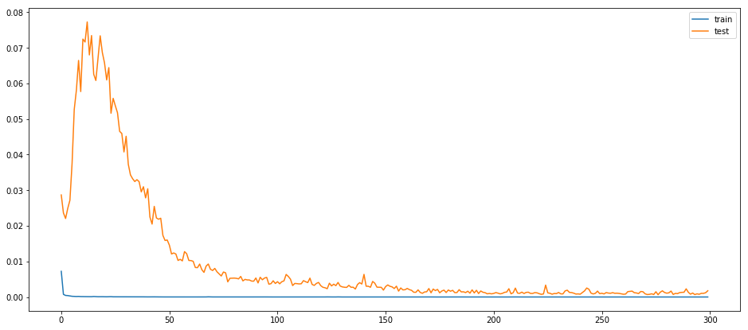
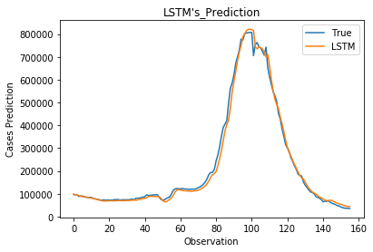

---
authors:
- admin
categories: [machine learning, data science, prediction]
date: "2022-03-23T00:00:00Z"
image:
  caption: ""
  focal_point: ""
lastMod: "2022-03-23T00:00:00Z"
projects: []
subtitle: Learn how to make a research blog with hugo blogdown
summary: Learn more about Python and Jupyter labs
tags: []
title: How to predict covid case counts using machine learning models?
---

```python
from IPython.core.display import Image
Image('https://www.python.org/static/community_logos/python-logo-master-v3-TM-flattened.png')
```


```python
# Import various libraries and routines needed for computation
import math 
import pandas as pd
import numpy as np
import tensorflow as tf
%matplotlib inline
import matplotlib.pyplot as plt
from math import sqrt
from numpy import concatenate
from matplotlib import pyplot
from pandas import read_csv
from pandas import DataFrame
from sklearn.preprocessing import MinMaxScaler, LabelEncoder
from sklearn.metrics import mean_squared_error, mean_absolute_error
from keras.models import Sequential
from keras.layers import Dense, Dropout
import keras.backend as K
from keras.layers import LSTM
from keras.callbacks import EarlyStopping
from datetime import date, timedelta, datetime 
```


```python
df = pd.read_csv('covid_final.csv')  
dataset = df.set_index(['date'])
dataset.drop(dataset.tail(10).index,
        inplace = True)
values = dataset.values
```


```python
date_index = dataset.index
```


```python
data_clean = dataset.copy()
data_clean_ext = dataset.copy()
data_clean_ext['new_cases_predictions'] = data_clean_ext['new_cases_smoothed']
data_clean.tail()
```


<div>
<style scoped>
    .dataframe tbody tr th:only-of-type {
        vertical-align: middle;
    }

    .dataframe tbody tr th {
        vertical-align: top;
    }

    .dataframe thead th {
        text-align: right;
    }
</style>
<table border="1" class="dataframe">
  <thead>
    <tr style="text-align: right;">
      <th></th>
      <th>new_cases_smoothed</th>
      <th>reproduction_rate</th>
      <th>new_tests_smoothed_per_thousand</th>
      <th>new_vaccinations_smoothed_per_million</th>
      <th>people_fully_vaccinated_per_hundred</th>
      <th>total_boosters_per_hundred</th>
      <th>stringency_index</th>
    </tr>
    <tr>
      <th>date</th>
      <th></th>
      <th></th>
      <th></th>
      <th></th>
      <th></th>
      <th></th>
      <th></th>
    </tr>
  </thead>
  <tbody>
    <tr>
      <th>2022-03-08</th>
      <td>38934.286</td>
      <td>0.65</td>
      <td>2.748</td>
      <td>621</td>
      <td>65.24</td>
      <td>28.89</td>
      <td>53.24</td>
    </tr>
    <tr>
      <th>2022-03-09</th>
      <td>36641.429</td>
      <td>0.66</td>
      <td>2.699</td>
      <td>601</td>
      <td>65.25</td>
      <td>28.91</td>
      <td>53.24</td>
    </tr>
    <tr>
      <th>2022-03-10</th>
      <td>36330.429</td>
      <td>0.69</td>
      <td>2.613</td>
      <td>583</td>
      <td>65.27</td>
      <td>28.94</td>
      <td>53.24</td>
    </tr>
    <tr>
      <th>2022-03-11</th>
      <td>36104.714</td>
      <td>0.71</td>
      <td>2.580</td>
      <td>557</td>
      <td>65.29</td>
      <td>28.97</td>
      <td>53.24</td>
    </tr>
    <tr>
      <th>2022-03-12</th>
      <td>35464.143</td>
      <td>0.71</td>
      <td>2.561</td>
      <td>540</td>
      <td>65.30</td>
      <td>28.99</td>
      <td>53.24</td>
    </tr>
  </tbody>
</table>
</div>


```python
# number of rows in the data
nrows = data_clean.shape[0]
```


```python
# Convert the data to numpy values
np_data_unscaled = np.array(data_clean)
np_data = np.reshape(np_data_unscaled, (nrows, -1))
```


```python
# ensure all data is float
values = values.astype('float64')
```


```python
# Transform the data by scaling each feature to a range between 0 and 1
scaler = MinMaxScaler()
np_data_scaled = scaler.fit_transform(np_data_unscaled)
```


```python
# Creating a separate scaler that works on a single column for scaling predictions
scaler_pred = MinMaxScaler()
df_cases = pd.DataFrame(data_clean_ext['new_cases_smoothed'])
np_cases_scaled = scaler_pred.fit_transform(df_cases)
```


```python
# Set the sequence length - this is the timeframe used to make a single prediction
sequence_length = 31

# Prediction Index
index_cases = dataset.columns.get_loc("new_cases_smoothed")

# Split the training data into train and train data sets
# As a first step, we get the number of rows to train the model on 80% of the data 
train_data_len = math.ceil(np_data_scaled.shape[0] * 0.8)

# Create the training and test data
train_data = np_data_scaled[0:train_data_len, :]
test_data = np_data_scaled[train_data_len - sequence_length:, :]

# The RNN needs data with the format of [samples, time steps, features]
# Here, we create N samples, sequence_length time steps per sample, and 6 features
def partition_dataset(sequence_length, data):
    x, y = [], []
    data_len = data.shape[0]
    for i in range(sequence_length, data_len):
        x.append(data[i-sequence_length:i,:]) #contains sequence_length values 0-sequence_length * columsn
        y.append(data[i, index_cases]) #contains the prediction values for validation,  for single-step prediction
    
    # Convert the x and y to numpy arrays
    x = np.array(x)
    y = np.array(y)
    return x, y

# Generate training data and test data
x_train, y_train = partition_dataset(sequence_length, train_data)
x_test, y_test = partition_dataset(sequence_length, test_data)
```


```python
# Configure the neural network model
model = Sequential()
# Model with n_neurons = inputshape Timestamps, each with x_train.shape[2] variables
n_neurons = x_train.shape[1] * x_train.shape[2]
model.add(LSTM(n_neurons, return_sequences=False, input_shape=(x_train.shape[1], x_train.shape[2])))
model.add(Dense(1))
```


```python
from tensorflow.keras.callbacks import ModelCheckpoint, EarlyStopping
# Compiling the LSTM
model.compile(optimizer = 'adam', loss = 'mean_squared_error')
```


```python
checkpoint_path = 'my_best_model.hdf5'
checkpoint = ModelCheckpoint(filepath=checkpoint_path, 
                             monitor='val_loss',
                             verbose=1, 
                             save_best_only=True,
                             mode='min')

earlystopping = EarlyStopping(monitor='val_loss', patience=50, restore_best_weights=True, verbose =0)
callbacks = [checkpoint, earlystopping]
```


```python
# Training the model
epochs = 300
batch_size = 20
history = model.fit(x_train, y_train,
                     batch_size=batch_size, 
                     epochs=epochs,
                     validation_data=(x_test, y_test),
                     callbacks = callbacks,
                     verbose = 0)
```

    
```python
from tensorflow.keras.models import load_model
model_from_saved_checkpoint = load_model(checkpoint_path)
```


```python
# Plot training & validation loss values
plt.figure(figsize=(16,7))
plt.plot(history.history['loss'], label='train')
plt.plot(history.history['val_loss'], label='test')
plt.legend()
plt.show()
```




```python
# Get the predicted values
y_pred_scaled = model_from_saved_checkpoint.predict(x_test)
```


```python
# Unscale the predicted values
y_pred = scaler_pred.inverse_transform(y_pred_scaled)
```


```python
y_test_unscaled = scaler_pred.inverse_transform(y_test.reshape(-1, 1))
```


```python
# Mean Absolute Error (MAE)
MAE = mean_absolute_error(y_test_unscaled, y_pred)
print(f'Median Absolute Error (MAE): {np.round(MAE, 2)}')

# Mean Absolute Percentage Error (MAPE)
MAPE = np.mean((np.abs(np.subtract(y_test_unscaled, y_pred)/ y_test_unscaled))) * 100
print(f'Mean Absolute Percentage Error (MAPE): {np.round(MAPE, 2)} %')

# Median Absolute Percentage Error (MDAPE)
MDAPE = np.median((np.abs(np.subtract(y_test_unscaled, y_pred)/ y_test_unscaled)) ) * 100
print(f'Median Absolute Percentage Error (MDAPE): {np.round(MDAPE, 2)} %')
```


```python
plt.plot(y_test_unscaled, label='True')
plt.plot(y_pred, label='LSTM')
plt.title("LSTM's_Prediction")
plt.xlabel('Observation')
plt.ylabel('Cases Prediction')
plt.legend()
plt.show()
```




```python
new_df = data_clean[-sequence_length:]
N = sequence_length
```


```python
# Get the last N day closing price values and scale the data to be values between 0 and 1
last_N_days = new_df[-sequence_length:].values
last_N_days_scaled = scaler.transform(last_N_days)
```


```python
# Create an empty list and Append past N days
X_test_new = []
X_test_new.append(last_N_days_scaled)

# Convert the X_test data set to a numpy array and reshape the data
pred_cases_scaled = model_from_saved_checkpoint.predict(np.array(X_test_new))
pred_cases_unscaled = scaler_pred.inverse_transform(pred_cases_scaled.reshape(-1, 1))
```


```python
# Print last price and predicted price for the next day
cases_today = np.round(new_df['new_cases_smoothed'][-1])
predicted_cases = np.round(pred_cases_unscaled.ravel()[0])
change_percent = np.round(100 - (cases_today * 100)/predicted_cases)
```


```python
plus = '+'; minus = ''
print(f'The close covid cases count today is  {cases_today}')
print(f'The predicted case count for the next day is {predicted_cases} ({plus if change_percent > 0 else minus}{change_percent}%)')
```


```python
!jupyter nbconvert covid_analysis.ipynb --to markdown --NbConvertApp.output_files_dir=.
!cat covid_analysis.md | tee -a index.md
!rm covid_analysis.md
```
