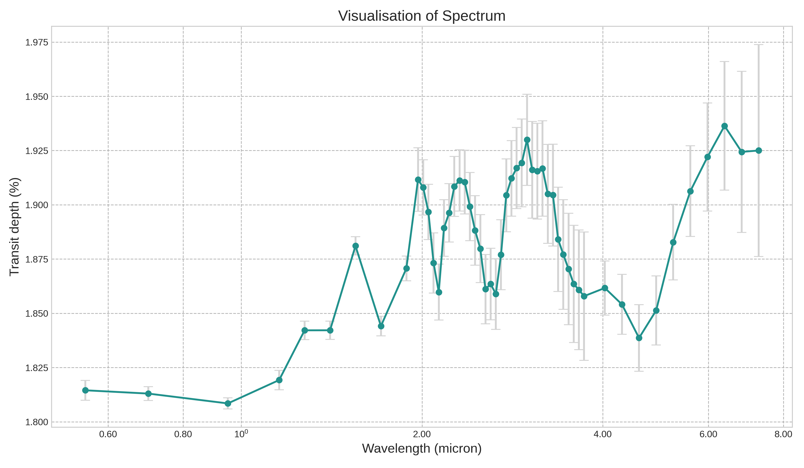
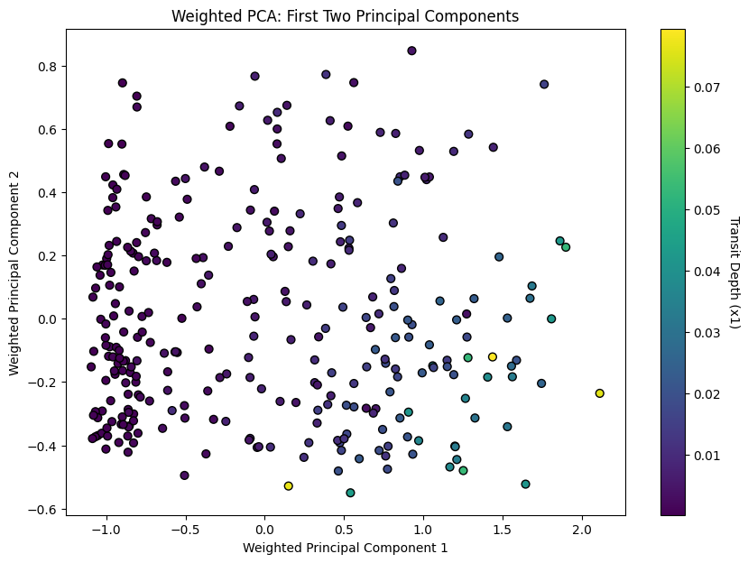
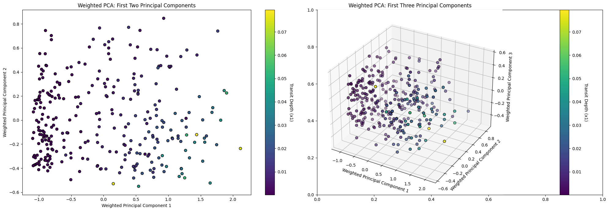
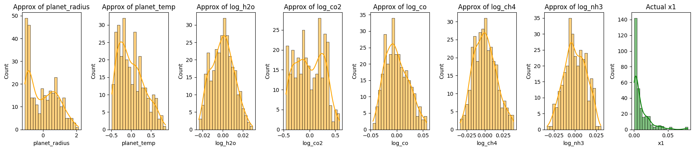
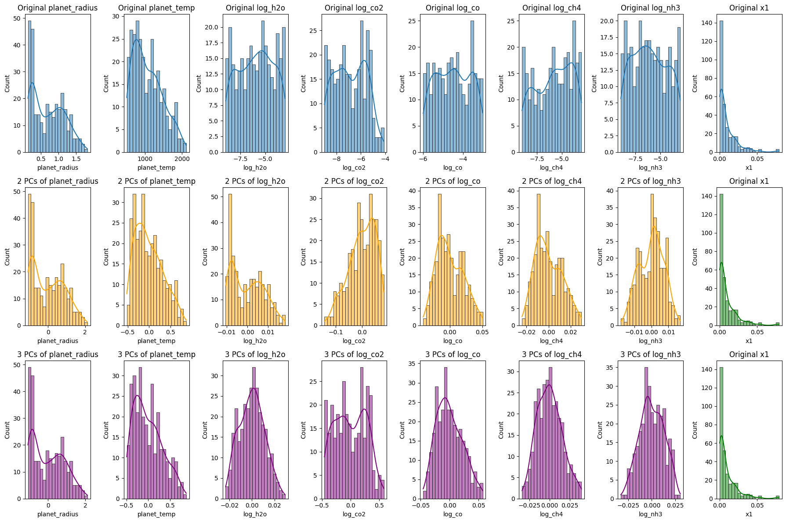

The figure below showcases a spectrum integral to exoplanet detection, charting the transit depth against the wavelength in microns. Every observation point in the spectrum carries an inherent uncertainty, denoted by the vertical error bars. To decode and potentially minimize this uncertainty, it's pivotal to fathom how features like `planet radius`, `planet temperature`, and the logarithmic concentrations of `H₂O`, `CO₂`, `CO`, `CH₄`, and `NH₃` influence the transit depth. Leveraging interpretative tools like SHAP can provide insights into how these exoplanetary features impact the observed transit depth, refining our understanding and accuracy in exoplanet spectral analysis.


```python
# Import required libraries
import numpy as np
import pandas as pd
import matplotlib.pyplot as plt
import seaborn as sns
```


```python
from IPython.display import Image
Image(filename='my_spectrum.png')
```


    

    


```python
# Load the CSV file into a Pandas DataFrame
df = pd.read_csv("small_astro.csv")
```


```python
df_backup = df.copy()
df_backup.head(10)
```


<div>
<style scoped>
    .dataframe tbody tr th:only-of-type {
        vertical-align: middle;
    }

    .dataframe tbody tr th {
        vertical-align: top;
    }

    .dataframe thead th {
        text-align: right;
    }
</style>
<table border="1" class="dataframe">
  <thead>
    <tr style="text-align: right;">
      <th></th>
      <th>Unnamed: 0</th>
      <th>planet_radius</th>
      <th>planet_temp</th>
      <th>log_h2o</th>
      <th>log_co2</th>
      <th>log_co</th>
      <th>log_ch4</th>
      <th>log_nh3</th>
      <th>x1</th>
      <th>x2</th>
      <th>...</th>
      <th>x43</th>
      <th>x44</th>
      <th>x45</th>
      <th>x46</th>
      <th>x47</th>
      <th>x48</th>
      <th>x49</th>
      <th>x50</th>
      <th>x51</th>
      <th>x52</th>
    </tr>
  </thead>
  <tbody>
    <tr>
      <th>0</th>
      <td>1</td>
      <td>0.559620</td>
      <td>863.394770</td>
      <td>-8.865868</td>
      <td>-6.700707</td>
      <td>-5.557561</td>
      <td>-8.957615</td>
      <td>-3.097540</td>
      <td>0.003836</td>
      <td>0.003834</td>
      <td>...</td>
      <td>0.003938</td>
      <td>0.003941</td>
      <td>0.003903</td>
      <td>0.003931</td>
      <td>0.003983</td>
      <td>0.004019</td>
      <td>0.004046</td>
      <td>0.004072</td>
      <td>0.004054</td>
      <td>0.004056</td>
    </tr>
    <tr>
      <th>1</th>
      <td>2</td>
      <td>1.118308</td>
      <td>1201.700465</td>
      <td>-4.510258</td>
      <td>-8.228966</td>
      <td>-3.565427</td>
      <td>-7.807424</td>
      <td>-3.633658</td>
      <td>0.015389</td>
      <td>0.015148</td>
      <td>...</td>
      <td>0.015450</td>
      <td>0.015447</td>
      <td>0.015461</td>
      <td>0.015765</td>
      <td>0.016099</td>
      <td>0.016376</td>
      <td>0.016549</td>
      <td>0.016838</td>
      <td>0.016781</td>
      <td>0.016894</td>
    </tr>
    <tr>
      <th>2</th>
      <td>3</td>
      <td>0.400881</td>
      <td>1556.096477</td>
      <td>-7.225472</td>
      <td>-6.931472</td>
      <td>-3.081975</td>
      <td>-8.567854</td>
      <td>-5.378472</td>
      <td>0.002089</td>
      <td>0.002073</td>
      <td>...</td>
      <td>0.001989</td>
      <td>0.002168</td>
      <td>0.002176</td>
      <td>0.002123</td>
      <td>0.002079</td>
      <td>0.002081</td>
      <td>0.002106</td>
      <td>0.002167</td>
      <td>0.002149</td>
      <td>0.002185</td>
    </tr>
    <tr>
      <th>3</th>
      <td>4</td>
      <td>0.345974</td>
      <td>1268.624884</td>
      <td>-7.461157</td>
      <td>-5.853334</td>
      <td>-3.044711</td>
      <td>-5.149378</td>
      <td>-3.815568</td>
      <td>0.002523</td>
      <td>0.002392</td>
      <td>...</td>
      <td>0.002745</td>
      <td>0.003947</td>
      <td>0.004296</td>
      <td>0.003528</td>
      <td>0.003352</td>
      <td>0.003629</td>
      <td>0.003929</td>
      <td>0.004363</td>
      <td>0.004216</td>
      <td>0.004442</td>
    </tr>
    <tr>
      <th>4</th>
      <td>5</td>
      <td>0.733184</td>
      <td>1707.323564</td>
      <td>-4.140844</td>
      <td>-7.460278</td>
      <td>-3.181793</td>
      <td>-5.996593</td>
      <td>-4.535345</td>
      <td>0.002957</td>
      <td>0.002924</td>
      <td>...</td>
      <td>0.003402</td>
      <td>0.003575</td>
      <td>0.003667</td>
      <td>0.003740</td>
      <td>0.003823</td>
      <td>0.003904</td>
      <td>0.003897</td>
      <td>0.004004</td>
      <td>0.004111</td>
      <td>0.004121</td>
    </tr>
    <tr>
      <th>5</th>
      <td>6</td>
      <td>0.161165</td>
      <td>620.185809</td>
      <td>-4.875000</td>
      <td>-5.074766</td>
      <td>-3.861240</td>
      <td>-5.388011</td>
      <td>-8.390503</td>
      <td>0.000444</td>
      <td>0.000442</td>
      <td>...</td>
      <td>0.000432</td>
      <td>0.000486</td>
      <td>0.000473</td>
      <td>0.000462</td>
      <td>0.000447</td>
      <td>0.000455</td>
      <td>0.000455</td>
      <td>0.000457</td>
      <td>0.000463</td>
      <td>0.000474</td>
    </tr>
    <tr>
      <th>6</th>
      <td>7</td>
      <td>0.194312</td>
      <td>900.597575</td>
      <td>-8.299899</td>
      <td>-6.850709</td>
      <td>-4.314491</td>
      <td>-3.712038</td>
      <td>-3.951455</td>
      <td>0.001794</td>
      <td>0.001721</td>
      <td>...</td>
      <td>0.001048</td>
      <td>0.001052</td>
      <td>0.000948</td>
      <td>0.000976</td>
      <td>0.001122</td>
      <td>0.001274</td>
      <td>0.001395</td>
      <td>0.001522</td>
      <td>0.001456</td>
      <td>0.001823</td>
    </tr>
    <tr>
      <th>7</th>
      <td>8</td>
      <td>1.132685</td>
      <td>1176.443900</td>
      <td>-6.765865</td>
      <td>-7.398548</td>
      <td>-3.378307</td>
      <td>-3.763737</td>
      <td>-5.881384</td>
      <td>0.012950</td>
      <td>0.012946</td>
      <td>...</td>
      <td>0.014019</td>
      <td>0.013871</td>
      <td>0.013810</td>
      <td>0.013902</td>
      <td>0.014024</td>
      <td>0.014150</td>
      <td>0.014298</td>
      <td>0.014392</td>
      <td>0.014401</td>
      <td>0.015042</td>
    </tr>
    <tr>
      <th>8</th>
      <td>9</td>
      <td>0.158621</td>
      <td>1189.209841</td>
      <td>-8.376041</td>
      <td>-6.321977</td>
      <td>-3.243900</td>
      <td>-8.711851</td>
      <td>-3.449195</td>
      <td>0.000444</td>
      <td>0.000445</td>
      <td>...</td>
      <td>0.000562</td>
      <td>0.000595</td>
      <td>0.000571</td>
      <td>0.000590</td>
      <td>0.000628</td>
      <td>0.000663</td>
      <td>0.000692</td>
      <td>0.000734</td>
      <td>0.000718</td>
      <td>0.000736</td>
    </tr>
    <tr>
      <th>9</th>
      <td>10</td>
      <td>0.660642</td>
      <td>528.023669</td>
      <td>-3.804286</td>
      <td>-8.919378</td>
      <td>-4.686964</td>
      <td>-8.150277</td>
      <td>-3.068319</td>
      <td>0.008997</td>
      <td>0.009035</td>
      <td>...</td>
      <td>0.009435</td>
      <td>0.009375</td>
      <td>0.009315</td>
      <td>0.009357</td>
      <td>0.009563</td>
      <td>0.009739</td>
      <td>0.009821</td>
      <td>0.009890</td>
      <td>0.009819</td>
      <td>0.009734</td>
    </tr>
  </tbody>
</table>
<p>10 rows × 60 columns</p>
</div>


```python
# Import the Random Forest Regressor and visualization libraries
from sklearn.ensemble import RandomForestRegressor

# Train a Random Forest model
rf_model = RandomForestRegressor(n_estimators=100, random_state=42)
rf_model.fit(X, y)

# Extract feature importances
feature_importances = rf_model.feature_importances_

# Create a DataFrame for visualization
importance_df = pd.DataFrame({
    'Feature': feature_columns,
    'Importance': feature_importances
}).sort_values(by='Importance', ascending=True)

# Create a horizontal bar chart for feature importances
plt.figure(figsize=(10, 6))
plt.barh(importance_df['Feature'], importance_df['Importance'], color='dodgerblue')
plt.xlabel('Importance')
plt.ylabel('')
plt.title('Random Forest Feature Importance')
plt.xticks(fontsize=13)  # Increase the font size of the x-axis tick labels
plt.yticks(fontsize=14)  # Increase the font size of the x-axis tick labels
# Save the figure before showing it
plt.savefig('random_forest_importance_plot.png', bbox_inches='tight', dpi=300)  # 'bbox_inches' ensures the entire plot is saved

plt.show()


feature_importances
```


    

    


    array([0.71850575, 0.10367982, 0.01655567, 0.07232808, 0.05603188,
           0.0146824 , 0.0182164 ])


## Random Forest Feature Importance Analysis

To gain insights into which exoplanetary features most influence the observed transit depth, a Random Forest Regressor was utilized. Here's an outline of the procedure:

1. **Model Initialization**: A Random Forest Regressor model was instantiated with 100 trees and a fixed random seed of 42 for reproducibility.

2. **Model Training**: The model was trained on the feature set `X` and target variable `y`.

3. **Feature Importance Extraction**: After training, the importance of each feature was extracted using the `feature_importances_` attribute of the trained model.

4. **Data Preparation for Visualization**: A DataFrame was created to house each feature alongside its respective importance. The features were then sorted in ascending order of importance for better visualization.

5. **Visualization**: A horizontal bar chart was plotted to showcase the importance of each feature. The chart offers a clear visual comparison, with the y-axis representing the features and the x-axis indicating their importance. Special attention was paid to font size adjustments for better readability. Furthermore, before displaying the chart, it was saved as a PNG image with high resolution.

The resulting visualization, titled 'Random Forest Feature Importance', provides a clear understanding of the relative significance of each feature in predicting the transit depth, as discerned by the Random Forest model.


### Weighted Principal Component Analysis (PCA) on Exoplanet Data

#### **Conceptual Overview**:

PCA is a method used to emphasize variation and capture strong patterns in a dataset. The "weighted PCA" approach fine-tunes this by considering the importance of different features, effectively giving more attention to features deemed vital.

#### **Detailed Breakdown**:

1. **Standardization**:
    - Before applying PCA, the dataset is standardized to give each feature a mean of 0 and a variance of 1. This is essential because PCA is influenced by the scale of the data.

2. **Weighted Features**:
    - Features are weighted according to their importance, as identified by the Random Forest model. Taking the square root of the weights ensures proper scaling during matrix multiplication in PCA.

3. **PCA Application**:
    - PCA projects the data into a new space defined by its principal components. The first two components often hold most of the dataset's variance, making them crucial for visualization.

4. **Visualization**:
    - The scatter plot visualizes the data in the space of the first two principal components. The color indicates `Transit Depth (x1)`, shedding light on how this parameter varies across the main patterns in the data.

5. **Explained Variance**:
    - This provides an understanding of how much original variance the first two components capture. A high percentage indicates that the PCA representation retains much of the data's original structure.

#### **Significance**:

1. **Data Compression**:
    - PCA offers a simplified yet rich representation of the data, which can be invaluable for visualization and pattern recognition.

2. **Feature Emphasis**:
    - Using feature importances ensures the PCA representation highlights the most critical patterns related to influential features.

3. **Framework for Further Exploration**:
    - Observing patterns or groupings in the PCA plot can guide subsequent investigations, pinpointing areas of interest or potential clusters.

4. **Efficient Data Overview**:
    - The visualization provides a comprehensive but digestible overview of the data, suitable for a wide range of audiences.

In essence, weighted PCA melds the dimensionality reduction capabilities of PCA with the interpretative power of feature importances, offering a profound view into the dataset's intricate structures and relationships.


```python
from sklearn.decomposition import PCA
from sklearn.preprocessing import StandardScaler
import numpy as np

# Standardize the feature matrix
X_scaled = StandardScaler().fit_transform(X)

# Multiply each feature by its square root of importance weight for weighted PCA
# The square root is used because each feature contributes to both rows and columns in the dot product calculation
X_weighted = X_scaled * np.sqrt(feature_importances)

# Perform PCA on the weighted data
pca = PCA(n_components=2)
X_pca = pca.fit_transform(X_weighted)

# Plotting the first two principal components
plt.figure(figsize=(10, 7))
plt.scatter(X_pca[:, 0], X_pca[:, 1], c=y, cmap='viridis', edgecolor='k', s=40)
plt.colorbar().set_label('Transit Depth (x1)', rotation=270, labelpad=15)
plt.xlabel('Weighted Principal Component 1')
plt.ylabel('Weighted Principal Component 2')
plt.title('Weighted PCA: First Two Principal Components')
plt.show()

# Variance explained by the first two principal components
variance_explained = pca.explained_variance_ratio_
variance_explained

```


    

    


    array([0.71985328, 0.10370239])


```python
from sklearn.decomposition import PCA
from sklearn.preprocessing import StandardScaler
import numpy as np
import matplotlib.pyplot as plt
from mpl_toolkits.mplot3d import Axes3D

# Standardize the feature matrix
X_scaled = StandardScaler().fit_transform(X)

# Multiply each feature by its square root of importance weight for weighted PCA
X_weighted = X_scaled * np.sqrt(feature_importances)

# Perform PCA on the weighted data with three components
pca = PCA(n_components=3)
X_pca = pca.fit_transform(X_weighted)

# Plotting the first three principal components
fig = plt.figure(figsize=(10, 7))
ax = fig.add_subplot(111, projection='3d')
scatter = ax.scatter(X_pca[:, 0], X_pca[:, 1], X_pca[:, 2], c=y, cmap='viridis', edgecolor='k', s=40)
plt.colorbar(scatter, ax=ax, pad=0.2).set_label('Transit Depth (x1)', rotation=270, labelpad=15)
ax.set_xlabel('Weighted Principal Component 1')
ax.set_ylabel('Weighted Principal Component 2')
ax.set_zlabel('Weighted Principal Component 3')
plt.title('Weighted PCA: First Three Principal Components')
plt.show()

# Variance explained by the first three principal components
variance_explained = pca.explained_variance_ratio_
variance_explained

```


    

    


    array([0.71985328, 0.10370239, 0.07160805])


```python
# side by side
from sklearn.decomposition import PCA
from sklearn.preprocessing import StandardScaler
import numpy as np
import matplotlib.pyplot as plt
from mpl_toolkits.mplot3d import Axes3D


# Standardize the feature matrix
X_scaled = StandardScaler().fit_transform(X)

# Multiply each feature by its square root of importance weight for weighted PCA
X_weighted = X_scaled * np.sqrt(feature_importances)

# Create a combined figure with subplots
fig, axes = plt.subplots(1, 2, figsize=(20, 7))

# Perform PCA on the weighted data with two components and plot
pca2 = PCA(n_components=2)
X_pca2 = pca2.fit_transform(X_weighted)
scatter_2d = axes[0].scatter(X_pca2[:, 0], X_pca2[:, 1], c=y, cmap='viridis', edgecolor='k', s=40)
fig.colorbar(scatter_2d, ax=axes[0], orientation='vertical').set_label('Transit Depth (x1)', rotation=270, labelpad=15)
axes[0].set_xlabel('Weighted Principal Component 1')
axes[0].set_ylabel('Weighted Principal Component 2')
axes[0].set_title('Weighted PCA: First Two Principal Components')

# Perform PCA on the weighted data with three components and plot
pca3 = PCA(n_components=3)
X_pca3 = pca3.fit_transform(X_weighted)
ax3d = fig.add_subplot(1, 2, 2, projection='3d')
scatter_3d = ax3d.scatter(X_pca3[:, 0], X_pca3[:, 1], X_pca3[:, 2], c=y, cmap='viridis', edgecolor='k', s=40)
fig.colorbar(scatter_3d, ax=ax3d, pad=0.2).set_label('Transit Depth (x1)', rotation=270, labelpad=15)
ax3d.set_xlabel('Weighted Principal Component 1')
ax3d.set_ylabel('Weighted Principal Component 2')
ax3d.set_zlabel('Weighted Principal Component 3')
ax3d.set_title('Weighted PCA: First Three Principal Components')

# Display the combined plot
plt.tight_layout()
plt.savefig('wPCA_2D_3D.png', bbox_inches='tight', dpi=300)  # 'bbox_inches' ensures the entire plot is saved

plt.show()

```


    

    


```python
import pandas as pd
import seaborn as sns


# Reconstruct the approximate original data using the first three principal components
reconstructed_data = np.dot(X_pca, pca.components_[:3, :]) + np.mean(X_scaled, axis=0)

# Create a DataFrame for the reconstructed data
reconstructed_df = pd.DataFrame(reconstructed_data, columns=feature_columns)

# Visualize the approximate original histograms
fig, axes = plt.subplots(1, len(feature_columns) + 1, figsize=(18, 4))  # Adjusted for the number of features
for i, col in enumerate(feature_columns):
    sns.histplot(reconstructed_df[col], bins=20, kde=True, ax=axes[i], color='orange')
    axes[i].set_title(f'Approx of {col}')

# Add visualization for actual transit depth (since it was not part of the PCA)
sns.histplot(df[transit_depth_column], bins=20, kde=True, ax=axes[-1], color='green')
axes[-1].set_title(f'Actual {transit_depth_column}')

plt.tight_layout()
plt.show()

```


    

    


```python

fig, axes = plt.subplots(2, 8, figsize=(18, 8))

# Original Data
for i, col in enumerate(feature_columns):
    sns.histplot(df[col], bins=20, kde=True, ax=axes[0, i])
    axes[0, i].set_title(f'{col}\nMean: {feature_mean[col]:.2f}\nVariance: {feature_variance[col]:.2f}')

sns.histplot(df[transit_depth_column], bins=20, kde=True, ax=axes[0, -1])
axes[0, -1].set_title(f'{transit_depth_column}\nMean: {transit_depth_mean:.2f}\nVariance: {transit_depth_variance:.2f}')

# Reconstructed Data
for i, col in enumerate(feature_columns):
    sns.histplot(reconstructed_df[col], bins=20, kde=True, ax=axes[1, i], color='orange')
    axes[1, i].set_title(f'Surrogate of {col}')

sns.histplot(df[transit_depth_column], bins=20, kde=True, ax=axes[1, -1], color='green')
axes[1, -1].set_title(f'Actual {transit_depth_column}')

plt.tight_layout()
plt.show()

```


    

    


```python
import pandas as pd
import seaborn as sns
import matplotlib.pyplot as plt
from sklearn.decomposition import PCA
from sklearn.preprocessing import StandardScaler
import numpy as np


# Standardize the feature matrix
X_scaled = StandardScaler().fit_transform(X)

# Multiply each feature by its square root of importance weight for weighted PCA
X_weighted = X_scaled * np.sqrt(feature_importances)

# Initialize the figure and axes
fig, axes = plt.subplots(3, len(feature_columns) + 1, figsize=(18, 12))

# Original Data histograms
for i, col in enumerate(feature_columns):
    sns.histplot(df[col], bins=20, kde=True, ax=axes[0, i])
    axes[0, i].set_title(f'Original {col}')

sns.histplot(df[transit_depth_column], bins=20, kde=True, ax=axes[0, -1])
axes[0, -1].set_title(f'Original {transit_depth_column}')

# Reconstruction using 2 PCs
pca2 = PCA(n_components=2)
X_pca2 = pca2.fit_transform(X_weighted)
reconstructed_data_2PCs = np.dot(X_pca2, pca2.components_[:2, :]) + np.mean(X_scaled, axis=0)
reconstructed_df_2PCs = pd.DataFrame(reconstructed_data_2PCs, columns=feature_columns)

for i, col in enumerate(feature_columns):
    sns.histplot(reconstructed_df_2PCs[col], bins=20, kde=True, ax=axes[1, i], color='orange')
    axes[1, i].set_title(f'2 PCs of {col}')

sns.histplot(df[transit_depth_column], bins=20, kde=True, ax=axes[1, -1], color='green')
axes[1, -1].set_title(f'Original {transit_depth_column}')

# Reconstruction using 3 PCs
pca3 = PCA(n_components=3)
X_pca3 = pca3.fit_transform(X_weighted)
reconstructed_data_3PCs = np.dot(X_pca3, pca3.components_[:3, :]) + np.mean(X_scaled, axis=0)
reconstructed_df_3PCs = pd.DataFrame(reconstructed_data_3PCs, columns=feature_columns)

for i, col in enumerate(feature_columns):
    sns.histplot(reconstructed_df_3PCs[col], bins=20, kde=True, ax=axes[2, i], color='purple')
    axes[2, i].set_title(f'3 PCs of {col}')

sns.histplot(df[transit_depth_column], bins=20, kde=True, ax=axes[2, -1], color='green')
axes[2, -1].set_title(f'Original {transit_depth_column}')

plt.tight_layout()
plt.savefig('wPCA_combined_plot.png', bbox_inches='tight', dpi=500)  # 'bbox_inches' ensures the entire plot is saved

plt.show()

```


    

    


### Reconstruction of Exoplanet Data Using Principal Component Analysis (PCA)

The code segment aims to reconstruct exoplanet data using different numbers of principal components (PCs) from PCA, offering insights into how much information retention occurs as we vary the number of PCs.

#### **Data Standardization**:
- The features undergo standardization, ensuring each feature has a mean of 0 and variance of 1. This normalization is crucial for PCA, as the algorithm is sensitive to varying scales across features.

#### **Weighted Features**:
- Features are adjusted based on their significance as ascertained by a prior model, specifically the Random Forest. Weighting the features adjusts the emphasis the PCA places on each feature during the dimensionality reduction process.

#### **Data Reconstruction**:
- After performing PCA, the algorithm seeks to transform the reduced data back to the original high-dimensional space. This "reconstructed" data is an approximation of the original but is built using fewer dimensions.

#### **Visualization of Reconstructions**:
1. **Original Data Histograms**:
    - The initial histograms show the distributions of the original features and the transit depth.
  
2. **Reconstruction Using 2 Principal Components**:
    - Using only the first two PCs, the data is reconstructed and its histograms visualized. This illustrates the patterns and distributions captured when only the first two components are considered.
  
3. **Reconstruction Using 3 Principal Components**:
    - An analogous reconstruction is done with three PCs. The addition of a third dimension might capture more nuanced variations in the data.

#### **Significance**:
1. **Data Compression vs. Retention**:
    - The visualizations enable us to compare the reconstructions against the original data. We discern how much information is retained and what is lost as we reduce dimensions.
  
2. **Guide for Dimensionality Decision**:
    - By juxtaposing the original with the reconstructions, we gain insights into the optimal number of PCs to use for specific tasks, striking a balance between compression and information retention.
  
3. **Empirical Understanding**:
    - These histograms and visual representations offer a tangible way to grasp the abstract notion of dimensionality reduction. They elucidate how PCA captures the essence of the data while diminishing dimensions.

In conclusion, this analysis, coupled with the visualizations, equips us with a robust understanding of how PCA reconstructs data using varying numbers of components. It underscores the trade-offs involved and the implications of choosing specific dimensionality levels in data-driven tasks.


### Reference

Changeat, Q., & Yip, K. H. (2023). ESA-Ariel Data Challenge NeurIPS 2022: Introduction to exo-atmospheric studies and presentation of the Atmospheric Big Challenge (ABC) Database. *arXiv preprint arXiv:2206.14633*.

Herin, M., Il Idrissi, M., Chabridon, V., & Iooss, B. (2022). Proportional marginal effects for global sensitivity analysis. arXiv preprint arXiv:2210.13065.


