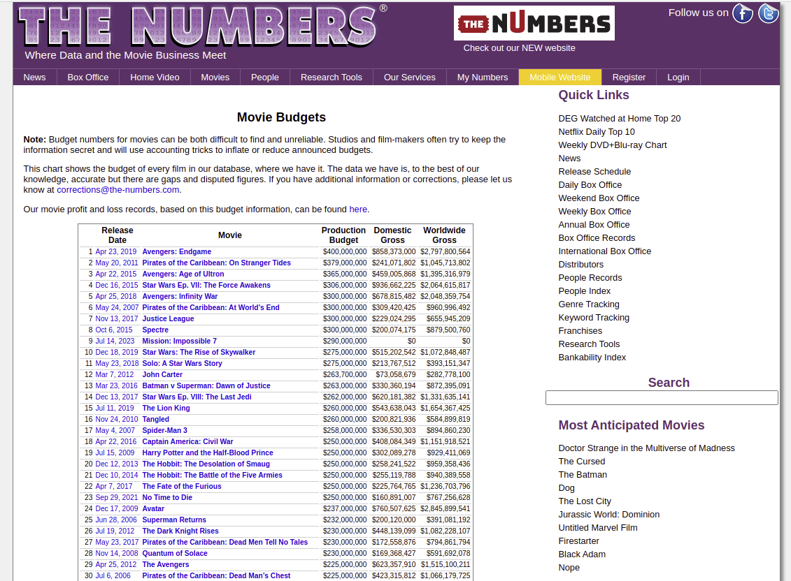

```{r setup, include=FALSE}
options(htmltools.dir.version = FALSE)
options(htmltools.preserve.raw = FALSE)


knitr::opts_chunk$set(echo = TRUE, 
                      dev = 'svg',
                      collapse = TRUE, 
                      comment = NA,  # PRINTS IN FRONT OF OUTPUT, default is '##' which comments out output
                      prompt = FALSE, # IF TRUE adds a > before each code input
                      warning = FALSE, 
                      message = FALSE,
                      fig.height = 3, 
                      fig.width = 4,
                      out.width = "100%"
                      )


# load necessary packages
library(tidyr)
library(dplyr)
library(ggplot2)
library(countdown)
library(ggthemes)
library(tidyverse)
library(stringr)
library(xaringanExtra)
xaringanExtra::use_panelset()
xaringanExtra::use_tachyons()
library(flipbookr)
library(htmlwidgets)
library(lubridate)
library(palmerpenguins)

library(knitr)
library(kableExtra)
library(fontawesome)
library(rvest)
library(forcats)
library(patchwork)
library(readr)
library(stringr)
library(icons)
library(tidytext)
library(RSelenium)
library(polite)
library(ggplot2movies)
library(DT)
library(polite)
library(plotly)
library(purrr)

yt <- 0

base_url <- "https://www.the-numbers.com/movie/budgets/all"
base_webpage <- read_html(base_url)
table_base <- html_table(base_webpage)[[1]]

# all webpages
new_urls <- "https://www.the-numbers.com/movie/budgets/all/"

# creating one table
table_new <-data.frame()
df_movies <- data.frame()

# iterator
idx <-  seq(1, 6301, 100)

# it loops through 5501 times so as to extract and then store and then combine about 5000 movies so far extracted.

for (i in 1:length(idx)) {
  new_webpage <- read_html(str_glue(new_urls, {idx[i]}))
  table_new <- html_table(new_webpage)[[1]] %>% 
  tibble::as_tibble(.name_repair = "unique") 
  df_movies <- rbind(df_movies, table_new)
}

df_movies_tidy <- df_movies %>% rename(ID = `...1`) %>% 
  mutate(ProductionBudget = parse_number(ProductionBudget))  %>% 
  mutate(DomesticGross = parse_number(DomesticGross))  %>% 
  mutate(WorldwideGross = parse_number(WorldwideGross)) %>%
  mutate(ReleaseDate = mdy(ReleaseDate)) %>%
  mutate(ReleaseDate = replace_na(ReleaseDate, make_date())) %>%
  mutate(MonthOfRelease = month(ReleaseDate, label = TRUE)) %>%
  mutate(YearOfRelease = year(ReleaseDate))

df_DomesticGross_month <- df_movies_tidy %>%
  select(MonthOfRelease, DomesticGross) %>%
  group_by(MonthOfRelease) %>%
  summarize(AverageByMonth = mean(DomesticGross))

```


```{r xaringan-themer, include = FALSE}
# Use xaringan theme from first set
```

layout: true
  
<!-- <div class="my-footer"><span>Bastola</span></div> -->
<!-- this adds the link footer to all slides, depends on my-footer class in css-->

---
class: title-slide, middle
<!-- background-image: url("assets/title-image2.jpg") -->
background-position: 10% 90%, 100% 50%
background-size: 160px, 100% 100%

# .fancy[More Web Scraping]

### .fancy[Stat 220]

.large[Bastola]

`r format(Sys.Date(), ' %B %d %Y')`

---

class: middle
background-image: url("images/polite.png") 
background-position: left center
background-size: 360px, 100% 100%


.pull-right-60[

.font120[

##  `polite` package

  - Two main functions `bow` and `scrape` define and realize a web harvesting session

  - Builds on awesome toolkits for defining and managing http sessions using `rvest`
]
]

---

`r chunk_reveal("demo1", widths = c(60, 60), font_size_code="80%", title = "## Get Names")`

.scroll-output[
```{r,demo1, eval=FALSE, echo=FALSE }
bow(url = "https://www.imdb.com/search/title/?groups=best_picture_winner&sort=year,desc&count=100&view=advanced") %>%
  scrape() %>%
  html_elements(css = ".loadlate") %>%  # images
  html_attr(name = "alt")  # attribute alt
```
]

---

`r chunk_reveal("demo2", widths = c(60, 60), font_size_code="80%", title = "## Get Links")`

```{r,demo2, eval=FALSE, echo=FALSE }
bow(url = "https://www.imdb.com/search/title/?groups=best_picture_winner&sort=year,desc&count=100&view=advanced") %>%
  scrape() %>%
  html_elements(css = ".lister-item-header a") %>%
  html_attr(name = "href") %>%
  url_absolute(base = "https://www.imdb.com")
```


---

# Scrape Table

```{r}
table_usafacts <- bow(url = "https://usafacts.org/visualizations/covid-vaccine-tracker-states/state/minnesota")%>%
  scrape() %>% html_elements(css = "table") %>% html_table()
```

--

.scroll-box-20[
```{r}
knitr::kable(table_usafacts[[3]], format = "html")
```
]

.footnote[Click [here](https://usafacts.org/visualizations/covid-vaccine-tracker-states/state/minnesota) to take a look at the webpage]

---
class: action

# <i class="fa fa-pencil-square-o" style="font-size:48px;color:purple">&nbsp;Your&nbsp;Turn&nbsp;`r (yt <- yt + 1)`</i>    
Please clone the repository on [advanced web scraping and visualization](https://github.com/stat220/15-more-web-scraping) to your local folder. Go to this [webpage](https://usafacts.org/visualizations/coronavirus-covid-19-spread-map/state/minnesota) and scrape the table that has the latest county-level coronavirus stats for the state of Minnesota.

.scroll-box-20[
```{r, echo=FALSE}
table_covid_cases <- bow(url = "https://usafacts.org/visualizations/coronavirus-covid-19-spread-map/state/minnesota") %>% scrape() %>%
  html_elements(css = "table") %>%
  html_table()
knitr::kable(table_covid_cases[[2]], format = "html")
```
]

What are the top 10 counties in Minnesota by the number of COVID cases?

`r countdown(minutes = 5, seconds = 00, top = 0 , color_background = "inherit", padding = "3px 4px", font_size = "2em")`

---

# Scraping multiple tables

```{r}
all_url <- "https://finance.yahoo.com/losers?count=25&offset="
```


```{r}
idx <- seq(0, 250, by = 25)  #<<

table_new <-data.frame()
df <- data.frame()

for (i in seq_along(idx)) {
  new_webpage <- read_html(str_glue(all_url, {idx[i]}))
  table_new <- html_table(new_webpage)[[1]] %>% 
    as_tibble(.name_repair = "unique") 
  df <- rbind(df, table_new)
}
```


.footnote[Click [here](https://finance.yahoo.com/gainers?count=25&offset=0) to take a look at the webpage]

---
# Scraping multiple tables

```{r}
all_url <- "https://finance.yahoo.com/losers?count=25&offset="
```


```{r}
idx <- seq(0, 250, by = 25) 

table_new <-data.frame() #<<
df <- data.frame() #<<

for (i in seq_along(idx)) {
  new_webpage <- read_html(str_glue(all_url, {idx[i]}))
  table_new <- html_table(new_webpage)[[1]] %>% 
    as_tibble(.name_repair = "unique") 
  df <- rbind(df, table_new)
}
```


.footnote[Click [here](https://finance.yahoo.com/gainers?count=25&offset=0) to take a look at the webpage]

---

# Scraping multiple tables

```{r}
all_url <- "https://finance.yahoo.com/losers?count=25&offset="
```


```{r}
idx <- seq(0, 250, by = 25)  

table_new <-data.frame()
df <- data.frame()

for (i in seq_along(idx)) {    #<<
  new_webpage <- read_html(str_glue(all_url, {idx[i]}))
  table_new <- html_table(new_webpage)[[1]] %>% 
    as_tibble(.name_repair = "unique") 
  df <- rbind(df, table_new)
}
```


.footnote[Click [here](https://finance.yahoo.com/gainers?count=25&offset=0) to take a look at the webpage]

---

# Scraping multiple tables

```{r}
all_url <- "https://finance.yahoo.com/losers?count=25&offset="
```


```{r}
idx <- seq(0, 250, by = 25)  

table_new <-data.frame()
df <- data.frame()

for (i in seq_along(idx)) {
  new_webpage <- read_html(str_glue(all_url, {idx[i]})) #<<
  table_new <- html_table(new_webpage)[[1]] %>% 
    as_tibble(.name_repair = "unique") 
  df <- rbind(df, table_new)
}
```


.footnote[Click [here](https://finance.yahoo.com/gainers?count=25&offset=0) to take a look at the webpage]

---

# Scraping multiple tables

```{r}
all_url <- "https://finance.yahoo.com/losers?count=25&offset="
```


```{r}
idx <- seq(0, 250, by = 25) 

table_new <-data.frame()
df <- data.frame()

for (i in seq_along(idx)) {
  new_webpage <- read_html(str_glue(all_url, {idx[i]}))
  table_new <- html_table(new_webpage)[[1]] %>% #<<
    as_tibble(.name_repair = "unique") 
  df <- rbind(df, table_new) 
}
```


.footnote[Click [here](https://finance.yahoo.com/gainers?count=25&offset=0) to take a look at the webpage]


---

# Scraping multiple tables

```{r}
all_url <- "https://finance.yahoo.com/losers?count=25&offset="
```


```{r}
idx <- seq(0, 250, by = 25) 

table_new <-data.frame()
df <- data.frame()

for (i in seq_along(idx)) {
  new_webpage <- read_html(str_glue(all_url, {idx[i]}))
  table_new <- html_table(new_webpage)[[1]] %>% 
    as_tibble(.name_repair = "unique") #<<
  df <- rbind(df, table_new) 
}
```


.footnote[Click [here](https://finance.yahoo.com/gainers?count=25&offset=0) to take a look at the webpage]

---

# Scraping multiple tables

```{r}
all_url <- "https://finance.yahoo.com/losers?count=25&offset="
```


```{r}
idx <- seq(0, 250, by = 25)  

table_new <-data.frame()
df <- data.frame()

for (i in seq_along(idx)) {
  new_webpage <- read_html(str_glue(all_url, {idx[i]}))
  table_new <- html_table(new_webpage)[[1]] %>% as_tibble(.name_repair = "unique") 
  df <- rbind(df, table_new) #<<
}
```


.footnote[Click [here](https://finance.yahoo.com/gainers?count=25&offset=0) to take a look at the webpage]

---

# Multiple tables combined

.scroll-box-22[
```{r, echo=FALSE}
DT::datatable(
  df %>% select(-`52 Week Range`),
  fillContainer = FALSE, options = list(pageLength = 8)
)
```
]

---

class: action

# <i class="fa fa-pencil-square-o" style="font-size:48px;color:purple">&nbsp;Your&nbsp;Turn&nbsp;`r (yt <- yt + 1)`</i>    

.pull-left[
.scroll-box-20[
]
]
.pull-right[
.fancy[
1. Go to the [the numbers webpage](https://www.the-numbers.com/movie/budgets/all) and extract the table on the front page.

2. Find out the number of pages that contain the movie table, while looking for the changes in the url in the address bar.

3. Write a for loop to store all the data in multiple pages to a single data frame.

4. Display the data table using `knitr::kable(data, format = "html")`

5. Store the data in a `.csv` file with `write_csv(data_object, "/path/name.csv")`
]
]

`r countdown(minutes = 10, seconds = 00, top = 0 , color_background = "inherit", padding = "3px 4px", font_size = "2em")`

.footnote[Click [here](https://www.the-numbers.com/movie/budgets/all) to take a look at the webpage]

---

`r chunk_reveal("demo3", widths = c(60, 60), font_size_code="80%", title = "## Tidy further")`

```{r,demo3, eval=FALSE, echo=FALSE }
df_movies %>% 
  rename(ID = `...1`) %>% 
  mutate(ProductionBudget = parse_number(ProductionBudget))  %>% 
  mutate(DomesticGross = parse_number(DomesticGross))  %>% 
  mutate(WorldwideGross = parse_number(WorldwideGross)) %>%
  mutate(ReleaseDate = mdy(ReleaseDate)) %>%
  mutate(ReleaseDate = replace_na(ReleaseDate, make_date())) %>%
  mutate(MonthOfRelease = month(ReleaseDate, label = TRUE)) %>%
  mutate(YearOfRelease = year(ReleaseDate)) %>%
  select(MonthOfRelease, DomesticGross) %>%
  group_by(MonthOfRelease) %>%
  summarize(AverageByMonth = mean(DomesticGross))
```

---

# Interactive Donut Plot

```{r, echo=FALSE, fig.height=7, fig.width=6}
fig <- df_DomesticGross_month %>% plot_ly(labels = ~MonthOfRelease, values = ~AverageByMonth)
fig <- fig %>% add_pie(hole = 0.6)
fig <- fig %>% layout(title = "Average Domestic Gross by Month",  showlegend = F,
                      xaxis = list(showgrid = FALSE, zeroline = FALSE, showticklabels = FALSE),
                      yaxis = list(showgrid = FALSE, zeroline = FALSE, showticklabels = FALSE))

fig
```

---

# Interactive visualizations using `Plotly`

.scroll-box-16[
```{r}
midwest %>% as_tibble()
```
]

```{r, eval=FALSE, fig.height=7, fig.width=6}
library(plotly)

midwest %>%
  filter(inmetro == T) %>%
  plot_ly(x =  ~ percbelowpoverty, y =  ~ percollege) %>%
  add_markers() #<<
```

---

# Interactive visualizations using `Plotly`

```{r, echo=FALSE, fig.height=7, fig.width=6}
midwest %>%
  filter(inmetro == T) %>%
  plot_ly(x =  ~ percbelowpoverty, y =  ~ percollege) %>%
  add_markers()
```

---

# Interactive visualizations using `ggplotly`

```{r}
mtcars %>% as_tibble() %>% head()
```

--

```{r, fig.height=7, fig.width=6, eval=FALSE}
gp = mtcars %>%
  mutate(amFactor = factor(am, labels = c('auto', 'manual')),
         hovertext = paste(wt, mpg, amFactor)) %>%
  arrange(wt) %>%
  ggplot(aes(x = wt, y = mpg, color = amFactor)) +
  geom_smooth(se = F) +
  geom_point(aes(color = amFactor))
```

--


```{r}
ggplotly()  #<<
```


---

# Interactive visualizations using `ggplotly`

```{r, echo=FALSE, fig.height=7, fig.width=6}
gp = mtcars %>%
  mutate(amFactor = factor(am, labels = c('auto', 'manual')),
         hovertext = paste(wt, mpg, amFactor)) %>%
  arrange(wt) %>%
  ggplot(aes(x = wt, y = mpg, color = amFactor)) +
  geom_smooth(se = F) +
  geom_point(aes(color = amFactor))

ggplotly()
```


---

# DT: Interactive Data Tables

.code120[
```{r, eval=FALSE}
library(ggplot2movies)
movies %>%
  select(1:6) %>%
  filter(rating > 8, !is.na(budget), votes > 1000) %>% 
  datatable(fillContainer = FALSE, options = list(pageLength = 6))
```
]

--

```{r, echo=FALSE}
movies %>%
  select(1:6) %>%
  filter(rating > 8, !is.na(budget), votes > 1000) %>% 
  datatable(fillContainer = FALSE, options = list(pageLength = 6))
```

---

class: action

# <i class="fa fa-pencil-square-o" style="font-size:48px;color:purple">&nbsp;Your&nbsp;Turn&nbsp;`r (yt <- yt + 1)`</i>    


```{r echo=FALSE, fig.height = 6, fig.width = 7, fig.align='center'}
tweets<- read_csv("https://raw.githubusercontent.com/deepbas/statdatasets/main/TrumpTweetData.csv")
w <- ggplot(data=drop_na(tweets, source), 
            aes(x=nWords, y=nRealWords, color=source)) + geom_jitter() 
ggplotly(w) 
```

.font120[
Reproduce the plot using `plotly`
]

`r countdown(minutes = 5, seconds = 00, top = 0 , color_background = "inherit", padding = "3px 4px", font_size = "2em")`

---

class: action

# <i class="fa fa-pencil-square-o" style="font-size:48px;color:purple">&nbsp;Your&nbsp;Turn&nbsp;`r (yt <- yt + 1)`</i>    

```{r, echo=FALSE, fig.height = 6, fig.width = 7, fig.align='center'}
mca <- data.frame(percent = c(23.5, 34.7, 19.8, 22.0, 27.6, 32.1, 20.2, 20.2, 26.0, 30.7, 22.1, 21.1), portfolio = factor(rep(c("Commodities", "Stocks", "Real State", "Other Assets"), 3), levels=c("Commodities", "Stocks", "Real State", "Other Assets")), year = rep(c("2019","2020","2021"), each=4))
mybar <- ggplot(mca, aes(x=year, y=percent, fill=portfolio)) + 
  labs(title="Investment Portfolio") +
  geom_bar(stat = "identity", position = "dodge") +
  theme(legend.position = "bottom") + 
  scale_fill_viridis_d()
ggplotly(mybar) 
```

.font120[
Reproduce the plot using `plotly`
]

`r countdown(minutes = 5, seconds = 00, top = 0 , color_background = "inherit", padding = "3px 4px", font_size = "2em")`


