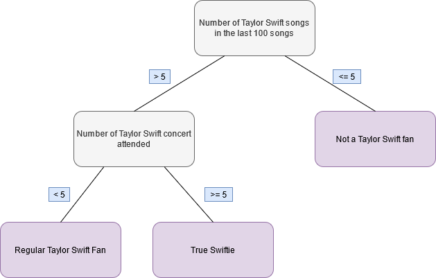

```{r setup, include=FALSE}
options(htmltools.dir.version = FALSE)
options(htmltools.preserve.raw = FALSE)


knitr::opts_chunk$set(echo = TRUE, 
                      dev = 'svg',
                      collapse = TRUE, 
                      comment = NA,  # PRINTS IN FRONT OF OUTPUT, default is '##' which comments out output
                      prompt = FALSE, # IF TRUE adds a > before each code input
                      warning = FALSE, 
                      message = FALSE,
                      fig.height = 3, 
                      fig.width = 4,
                      out.width = "100%"
                      )


# load necessary packages
library(tidyr)
library(dplyr)
library(ggplot2)
library(countdown)
library(ggthemes)
library(tidyverse)
library(stringr)
library(xaringanExtra)
xaringanExtra::use_panelset()
xaringanExtra::use_tachyons()
library(flipbookr)
library(htmlwidgets)
library(lubridate)
library(palmerpenguins)
library(fontawesome)
library(caret)
library(class)
library(patchwork)
library(tidymodels)
library(mlbench)     # for PimaIndiansDiabetes2 dataset
library(janitor)
library(parsnip)
library(kknn)
library(paletteer)
library(corrr)
library(scico)
library(skimr)
library(janitor)
library(vip)
library(rpart.plot)
library(ranger)
library(palmerpenguins)
library(ISLR2)
library(forcats)

yt <- 0

data(PimaIndiansDiabetes)
db <- PimaIndiansDiabetes

```


```{r xaringan-themer, include = FALSE}
# Use xaringan theme from first set
```

layout: true
  
<!-- <div class="my-footer"><span>Bastola</span></div> -->
<!-- this adds the link footer to all slides, depends on my-footer class in css-->

---
class: title-slide, middle
<!-- background-image: url("assets/title-image2.jpg") -->
background-position: 10% 90%, 100% 50%
background-size: 160px, 100% 100%

# .fancy[Decision Trees and Random Forest]

### .fancy[Stat 220]

.large[Bastola]

`r format(Sys.Date(), ' %B %d %Y')`

---

class: inverse

## Decision Tree

.blockquote[
- trains a model based on known values and uses the model to predict unknown values that have the same associated explanatory variables
]

.pull-left[
.font90[
- Data is continuously split according to a certain parameter
- Two main entities:

  + nodes: where the data is split
  + leaves: decisions or final outcomes
]
]
.pull-right[
```{r echo = FALSE}

```

]
---

# Decision Tree

> Use explanatory variables to make subsets of cases that are as similar (“pure”) as possible with respect to the response

- Start with all observations in one group

- Find the variable/split that best separates the outcome

- Divide the data into two groups (leaves) on the split (node)

- Within each split, find the best variable/split that separates the outcomes

- Continue until the groups are too small or sufficiently “pure”

---


```{r}
data(PimaIndiansDiabetes2)
db <- PimaIndiansDiabetes2 %>% na.omit() %>%
  mutate(diabetes = fct_relevel(diabetes, "pos"))
```

--

```{r}
glimpse(db)
```

---

# Overfitting and underfitting

```{r echo = FALSE, fig.width=6, fig.height=4.5, fig.align='center', out.width = "65%"}
knitr::include_graphics("images/overfitting.png")
```

.font90[
- .bold[Overfitting:] Good performance on the training data, poor generliazation to other data.
- .bold[Underfitting:] Poor performance on the training data and poor generalization to other data
]

---


```{r}
set.seed(314) 
db_split <- initial_split(db, prop = 0.80, 
                             strata = diabetes)
db_train <- db_split %>% training()
db_test <- db_split %>% testing()

```

--

```{r}
# Scaling not needed
db_recipe <- recipe(diabetes ~ ., data = db_train) %>%
 step_dummy(all_nominal(), -all_outcomes()) %>%
 prep()
```

---

class: middle

# Model Specification

- .bold[cost_complexity:] The cost complexity parameter 
- .bold[tree_depth:] The maximum depth of a tree
- .bold[min_n:] The minimum number of data points in a node that are required for the node to be split further.


```{r}
tree_model <- decision_tree(cost_complexity = tune(),
                            tree_depth = tune(),
                            min_n = tune()) %>% 
              set_engine('rpart') %>% 
              set_mode('classification')
```

---

class: middle

# Workflow

```{r}
# Combine the model and recipe into a workflow 
tree_workflow <- workflow() %>% 
                 add_model(tree_model) %>% 
                 add_recipe(db_recipe)
```

---

# Hyperparameter tuning

```{r}
# Create folds for cross validation on the training data set
db_folds <- vfold_cv(db_train, v = 5, strata = diabetes)
```

--

```{r}
## Create a grid of hyperparameter values to test
tree_grid <- grid_regular(cost_complexity(),
                          tree_depth(),
                          min_n(), 
                          levels = 2)
```

---

# View grid

```{r}
tree_grid
```

---

class: middle

# Tuning Hyperparameters with `tune_grid()`

```{r}
# Tune decision tree workflow
set.seed(314)
tree_tuning <- tree_workflow %>% 
               tune_grid(resamples = db_folds,
                         grid = tree_grid)
```

---

# Best model

```{r}
# Select best model based on roc_auc
best_tree <- tree_tuning %>% 
             select_best(metric = 'roc_auc')
```

--

```{r}
# View the best tree parameters
best_tree
```

---

# Finalize workflow

```{r}
final_tree_workflow <- tree_workflow %>% 
                       finalize_workflow(best_tree)
```

--

# Fit the model

```{r}
tree_wf_fit <- final_tree_workflow %>% 
               fit(data = db_train)
```

--

# Extract fit 

```{r}
tree_fit <- tree_wf_fit %>% 
            extract_fit_parsnip()
```

---

.code80[
```{r, echo=TRUE, fig.width=6, fig.height=4.5, fig.align='center', out.width = "55%", fig.cap="Variable Importance"}
vip(tree_fit)
```
]

---
.code80[
```{r, echo=TRUE, fig.width=6, fig.height=4.5, fig.align='center', out.width = "55%", fig.cap="Decision Tree"}
rpart.plot(tree_fit$fit, roundint = FALSE)
```
]

---

# Train and Evaluate With `last_fit()`

```{r}
tree_last_fit <- final_tree_workflow %>% 
                 last_fit(db_split)
```

--

```{r}
tree_last_fit %>% collect_metrics()
```

---

# Confusion matrix

```{r}
tree_predictions <- tree_last_fit %>% collect_predictions()
conf_mat(tree_predictions, truth = diabetes, estimate = .pred_class)
```

---

### Assessing Accuracy

Accuracy = How often the classifier is correct out of the total possible predictions?  

--

Accuracy = True Positives + True Negatives / (True Positives + True Negatives + False Positives + False Negatives)

--
.font90[
* True Positive Rate (Sensitivity/Recall):  
  - Out of all **true positives**, how many did you predict right?  
  - True Positives / (True Positives + False Negatives)  
]

--

.font90[
* True Negative Rate (Specificity):  
  - Out of all **true negatives**, how many did you predict right?  
  - True Negatives / (True Negatives + False Positives)  
]

---

# ROC-AUC

```{r, echo=FALSE, fig.width=6, fig.height=4.5, fig.align='center', out.width = "60%"}
tree_last_fit %>% collect_predictions() %>% 
                  roc_curve(truth = diabetes, estimate = .pred_pos) %>% 
                  autoplot()
```

---

# Predicted probability distributions for each class

```{r,  echo=FALSE, fig.width=6, fig.height=4.5, fig.align='center', out.width = "60%"}
tree_predictions %>%
  ggplot() +
  geom_density(aes(x = .pred_pos, fill = diabetes), 
               alpha = 0.5)
```

---

class: action

# <i class="fa fa-pencil-square-o" style="font-size:48px;color:purple">&nbsp;Your&nbsp;Turn&nbsp;`r (yt <- yt + 1)`</i>    

Please clone the repository on [decision tree and random forest](https://github.com/stat220/23-random-forest) to your local folder.


```{r, echo=FALSE, echo=FALSE, fig.width=6, fig.height=4.5, fig.align='center', out.width = "50%"}
set.seed(314) # Remember to always set your seed. Any integer will work

fire <- read_csv("https://raw.githubusercontent.com/deepbas/statdatasets/main/Algeriafires.csv")
fire <- fire %>% clean_names() %>% 
  na.omit() %>% 
  mutate_at(c(10,13), as.numeric) %>%
  mutate(classes = as.factor(classes)) %>%
  select(-year, -day, -month)

fire_split <- initial_split(fire, prop = 0.90, 
                             strata = classes)

fire_train <- fire_split %>% training()
fire_test <- fire_split %>% testing()

# Create folds for cross validation on the training data set

fire_folds <- vfold_cv(fire_train, v = 10, strata = classes)

fire_recipe <- recipe(classes ~ ., data = fire_train) %>%
 step_dummy(all_nominal(), -all_outcomes()) %>%
 prep()


tree_model <- decision_tree(cost_complexity = tune(),
                            tree_depth = tune(),
                            min_n = tune()) %>% 
              set_engine('rpart') %>% 
              set_mode('classification')

tree_workflow <- workflow() %>% 
                 add_model(tree_model) %>% 
                 add_recipe(fire_recipe)

tree_grid <- grid_regular(cost_complexity(),
                          tree_depth(),
                          min_n(), 
                          levels = 2)

set.seed(314)
tree_tuning <- tree_workflow %>% 
               tune_grid(resamples = fire_folds,
                         grid = tree_grid)

best_tree <- tree_tuning %>% 
             select_best(metric = 'roc_auc')

final_tree_workflow <- tree_workflow %>% 
                       finalize_workflow(best_tree)

tree_wf_fit <- final_tree_workflow %>% 
               fit(data = fire_train)

tree_fit <- tree_wf_fit %>% 
            extract_fit_parsnip()

rpart.plot(tree_fit$fit, roundint = FALSE)
```

Follow the questionnaires to make a decision tree for the `fire` dataset.

`r countdown(minutes = 10, seconds = 00, top = 0 , color_background = "inherit", padding = "3px 4px", font_size = "2em")`

---

# Random Forest

> Random forests take decision trees and construct more powerful models in terms of prediction accuracy.

--

.font80[
- <!--The main mechanism that powers this algorithm is--> Repeated sampling (with replacement) of the training data to produce a sequence of decision tree models. 

- These models are then averaged to obtain a single prediction for a given value in the predictor space.

- The random forest model selects a random subset of predictor variables for splitting the predictor space in the tree building process. <!--This is done for every iteration of the algorithm, typically 100 to 2,000 times.-->
]

---

class: middle

# Model Specification

- .bold[mtry:] The number of predictors that will be randomly sampled at each split when creating the tree models

- .bold[trees:] The number of decision trees to fit and ultimately average

- .bold[min_n:] The minimum number of data points in a node that are required for the node to be split further

---

# Model Specification

```{r}
rf_model <- rand_forest(mtry = tune(),
                        trees = tune(),
                        min_n = tune()) %>% 
            set_engine('ranger', importance = "impurity") %>% 
            set_mode('classification')
```

--

# Workflow

```{r}
rf_workflow <- workflow() %>% 
               add_model(rf_model) %>% 
               add_recipe(db_recipe)
```

---

# Hyperparameter Tuning

```{r}
## Create a grid of hyperparameter values to test
set.seed(314)
rf_grid <- grid_random(mtry() %>% range_set(c(2, 7)),
                       trees(),
                       min_n(),
                       size = 15)
```

---

# View Grid

```{r}
rf_grid
```

---

# Tuning Hyperparameters with `tune_grid()`


```{r}
## Tune random forest workflow
set.seed(314)

rf_tuning <- rf_workflow %>% 
             tune_grid(resamples = db_folds,
                       grid = rf_grid)
```

---

# Select best

```{r}
## Select best model based on roc_auc
best_rf <- rf_tuning %>% 
           select_best(metric = 'roc_auc')
```

```{r}
# View the best parameters
best_rf
```

---


# Finalize workflow

```{r}
final_rf_workflow <- rf_workflow %>% 
                     finalize_workflow(best_rf)
```

--

# Variable Importance

```{r}
rf_wf_fit <- final_rf_workflow %>% 
             fit(data = db_train)

rf_fit <- rf_wf_fit %>% 
          extract_fit_parsnip()

```

---

# Variable Importance

```{r, echo=FALSE, fig.width=6, fig.height=4.5, fig.align='center', out.width = "60%"}
vip(rf_fit)
```

---

class: action

# <i class="fa fa-pencil-square-o" style="font-size:48px;color:purple">&nbsp;Your&nbsp;Turn&nbsp;`r (yt <- yt + 1)`</i>    


```{r,  echo=FALSE, fig.width=6, fig.height=4.5, fig.align='center', out.width = "50%"}
rf_model <- rand_forest(mtry = tune(),
                        trees = tune(),
                        min_n = tune()) %>% 
            set_engine('ranger', importance = "impurity") %>% 
            set_mode('classification')


rf_workflow <- workflow() %>% 
               add_model(rf_model) %>% 
               add_recipe(fire_recipe)

rf_grid <- grid_random(mtry() %>% range_set(c(1, 8)),
                       trees(),
                       min_n(),
                       size = 10)

rf_tuning <- rf_workflow %>% 
             tune_grid(resamples = fire_folds,
                       grid = rf_grid)

best_rf <- rf_tuning %>% 
           select_best(metric = 'roc_auc')

final_rf_workflow <- rf_workflow %>% 
                     finalize_workflow(best_rf)
rf_wf_fit <- final_rf_workflow %>% 
             fit(data = fire_train)
rf_fit <- rf_wf_fit %>% 
          extract_fit_parsnip()

vip(rf_fit)
```

Use random forest model to find out the most important variables in predicting fire.

`r countdown(minutes = 5, seconds = 00, top = 0 , color_background = "inherit", padding = "3px 4px", font_size = "2em")`

