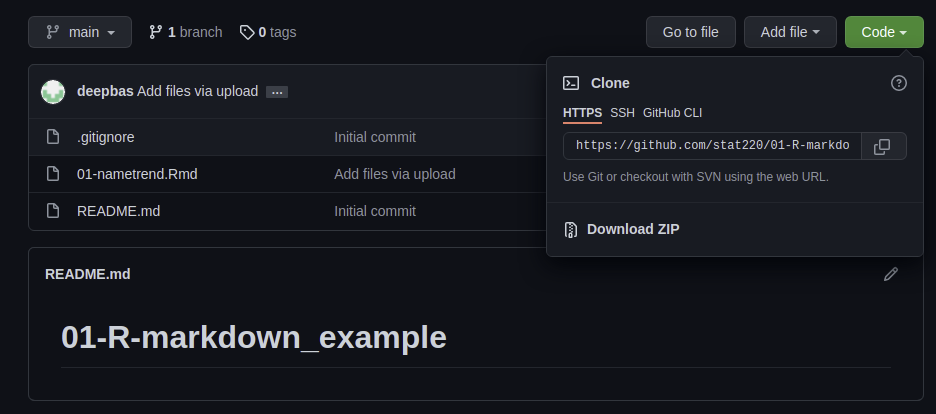
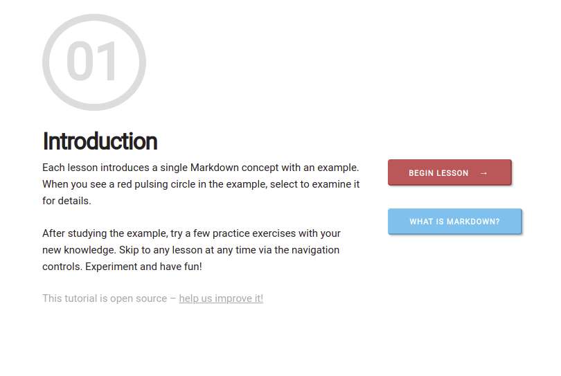

```{r setup, include=FALSE}
knitr::opts_chunk$set(echo = TRUE, 
                      dev = 'svg',
                      collapse = TRUE)
```


```{css, echo = FALSE}
.red { color: red; }

```

# Replicability vs. Reproducibility

- Scientific findings should be **replicatable**

    * Asha repeats Bob's lab experiment and gets different data but makes the same conclusions as Bob
    
--

- Statistical findings should be **reproducible**

    * Asha takes Bob's data and gets the exact same statistical results as Bob
--

- Statistical findings should be *easily* **reproducible**

    * Asha only needs to hit one button to reproduce Bob's results.
    
    * Asha only needs to hit one button to reproduce Bob's analysis on a *new data set*


---


# Reproducible data science


### Short-term impact

- Are the tables and figures reproducible from the code and data?

- Does the code work as intended?

- In addition to what was done, is it clear **why** it was done? 
(e.g., how were parameter settings chosen?)

--

### Long-term impact

- Can the code be used for other data?

- Can you extend the code to do other things?

---


# Making your work reproducible

* You need a scriptable program (e.g. R, Python)

    * forces you to record the linear sequence of events in an analysis
    
    * avoid point-n-click!
    
    * avoid any "by hand" actions (e.g. data cleaning in Excel)

--

.red[But scriptable doesn't always mean reproducible!!]

--

* You should make your workflow  transparent and easily followed, $\rightarrow$ R Markdown

    * meaningful file and variable names
    
    * don't overly complicate code, use packages when only when needed (the fewer dependencies the better)
    
    * only relevant code included
    
    * **written description of your analysis process and results alongside your code**


---
background-image: url(`r xaringan:::karl`)
background-size: cover
class: center, bottom, inverse

# Karl Broman’s [Steps toward Reproducible Research](https://www.biostat.wisc.edu/~kbroman/presentations/repro_research_JSM2016_withnotes.pdf)

---


# Reproducibility using R markdown

- Karl Broman paraphrasing Mark Holder: 

    + **Your closest collaborator is you six months ago, but you don’t reply to emails.**
    
    + You need to document your workflow for both yourself and current/future collaborators
    


- R Markdown is a literate programming language that integrates R code, results and write-up.

    + literate = it is readable and easy to learn


 

---


# Assignment-0 Recap

```{r, echo=FALSE,  message=FALSE, comment=FALSE}
#install.packages("babynames")
library(babynames)
#install.packages("tidyverse")
library(tidyverse)
filtered_names <- babynames %>% filter(name=="John")
```


```{r eval=require('DT'), echo = FALSE, tidy=FALSE}
DT::datatable(
  head(babynames, 24),
  fillContainer = FALSE, options = list(pageLength = 6)
)
```


--

```{r comment='#'}
dim(babynames)
```


---

# Communication is important!

```{r trend, fig.height=4, dev='svg', echo=FALSE}
par(mar = c(4, 4, 1, .1))
ggplot(data=filtered_names, aes(x=year, y=prop)) + geom_line(aes(colour=sex)) + 
  xlab('Year') +  ylab('Prop. of Babies Named John')
```

--

.red[The overall trend of baby name `John` has been on a steady decline over the years.]

---

# Basic anatomy of R-markdown


1. The **metadata**

1. The **text** 

1. The **code**

1. The **output**


---

# Let's look at the source anatomy 

Please git clone this repository to your local folder.



```{r echo = FALSE}
library(countdown)
countdown(minutes = 5)
```

---


# Metadata and output types

.pull-left[

**YAML** (yet another markup language)

-  data serialization language that is often used for writing configuration files.


Basic recipe: 
```yaml
---
key: value
---
```


Example:

```yaml
---
title: My title
output:
  github_document
    toc: true
    theme: flatly
---
```

]

--

.pull-right[

**Output types**

- html_document (can’t view in GitHub repo)
- pdf_document (need MikTex or MacTex installed)
- github_document (creates a .md Markdown doc, viewable on
GitHub)
- ioslides_presentation, beamer_presentation


```yaml
---
title: "Baby Name Trends"
output: github_document
---
```

```yaml
---
title: "Baby Name Trends"
output: github_document
params: 
  attribute: value
---
```

]


---


# Parameters

```yaml
---
title: "Baby Name Trends"
output: html_document
params: 
  name:
  from:
  to:
---
```


To Do:

- Change the parameters and output types!!
- Try 'Knit with Parameters'

```{r echo = FALSE}
library(countdown)
countdown(minutes = 6)
```


---

# Text

Use markdown to format the text

[10 minute tutorial](https://commonmark.org/help/tutorial/)




---


# Text

- Simple  rules for 

--
    * section headers (`#`,`##`,etc)
--
    * lists (need ~2 tabs to create sublists)
--
    * formatting (bold `**`, italics `*`)
--
    * tables
--
    * R syntax (use backward tick ` ` `)
--
    * web links `[linked text](url)`
--
    * latex math equations $\beta_1 + \beta_2$
--
    * in HTML docs, you can use HTML commands (in pdf, latex commands)
   
For further help, look at [R Markdown Cheatsheet](https://deepbas.io/courses/stat220/cheatsheets/)
    
---


# Code chunks

Code goes in **chunks**, defined by three backticks

```{r, echo=FALSE, comment=FALSE, include=FALSE, message=FALSE}
library(babynames)
library(tidyverse)
library(ggplot2)

filtered_names <- babynames %>% filter(name=="Aimee", year < max(year), year > min(year))

```

````
```{r}`r ''`

filtered_names <- babynames %>% filter(name=="Amiee", year < max(year), year > min(year))

ggplot(data=filtered_names, aes(x=year, y=prop)) + 
  geom_line(aes(colour=sex)) + 
  xlab('Year') + 
  ylab('Prop. of Babies Named Aimee')

```
````
---


#  Adding/running chunks

Let's

1. Add chunks with button or:

   Command (or Cmd) `⌘` + Option (or Alt) `⌥` +  `i` (Mac)
  
   Ctrl + Alt + `i` (Windows/Linux)
   
1. Run chunks by:

   Run current chunk button (interactive)
   
   Knit button / run all chunks
   
---


# Inline code

.left-wide[

How many babies were born with name 'Aimee'?

``` `r knitr::inline_expr(' sum(filtered_names$n)')` ```

There are a total of
`r  sum(filtered_names$n)` babies.

]
--

.right-narrow[

In what year were there highest proportion of babies born with the name `Aimee`?

``` `r knitr::inline_expr(' filtered_names$year[which.max(filtered_names$prop)]')` ```

`Aimee` name was the most popular in 
`r filtered_names$year[which.max(filtered_names$prop)]`.

]

---


# Chunk options

.pull-left[
````
```{r}`r ''`
glimpse(filtered_names)
```
````
]


.pull-right[
```{r}
dplyr::glimpse(filtered_names)
```
]

---
# echo


````
```{r echo=FALSE}`r ''`
glimpse(filtered_names)
```
````


```{r echo=FALSE}
glimpse(filtered_names)
```


---

# eval

.pull-left[
````
```{r eval=FALSE}`r ''`
glimpse(filtered_names)
```
````
]

.pull-right[
```{r eval=FALSE}
glimpse(filtered_names)
```
]

---
# include
.pull-left[
````
```{r include=FALSE}`r ''`
glimpse(filtered_names)
```
````
]
.pull-right[
```{r include=FALSE}
glimpse(filtered_names)
```
]

---

# results
.pull-left[
.code108[
````
```{r echo=TRUE, results='hide'}`r ''`
glimpse(filtered_names)
```
````
]
]

.pull-right[
.code108[
```{r echo=TRUE, results='hide'}
glimpse(filtered_names)
```
]
]


---
# Chunk option take-aways
+ Place between curly braces<br>`{r option=value}`

+ Multiple options separated by commas<br>`{r option1=value, option2=value}`

+ Careful! The `r` part is the **code engine** (other engines possible)

---
# Chunk labels

.code100[
````
```{r peek, echo=FALSE, results='hide'}`r ''`
glimpse(filtered_names)
```
````

]

+ Place between curly braces<br>`{r label}`
+ Separate options with commas<br>`{r label, option1=value}`
+ Careful! Don't duplicate labels

.code100[
````
```{r peek}`r ''`
head(filtered_names)
```
````
]
.code100[
```
Error in parse_block(g[-1], g[1], params.src) : 
  duplicate label 'peek'
Calls: <Anonymous> ... process_file -> split_file -> lapply -> FUN -> parse_block
Execution halted
```
]

???
how can we make it easier on ourselves to explore the code in here?
show how to add chunk labels and view in IDE interactively

---

# The setup chunk
.pull-left[
````
```{r setup, include=FALSE}`r ''`
knitr::opts_chunk$set(
  collapse = TRUE,   
  comment = "#>", 
  out.width = "100%" 
)
```
````
]
.pull-right[
+ A special chunk label: `setup`

+ Typically the first

+ All following chunks will use these options (i.e., sets global chunk options)

+ **Tip**: set `include=FALSE`

+ You can (and should) use individual chunk options too
]

---


#  Exercise

Customize this report

1. Label the code chunk with your plot in it.

1. Add your setup chunk.

1. Add `fig.path = "figs/"` as a knitr code chunk option for a single plot. What happened? What happens if you don't include the forwardslash?

1. Knit and behold

1. Add it to a global setup chunk instead

```{r echo=FALSE}
countdown(minutes = 5)
```

---

# Acknowledgments

Parts of these slides were adapted from previous works of Adam Loy and Katie St. Clair.


