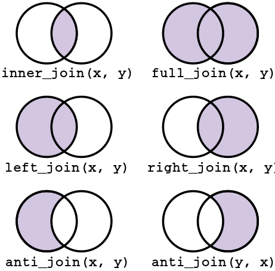

<style type="text/css">

.hljs-github .hljs {
    background: #e5e5e5;
}

.inline-c, remark-inline-code {
   background: #e5e5e5;
   border-radius: 3px;
   padding: 4px;
   font-family: 'Source Code Pro', 'Lucida Console', Monaco, monospace;
}

.yellow-h{
   background: #ffff88;
}

.out-t, remark-inline-code {
   background: #9fff9f;
   border-radius: 3px;
   padding: 4px;
   
}

.pull-left-c {
    float: left;
    width: 58%;
    
}

.pull-right-c {
    float: right;
    width: 38%;
    
}

.large {
    font-size: 200%
    
}

.medium {
    font-size: 75%
    
}

.small {
    font-size: 50%
    }

.action {
    background-color: #f2eecb;
  
}

</style>

```{css, echo = FALSE}
.red{ color: red;}
.remark-code, .remark-inline-code {
    font-family: 'Fira Mono', 'Source Code Pro', monospace;}
.remark-slide-scaler {
    overflow-y: auto;}
.remark-slide-content {
  font-size: 24px;
  padding: 20px 80px 20px 80px;
}
.remark-code, .remark-inline-code {
  background: #f0f0f0;
}
.remark-code {
  font-size: 20px;
}
.huge .remark-code { /*Change made here*/
  font-size: 200% !important;
}
.tiny .remark-code { /*Change made here*/
  font-size: 75% !important;
}

```


```{r setup, include=FALSE}
knitr::opts_chunk$set(echo = TRUE, 
                      dev = 'svg',
                      collapse = TRUE, 
                      comment=NA, 
                      warning = FALSE,
                      message = FALSE,
                      fig.height = 4, fig.width = 6, fig.align='center')


library(dplyr)
library(dslabs)
library(ggplot2)
library(countdown)
library(ggthemes)
library(tidyverse)
library(stringr)
library(xaringanExtra)
xaringanExtra::use_panelset()

library(knitr)
library(kableExtra)
library(fontawesome)

# Data
pollution <- tribble(
       ~city,   ~size, ~amount, 
  "New York", "large",      23,
  "New York", "small",      14,
    "London", "large",      22,
    "London", "small",      16,
   "Beijing", "large",      121,
   "Beijing", "small",      56
)

```


# Slicing and selecting data

The slice_ operators let you slice (subset) rows:

- `slice_head(n=5)` : view the first 5 rows

- `slice_tail(n=5)` : view the last 5 rows

- `slice_sample(n=5)` : view 5 random rows

- `slice_min(column, n=5)` : view the 5 smallest values of a column

- `slice_max(column, n=5)` : view the 5 largest values of a column

---

# *slice()*

```{r}
library(gapminder)
slice(gapminder, 1:5)
```

---

# *slice()*

```{r}
slice(gapminder, -(1:3))
```

---

# *slice_max()*

```{r}
gapminder %>% 
  slice_max(gdpPercap, n=6)
```

---

# *summarize()* vs. *mutate()*

*summarize()* : summarize collapses all variable values down to one number (by group)

```{r}
gapminder %>% 
  group_by(continent) %>% 
  summarize(avg_life_expectancy = mean(lifeExp)) #<<
```

---

# *summarize()* vs. *mutate()*

*mutate()* : transforms all variable values but preserves the variable length (by group)

```{r}
gapminder %>%
  group_by(continent) %>%
  mutate(meanPop = mean(pop)/1000000) #<<
```

---

# *group_by()*

```{r}
gapminder %>% 
  group_by(continent, year) %>% 
  summarise(avg_life_expectancy = mean(lifeExp)) %>% 
  slice_max(avg_life_expectancy, n = 1)
```

---

# *ungroup()*

Any further mutations called on it would not use the grouping for aggregate statistics.

```{r}
gapminder %>% 
  group_by(continent, year) %>% 
  summarise(avg_life_expectancy = mean(lifeExp)) %>% 
  ungroup() %>% #<<
  slice_max(avg_life_expectancy, n = 1)

```

---

# Two-table verbs

.pull-left-c[
- `inner_join()` - Merge two datasets. Exclude all unmatched rows.

- `full_join()` - Merge two datasets. Keep all observations.

- `left_join()` - Merge two datasets. Keep all observations from the origin table.

- `right_join()` - Merge two datasets. Keep all observations from the destination table.

- `anti_join()` - Drops all observations in origin that have a match in destination table.

]


.pull-right-c[

```{r echo=FALSE, out.width=400}

```

]


---

# Mutating Joins


- Mutating joins

    - `left_join()`
    
    - `right_join()`
    
    - `inner_join()`
    
    - `full_join()`


--

-  Differ in their behaviour when a match is not found

---

# Flights and airlines data

```{r}
library(nycflights13)
flights2 <- flights %>% 
  select(year:day, hour, origin, dest, tailnum, carrier)
```

--


```{r}
head(flights2)
```

---

# Airline information

```{r}
head(airlines)

```

---

# *left_join()*

```{r}
flights2 %>% 
  left_join(airlines)
```

---

# Keys: controlling how the tables are matched

```{r}
flights2 %>% left_join(planes, by = "tailnum")
```

---

# Matching keys


```{r}
flights2 %>% left_join(airports, c("origin" = "faa"))
```
---

# *inner_join()*

```{r}
df1 <- tibble(x = c(1, 2), y = 2:1)
df2 <- tibble(x = c(3, 1), a = 10, b = "a")
```

--

.pull-left[
```{r, echo=FALSE}
df1 %>% knitr::kable(type = "html", caption = "df1")
```
]
.pull-right[
```{r, echo=FALSE}
df2 %>% knitr::kable(type = "html", caption = "df2")
```
]

--

<br>

```{r, eval=FALSE}
df1 %>% inner_join(df2)
```

```{r, echo=FALSE}
df1 %>% inner_join(df2) %>% knitr::kable()
```


---
  
# *left_join()*

.pull-left[
```{r, echo=FALSE}
df1 %>% knitr::kable(type = "html", caption = "df1")
```
]
.pull-right[
```{r, echo=FALSE}
df2 %>% knitr::kable(type = "html", caption = "df2")
```
]


--

<br>

.pull-left[
```{r, eval=FALSE}
df1 %>% left_join(df2)
```

```{r, echo=FALSE}
df1 %>% left_join(df2) %>% 
  knitr::kable(type = "html")
```
]
.pull-right[
```{r, eval=FALSE}
df2 %>% left_join(df1)
```

```{r, echo=FALSE}
df2 %>% left_join(df1) %>% 
  knitr::kable(type = "html")
```
]


---
  
# *right_join()*

.pull-left[

```{r, echo=FALSE}
df1 %>% knitr::kable(type = "html", caption = "df1")
```

]
.pull-right[

```{r, echo=FALSE}
df2 %>% knitr::kable(type = "html", caption = "df2")
```
]


--

<br>

.pull-left[

```{r, eval=FALSE}
df1 %>% right_join(df2)
```


```{r, echo=FALSE}
df1 %>% right_join(df2) %>% 
  knitr::kable(type = "html")
```
]

.pull-right[
```{r, eval=FALSE}
df2 %>% right_join(df1)
```

```{r, echo=FALSE}
df2 %>% right_join(df1) %>% 
  knitr::kable(type = "html")
```
]

---
  
#  Your Turn 1

- Please git clone the repository on [joining data frames](https://github.com/stat220/06-data-joins) from the course GitHub organization.

- Use the provided `artists` and `bands`  tibbles to perform `left_join()` ans `right_join()`.
  - Use `left_join()` to join artists to bands.
  - Use `right_join()` to join bands to artists.
  - Use `setequal()` to check that the datasets are the same.


```{r echo=FALSE}
countdown(4)
```

---
  
# *full_join()*

.pull-left[

```{r, echo=FALSE}
df1 %>% knitr::kable(type = "html", caption = "df1")
```

]
.pull-right[

```{r, echo=FALSE}
df2 %>% knitr::kable(type = "html", caption = "df2")
```
]

--

<br>

```{r, eval=FALSE}
df1 %>% full_join(df2)
```


```{r, echo=FALSE}
df1 %>% full_join(df2) %>% knitr::kable(type = "html")
```
  
---

#  Your Turn 2

Work with the tibbles: `albums`, `songs`, and `labels`.

- Use `inner_join()` to join `albums` to `songs`.
- Use `full_join()` to join `bands` to `artists`.
- Repeat the above using the pipe operator, `%>%`.
- Create one table that combines all information


```{r echo=FALSE}
countdown(5)
```
---

  
# Filtering joins

Filtering joins return a copy of the dataset that has been filtered, not augmented (as with mutating joins)

- `semi_join(x,y)` :  keeps all observations in x that have a match in y.

- `anti_join(x,y)` :  drops all observations in x that have a match in y.


--

.out-t[most useful for diagnosing join mismatches]

---

# Another example 

```{r}
df1 <- tibble(x = c(1, 1, 3, 4), y = 1:4)
df2 <- tibble(x = c(1, 1, 2), z = c("a", "b", "a"))
```

--

.pull-left[
```{r, echo=FALSE}
df1 %>% knitr::kable(type = "html", caption = "df1")
```
]
.pull-right[
```{r, echo=FALSE}
df2 %>% knitr::kable(type = "html", caption = "df2")
```
]

---

# *semi_join()*


.pull-left[
```{r, echo=FALSE}
df1 %>% knitr::kable(type = "html", caption = "df1")
```
]
.pull-right[
```{r, echo=FALSE}
df2 %>% knitr::kable(type = "html", caption = "df2")
```
]

--

<br>
.pull-left[
```{r, eval=FALSE}
df1 %>% semi_join(df2, by = "x")
```

```{r, echo=FALSE}
df1 %>% semi_join(df2, by = "x") %>% knitr::kable(type = "html")
```
]
.pull-right[
```{r, eval=FALSE}
df2 %>% semi_join(df1, by = "x")
```

```{r, echo=FALSE}
df2 %>% semi_join(df1, by = "x") %>% knitr::kable(type = "html")
```
]


---

# *anti_join()*

.pull-left[
```{r, echo=FALSE}
df1 %>% knitr::kable(type = "html", caption = "df1")
```
]
.pull-right[
```{r, echo=FALSE}
df2 %>% knitr::kable(type = "html", caption = "df2")
```
]

--

<br>


.pull-left[
```{r, eval=FALSE}
df1 %>% anti_join(df2, by = "x")
```

```{r, echo=FALSE}
df1 %>% anti_join(df2, by = "x") %>% knitr::kable(type = "html")
```
]

.pull-right[
```{r, eval=FALSE}
df2 %>% anti_join(df1, by = "x")
```

```{r, echo=FALSE}
df2 %>% anti_join(df1, by = "x") %>% knitr::kable(type = "html")
```
]


---

#  Your Turn 3

Continue working with the previous tibble to practice `semi_join()` and `anti_join()`

  - Collect `artists` that have `songs` provided.
  
  - Collect the `albums` made by a `band` and count them.
  
  - Return rows of `artists` that don't have bands info. Hint use `anti_join()`.
  
  - Find the rows of `songs` that match a row in `labels` and find the number of rows.


```{r echo=FALSE}
countdown(5)
```

---


# Set Operations

These expect the x and y inputs to have the same variables, and treat the observations like sets:

--

- `intersect(x,y)`

  - will return only the rows that appear in both datasets

--

- `union(x,y)` 
  - return every row that appears in one or more of the datasets
  - If a row appears multiple times union will only return it once

--

- `setdiff(x,y)`
  - will return the rows that appear in the first dataset but not the second

---

# One more example 

```{r}
df1 <- tibble(x = 1:2, y = c(1L, 1L))
df2 <- tibble(x = 1:2, y = 1:2)
```

--

<br>

.pull-left[
```{r, echo=FALSE}
df1 %>% knitr::kable(type = "html", caption = "df1")
```
]
.pull-right[
```{r, echo=FALSE}
df2 %>% knitr::kable(type = "html", caption = "df2")
```
]

---

# Set operations

.pull-left[
```{r, eval=FALSE}
intersect(df1, df2))
```

```{r, echo=FALSE}
intersect(df1, df2) %>% knitr::kable(type = "html")
```
]
.pull-right[
```{r, eval=FALSE}
union(df1, df2))
```

```{r, echo=FALSE}
union(df1, df2) %>% knitr::kable(type = "html")
```
]

--

<br>

.pull-left[
```{r, eval=FALSE}
setdiff(df1, df2))
```

```{r, echo=FALSE}
setdiff(df1, df2) %>% knitr::kable(type = "html")
```
]
.pull-right[
```{r, eval=FALSE}
setdiff(df2, df1))
```

```{r, echo=FALSE}
setdiff(df2, df1) %>% knitr::kable(type = "html")
```
]


