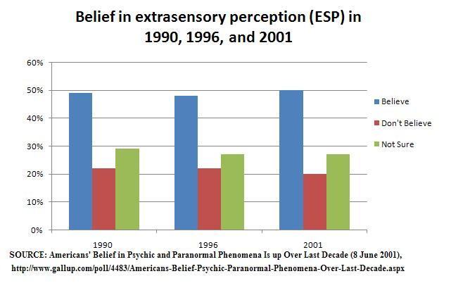

```{r setup, include=FALSE}
options(htmltools.dir.version = FALSE)
options(htmltools.preserve.raw = FALSE)
options(ggrepel.max.overlaps = Inf)

knitr::opts_chunk$set(echo = TRUE, 
                      dev = 'svg',
                      collapse = TRUE, 
                      comment = NA,  # PRINTS IN FRONT OF OUTPUT, default is '##' which comments out output
                      prompt = FALSE, # IF TRUE adds a > before each code input
                      warning = FALSE, 
                      message = FALSE,
                      fig.height = 3, 
                      fig.width = 4,
                      out.width = "100%"
                      )


# load necessary packages
library(tidyverse)
library(countdown)
library(mosaic)
library(ggthemes)
library(xaringanExtra)
library(forcats)
xaringanExtra::use_panelset()
xaringanExtra::use_tachyons()
xaringanExtra::use_clipboard()
xaringanExtra::use_extra_styles(
  hover_code_line = TRUE,         #<<
  mute_unhighlighted_code = TRUE  #<<
)
library(flipbookr)
library(patchwork)
library(Lock5Data)

# Set ggplot theme
theme_set(theme_tufte(base_size = 10))


yt <- 0

# read.csv("https://raw.githubusercontent.com/deepbas/statdatasets/main/APM_DougEvansCases.csv")

```


```{r xaringanExtra-clipboard, echo=FALSE}
htmltools::tagList(
  xaringanExtra::use_clipboard(
    button_text = "<i class=\"fa fa-clipboard\"></i>",
    success_text = "<i class=\"fa fa-check\" style=\"color: #90BE6D\"></i>",
    error_text = "<i class=\"fa fa-times-circle\" style=\"color: #F94144\"></i>"
  ),
  rmarkdown::html_dependency_font_awesome()
)
```


layout: true
  
<!-- <div class="my-footer"><span>Stat 230</span></div> -->
<!-- this adds the link footer to all slides, depends on my-footer class in css-->

---

class: title-slide, middle
<!-- background-image: url("assets/title-image2.jpg") -->
background-position: 10% 90%, 100% 50%
background-size: 160px, 100% 100%

# .fancy[Statistical Hypothesis Testing]

### .fancy[Stat 120]

`r format(Sys.Date(), ' %B %d %Y')`


---

class: middle

# Extrasensory Perception

<center>
<br>
<a></a>
</center>

---

class: middle

# Extrasensory Perception

One way to test for ESP is with Zener cards:

.pull-left[
<br>
<br>
<center>
<br>
<a></a>
</center>

]

.pull-right[
<center>
<br>
<a></a>
</center>

]

> Subjects draw a card at random and telepathically communicate this to someone who then guesses the symbol

---

class: action

# <i class="fa fa-pencil-square-o" style="font-size:48px;color:purple">&nbsp;Your&nbsp;Turn&nbsp;`r (yt <- yt + 1)`</i>    

.pull-left-40[

]
.pull-right-60[
<br>
.blockquote[

Randomly choose a letter from A B C D E and write it down (don’t show anyone!)

Find a partner, telepathically communicate your letter (no auditory or visual clues!) and have them guess your
letter.

Repeat a couple of times then switch roles.


]

.out-t[How often did you guess correctly?]
]

`r countdown(minutes = 5, seconds = 00, top = 0 , color_background = "inherit", padding = "3px 4px", font_size = "2em")`

---

class: middle, inverse

.large[
> Suppose you did this 10 times and guessed correctly 3 times. Is this evidence that you have ESP abilities?]

---

# Extrasensory Perception

.blockquote-list[
There are five cards with five different symbols. If there is no such thing as ESP, what proportion p of guesses should be correct?

  1. $\mathrm{p}=0$
  2. $\mathrm{p}=1/ 4$
  3. $\mathrm{p}=1 / 5$
  4. $\mathrm{p}=1 / 2$
]


<br>
<details>
<summary>.large.red[Click for answer]</summary>
The correct answer is 3. (since there are five choices and we are randomly guessing)
</details>

---

# Extrasensory Perception (Example 1)

.blockquote[
Let $\hat{p}$ denote the sample proportion of correct guesses. Which of the statistics below would give the strongest evidence for ESP?

  1. $\hat{\mathrm{p}}=0$
  2. $\hat{\mathrm{p}}=1 / 5$
  3. $\hat{\mathrm{p}}=1 / 2$
  4. $\hat{\mathrm{p}}=3 / 4$
]

<br>
<details>
<summary>.large.red[Click for answer]</summary>
The correct answer is 4. Since more correct means ESP. 
</details>


---

# Extrasensory Perception

.blockquote-list.font120[
- As we've learned, statistics vary from sample to sample
- Even if the "population/true" proportion is $\mathrm{p}=1/5$, not every sample proportion will be exactly $1/5$
]

--

<br>
<br>

.out-t.font120[How do we determine when a sample proportion is far enough above 1/5 to provide evidence of ESP?]

---

# Statistical Test

.blockquote-list.font120[
A statistical test uses data from a sample to assess a claim about a population or experiment


.yellow-h.bold[Null Hypothesis:] $\left(\mathrm{H}_{0}\right)$
Claim that there is no effect or difference.

.yellow-h.bold[Alternative Hypothesis:] $\left(\mathrm{H}_{\mathrm{a}}\right)$
Claim for which we seek evidence.

]

--

<br>
<br>

.out-t.center[Always claims about .bold[population parameters.]]

---

# ESP Hypothesis
.blockquote.font90[
For the ESP experiment:
  - $\mathrm{H}_{0}: \mathrm{p}=1 / 5$
  - $\mathrm{H}_{\mathrm{a}}: \mathrm{p}>1 / 5$
]

<br>

.blockquote.font90[
.purple[Helpful hints:]
  - $\mathrm{H}_{0}$ usually includes $=$
  - $\mathrm{H}_{\mathrm{a}}$ usually includes $>,<$, or $\neq$
  - The direction in $\mathrm{H}_{\mathrm{a}}$ depends on the question being asked, not based on what the data shows!
  - The data should be used as an evidence supporting or refuting $\mathrm{H}_{\mathrm{a}}$.
]

---


# Sleep Vs. Caffeine (Example 2)

.blockquote[
Students were given words to memorize, then randomly assigned to take either a 90 min nap, or a caffeine pill. $2 \frac{1}{2}$ hours later, they were tested on their recall ability.
- Explanatory variable: .bold[sleep or caffeine]
- Response variable: .bold[number of words recalled]
]

--

<br>

.out-t[Is sleep or caffeine better for memory?
]

.footnote[Mednick, Cai, Kanady, and Drummond (2008). “Comparing the benefits of caffeine, naps and placebo on verbal, motor and perceptual memory,” Behavioral Brain Research, 193, 79-86.]

---

class: middle

# Sleep Vs. Caffeine

.blockquote[

What is the parameter of interest in the sleep versus caffeine experiment?

  1. Proportion
  2. Difference in proportions
  3. Mean
  4. Difference in means
  5. Correlation
  
]

<br>
<details>
<summary>.large.red[Click for answer]</summary>
The correct answer is 4.

.blockquote[Difference in mean responses $\mu_1 - \mu_2$, where $\mu_1$ and $\mu_2$ are the mean words recalled in the two different conditions]

</details>


---

class: middle

# Sleep Vs. Caffeine

.blockquote-list[
- Let $\mu_{\mathrm{s}}$ and $\mu_{\mathrm{c}}$ be the mean number of words recalled after sleeping and after caffeine.
- Is there a difference in average word recall between sleep and caffeine?
]

---

# Sleep Vs. Caffeine

.blockquote[
- What are the null and alternative hypothesis?
  1. $\mathrm{H}_{0}: \mu_{\mathrm{s}} \neq \mu_{\mathrm{c}}, \mathrm{H}_{\mathrm{a}}: \mu_{\mathrm{s}}=\mu_{\mathrm{c}}$
  2. $\mathrm{H}_{0}: \mu_{\mathrm{s}}=\mu_{\mathrm{c}}, \mathrm{H}_{\mathrm{a}}: \mu_{\mathrm{s}} \neq \mu_{\mathrm{c}}$
  3. $\mathrm{H}_{0}: \mu_{\mathrm{s}} \neq \mu_{\mathrm{c}}, \mathrm{H}_{\mathrm{a}}: \mu_{\mathrm{s}}>\mu_{\mathrm{c}}$
  4. $\mathrm{H}_{0}: \mu_{\mathrm{s}}=\mu_{\mathrm{c}}, \mathrm{H}_{\mathrm{a}}: \mu_{\mathrm{s}}>\mu_{\mathrm{c}}$
  5. $\mathrm{H}_{0}: \mu_{\mathrm{s}}=\mu_{\mathrm{c}}, \mathrm{H}_{\mathrm{a}}: \mu_{\mathrm{s}}<\mu_{\mathrm{c}}$
]

<br>
<details>
<summary>.large.red[Click for answer]</summary>
The correct answer is 2 (since we are looking for evidence that the means are different)
</details>

---

class: middle

# Difference in Hypothesis

Note: the following two sets of hypotheses are equivalent, and can be used interchangeably:

.blockquote[
$$\begin{array}{ll}
\mathrm{H}_{0}: \mu_{1}=\mu_{2} & \mathrm{H}_{0}: \mu_{1}-\mu_{2}=0 \\
\mathrm{H}_{\mathrm{a}}: \mu_{1} \neq \mu_{2} & \mathrm{H}_{\mathrm{a}}: \mu_{1}-\mu_{2} \neq 0
\end{array}$$
]

---

# Guess the best inference method

Options: .green[TEST, CONFIDENCE INTERVAL, NEITHER]

.blockquote-list[
(a) What proportion of US adults support gun control?]


<br>
<details>
<summary>.large.red[Click for answer]</summary>
<br>
.blockquote[
- Estimating a parameter
- .bold[Confidence Interval] for $\mathrm{p}$
- proportion of US adults who support gun control.]

</details>


---

# Guess the best inference method

Options: .green[TEST, CONFIDENCE INTERVAL, NEITHER]

.blockquote-list[
(b) Does the proportion of US adults who support gun control differ between males and females?]


<br>
<details>
<summary>.large.red[Click for answer]</summary>
<br>
.blockquote[
.bold[Testing] the claim of difference
$$\begin{array}{l}
\mathrm{H}_{0}: \mathrm{p}_{\mathrm{f}}=\mathrm{p}_{\mathrm{m}} \\
\mathrm{H}_{\mathrm{a}}: \mathrm{p}_{\mathrm{f}} \neq \mathrm{p}_{\mathrm{m}}
\end{array}$$
]

</details>


---

# Guess the best inference method

Options: .green[TEST, CONFIDENCE INTERVAL, NEITHER]

.blockquote-list[
(c) What proportion of this class supports gun control?]


<br>
<details>
<summary>.large.red[Click for answer]</summary>
<br>
.blockquote[
.bold[Neither], just collect data on the entire population (class) to answer this question.
]

</details>


---

# Guess the best inference method

Options: .green[TEST, CONFIDENCE INTERVAL, NEITHER]

.blockquote-list[
(d) How much more do men earn, on average, compared to women in the US?]


<br>
<details>
<summary>.large.red[Click for answer]</summary>
<br>
.blockquote[
“how much" means an estimate: .bold[Confidence Interval] for
$$\mu_{\mathrm{f}}-\mu_{\mathrm{m}}$$
]

</details>


---

# Guess the best inference method

Options: .green[TEST, CONFIDENCE INTERVAL, NEITHER]

.blockquote-list[
(e) What proportion of Minnesota voters in the 2012 election voted for President Biden?]


<br>
<details>
<summary>.large.red[Click for answer]</summary>
<br>
.blockquote[
- Neither, this number is computed from voting records
]

</details>


---

# Guess the best inference method

Options: .green[TEST, CONFIDENCE INTERVAL, NEITHER]

.blockquote-list[
(f) Is a higher rate of cricket chirping associated with higher summer night temps?]


<br>
<details>
<summary>.large.red[Click for answer]</summary>
<br>
.blockquote[
- .bold[Testing] a claim about association
$$\begin{array}{l}
\mathrm{H}_{0}: \rho=0 \text { or } \beta=0 \\
\mathrm{H}_{\mathrm{a}}: \rho>0 \text { or } \beta>0
\end{array}$$
]

</details>


---

class: middle

# Statistical Significance

<center>
<br>
<a href= "https://www.xkcd.com"> xkcd.com </a>
</center>


---

class: middle

# Statistical Significance

.blockquote[
When results as extreme as the observed sample statistic are unlikely to occur by .bold[random chance] alone (assuming the null hypothesis is true), we say the sample results are .bold[statistically significant]
- If our sample is .bold[statistically significant], we have convincing .bold[evidence against] $\mathrm{H}_{0}$, .bold[in favor of] $\mathrm{H}_{\mathrm{a}}$
- If our sample is .bold[not statistically significant], our test is .bold[inconclusive]. The null hypothesis may be true (or maybe not).
]

---

# Extrasensory Perception

.blockquote[
$p=$ Proportion of correct guesses
$$\begin{array}{l}
\mathrm{H}_{0}: \mathrm{p}=1 / 5 \\
\mathrm{H}_{\mathrm{a}}: \mathrm{p}>1 / 5
\end{array}$$
]

<br>
.blockquote[
If results are statistically significant ...
- the sample proportion of correct guesses is higher than is likely just by random chance (if ESP does not exist and $\mathrm{p}=1 / 5$ )
- we have evidence that the true proportion of correct guesses really is higher than $1 / 5$, and thus have evidence of ESP
]

---

class: middle


# Extrasensory Perception

.blockquote[
$p=$ Proportion of correct guesses
$$\begin{array}{l}
\mathrm{H}_{0}: \mathrm{p}=1 / 5 \\
\mathrm{H}_{\mathrm{a}}: \mathrm{p}>1 / 5
\end{array}$$
]

<br>
.blockquote[
If results are .bold[NOT] statistically significant ...
- the sample proportion of correct guesses could easily happen just by random chance (if ESP does not exist and $\mathrm{p}=1 / 5$ )
- we do not have enough evidence to conclude that $p>1 / 5$, or that ESP exists
- BUT we still can't say that $p=1 / 5$
]

---

class: middle

# Sleep Vs Caffeine

.blockquote-list[
- $\mu_{\mathrm{s}}$ and $\mu_{\mathrm{c}}$ : mean number of words recalled after sleeping and after caffeine
- $\mathrm{H}_{0}: \mu_{\mathrm{s}}=\mu_{\mathrm{c}}$ and $\mathrm{H}_{\mathrm{a}}: \mu_{\mathrm{s}} \neq \mu_{\mathrm{c}}$ sleeping and after caffeine
- The sample difference in means is $\overline{\mathrm{x}}_{\mathrm{S}}-\overline{\mathrm{x}}_{\mathrm{C}}=3$, and this is statistically significant. 
]

---

# Sleep Vs Caffeine


The sample difference in means is $\overline{\mathrm{x}}_{\mathrm{S}}-\overline{\mathrm{x}}_{\mathrm{C}}=3$, and this is statistically significant. 

.blockquote-list[
We can conclude ...

  1. there is a difference between sleep and caffeine for memory (and data show sleep is better)
  2. there is a difference between sleep and caffeine for memory (and data show caffeine is better)
  3. there is not a difference between sleep and caffeine for memory
  4. nothing

]


---

# Statistical Significance

.blockquote-list[
- Hypothesis testing is similar to how our justice system works (or is suppose to work).

$$\mathrm{H}_{0} : \text{Defendant is innocent vs. } \mathrm{H}_{\mathrm{a}} \text{: Defendant is guilty}$$
]

<br>

.blockquote[
Assumption: Defendant is innocent $\left(\mathrm{H}_{0}\right)$

Verdict:
- .bold[Guilty:] evidence (data) “beyond a reasonable doubt” points to guilt (Statistically significant)
- .bold[Not Guilty:] evidence (data) not beyond a reasonable doubt, but we don't know if they are truly innocent $\left(\mathrm{H}_{0}\right)$
]


---

# BUT..

.out-t[How do we determine statistical significance??]

.blockquote-list[
For ESP example:
- If there is no ESP, how unusual would it be to get 3 correct guesses in 10 tries?

For Sleep versus Caffeine example:

- If the effect of sleep and caffeine on recall is the same, how rare would it be to get an average difference of 3 words in the experiment conducted?
]


.yellow-h[We assess this with a probability that we call a "p-value."]
---

class: middle

# Summary

.blockquote[
- Statistical tests use data from a sample to assess a claim about a population
- Statistical tests are usually formalized with competing hypotheses:
- Null hypothesis $\left(\mathrm{H}_{0}\right)$ : no effect or no difference
- Alternative hypothesis $\left(\mathrm{H}_{\mathrm{a}}\right)$ : what we seek evidence for
- If data are statistically significant, we have convincing evidence against the null hypothesis, and in favor of the alternative
]

