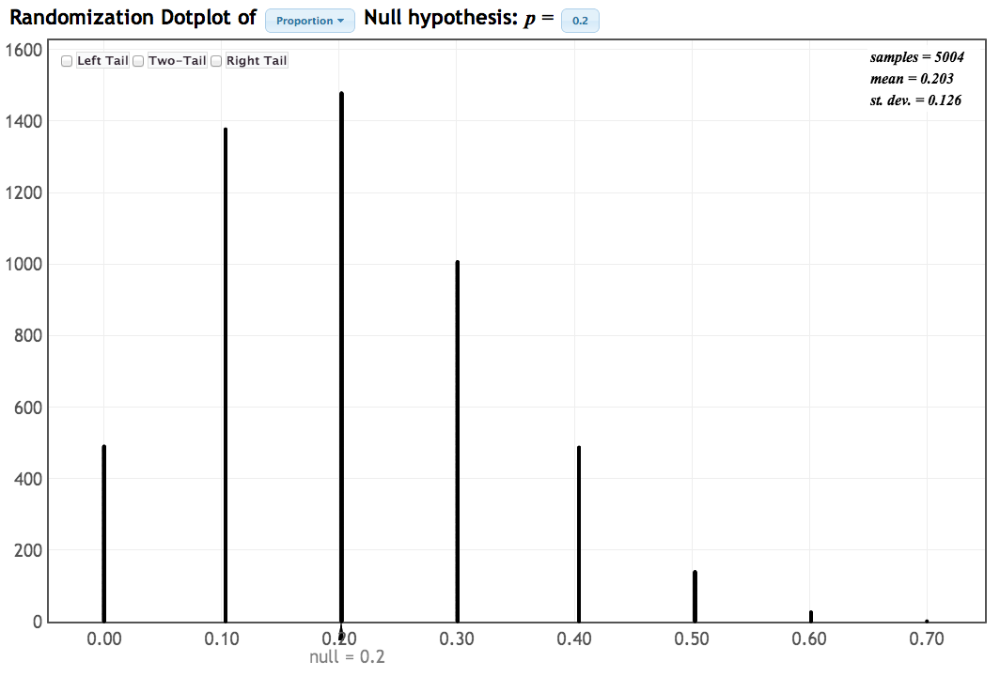
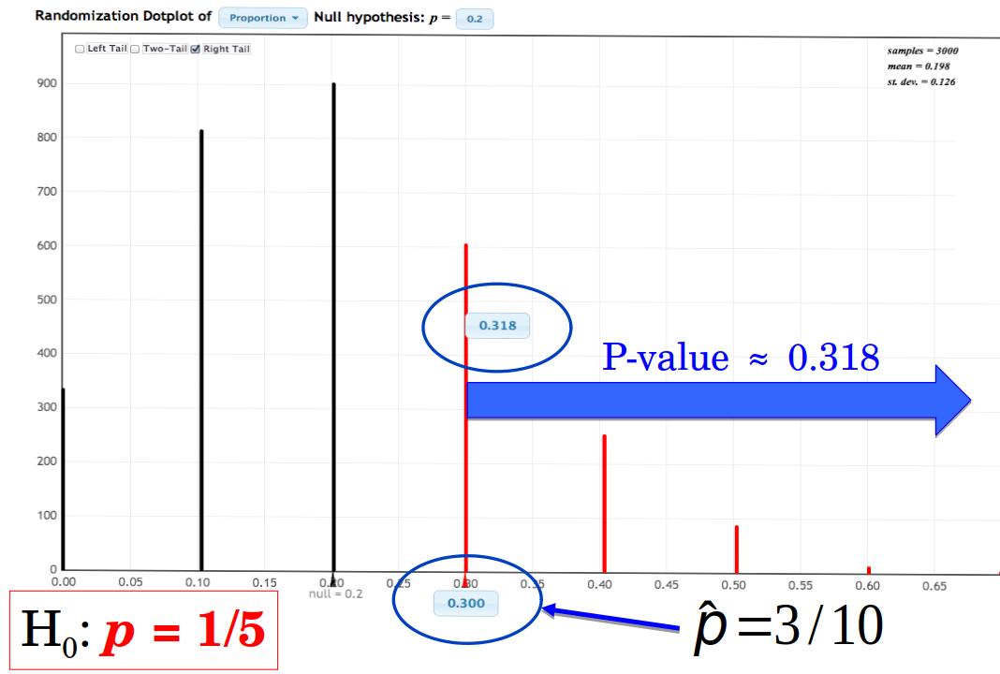
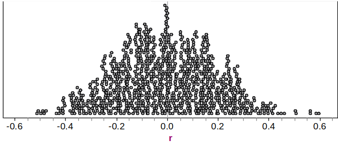
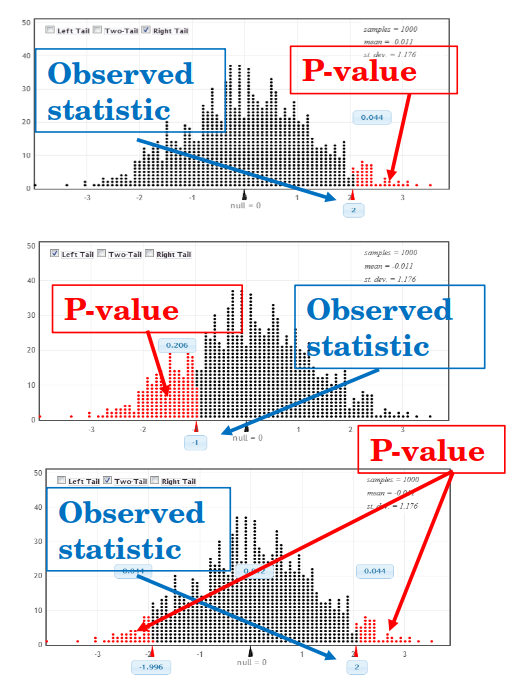
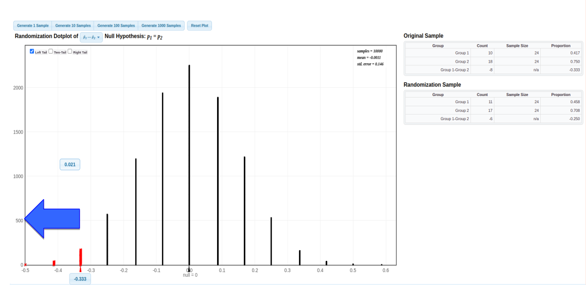

```{r setup, include=FALSE}
options(htmltools.dir.version = FALSE)
options(htmltools.preserve.raw = FALSE)
options(ggrepel.max.overlaps = Inf)

knitr::opts_chunk$set(echo = TRUE, 
                      dev = 'svg',
                      collapse = TRUE, 
                      comment = NA,  # PRINTS IN FRONT OF OUTPUT, default is '##' which comments out output
                      prompt = FALSE, # IF TRUE adds a > before each code input
                      warning = FALSE, 
                      message = FALSE,
                      fig.height = 3, 
                      fig.width = 4,
                      out.width = "100%"
                      )


# load necessary packages
library(tidyverse)
library(countdown)
library(mosaic)
library(ggthemes)
library(xaringanExtra)
library(forcats)
xaringanExtra::use_panelset()
xaringanExtra::use_tachyons()
xaringanExtra::use_clipboard()
xaringanExtra::use_extra_styles(
  hover_code_line = TRUE,         #<<
  mute_unhighlighted_code = TRUE  #<<
)
library(flipbookr)
library(patchwork)
library(Lock5Data)

# Set ggplot theme
theme_set(theme_tufte(base_size = 10))


yt <- 0

# read.csv("https://raw.githubusercontent.com/deepbas/statdatasets/main/APM_DougEvansCases.csv")

```


```{r xaringanExtra-clipboard, echo=FALSE}
htmltools::tagList(
  xaringanExtra::use_clipboard(
    button_text = "<i class=\"fa fa-clipboard\"></i>",
    success_text = "<i class=\"fa fa-check\" style=\"color: #90BE6D\"></i>",
    error_text = "<i class=\"fa fa-times-circle\" style=\"color: #F94144\"></i>"
  ),
  rmarkdown::html_dependency_font_awesome()
)
```


layout: true
  
<!-- <div class="my-footer"><span>Stat 230</span></div> -->
<!-- this adds the link footer to all slides, depends on my-footer class in css-->

---

class: title-slide, middle
<!-- background-image: url("assets/title-image2.jpg") -->
background-position: 10% 90%, 100% 50%
background-size: 160px, 100% 100%

# .fancy[Randomization Distributions and P-values]

### .fancy[Stat 120]

`r format(Sys.Date(), ' %B %d %Y')`


---

class: middle

# Statistical Hypothesis

.bql.font120[
.bold[Null Hypothesis] $(H_0):$ Claim that there is no effect or difference.

.bold[Alternative Hypothesis] $(H_a):$ Claim for which we seek evidence.
]


.out-t[Always claims about population parameters.]

---

# Statistical Significance

.bql[
Hypothesis testing is similar to how our justice system works (or is suppose to work).

$$\mathrm{H}_{0} : \text{Defendant is innocent vs. } \mathrm{H}_{\mathrm{a}} \text{: Defendant is guilty}$$
]

<br>

.bq.font90[
Assumption: Defendant is innocent $\left(\mathrm{H}_{0}\right)$

Verdict:
- .bold[Guilty:] evidence (data) “beyond a reasonable doubt” points to guilt (Statistically significant)
- .bold[Not Guilty:] evidence (data) not beyond a reasonable doubt, but we don't know if they are truly innocent $\left(\mathrm{H}_{0}\right)$
]

---

# Randomization Distribution


> A .bold[randomization distribution] is a collection of statistics from samples simulated assuming the null hypothesis is true


<br>

.bqt[
- Also known as a .bold[permutation distribution].
- A randomization distribution is centered at the value of the parameter given in the .bold[null hypothesis].
]

---


class: middle

# Randomization Distribution for ESP

<center>
 <br>
<div style="position: absolute; top: 30%; left: 50%;">
<span style="content: '\2192'; font-size: 20px; color: #920; text-align: center; white-space: pre-line;">
</span>
</div>
<a></a>
</center>

---

class: middle

# Randomization Distribution for ESP

<center>
 <br>
<div style="position: absolute; top: 30%; left: 50%;">
<span style="content: '\2192'; font-size: 20px; color: #920; text-align: center; white-space: pre-line;">
  <p>This <b>randomization distribution</b> <br> is just the sampling distribution <br> for a sample proportion (n=10) <br> when the population proportion is <b>p=0.20</>.</p>
</span>
</div>
<a></a>
</center>


---

<br>
<br>


# P-value

.bql[
The .bold[p-value] is the chance of obtaining a sample statistic as extreme (or more extreme) than the observed sample statistic, if the null hypothesis is true
]

--

<br>

.bq.font80[
- The p-value can be calculated as the proportion of statistics in a randomization distribution that are as extreme (or more extreme) than the observed sample statistic
- .bold[“extreme”] is determined by the alternative hypothesis]


---

class: middle

## [StatKey](http://www.lock5stat.com/statkey) ESP

<center>
 <br>
<div style="position: absolute; top: 30%; left: 50%;">
<span style="content: '\2192'; font-size: 20px; color: #920; text-align: center; white-space: pre-line;">
</span>
</div>
<a></a>
</center>


---


# p-value for ESP


.bql.font80[The p-value is the chance of getting at least 3 out of 10 guesses correct, if p = 0.2.
- P-value is about 0.318.
- About 31% of the time we would get at least 3 out 10 guesses correct just by chance (no ESP). (interpretation)
]

--

.hljs[Which conclusion does this p-value support?

A. Inconclusive, little evidence that supports $\operatorname{ESP}\left(\mathrm{H}_{\mathrm{a}}\right)$

B. Borderline, weak evidence for $\operatorname{ESP}\left(\mathrm{H}_{\mathrm{a}}\right)$

C. Strong statistically significant evidence for $\operatorname{ESP}\left(\mathrm{H}_{\mathrm{a}}\right)$
]

<details>
<summary class="answer">Click for answer</summary>
The correct answer is A.
</details>


---


class: middle

## `Randomization Distribution`: Correlation

.bqt.font80[
Using the randomization distribution below to test

\begin{align*}
\mathrm{H}_0: \rho=0 \quad \text { vs } \quad \mathrm{H}_{\mathrm{a}}: \rho>0
\end{align*}

Match the sample statistics: $r=0.1$, $r=0.3$, and $r=0.5$

With the p-values: $0.005$, $0.15$, and $0.35$, which sample statistic goes with which p-value?]

<br>
<center>
 <br>
<div style="position: absolute; top: 30%; left: 50%;">
<span style="content: '\2192'; font-size: 20px; color: #920; text-align: center; white-space: pre-line;">
</span>
</div>
<a></a>
</center>


---


.code50[
```{r, fig.align='center',out.width="50%", highlight.code = c(1,3)}
library(CarletonStats)
FloridaLakes <- read.csv("https://www.lock5stat.com/datasets2e/FloridaLakes.csv")
permTestCor(FloridaLakes$pH, FloridaLakes$AvgMercury)
```
]


<center>

<div style="position: absolute; top: 20%; left: 50%;">
    <span style="content: '\2192'; font-size: 30px; color: #920; text-align: center; white-space: pre-line;">
        In R use <span class="red bold">CarletonStats</span> package
    </span>
</div>
<a></a>

</center>


---


class: middle

# Alternative Hypothesis

.bql[
- A .b[one-sided] alternative contains either > or <
- A .b[two-sided] alternative contains $\neq$
- The p-value is the proportion in the tail in the direction specified by $\mathrm{H}_{\mathrm{a}}$
- For a two-sided alternative, the $\mathrm{p}$-value is twice the proportion in the smallest tail
]

---


.pull-left[
## p-value and $H_a$

<br>
<br>

.bql[

\begin{align*}
\text { Upper-tail } \quad & \mathrm{H}_0: \mu=0 \\
\text { (Right Tail) }\quad & \mathrm{H}_{\mathrm{a}}: \mu>0 \\
 \bar{x}& =2
\end{align*}


\begin{align*}
\text { Lower-tail } \quad & \mathrm{H}_0: \mu=0 \\
\text { (Left Tail) } \quad & \mathrm{H}_{\mathrm{a}}: \mu<0 \\
 \bar{x}&=-1
\end{align*}

\begin{align*}
\text { Two-tailed } \quad & \mathrm{H}_0: \mu=0 \\
\quad & \mathrm{H}_{\mathrm{a}}: \mu \neq 0 \\
 \bar{x}&=2
\end{align*}

]

]

.pull-right[

<br>

<center>
 <br>
<div style="position: absolute; top: 30%; left: 50%;">
<span style="content: '\2192'; font-size: 20px; color: #920; text-align: center; white-space: pre-line;">
</span>
</div>
<a></a>
</center>

]


---


.code50[
```{r, fig.align='center',out.width="50%", highlight.code = c(1,3)}
library(CarletonStats)
SleepCaffeine <- read.csv("https://www.lock5stat.com/datasets2e/SleepCaffeine.csv")
permTest(SleepCaffeine$Words, SleepCaffeine$Group)
```
]


<center>
<div style="position: absolute; top: 20%; left: 50%;">
    <span style="content: '\2192'; font-size: 30px; color: #920; text-align: center; white-space: pre-line;">
        <span class="red bold">Sleep Vs Caffeine</span> 
    </span>
</div>
<a></a>
</center>

---

class: middle

## Independent vs. Dependent Samples

.bq.font70[
- **Independent samples**: No link between groups' observations.

- **Dependent samples**: Observations are naturally paired.

  - Example: Measurements before and after an intervention.
]

<br>

.bqt.font60[

### Hypothesis Testing for Paired Differences: `permTestPaired()`

- Focus on the average of within-pair differences, $\mu_d = \mu_1 - \mu_2$.

- Hypotheses:

  - $H_0: \mu_d = 0$ (no effect)
  - $H_A: \mu_d \neq 0$ (presence of effect)
]

---

class: middle

## Coccaine Addiction (Difference in Proportions)

.bql[In a randomized experiment, 48 cocaine addicts attempting to quit were randomly assigned to take either desipramine (a new drug) or lithium (an existing drug) to test if `desipramine` is more effective than `lithium` at treating .b[cocaine addiction], with relapse as the response variable.
]

<br>

&nbsp; | Relapse | No Relapse | total
---- | ---- | ----- | -----
`Desipramine` | 10 | 14 | 24
`Lithium` | 18 | 6 | 24

.out-t[ Is `desipramine` more effective than `lithium` at treating .b[cocaine addiction]?]


---

## [StatKey](http://www.lock5stat.com/statkey) Coccaine Addiction

&nbsp; | Relapse | No Relapse | total
---- | ---- | ----- | -----
`Desipramine` | 10 | 14 | 24
`Lithium` | 18 | 6 | 24


.pull-left[


- $\hat{p}_{D}$: proportion relapsed in `Desipramine`

<br>


\begin{aligned}
& \mathrm{H}_0: p_{D}=p_{L} \\
& \mathrm{H}_{\mathrm{a}}: p_{D}<p_{L}
\end{aligned}

]

.pull-right[
- $\hat{p}_{L}$: proportion relapsed in `Lithium`


\begin{align*}
\hat{p}_{D}=\frac{10}{24}= 0.42 \quad \hat{p}_{L}=\frac{18}{24}= 0.75
\end{align*}
So the sample statistic is:
\begin{align*}
\hat{p}_{D}-\hat{p}_{L}=0.42-0.75=-0.33
\end{align*}

]

--

.purple.Large[
How extreme is -0.33, if $p_{D}=p_{L}$?
]

---


class: middle

# Randomization steps?

.bq.font90[

a. Randomly assign treatments (desipramine/lithium) to 48 participants.

b. Create many simulated samples, assuming null hypothesis is true.

c. Shuffle outcomes (relapse/no relapse) without regard to treatment.

d. Calculate the difference in proportion of relapses for each sample.

e. Repeat steps c and d multiple times (1000+).]


---


class: middle

## [StatKey](http://www.lock5stat.com/statkey) Coccaine Addiction

<center>
 <br>
<div style="position: absolute; top: 20%; left: 15%;">
<span style="content: '\2192'; font-size: 40px; color: #FF00FF; text-align: center; white-space: pre-line;">
  <p>\[p-value &asymp; 0.021\]</p>
</span>
</div>

<a></a>
</center>


---

class: middle

## [StatKey](http://www.lock5stat.com/statkey) Coccaine Addiction

<center>
 <br>
<div style="position: absolute; top: 20%; left: 15%;">
<span style="content: '\2192'; font-size: 40px; color: #FF00FF; text-align: center; white-space: pre-line;">
  <p>\[p-value &asymp; 0.021\]</p>
</span>
</div>

<div style="position: absolute; top: 50%; left: 45%;">
<span style="content: '\2192'; font-size: 20px; color: #920; text-align: center; white-space: pre-line;">
  <p>If proportion relapse for desipramine  <br> is the same as that for lithium, <br> we would see differences this extreme <br> about 2.1% of the time</p>
</span>
</div>
<a></a>
</center>

---

class: middle

# p-value and $H_0$

.bql[
- If the p-value is small, then a statistic as extreme as that observed would be unlikely if the null hypothesis were true, providing statistically "discernible" evidence against $\mathrm{H}_0$

- .bold[The smaller the p-value, the stronger the evidence against the null hypothesis and in favor of the alternative]
]

---

class: action

# <i class="fa fa-pencil-square-o" style="font-size:48px;color:purple">&nbsp;Your&nbsp;Turn&nbsp;`r (yt <- yt + 1)`</i>    

.pull-left-40[

]
.pull-right-60[

<br>
.bql[

- Let's go over to the [course helper page](https://stat120-winter24.netlify.app/)
- Please do the class activity and let me know if you have any questions
- Feel free to talk to your neighbor
]
]

`r countdown(minutes = 20, seconds = 00, top = 0 , color_background = "inherit", padding = "3px 4px", font_size = "2em")`

