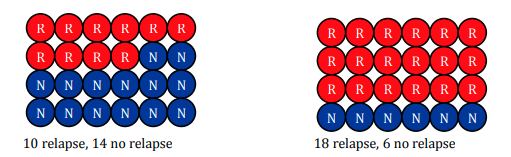
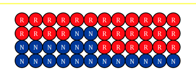
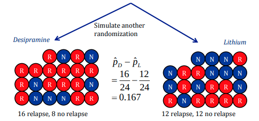
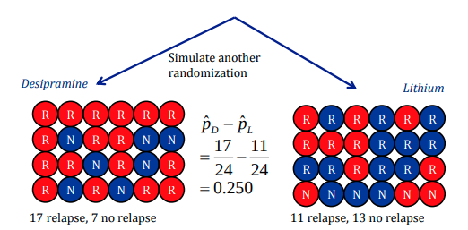
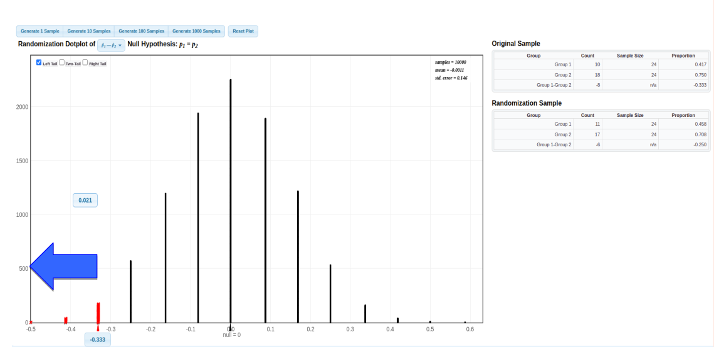
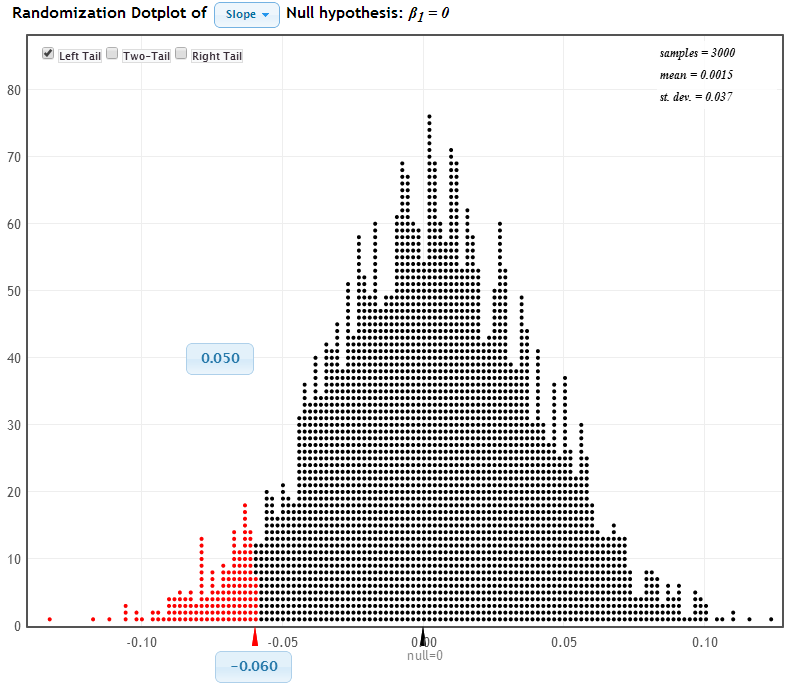

```{r setup, include=FALSE}
options(htmltools.dir.version = FALSE)
options(htmltools.preserve.raw = FALSE)
options(ggrepel.max.overlaps = Inf)

knitr::opts_chunk$set(echo = TRUE, 
                      dev = 'svg',
                      collapse = TRUE, 
                      comment = NA,  # PRINTS IN FRONT OF OUTPUT, default is '##' which comments out output
                      prompt = FALSE, # IF TRUE adds a > before each code input
                      warning = FALSE, 
                      message = FALSE,
                      fig.height = 3, 
                      fig.width = 4,
                      out.width = "100%"
                      )


# load necessary packages
library(tidyverse)
library(countdown)
library(mosaic)
library(ggthemes)
library(xaringanExtra)
library(forcats)
xaringanExtra::use_panelset()
xaringanExtra::use_tachyons()
xaringanExtra::use_clipboard()
xaringanExtra::use_extra_styles(
  hover_code_line = TRUE,         #<<
  mute_unhighlighted_code = TRUE  #<<
)
library(flipbookr)
library(patchwork)
library(Lock5Data)

# Set ggplot theme
theme_set(theme_tufte(base_size = 10))


yt <- 0

# read.csv("https://raw.githubusercontent.com/deepbas/statdatasets/main/APM_DougEvansCases.csv")

```


```{r xaringanExtra-clipboard, echo=FALSE}
# Icon for your turn
htmltools::tagList(
  xaringanExtra::use_clipboard(
    button_text = "<i class=\"fa fa-clipboard\"></i>",
    success_text = "<i class=\"fa fa-check\" style=\"color: #90BE6D\"></i>",
    error_text = "<i class=\"fa fa-times-circle\" style=\"color: #F94144\"></i>"
  ),
  rmarkdown::html_dependency_font_awesome()
)
```


layout: true
  
<!-- <div class="my-footer"><span>Stat 230</span></div> -->
<!-- this adds the link footer to all slides, depends on my-footer class in css-->

---

class: title-slide, middle
<!-- background-image: url("images/title-image2.png") -->
background-position: 10% 90%, 100% 50%
background-size: 160px, 100% 100%

# .fancy[Hypothesis Testing: Significance]

### .fancy[Stat 120]

`r format(Sys.Date(), ' %B %d %Y')`


---


## Recap: Coccaine Addiction

&nbsp; | Relapse | No Relapse | total
---- | ---- | ----- | -----
`Desipramine` | 10 | 14 | 24
`Lithium` | 18 | 6 | 24


<center>
 <br>
<div style="position: absolute; top: 70%; left: 10%;">
<span style="content: '\2192'; font-size: 40px; color: #FF00FF; text-align: center; white-space: pre-line;">
  <p>Desipramine</p>
</span>
</div>
<div style="position: absolute; top: 70%; left: 70%;">
<span style="content: '\2192'; font-size: 40px; color: #FF00FF; text-align: center; white-space: pre-line;">
  <p>Lithium</p>
</span>
</div>

<a></a>
</center>


---

class: middle

## Recap: Randomization Distribution

.bql.font90[
- In the experiment, 28 people relapsed and 20 people did not relapse. Create cards or slips of paper with 28 "R" values and 20 "N" values.
- Pool these response values together, and randomly divide them into two groups (representing .bold[Desipramine] and .bold[Lithium])
- Calculate your difference in proportions
- Plot your statistic on a dotplot like how `Statkey` does
- To create an entire randomization distribution, we simulate this process many more times with technology: 
]


---

# Randomization

<center>
 <br>
</center>

--

<center>
 <br>
</center>

---


# Randomization

<center>
 <br>
</center>

--

<center>
 <br>
</center>

---


# Randomization: Statkey

<center>
 <br>
</center>

---

class: middle

# Formal Decisions

.pull-left[.b[If the p-value is small:]

.bq.font90[
- REJECT $\mathrm{H}_0$
- the sample would be extreme if $\mathrm{H}_0$ were true
- the results are statistically significant
- we have evidence for $\mathrm{H}_{\mathrm{a}}$
]
]

.pull-right[.b[If the p-value is not small:]

.bq.font90[
- DO NOT REJECT $\mathrm{H}_0$ 
- the sample would not be too extreme if $\mathrm{H}_0$ were true
- the results are not statistically significant
- the test is inconclusive; either $\mathrm{H}_0$ or $\mathrm{H}_{\mathrm{a}}$ may be true
]
]

---

class: middle

# Significance Level $\&$ Formal  Decisions

.bql[The .bold[significance level], $\alpha$ is  the threshold below which the p-value is deemed small enough to reject the null hypothesis (evidence is statistically significant).
]

$$ \mathrm{p} \text {-value }<\alpha \quad \Longrightarrow \quad \text { Reject } \mathrm{H}_0 $$
$$\mathrm{p} \text {-value } \geq \alpha \quad \Longrightarrow \text { Do not Reject } \mathrm{H}_0$$
Common levels:
.bq.font80[
- $10 \%$ : need some evidence to reject the null
- $5 \%$ : need moderate evidence to reject the null
- $1 \%$ : need strong evidence to reject the null
]

---

# Statistical Conclusions

Formal decision of hypothesis test, based on $\alpha = 0.05$ :

<center>
 <br>
</center>


Informal strength of evidence against H0:


<center>
 <br>
</center>


---

# Never Accept $\mathrm{H}_0$

.bql[
- "Do not reject $\mathrm{H}_0$ " is not the same as "accept $\mathrm{H}_0$ "!
- Lack of evidence against $\mathrm{H}_0$ is NOT the same as evidence for $\mathrm{H}_0$ !
]

.pull-left-60[

<br>
<br>

```
For the logical fallacy of believing that a hypothesis 
has been proved to be true, merely because it is not 
contradicted by the available facts, has no more right 
to insinuate itself in statistical than in other kinds 
of scientific reasoning …”
```
<div style="text-align: right; font-family: 'Brush Script MT', cursive;">
  Sir R. A. Fisher
</div>


]

.pull-right-40[
<br>
<center>
 <br>
</center>

]


---

class: middle

# Errors in Hypothesis Testing

|  | Reject $H_0$ | Do not reject $H_0$ |
| :--- | :--- | :--- |
| $H_0$ true | .red.bold[TYPE I ERROR] | <p style="text-align: center;">&#128516;</p> |
| $H_0$ false | <p style="text-align: center;">&#128516;</p> | .red.bold[TYPE II ERROR] |

<br>

.bq.font90[
- A Type I Error is rejecting a true null (false positive)
- A Type II Error is not rejecting a false null (false negative)
]

---


# Analogy to law


<center>
<p> A person is .red[innocent] until proven .green[guilty]. </p>
<br>
<br>


<p> .red[Evidence] must be beyond the .green[shadow of a doubt] <p>


</center>

<br>
<br>

<br>

.bql[
Types of mistakes in a verdict?


.font120[
\begin{align*}
\text{Convict an innocent} &\Rightarrow \text{Type I error} \\
\text{Release a guilty} &\Rightarrow \text{Type II error}
\end{align*}
]
]


---

# Analogy to law


<center>
<p> A person is .red[innocent] until proven .green[guilty]. </p>
<br>
<br>
<div style="position: absolute; top: 8%; left: 43%;">
<span style="content: '\2192'; font-size: 30px; color: #FF0000; text-align: center; white-space: pre-line;">
  <p>H<sub>0</sub></p>
</span>
</div>

<p> .red[Evidence] must be beyond the .green[shadow of a doubt] <p>


</center>

<br>
<br>

<br>

.bql[
Types of mistakes in a verdict?


.font120[
\begin{align*}
\text{Convict an innocent} &\Rightarrow \text{Type I error} \\
\text{Release a guilty} &\Rightarrow \text{Type II error}
\end{align*}
]
]


---


# Analogy to law


<center>
<p> A person is .red[innocent] until proven .green[guilty]. </p>
<br>
<br>
<div style="position: absolute; top: 8%; left: 43%;">
<span style="content: '\2192'; font-size: 30px; color: #FF0000; text-align: center; white-space: pre-line;">
  <p>H<sub>0</sub></p>
</span>
</div>


<div style="position: absolute; top: 8%; left: 70%;">
<span style="content: '\2192'; font-size: 30px; color: #008000; text-align: center; white-space: pre-line;">
  <p>H<sub>a</sub></p>
</span>
</div>

<p> .red[Evidence] must be beyond the .green[shadow of a doubt] <p>


</center>

<br>
<br>

<br>

.bql[
Types of mistakes in a verdict?


.font120[
\begin{align*}
\text{Convict an innocent} &\Rightarrow \text{Type I error} \\
\text{Release a guilty} &\Rightarrow \text{Type II error}
\end{align*}
]
]


---

# Analogy to law


<center>
<p> A person is .red[innocent] until proven .green[guilty]. </p>
<br>
<br>
<div style="position: absolute; top: 8%; left: 43%;">
<span style="content: '\2192'; font-size: 30px; color: #FF0000; text-align: center; white-space: pre-line;">
  <p>H<sub>0</sub></p>
</span>
</div>

<div style="position: absolute; top: 25%; left: 20%;">
<span style="content: '\2192'; font-size: 30px; color: #FF0000; text-align: center; white-space: pre-line;">
  <p>p-value </p>
</span>
</div>


<div style="position: absolute; top: 8%; left: 70%;">
<span style="content: '\2192'; font-size: 30px; color: #008000; text-align: center; white-space: pre-line;">
  <p>H<sub>a</sub></p>
</span>
</div>

<p> .red[Evidence] must be beyond the .green[shadow of a doubt] <p>


</center>

<br>
<br>

<br>

.bql[
Types of mistakes in a verdict?


.font120[
\begin{align*}
\text{Convict an innocent} &\Rightarrow \text{Type I error} \\
\text{Release a guilty} &\Rightarrow \text{Type II error}
\end{align*}
]
]

---


# Analogy to law


<center>
<p> A person is .red[innocent] until proven .green[guilty]. </p>
<br>
<br>
<div style="position: absolute; top: 8%; left: 43%;">
<span style="content: '\2192'; font-size: 30px; color: #FF0000; text-align: center; white-space: pre-line;">
  <p>H<sub>0</sub></p>
</span>
</div>

<div style="position: absolute; top: 25%; left: 20%;">
<span style="content: '\2192'; font-size: 30px; color: #FF0000; text-align: center; white-space: pre-line;">
  <p>p-value </p>
</span>
</div>

<div style="position: absolute; top: 25%; left: 65%;">
<span style="content: '\2192'; font-size: 30px; color: #008000; text-align: center; white-space: pre-line;">
  <p>&alpha;</p>
</span>
</div>

<div style="position: absolute; top: 8%; left: 70%;">
<span style="content: '\2192'; font-size: 30px; color: #008000; text-align: center; white-space: pre-line;">
  <p>H<sub>a</sub></p>
</span>
</div>

<p> .red[Evidence] must be beyond the .green[shadow of a doubt] <p>


</center>

<br>
<br>

<br>

.bql[
Types of mistakes in a verdict?


.font120[
\begin{align*}
\text{Convict an innocent} &\Rightarrow \text{Type I error} \\
\text{Release a guilty} &\Rightarrow \text{Type II error}
\end{align*}
]
]


---


class: middle

#  $\alpha=$ Probability of Type I Error

.out-t[
The significance level $\alpha$ controls the type I error rate.
]

.pull-left[
<br>
.bq.font70[
- Recall the Florida Lakes slope test: $$\mathrm{H}_0: \beta=0 \quad \mathrm{H}_{\mathrm{a}}: \beta<0$$

- If $\mathrm{H}_0$ is true and $\alpha=0.05$, then $5 \%$ of sample slopes will be lower red tail $(b \leq 0.06)$.

- $5 \%$ of the sample slopes will give $p$-values less than $0.05$, so $5 \%$ of statistics will lead to rejecting $\mathrm{H}_0$ if it is true (Type I error)!!!

]
]


.pull-right[

<center>
 <br>
<a>Null distribution</a>
</center>

]

---

class: middle

#  $\alpha=$ Probability of Type I Error

.out-t[
The significance level $\alpha$ controls the type I error rate.
]

.pull-left[
<br>
.bq.font70[
- Recall the Florida Lakes slope test: $$\mathrm{H}_0: \beta=0 \quad \mathrm{H}_{\mathrm{a}}: \beta<0$$

- If $\mathrm{H}_0$ is true and $\alpha=0.05$, then $5 \%$ of sample slopes will be lower red tail $(b \leq 0.06)$.

- $5 \%$ of the sample slopes will give $p$-values less than $0.05$, so $5 \%$ of statistics will lead to rejecting $\mathrm{H}_0$ if it is true (Type I error)!!!

]
]


.pull-right[

<center>
 <br>
<div style="position: absolute; top: 55%; left: 50%;">
<span style="content: '\2192'; font-size: 20px; color: #920; text-align: center; white-space: pre-line;">
  <p>Any b here will <br> mean we reject <br> null</p>
   <i class="gg-arrow-long-right"></i>
</span>
</div>
<a>Null distribution</a>
</center>

]

---

class: middle

# Selecting a significance level

.bql.font90[
Decreasing $\alpha$ will lower your Type I error rate (makes it harder to reject the null)
  - but it will also increase your type II error rate (makes it harder to accept a true alternative)
]

---

class: middle

# Selecting a significance level


.bq[
If a Type I error (rejecting a true null) is much worse than a Type II error, we may choose a smaller $\alpha$, like $\alpha=0.01$ (need lots of evidence to reject null).
  - E.g. sending an innocent person to jail
  ]
  
---

class: middle

# Selecting a significance level

.bq[
If a Type II error (not rejecting a false null) is much worse than a Type I error, we may choose a larger $\alpha$, like $\alpha=0.10$
- E.g. a false negative test for a serious disease
]


---

class: middle

# Probability of Type II Error

.bq.font80[
Not as simple to compute since the alternative is assumed to be true
- E.g. which value in $\mathrm{H}_{\mathrm{a}}: \beta<0$ do we select to create an "alternative" randomization distribution?]
<br>
.bq.font80[
The probability of making a Type II Error (not rejecting a false null) depends on
- Effect size (how far the truth is from the null)
- Sample size (bigger $\mathrm{n}$ means less uncertainty)
- Variability of measurements
- Significance level (bigger $\alpha$ means more false positives but fewer false negatives)]


---

class: middle

# Power of a test

.bql[
The power of a test is the chance that it will correctly reject the null, or
$$1 - \text{Prob(Type II error)}$$
]

---

class: action

# <i class="fa fa-pencil-square-o" style="font-size:48px;color:purple">&nbsp;Your&nbsp;Turn&nbsp;`r (yt <- yt + 1)`</i>    

.pull-left-40[

]

<br>


.pull-right[
<br>

> Please go over the class activity for today and attempt the problems.

]

`r countdown(minutes = 10, seconds = 00, top = 0 , color_background = "inherit", padding = "3px 4px", font_size = "2em")`

