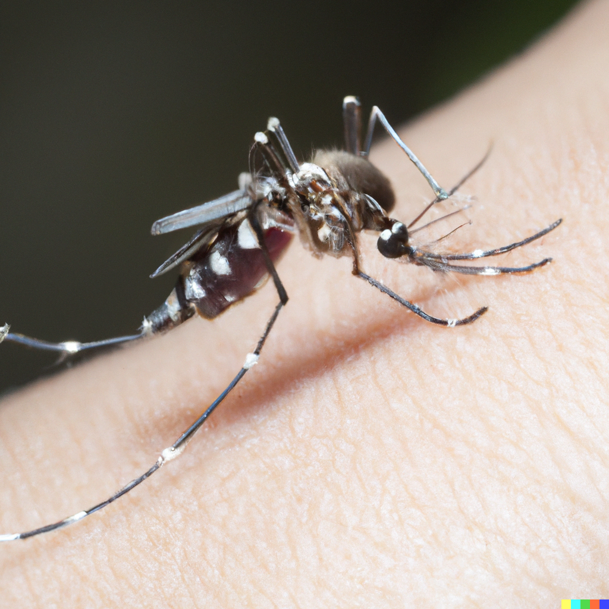

```{r setup, include=FALSE}
options(htmltools.dir.version = FALSE)
options(htmltools.preserve.raw = FALSE)
options(ggrepel.max.overlaps = Inf)

knitr::opts_chunk$set(echo = TRUE, 
                      dev = 'svg',
                      collapse = TRUE, 
                      comment = NA,  # PRINTS IN FRONT OF OUTPUT, default is '##' which comments out output
                      prompt = FALSE, # IF TRUE adds a > before each code input
                      warning = FALSE, 
                      message = FALSE,
                      fig.height = 3, 
                      fig.width = 4,
                      out.width = "100%"
                      )


# load necessary packages
library(tidyverse)
library(countdown)
library(mosaic)
library(ggthemes)
library(xaringanExtra)
library(forcats)
xaringanExtra::use_panelset()
xaringanExtra::use_tachyons()
xaringanExtra::use_clipboard()
xaringanExtra::use_extra_styles(
  hover_code_line = TRUE,         #<<
  mute_unhighlighted_code = TRUE  #<<
)
library(flipbookr)
library(patchwork)
library(Lock5Data)

# Set ggplot theme
theme_set(theme_tufte(base_size = 10))


yt <- 0

# read.csv("https://raw.githubusercontent.com/deepbas/statdatasets/main/APM_DougEvansCases.csv")

```


```{r xaringanExtra-clipboard, echo=FALSE}
htmltools::tagList(
  xaringanExtra::use_clipboard(
    button_text = "<i class=\"fa fa-clipboard\"></i>",
    success_text = "<i class=\"fa fa-check\" style=\"color: #90BE6D\"></i>",
    error_text = "<i class=\"fa fa-times-circle\" style=\"color: #F94144\"></i>"
  ),
  rmarkdown::html_dependency_font_awesome()
)
```


layout: true
  
<!-- <div class="my-footer"><span>Stat 230</span></div> -->
<!-- this adds the link footer to all slides, depends on my-footer class in css-->

---

class: title-slide, middle
<!-- background-image: url("assets/title-image2.jpg") -->
background-position: 10% 90%, 100% 50%
background-size: 160px, 100% 100%

# .fancy[Hypothesis Tests and Confidence Intervals using Normal Distribution!s]

### .fancy[Stat 120]

`r format(Sys.Date(), ' %B %d %Y')`


---

# How do Malaria parasites impact mosquito behavior?
.pull-left[
<center>
 <br>
</center>
]
.pull-right[
<br>
.bq[
- This experiment looks at the behavior of mosquito when exposed to malaria infected mice and healthy mice. 
- The parasites go through two stages: not yet infectious (Days 1-8) and infectious (Days 9-28). 
]

]

---

 # Malaria Parasites and Mosquitoes

.bql[
- The response variable is whether the mosquito approached a human in a cage with them. 
- The experiment looks to see if this behavior differs by exposed vs control, and if it differs by infection stage. 

]

.footnote[Cator LJ, George J, Blanford S, Murdock CC, Baker TC, Read AF, Thomas MB. (2013). [‘Manipulation’ without the parasite: altered feeding behaviour of mosquitoes is not dependent on infection with malaria parasites](http://www.thereadgroup.net/wp-content/uploads/Cator-et-al.-2013-PRSB-eprint.pdf). Proc R Soc B 280: 20130711. ]

---

 # Malaria Parasites and Mosquitoes

.bq[
Malaria parasites would benefit if:
- Mosquitoes approached humans less often after being exposed, but before becoming infectious, because humans are risky 
- Mosquitoes approached humans more often after becoming infectious, to pass on the infection
]


---

# Days 1-8

.bq[
We'll first look at the mosquitoes before they become infectious (days 1-8).

$p_C:$ proportion of controls to approach human

$p_E:$ proportion of exposed to approach human
]

What are the relevant hypotheses?

A. $\mathrm{H}_0: p_{\mathrm{E}}=p_{\mathrm{C}}, \mathrm{H}_{\mathrm{a}}: p_{\mathrm{E}}<p_{\mathrm{C}}$

в. $\mathrm{H}_0: p_{\mathrm{E}}=p_{\mathrm{C}}, \mathrm{H}_{\mathrm{a}}: p_{\mathrm{E}}>p_{\mathrm{C}}$

c. $\mathrm{H}_0: p_{\mathrm{E}}<p_{\mathrm{C}}, \mathrm{H}_{\mathrm{a}}: p_{\mathrm{E}}=p_{\mathrm{C}}$

D. $H_0: p_{\mathrm{E}}>p_{\mathrm{C}}, \mathrm{H}_{\mathrm{a}}: p_{\mathrm{E}}=p_{\mathrm{C}}$

<br>
<details>
<summary>.red[Click for answer]</summary>
The correct answer is 3. (since there are five choices and we are randomly guessing)
</details>

---

class: action

# <i class="fa fa-pencil-square-o" style="font-size:48px;color:purple">&nbsp;Your&nbsp;Turn&nbsp;`r (yt <- yt + 1)`</i>    

.pull-left-40[

]
.pull-right-60[
<br>
.bq[

Randomly choose a letter from A B C D E and write it down (don’t show anyone!)

Find a partner, telepathically communicate your letter (no auditory or visual clues!) and have them guess your
letter.

Repeat a couple of times then switch roles.


]

.out-t[How often did you guess correctly?]
]

`r countdown(minutes = 5, seconds = 00, top = 0 , color_background = "inherit", padding = "3px 4px", font_size = "2em")`

