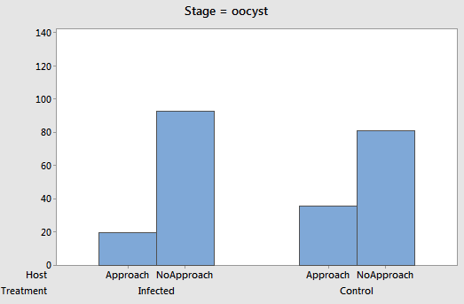
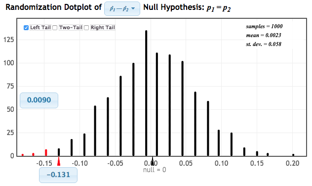

```{r setup, include=FALSE}
options(htmltools.dir.version = FALSE)
options(htmltools.preserve.raw = FALSE)
options(ggrepel.max.overlaps = Inf)

knitr::opts_chunk$set(echo = TRUE, 
                      dev = 'svg',
                      collapse = TRUE, 
                      comment = NA,  # PRINTS IN FRONT OF OUTPUT, default is '##' which comments out output
                      prompt = FALSE, # IF TRUE adds a > before each code input
                      warning = FALSE, 
                      message = FALSE,
                      fig.height = 3, 
                      fig.width = 4,
                      out.width = "100%"
                      )


# load necessary packages
library(tidyverse)
library(countdown)
library(mosaic)
library(ggthemes)
library(xaringanExtra)
library(forcats)
xaringanExtra::use_panelset()
xaringanExtra::use_tachyons()
xaringanExtra::use_clipboard()
xaringanExtra::use_extra_styles(
  hover_code_line = TRUE,         #<<
  mute_unhighlighted_code = TRUE  #<<
)
library(flipbookr)
library(patchwork)
library(Lock5Data)

# Set ggplot theme
theme_set(theme_tufte(base_size = 10))


yt <- 0

# read.csv("https://raw.githubusercontent.com/deepbas/statdatasets/main/APM_DougEvansCases.csv")

```


```{r xaringanExtra-clipboard, echo=FALSE}
htmltools::tagList(
  xaringanExtra::use_clipboard(
    button_text = "<i class=\"fa fa-clipboard\"></i>",
    success_text = "<i class=\"fa fa-check\" style=\"color: #90BE6D\"></i>",
    error_text = "<i class=\"fa fa-times-circle\" style=\"color: #F94144\"></i>"
  ),
  rmarkdown::html_dependency_font_awesome()
)
```


layout: true
  
<!-- <div class="my-footer"><span>Stat 230</span></div> -->
<!-- this adds the link footer to all slides, depends on my-footer class in css-->

---

class: title-slide, middle
<!-- background-image: url("assets/title-image2.jpg") -->
background-position: 10% 90%, 100% 50%
background-size: 160px, 100% 100%

# .fancy[Hypothesis Tests and Confidence Intervals using Normal Distribution!]

### .fancy[Stat 120]

`r format(Sys.Date(), ' %B %d %Y')`


---

class: middle

# How do Malaria parasites impact mosquito behavior?

.pull-left-40[
<center>
 <br>
</center>
]

.pull-right-60[

.bql.font50[## Experiment Design

- Mosquitoes are exposed to two groups of mice:

  - Malaria-infected mice (experimental group)
  - Healthy mice (control group)
  
- Malaria-infected mice go through two stages of infection:

  - `Stage 1`: Not yet infectious (Days 1-8)
  - `Stage 2`: Infectious (Days 9-28)
  
- `Response Variable`: Whether the mosquito approaches a human.
]


]

.hljs.font60[.b[Research Questions]: Does mosquito behavior differ when exposed to malaria-infected mice compared to healthy mice? Does mosquito behavior differ based on the infection stage of the malaria-infected mice?]


.footnote.font50[Cator LJ, George J, Blanford S, Murdock CC, Baker TC, Read AF, Thomas MB. (2013). [‘Manipulation’ without the parasite: altered feeding behaviour of mosquitoes is not dependent on infection with malaria parasites](http://www.thereadgroup.net/wp-content/uploads/Cator-et-al.-2013-PRSB-eprint.pdf). Proc R Soc B 280: 20130711. ]

---

class: middle

 # Malaria Parasites and Mosquitoes

.pull-left-60[

.bql[

## Malaria parasites would benefit if

  - Mosquitoes approached humans `less often` after being exposed, but before becoming infectious, because humans are risky 
  - Mosquitoes approached humans `more often` after becoming infectious, to pass on the infection
]
]

.pull-right-40[
<br>
<center>
 <br>
</center>
]


---

# Days 1-8

.bql[
We'll first look at the mosquitoes before they become infectious (days 1-8).

$p_C:$ proportion of controls to approach human

$p_E:$ proportion of exposed to approach human
]

What are the relevant hypotheses?

A. $\mathrm{H}_0: p_{\mathrm{E}}=p_{\mathrm{C}}, \mathrm{H}_{\mathrm{a}}: p_{\mathrm{E}}<p_{\mathrm{C}}$

в. $\mathrm{H}_0: p_{\mathrm{E}}=p_{\mathrm{C}}, \mathrm{H}_{\mathrm{a}}: p_{\mathrm{E}}>p_{\mathrm{C}}$

c. $\mathrm{H}_0: p_{\mathrm{E}}<p_{\mathrm{C}}, \mathrm{H}_{\mathrm{a}}: p_{\mathrm{E}}=p_{\mathrm{C}}$

D. $H_0: p_{\mathrm{E}}>p_{\mathrm{C}}, \mathrm{H}_{\mathrm{a}}: p_{\mathrm{E}}=p_{\mathrm{C}}$


<details>
<summary>.red[Click for answer]</summary>
The correct answer is A. (since it favors parasites if exposed mosquitoes do not approach humans during this stage)
</details>


---

class: middle

<center>
 <br>
</center>

--

<center>
<div style="position: absolute; top: 10%; left: 24%;">
<span style="content: '\2192'; font-size: 22px; color: #FF00FF; text-align: center; white-space: pre-line;">
<p><b>p&#770;<sub>E</sub> - p&#770;<sub>C</sub> = 20/113 - 36/117 = 0.177 - 0.308 = -0.131</b></p>
</span>
</div>
</center>


---

class: middle


<center>
 <br>
</center>


---

class: middle


.pull-left[

<center>
 <br>
</center>


<center>
 <br>
</center>


]

.pull-right[

<center>
 <br>
</center>


<center>
 <br>
</center>

]

--

<center>
<div style="position: absolute; top: 80%; left: 4%;">
<span style="content: '\2192'; font-size: 30px; color: #FF00FF; text-align: center; white-space: pre-line;">
<p><b>What do you notice?</b></p>
</span>
</div>
</center>

---

# Central Limit Theorem (CLT)

.bql.font[
For random samples with a sufficiently large sample size, the distribution of sample statistics for a .red[mean] or a .red[proportion] is .bolder[normally distributed]
]

--

### The catch: "sufficiently large sample size"

.bq.font80[
The .b[more skewed] the original distribution of data/population is, the larger $n$ has to be for the CLT to work

- For quantitative variables that are not very skewed, $\boldsymbol{n} \geq \mathbf{3 0}$ is usually sufficient
- For categorical variables, counts of .b[at least 10] within each category is usually sufficient
]


---

class: middle

# Which normal distribution should we use to approximate this?

<center>
 <br>
</center>

.pull-left[
\begin{aligned}
A. \quad & \mathrm{N}(0,-0.131) \\
B. \quad& \mathrm{N}(0,0.056) \\
C. \quad& \mathrm{N}(-0.131,0.056) \\
D. \quad& \mathrm{N}(0.056,0)
\end{aligned}
]
.pull-right[
<br>
<details>
<summary>.red[Click for answer]</summary>
The correct answer is B. (since the distribution is centered at 0 and has standard deviation of 0.056)
</details>
]


---

class: middle

# [Statkey](https://www.lock5stat.com/StatKey/index.html): p-value from N(null, SE)

<center>
 
</center>


---

class: middle

# Connecting Normal model to hypothesis tests

.bql[
Suppose: randomization distribution is bell shaped.

- `Center`: hypothesized null parameter value
- `Spread`: the standard error given in the randomization graph (or by formula)
- `P-value`: computed from the normal model the "usual" way - the chance of being as extreme, or more extreme, than the observed statistic.
]

---

class: middle

# Standardized Statistic

> The standardized test statistic (also known as a z-statistic) is
\begin{align*}
z=\frac{\text { statistic }-\text { null }}{S E}
\end{align*}


.hljs[Calculating the number of standard errors a statistic is from the null lets us assess extremity on a common scale.]

---

class: middle

# Malaria and Mosquitos

> Does infecting mosquitoes with Malaria actually impact the mosquitoes’ behavior to favor the parasite?
- After the parasite becomes infectious, do infected mosquitoes approach humans more often, so as to pass on the infection?


---

class: middle

# Days 9 – 28

.hljs[For the data after the mosquitoes become infectious (Days $9-28$), what are the relevant hypotheses?]

\begin{align}
\boldsymbol{p}_{C}: & \text{proportion of controls to approach human}\\ 
\boldsymbol{p}_{E}: & \text{proportion of exposed to approach human}
\end{align}

\begin{aligned}
A. \quad & \mathrm{H}_0: p_{\mathrm{E}}=p_{\mathrm{C}}, \mathrm{H}_{\mathrm{a}}: p_{\mathrm{E}}<p_{\mathrm{C}} \\
B. \quad & \mathrm{H}_0: p_{\mathrm{E}}=p_{\mathrm{C}}, \mathrm{H}_{\mathrm{a}}: p_{\mathrm{E}}>p_{\mathrm{C}} \\
C. \quad & \mathrm{H}_0: p_{\mathrm{E}}<p_{\mathrm{C}}, \mathrm{H}_{\mathrm{a}}: p_{\mathrm{E}}=p_{\mathrm{C}} \\
D. \quad & \mathrm{H}_0: p_{\mathrm{E}}>p_{\mathrm{C}}, \mathrm{H}_{\mathrm{a}}: p_{\mathrm{E}}=p_{\mathrm{C}}
\end{aligned}


<details>
<summary>.red[Click for answer]</summary>
The correct answer is B. (since it now favors parasites if exposed mosquitoes approach humans more during this stage)
</details>


---


# Before and after


.pull-left[
<center>
 
</center>
]

.pull-right[
<center>
 
</center>
]


<center>
<div style="position: absolute; top: 70%; left: 4%;">
<span style="content: '\2192'; font-size: 22px; color: #FF00FF; text-align: center; white-space: pre-line;">
<p><b>p&#770;<sub>E</sub> - p&#770;<sub>C</sub> = <br> 20/113 - 36/117 = <br> 0.177 - 0.308 = -0.131</b></p>
</span>
</div>
</center>


<center>
<div style="position: absolute; top: 70%; left: 64%;">
<span style="content: '\2192'; font-size: 22px; color: #FF00FF; text-align: center; white-space: pre-line;">
<p><b>p&#770;<sub>E</sub> - p&#770;<sub>C</sub> = <br> 37/149 - 14/144 = <br> 0.248 - 0.097 = 0.151</b></p>
</span>
</div>
</center>

---

class: middle


# Is the difference significant?

.pull-left[
.bq[The difference in proportions is 0.151 and the standard error is 0.05.  Is this significant?

A. Yes

B. No

]
]

.pull-right[
<br>
<center>
 
</center>
]

---

class: middle

# Malaria and Mosquitoes

.bql[
It appears that mosquitoes infected by malaria parasites do, in fact, behave in ways advantageous to the parasites!
- Exposed mosquitos are `less likely` to approach before becoming infectious (so more likely to stay alive)
- Exposed mosquitos are `more likely` to approach humans after becoming infectious (so more likely to pass on disease)
]

---

class: middle

# Formula for p-values Using N(0,1)
<br>
<br>
.Large[
\begin{align*}
z=\frac{\text { sample statistic }-\text { null value }}{\text { SE }}
\end{align*}
]

--

<center>
<div style="position: absolute; top: 35%; left: 35%;">
<span style="content: '\2192'; font-size: 22px; color: #FF00FF; text-align: center; white-space: pre-line;">
<p><b>From original <br> data</b></p>
</span>
</div>
</center>

--

<center>
<div style="position: absolute; top: 40%; left: 62%;">
<span style="content: '\2192'; font-size: 22px; color: #FF00FF; text-align: center; white-space: pre-line;">
<p><b>From H<sub>o</sub></b></p>
</span>
</div>
</center>

--


<center>
<div style="position: absolute; top: 60%; left: 45%;">
<span style="content: '\2192'; font-size: 22px; color: #FF00FF; text-align: center; white-space: pre-line;">
<p><b>From <br>randomization <br>distribution</sub></b></p>
</span>
</div>
</center>

---

<br>
<br>

# Proportion of infected?

.bql.font90[
- All mosquitoes in the infected group were exposed to the malaria parasites, but not all mosquitoes were actually infected
- Of the 201 mosquitoes in the infected group that we actually have data on, only 90 were actually infected $(90 / 201=0.448)$
- What proportion of mosquitoes eating from a malaria infected mouse become infected?
]

--

.out-t[We want a confidence interval!]

---

# Bootstrap Interval


<center>
 
</center>


---

class: middle

# Connecting Normal model to Confidence Intervals

.bql[## Suppose: bootstrap distribution is bell-shaped.

- `Center`: sample statistic
- `Spread`: the standard error given in the bootstrap graph (or by formula)
]

---

class: middle

# Bootstrap Distributions


.bql[If a bootstrap distribution is normally distributed, we can write it as

A. $\mathrm{N} (parameter, SD)$

B. $\mathrm{N}  (statistic, SD)$

C. $\mathrm{N} (parameter, SE)$

D. $\mathrm{N} (statistic, SE)$
]

<details>
<summary>.red[Click for answer]</summary>
The correct answer is D. (center = statistic, spread = SE)
</details>


---

class: middle

# Connecting Normal model to Confidence Intervals


.hljs[
To get a $95 \%$ confidence interval we compute:
$$statistic \pm 2(SE)$$
]

.bql[
Why 2 SE's?
- $95 \%$ of all sample means fall within 2 SE's of the population mean
- The value 2 is a z-score!
- Well, actually the precise z-score under a normal model is $z=1.96$ instead of 2 !
]

---

class: middle

# N(0,1) model

<center>
 
</center>

--

<center>
<div style="position: absolute; top: 40%; left: 62%;">
<span style="content: '\2192'; font-size: 30px; color: #FF00FF; text-align: center; white-space: pre-line;">
<p><b>95% of all values fall within 1.96 SE’s of the mean</b></p>
</span>
</div>
</center>

---

class: inverse

# What if we wanted a 90% CI? What z-score should we use?

--

.pull-left[
<center>
 
</center>

```{r}
qnorm(0.95)
```

90% Confidence: $z^*=1.645$


]

.pull-right[
<center>
 
</center>
```{r}
qnorm(0.995)
```
99% Confidence: $z^*=2.576$

]

---

class: middle

# Confidence Interval using N(0,1)

.bqt[
If a statistic is normally distributed, we find a confidence interval for the parameter using
$$statistic \pm z^* SE$$
where the area between $-z^*$ and $+z^*$ in the standard normal distribution is the desired level of confidence.
]

---


class: action

# <i class="fa fa-pencil-square-o" style="font-size:48px;color:purple">&nbsp;Your&nbsp;Turn&nbsp;`r (yt <- yt + 1)`</i>    

.pull-left-40[

]
.pull-right-60[

<br>
.bql[
- Let's go over to the [course helper page](https://stat120-fall23.netlify.app/)
- Please do the class activity and let me know if you have any questions
- Feel free to talk to your neighbor
]


]

`r countdown(minutes = 15, seconds = 00, top = 0 , color_background = "inherit", padding = "3px 4px", font_size = "2em")`

