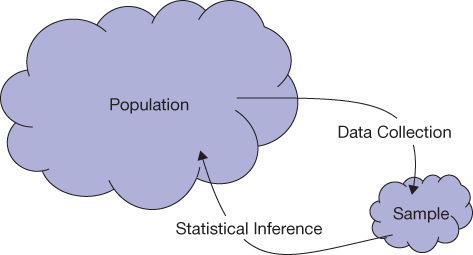
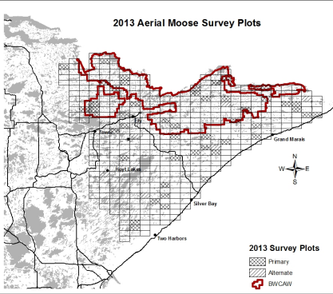
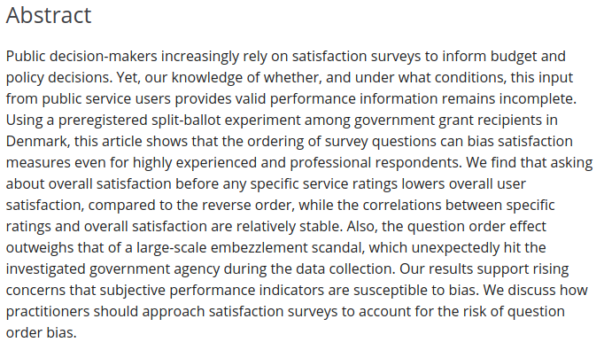

```{r setup, include=FALSE}
options(htmltools.dir.version = FALSE)
options(htmltools.preserve.raw = FALSE)
options(ggrepel.max.overlaps = Inf)

knitr::opts_chunk$set(echo = TRUE, 
                      dev = 'svg',
                      collapse = TRUE, 
                      comment = NA,  # PRINTS IN FRONT OF OUTPUT, default is '##' which comments out output
                      prompt = FALSE, # IF TRUE adds a > before each code input
                      warning = FALSE, 
                      message = FALSE,
                      fig.height = 3, 
                      fig.width = 4,
                      out.width = "100%"
                      )


# load necessary packages
library(Sleuth3)   # Data-set for Sleuth
library(tidyverse)
library(countdown)
library(mosaic)
library(ggthemes)
library(xaringanExtra)
library(forcats)
library(NHSRtheme)  # color themes, nhs
xaringanExtra::use_panelset()
xaringanExtra::use_tachyons()
xaringanExtra::use_clipboard()
xaringanExtra::use_extra_styles(
  hover_code_line = TRUE,         #<<
  mute_unhighlighted_code = TRUE  #<<
)
library(flipbookr)
library(patchwork)


# Set ggplot theme
theme_set(theme_tufte(base_size = 10))


yt <- 0


```


```{r xaringanExtra-clipboard, echo=FALSE}
htmltools::tagList(
  xaringanExtra::use_clipboard(
    button_text = "<i class=\"fa fa-clipboard\"></i>",
    success_text = "<i class=\"fa fa-check\" style=\"color: #90BE6D\"></i>",
    error_text = "<i class=\"fa fa-times-circle\" style=\"color: #F94144\"></i>"
  ),
  rmarkdown::html_dependency_font_awesome()
)
```


layout: true
  
<!-- <div class="my-footer"><span>Stat 230</span></div> -->
<!-- this adds the link footer to all slides, depends on my-footer class in css-->

---

class: title-slide, middle
<!-- background-image: url("assets/title-image2.jpg") -->
background-position: 10% 90%, 100% 50%
background-size: 160px, 100% 100%

# .fancy[Sampling]

### .fancy[Stat 120]

`r format(Sys.Date(), ' %B %d %Y')`

---

# Sampling and Inference

.pull-left[
.blockquote[
- A .bold[population] includes all
individuals or objects of
interest.
- A .bold[sample] is all the cases that
we have collected data on (a
subset of the population).
- .bold[Statistical inference] is the
process of using data from a
sample to gain information
about the population.
]

]
.pull-right[
<center>
 <br>
<a>Population and Sample</a>
</center>
]

---

# MN Department of Natural Resources

.pull-left[
<center>
 <br>
<a>Population and Sample</a>
</center>
]
.pull-right[
.blockquote[
- .bold[Population:] all plots (grid
cells) on the map
- .bold[Sample:] the cross-hatched
plots on the map
- .bold[Variable:] number of moose
counted in a plot
- .bold[Inference:] estimated 2,760
moose in the entire
population
]
]

---

# Sampling Bias

.blockquote[
- Sampling bias occurs when the method of selecting a sample
causes the sample to differ from the population in some
relevant way

- If sampling bias exists, we cannot trust generalizations from the
sample to the population
]

--

<br>

<center>
<a style="background-color:Orange;font-size:28px"> To eliminate sampling bias always take a RANDOM SAMPLE! </a>
</center>


---

# Lincoln’s Gettysburg Address

.font85[
```
“Four score and seven years ago our fathers brought forth, on this continent, a new
nation, conceived in Liberty, and dedicated to the proposition that all men are created
equal. Now we are engaged in a great civil war, testing whether that nation, or any
nation so conceived and so dedicated, can long endure. We are met on a great
battle-field of that war. We have come to dedicate a portion of that field, as a final
resting place for those who here gave their lives that that nation might live. It is
altogether fitting and proper that we should do this. But, in a larger sense, we can not
dedicate—we can not consecrate—we can not hallow—this ground. The brave men,
living and dead, who struggled here, have consecrated it, far above our poor power to
add or detract. The world will little note, nor long remember what we say here, but it
can never forget what they did here. It is for us the living, rather, to be dedicated here
to the unfinished work which they who fought here have thus far so nobly advanced. It
is rather for us to be here dedicated to the great task remaining before us—that from
these honored dead we take increased devotion to that cause for which they here
gave the last full measure of devotion—that we here highly resolve that these dead
shall not have died in vain—that this nation, under God, shall have a new birth of
freedom—and that government of the people, by the people, for the people, shall not
perish from the earth.
```
]

---

# Lincoln's Gettysberg Address

.bold[Question:] What is the average word length?

--

.bold[Task:] Select a sample of 10 words to estimate average word length of
entire address

--

.blockquote[
- Population? (describe cases of interest)
- Sample?
- pick your sample….
- variable measured?
- compute average word length

]

--

<br>

<center>
<a style="background-color:Tomato;font-size:28px"> Actual average is 4.29 letters </a>
</center>

---
class: action, middle

# <i class="fa fa-pencil-square-o" style="font-size:48px;color:purple">&nbsp;Your&nbsp;Turn&nbsp;`r (yt <- yt + 1)`</i>    


.pull-left-40[

]
.pull-right-60[
.blockquote[

- Go to this [google form](https://forms.gle/vQLqhXcsFWX5ieRh9)
- Find the average word length and enter your answer
]
]

`r countdown(minutes = 10, seconds = 00, top = 0 , color_background = "inherit", padding = "3px 4px", font_size = "2em")`

---

class: middle

# Bias in data

> Even with a random sample, data can still be biased, especially
when collected on humans

---

class: middle

# Some other forms of bias

.blockquote[Other forms of bias to watch out for in data collection:
- Question wording
- Question order
- Context
- Non-response Bias
]

---

# Question wording

.blockquote[A random sample was asked: “Should there be a tax cut, or
should money be used to fund new government programs?”


| Tax Cut      | Programs |
| ----------- | ----------- |
| 60%      | 40%       |
]

--
<br>

.blockquote[A different random sample was asked: “Should there be a tax
cut, or should money be spent on programs for education, the
environment, health care, crime-fighting, and military defense?”

| Tax Cut      | Programs |
| ----------- | ----------- |
| 22%      | 78%       |
]

---

class: middle

# Question order

> Depending on the order of questions we can see either a greater differences in responses or lesser difference in response. Respondents tend to provide answers consistent with their prior responses.


---

# Danish Study

> Danish policy makers found out in a [study](https://onlinelibrary.wiley.com/doi/abs/10.1111/padm.12688) that order bias exists in Danish Public Services

- When asked about overall satisfaction before being asked about specific services, the overall satisfaction was low.

- When asked about overall satisfaction after being asked about specifc services, then the overall satifaction was high.

---

class: action

# <i class="fa fa-pencil-square-o" style="font-size:48px;color:purple">&nbsp;Your&nbsp;Turn&nbsp;`r (yt <- yt + 1)`</i>    

Go over the abstract of this [study](https://onlinelibrary.wiley.com/doi/abs/10.1111/padm.12688) and summarize it in the in class activity .Rmd file. 

<center>
 <br>
</center>


`r countdown(minutes = 3, seconds = 00, top = 0 , color_background = "inherit", padding = "3px 4px", font_size = "2em")`

---

# Context

Ann Landers column asked readers “If you had it to do over again,
would you have children?”

--

.blockquote[The first request for data contained a letter from a young couple
which listed worries about parenting and various reasons not to
have kids

$$30\% \text{ said yes}$$]
--

<br>

.blockquote[The second request for data was in response to this number, in
which Ann wrote how she was “stunned, disturbed, and just
plain flummoxed”

$$95\% \text{ said yes}$$]


---

# Non-response Bias

>  When respondents are either unable or unwilling to respond to your survey, then this results in a non-response bias

- Survey targeted to the wrong audience
- There is general unwillingness due to polar opposite opinions
- The survey did not reach the right respondent

A survey asking teenagers about best cigarette brands
Spam emails is also a prime reason for non-response bias

---

class: action

# <i class="fa fa-pencil-square-o" style="font-size:48px;color:purple">&nbsp;Your&nbsp;Turn&nbsp;`r (yt <- yt + 1)`</i>    

> For the remainder of the time, please go over 

- the Gettysburg example again

- CNN poll: Driving with a Pet on your Lap


`r countdown(minutes = 5, seconds = 00, top = 0 , color_background = "inherit", padding = "3px 4px", font_size = "2em")`

