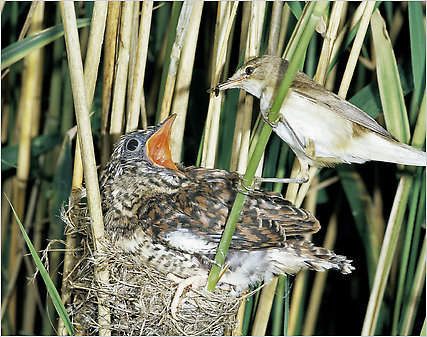

```{r setup, include=FALSE}
options(htmltools.dir.version = FALSE)
options(htmltools.preserve.raw = FALSE)
options(ggrepel.max.overlaps = Inf)

knitr::opts_chunk$set(echo = TRUE, 
                      dev = 'svg',
                      collapse = FALSE, 
                      comment = NA,  # PRINTS IN FRONT OF OUTPUT, default is '##' which comments out output
                      prompt = FALSE, # IF TRUE adds a > before each code input
                      warning = FALSE, 
                      message = FALSE,
                      fig.height = 3, 
                      fig.width = 4,
                      out.width = "100%"
                      )

# load necessary packages
library(tidyverse)
library(dplyr)
library(countdown)
library(ggthemes)
library(xaringanExtra)
library(forcats)
xaringanExtra::use_panelset()
xaringanExtra::use_tachyons()
xaringanExtra::use_clipboard()
xaringanExtra::use_extra_styles(
  hover_code_line = TRUE,         
  mute_unhighlighted_code = TRUE  
)
library(flipbookr)
library(patchwork)
library(DT)
library(knitr)
library(grid)
library(gridExtra)


select <- dplyr::select

# Set ggplot theme
theme_set(theme_tufte(base_size = 10))

yt <- 0

# read.csv("https://raw.githubusercontent.com/deepbas/statdatasets/main/agstrat.csv")
```


```{r xaringanExtra-clipboard, echo=FALSE}
htmltools::tagList(
  xaringanExtra::use_clipboard(
    button_text = "<i class=\"fa fa-clipboard\"></i>",
    success_text = "<i class=\"fa fa-check\" style=\"color: #90BE6D\"></i>",
    error_text = "<i class=\"fa fa-times-circle\" style=\"color: #F94144\"></i>"
  ),
  rmarkdown::html_dependency_font_awesome()
)
```


layout: true
  
---

class: title-slide, middle

# .fancy[ANOVA Pairwise Comparisons]

### .fancy[Stat 120]

`r format(Sys.Date(), ' %B %d %Y')`

---

class: middle

# Post-ANOVA

.blockquote.font90[
- Inference .bold[AFTER] doing .bold[ANOVA] to compare means for several groups:

    - Confidence interval for a single mean
    - Confidence interval for a difference in two means
    - Pairwise t-test for a difference in two means

]

---

class: middle

# ANOVA for Difference in Means

.blockquote.font90[
- .bold[Data:] Random samples of size $n_1, n_2, \cdots , n_k$ from each of k populations (or groups)

- .bold[Summary statistics:]

    - Sample mean for each group
    - Std. dev. for each group
    - Mean and std. dev. for all values

]

---

class: middle

# ANOVA for Difference in Means

.blockquote[
$$H_0:\mu_1 = \mu_2 = \cdots = \mu_k$$
$$H_a: \text{at least one } \mu_i \text{ is different}$$

- .bold[Conditions:] Similar variability AND either sample sizes in each group are large (each $n_i \geq 30$) OR the data are relatively normally distributed
]

---

class: middle

# Cuckoo Birds

.pull-left-60[
.blockquote.font80[
- Cuckoo birds lay their eggs in the nests of other birds

- When the cuckoo baby hatches, it kicks out all the original eggs/babies

- If the cuckoo is lucky, the mother will raise the cuckoo as if it were her own
  - Do cuckoo bird eggs found in nests of different species differ in size?
]
]

.pull-right-40[
<br>
<br>
<center>
 <br>
<a>Cuckoo bird in nest</a>
</center>
]

---

class: middle

# Cuckoo Dataset

.pull-left[
.blockquote.font90[
- .bold[cuckoo] dataset contains information on 120 Cuckoo eggs, obtained from randomly selected "foster" nests.

- researchers have measured the `length` (in mm) and established the `type` (species) of foster parent.
]

]
.pull-right[
.blockquote[
<br>
- `type=1`: Meadow pipit
- `type=2`: Tree pipit
- `type=3`: Dunnock
- `type=4`: European robin
- `type=5`: White wagtail
- `type=6`: Eurasian wren
]

]

---

class: inverse, middle

.bold.large[Goal: test if the type of foster parent has an effect on the average length of the cuckoo eggs.]

---

`r chunk_reveal("cuckoo", widths= c(0.73,0.27), font_size_code="70%", title = "## ANOVA")`

```{r cuckoo, fig.width = 3, fig.height = 3.5, out.width = "100%", include=FALSE}
library(dplyr)
cuckoo <-  read.csv("https://raw.githubusercontent.com/deepbas/statdatasets/main/cuckoo.dat", sep = "")
cuckoo <- cuckoo %>%
  `colnames<-`(c("length", "type")) %>%
  mutate(type = as.factor(type))

stat <- cuckoo %>% 
  group_by(type) %>% 
  summarize(mean(length), 
            sd(length), 
            length(length))%>%
  `colnames<-`(c( "Type", "mean", "sd", "n"))
stat <- as.data.frame(stat)
knitr::kable(stat)
```

---

`r chunk_reveal("boxplot", widths= c(1,1), font_size_code="70%", title = "## Side-by-side Boxplot (1a)")`

.scroll-box-20[
```{r boxplot, fig.width = 3, fig.height = 3.5, out.width = "100%", include=FALSE}
cuckoo %>%
  ggplot(aes(x=type,y=length,fill=type)) +
  theme_bw() +
  geom_boxplot() +
  geom_jitter(width = 0.2) +
  labs(title ="Boxplot of the length of eggs per type", 
       y = "length (mm)",
       x = "type") + 
  stat_summary(fun=mean, geom="point", shape=10, 
               size=2, color="black", fill="black") +
  theme(plot.title = element_text(hjust=0.5, size=9, 
                                  face='bold')) 
```
]

---

class: middle

# Check Assumptions (1b)

.blockquote[
$$H_0: \text{The mean egg length is equal between the different bird tpyes.}$$
$$H_a: \text{The mean egg length for at least one bird type is different }$$

Make sure that all assumptions for ANOVA are met:

- The data (length) must be normally distributed (in all groups)
- The variability within all groups is similar
]

---

`r chunk_reveal("normality", widths= c(1,1), font_size_code="70%", title = "## Approximate normality in groups (1b)")`

.scroll-output[
```{r normality, fig.width = 3, fig.height = 3.5, out.width = "100%", include=FALSE}
cuckoo %>% 
  ggplot(aes(sample=length)) + 
  geom_qq() + 
  geom_qq_line() + 
  facet_grid(~type) +  
  theme_bw() 
```

]

---

# Fitting ANOVA (1c)

```{r, highlight.output = c(2)}
fit_anova <- aov(length~type, cuckoo)
summary(fit_anova)
```

--

.blockquote[
Since the .bold[p-value] is very small, at the significance level of $5\%$, we have sufficient evidence to conclude that the mean egg length for at least one bird type is .bold[different] from the mean egg length in at least one other bird type.
]

--

.out-t.font120[But which of the species are different?]

---

class: middle

# Inference after ANOVA

.blockquote.font80[
- Compute a CI for any $\mu_i$

- Compute a CI for $\mu_i - \mu_j$

- Pairwise t-test for difference in means

$$H_0: \mu_i = \mu_j \text{ vs. } H_a: \mu_i \neq \mu_j$$

- Use the usual procedures except:

    - Estimate any $\sigma$ with the pooled standard deviation: $\sqrt{MSE}$
    - Use the error degrees of freedom for any t-values
]

---

class: middle

# Inference after ANOVA

.blockquote.font90[
Compute a CI for any $\mu_i$

- The usual procedure:

$$\bar{x}_i \pm t^{*} \frac{s_i}{\sqrt{n_i}}$$
- .bold[BUT] after .bold[ANOVA], estimate any $\sigma$ with the pooled standard deviation:

$$\bar{x}_i \pm t^{*}\frac{\sqrt{MSE}}{\sqrt{n_i}}$$

  - the corresponding `df=n-k`
]

---

# Cuckoo Eggs (1d)

> Find a 95% confidence interval for the mean cuckoo egg length in `European robin` nests (Type = 4).

.pull-left[
.font80[
```{r}
MSE <- 1.745
summary(fit_anova)
```
]
]
.pull-right[
.font80[
```{r, echo=FALSE}
knitr::kable(stat)
```
]
]

$$\bar{x}_i \pm t^{*}\frac{\sqrt{MSE}}{\sqrt{n_i}}, \text{ df = n-k }$$

---

# Inferences after ANOVA

Compute a CI for any $\mu_i - \mu_j$

.blockquote.font90[

- The usual procedure:

$$(\bar{x}_i - \bar{x}_j) \pm t^{*} \sqrt{\frac{s_i^2}{n_i} + \frac{s_j^2}{n_j}}$$

- BUT after ANOVA, estimate any $\sigma$ with the pooled standard deviation:

$$(\bar{x}_i - \bar{x}_j) \pm t^{*} \sqrt{MSE \left(\frac{1}{n_i} + \frac{1}{n_j}\right)}$$
  - the corresponding `df=n-k`
]

---

# Cuckoo Eggs (1e)

Find a 95% CI for the difference in mean egg length between `European robin`(type = 4) and `Eurasian wren`(type = 6) nests.

.pull-left-60[

.font80[
```{r, echo=FALSE}
summary(fit_anova)
```
]
]
.pull-right-40[
.font80[
```{r, echo=FALSE}
knitr::kable(stat)
```
]
]

$$(22.575 - 21.130) \pm 1.981 \cdot \sqrt{1.745\left(\frac{1}{16} + \frac{1}{15} \right)} = (0.50, 2.39)$$
.code80[
```{r, collapse=TRUE}
(stat[4,2] - stat[6,2]) + c(-1,1)* (qt(1-0.05/2, df=113))* sqrt(MSE*(1/stat[4,4] + 1/stat[6,4]))
```
]

--

.out-t.font80[Why is it important that the interval contains only positive values?]


---

# Cuckoo Eggs (1f)

.blockquote.font80[Find a 95% CI for the difference in mean egg length between `Dunnock` (type = 3) and `European robin`(type = 4)  nests.]

.pull-left-60[
.font80[
```{r, echo=FALSE}
summary(fit_anova)
```
]
]
.pull-right-40[
.font80[
```{r, echo=FALSE}
knitr::kable(stat)
```
]
]

.code80[
```{r, collapse=TRUE}
(stat[3,2] - stat[4,2]) + c(-1,1)* (qt(1-0.05/2, df=113))*sqrt(MSE*(1/stat[3,4] + 1/stat[4,4]))
```
]

$$(23.121 - 22.575) \pm 1.981\cdot \sqrt{1.188\left(\frac{1}{14} + \frac{1}{16} \right)} = (-0.41, 1.50)$$

--

.out-t.font80[What does it mean if the interval contains 0?]

---

# Mutiple Comparisons 

.blockquote.font90[

- Often, doing pairwise comparisons after ANOVA involves many tests

  - e.g. $k$ groups/categories,then we have $\frac{k(k-1)}{2}$ comparisons
  - $k=6$ bird species then 15 pairwise tests.

- If each test has an $\alpha$ chance of a Type I error (finding a difference between a pair that aren’t different),  the overall Type I error rate can be much higher.

  - Use a smaller $\alpha$ for each pairwise test (Bonferroni)
    - $\alpha^{*} = \frac{\alpha}{k}$
    - e.g $\alpha = 0.05$ and $k = 6$, then $\alpha^{*} = 0.05/6 =  0.0083$
]
---

# Cuckoo Eggs (1g)

- Which means are “different” at a $5\%$ significance level?

```{r}
pairwise.t.test(cuckoo$length, cuckoo$type, p.adjust.method =  "bonferroni")
```

---

# Multiple Comparisons (1h)

.pull-left-40[
.code80[
```{r,message=FALSE, echo=TRUE, eval=FALSE, collapse=TRUE}
library(multcomp, quietly = TRUE)
fit <- lm(length~type, cuckoo)
mcp <- glht(fit, linfct = mcp(type = "Tukey"))
summary(mcp)
```
]
]
.pull-right-60[
.code70[
```{r,message=FALSE, echo=FALSE, collapse=TRUE}
library(multcomp, quietly = TRUE)
fit <- lm(length~type, cuckoo)
mcp <- glht(fit, linfct = mcp(type = "Tukey"))
summary(mcp)
```
]
]

---

class: action

# <i class="fa fa-pencil-square-o" style="font-size:48px;color:purple">&nbsp;Your&nbsp;Turn&nbsp;`r (yt <- yt + 1)`</i>    

.pull-left-40[

]
.pull-right-60[

<br>
<br>

.blockquote[
- Go over to the in class activity file
- Complete the remaining activity 
]
]

`r countdown(minutes = 5, seconds = 00, top = 0 , color_background = "inherit", padding = "3px 4px", font_size = "2em")`
