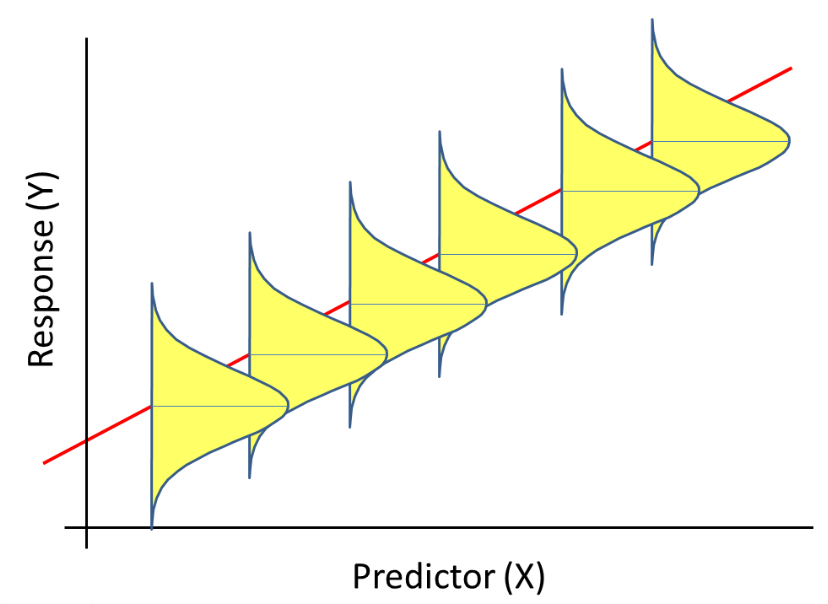
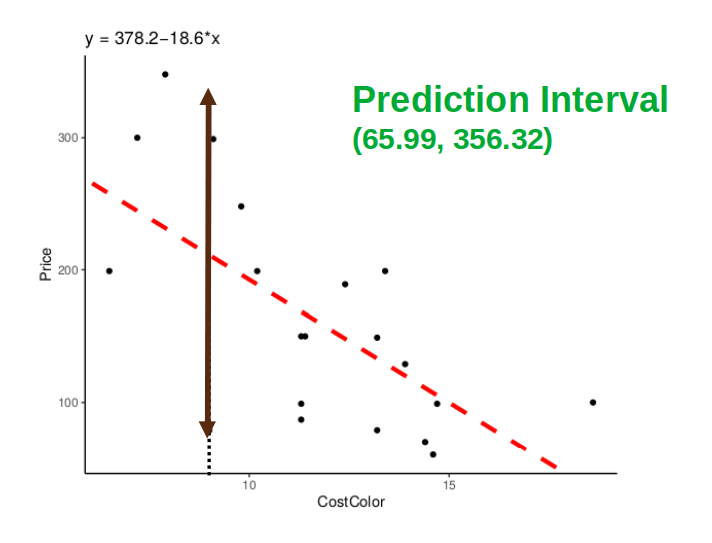
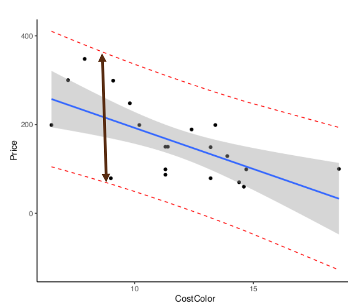

```{r setup, include=FALSE}
options(htmltools.dir.version = FALSE)
options(htmltools.preserve.raw = FALSE)
options(ggrepel.max.overlaps = Inf)

knitr::opts_chunk$set(echo = TRUE, 
                      dev = 'svg', 
                      collapse = FALSE, 
                      comment = NA,  # PRINTS IN FRONT OF OUTPUT, default is '##' which comments out output
                      prompt = FALSE, # IF TRUE adds a > before each code input
                      warning = FALSE, 
                      message = FALSE,
                      fig.height = 3, 
                      fig.width = 4,
                      out.width = "100%"
                      )

# load necessary packages
library(tidyverse)
library(dplyr)
library(countdown)
library(ggthemes)
library(xaringanExtra)
library(forcats)
xaringanExtra::use_panelset()
xaringanExtra::use_tachyons()
xaringanExtra::use_clipboard()
xaringanExtra::use_extra_styles(
  hover_code_line = TRUE,         
  mute_unhighlighted_code = TRUE  
)
library(flipbookr)
library(patchwork)
library(DT)
library(knitr)
library(grid)
library(gridExtra)
library(tikzDevice)


select <- dplyr::select

# Set ggplot theme
theme_set(theme_tufte(base_size = 10))

yt <- 0

# read.csv("https://raw.githubusercontent.com/deepbas/statdatasets/main/agstrat.csv")
```


```{r xaringanExtra-clipboard, echo=FALSE}
htmltools::tagList(
  xaringanExtra::use_clipboard(
    button_text = "<i class=\"fa fa-clipboard\"></i>",
    success_text = "<i class=\"fa fa-check\" style=\"color: #90BE6D\"></i>",
    error_text = "<i class=\"fa fa-times-circle\" style=\"color: #F94144\"></i>"
  ),
  rmarkdown::html_dependency_font_awesome()
)
```


layout: true
  
---

class: title-slide, middle

# .fancy[Introduction to Random Variables and distributions]

### .fancy[Stat 120]

`r format(Sys.Date(), ' %B %d %Y')`

---

.pull-left[
Random Variable (RV)
- a variable whose value is a numerical outcome of a random process.
- Notation: $P(X=X)$ means the probability that $R V X$ equals the number given by $X$.

Example: flip a coin twice - $X=\#$ of Heads observed


]

.pull-right[

]

---


---

class: action

# <i class="fa fa-pencil-square-o" style="font-size:48px;color:purple">&nbsp;Your&nbsp;Turn&nbsp;`r (yt <- yt + 1)`</i>    

.pull-left-40[

]
.pull-right-60[

<br>
<br>

.blockquote[
- Go over to the in class activity file
- Complete the remaining activity 
]
]

`r countdown(minutes = 3, seconds = 00, top = 0 , color_background = "inherit", padding = "3px 4px", font_size = "2em")`


---

# Predictions

.blockquote[
For a single predictor model and a particular value $(x^*)$ of the predictor, the predicted response is

\begin{align*}
\hat{y}=b_{0}+b_{1} x^{*}
\end{align*}
]

--

<br>

.out-t[How accurate is the prediction?]

.blockquote-list[
Two kinds of intervals:

1. Confidence Interval (CI) for Mean $Y$
2. Prediction Interval (PI) for Individual $Y^{\prime} S$
]

---

# CI vs. PI: What’s the difference?

.blockquote[
If we want to be 95% sure that we have captured the
average price for all ink-jet printers that cost 10 cents
per page to print in color 

\begin{align*}
\Longrightarrow \text { Confidence interval for the mean  Y}
\end{align*}

]

<br>

.blockquote[
If we want to be 95% sure that we have captured the
price for a particular ink-jet printer that cost 10 cents
per page to print in color 
\begin{align*}
\Longrightarrow \text { Prediction interval for the individual Y }
\end{align*}
]

---


# CI for Regression

.blockquote[
A CI for mean Y tries to capture the “true” line for the population. 
]

--

<br>

.out-t[How much might the fitted line vary from sample to sample? ]


---

# Regression Intervals (1c)

.blockquote[We generally use statistical software to
provide the confidence intervals for
regression predictions]


```{r}
# new data frame with the new x*
newx = data.frame(CostColor=9.0)
predict(mod1,newx, interval="confidence",  level = 0.95)
```


---

# CI for Mean Y at each x*

.pull-left[
.blockquote.font90[
- Trying to capture the line 

- Not trying to capture individual data values 

- The $\mathrm{Cl}$ gets wider for more extreme predictor values
]
]
.pull-right[
```{r, echo=FALSE}
ggplot(inkjet, aes(x=CostColor, y=Price))+ theme_classic()+
    geom_point()+
    geom_smooth(method=lm, se=TRUE)
```
]

--

.out-t.font90[What about capturing individual values?]
.hljs.font90[The cost to print a color page from my ink-jet printer is 9 cents. Give me an interval that is 95% sure to capture the price of my ink-jet printer.]

---

# Prediction Interval for Individual Y

.blockquote.font80[
We need to account for both the uncertainty in estimating the population mean and the random variability (error) of the individual values. 
]

<center>
 <br>
</center>

---

# Regression Intervals (1d)

.blockquote[
We generally use statistical software to provide the prediction intervals for regression
]

```{r}
# new data frame with the new x*
newx=data.frame(CostColor=9)
predict(mod1,newx, interval="prediction", level = 0.95)
```

---

# PI for Price when $x^*=9$

<center>
 <br>
</center>

---

# PI for Individual Y at each $x^*$

<center>
 <br>
</center>

--

.out-t[The PI bounds capture all the data values]

--

---

# Question!

.blockquote-list[
One of the following is a confidence interval for the mean value and the other is a prediction interval for individual values, both for predicting the body fat percentage for a male with an abdominal circumference of 90 cm. Which is the confidence interval?

A. $16.5$ to $18.4$

в. $8.0$ to $26.8$

]

<br>
<details>
<summary>.large.red[Click for answer]</summary>
The correct answer is A. (since it is narrower)
</details>

---

class: middle

# Computation: CI Mean Y when $X=x^*$ (1e)

.blockquote-list.font120[
$$\begin{equation}
\hat{y} \pm t^{*} S_{\varepsilon} \sqrt{\frac{1}{n}+\frac{\left(x^{*}-\bar{x}\right)^{2}}{(n-1) s_{x}^{2}}}
\end{equation}$$
]

---

### Identify the circled value in the 95% CI formula for the mean Price when `CostColor = 9`.

$$\begin{equation}
\hat{y} \pm t^{*} S_{\varepsilon} \sqrt{\frac{1}{n}+\frac{\left(x^{*}-\bar{x}\right)^{2}}{(n-1) s_{x}^{2}}}
\end{equation}$$

.pull-left-40[
A. $211.60$

B. $211.16$

c. $250$

D. $211.00$

E. $200.16$
]

.pull-right-60.font80[
```{r, collapse=TRUE}
summary(inkjet$CostColor)
sd(inkjet$CostColor)
anova(mod1)
```


]

<br>
<details>
<summary>.large.red[Click for answer]</summary>
The correct answer is 
</details>

---

### Use StatKey or R to identify the circled value in the 95% CI formula for the mean Price when `CostColor = 9`.

$$\begin{equation}
\hat{y} \pm t^{*} S_{\varepsilon} \sqrt{\frac{1}{n}+\frac{\left(x^{*}-\bar{x}\right)^{2}}{(n-1) s_{x}^{2}}}
\end{equation}$$

.pull-left-40[
A. $1.674$

B. $1.96$

c. $2.101$

D. $4.83$

E. $8.09$
]

.pull-right-60.font80[
```{r, collapse=TRUE}
summary(inkjet$CostColor)
sd(inkjet$CostColor)
anova(mod1)
```

]

<br>
<details>
<summary>.large.red[Click for answer]</summary>
The correct answer is 
</details>

---

### Identify the circled value in the 95% CI formula for the mean Price when `CostColor = 9`.

$$\begin{equation}
\hat{y} \pm t^{*} S_{\varepsilon} \sqrt{\frac{1}{n}+\frac{\left(x^{*}-\bar{x}\right)^{2}}{(n-1) s_{x}^{2}}}
\end{equation}$$

.pull-left-40[
A. $10.08$

B. $66.09$

c. $4369$

D. $280.42$

E. $120.71$
]

.pull-right-60.font80[
```{r, collapse=TRUE}
summary(inkjet$CostColor)
sd(inkjet$CostColor)
anova(mod1)
```

]

<br>
<details>
<summary>.large.red[Click for answer]</summary>
The correct answer is 
</details>

---

### Identify the circled value in the 95% CI formula for the mean Price when `CostColor = 9`.

$$\begin{equation}
\hat{y} \pm t^{*} S_{\varepsilon} \sqrt{\frac{1}{n}+\frac{\left(x^{*}-\bar{x}\right)^{2}}{(n-1) s_{x}^{2}}}
\end{equation}$$

.pull-left-40[
A. $8.4$

B. $9.8$

С. $9.2$

D. $10$

E. $10.2$
]

.pull-right-60.font80[
```{r, collapse=TRUE}
summary(inkjet$CostColor)
sd(inkjet$CostColor)
anova(mod1)
```

]

<br>
<details>
<summary>.large.red[Click for answer]</summary>
The correct answer is 
</details>

---

### Identify the circled value in the 95% CI formula for the mean Price when `CostColor = 9`.

$$\begin{equation}
\hat{y} \pm t^{*} S_{\varepsilon} \sqrt{\frac{1}{n}+\frac{\left(x^{*}-\bar{x}\right)^{2}}{(n-1) s_{x}^{2}}}
\end{equation}$$

.pull-left-40[
A. 20

B. 18

c. 19

D. 21

E. 2
]

.pull-right-60.font80[
```{r, collapse=TRUE}
summary(inkjet$CostColor)
sd(inkjet$CostColor)
anova(mod1)
```

]

<br>
<details>
<summary>.large.red[Click for answer]</summary>
The correct answer is 
</details>


---

### Identify the circled value in the 95% CI formula for the mean Price when `CostColor = 9`.

$$\begin{equation}
\hat{y} \pm t^{*} S_{\varepsilon} \sqrt{\frac{1}{n}+\frac{\left(x^{*}-\bar{x}\right)^{2}}{(n-1) s_{x}^{2}}}
\end{equation}$$

.pull-left-40[
A. $11.35$

B. $11.67$

c. $13.53$

D. $9.63$

E. $10$
]

.pull-right-60.font80[
```{r, collapse=TRUE}
summary(inkjet$CostColor)
sd(inkjet$CostColor)
anova(mod1)
```

]

<br>
<details>
<summary>.large.red[Click for answer]</summary>
The correct answer is 
</details>

---

### Identify the circled value in the 95% CI formula for the mean Price when `CostColor = 9`.

$$\begin{equation}
\hat{y} \pm t^{*} S_{\varepsilon} \sqrt{\frac{1}{n}+\frac{\left(x^{*}-\bar{x}\right)^{2}}{(n-1) s_{x}^{2}}}
\end{equation}$$

.pull-left-40[
A. $2.97$

В. $2.90$

с. $8.76$

D. $1.72$

E. $3.00$
]

.pull-right-60.font80[
```{r, collapse=TRUE}
summary(inkjet$CostColor)
sd(inkjet$CostColor)
anova(mod1)
```

]

<br>
<details>
<summary>.large.red[Click for answer]</summary>
The correct answer is 
</details>


---

## 95% CI for the mean Price when `CostColor = 9`. (1e)

$$\begin{equation}
\hat{y} \pm t^{*} S_{\varepsilon} \sqrt{\frac{1}{n}+\frac{\left(x^{*}-\bar{x}\right)^{2}}{(n-1) s_{x}^{2}}}
\end{equation}$$

```{r, collapse=TRUE}
summary(inkjet$CostColor)
sd(inkjet$CostColor)
anova(mod1)
newx=data.frame(CostColor=9)
predict(mod1,newx, interval="confidence", level = 0.95)
```

---

class: middle

# Computation: PI for Individual Y when $X=x^*$ (1f)

$$\begin{equation}
\hat{y} \pm t^{*} S_{\varepsilon} \sqrt{1 + \frac{1}{n}+\frac{\left(x^{*}-\bar{x}\right)^{2}}{(n-1) s_{x}^{2}}}
\end{equation}$$

.blockquote[
Accounts for additional variability from an individual random error, $\varepsilon$
]

```{r, collapse=TRUE}
newx=data.frame(CostColor=9)
predict(mod1,newx, interval="prediction", level = 0.95)
```


