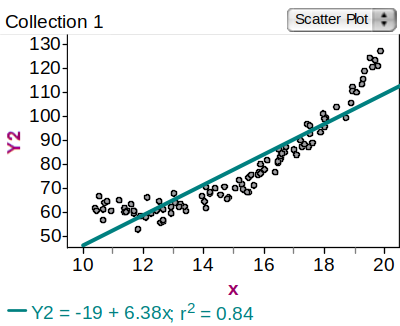
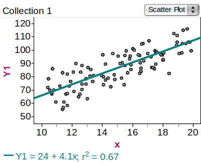
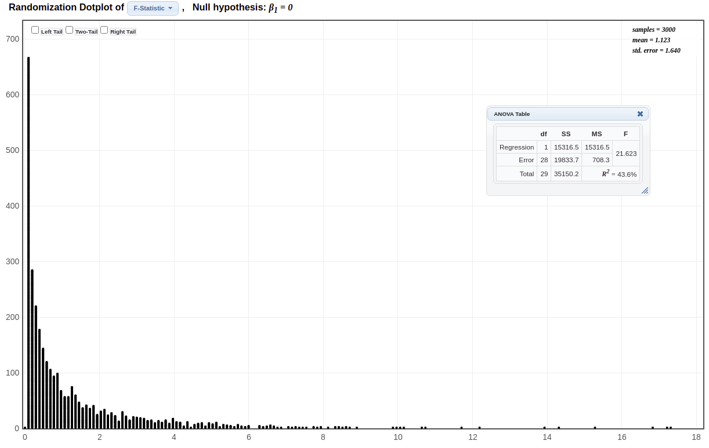

```{r setup, include=FALSE}
options(htmltools.dir.version = FALSE)
options(htmltools.preserve.raw = FALSE)
options(ggrepel.max.overlaps = Inf)

knitr::opts_chunk$set(echo = TRUE, 
                      dev = 'svg',
                      collapse = FALSE, 
                      comment = NA,  # PRINTS IN FRONT OF OUTPUT, default is '##' which comments out output
                      prompt = FALSE, # IF TRUE adds a > before each code input
                      warning = FALSE, 
                      message = FALSE,
                      fig.height = 3, 
                      fig.width = 4,
                      out.width = "100%"
                      )

# load necessary packages
library(tidyverse)
library(dplyr)
library(countdown)
library(ggthemes)
library(xaringanExtra)
library(forcats)
xaringanExtra::use_panelset()
xaringanExtra::use_tachyons()
xaringanExtra::use_clipboard()
xaringanExtra::use_extra_styles(
  hover_code_line = TRUE,         
  mute_unhighlighted_code = TRUE  
)
library(flipbookr)
library(patchwork)
library(DT)
library(knitr)
library(grid)
library(gridExtra)


select <- dplyr::select

# Set ggplot theme
theme_set(theme_tufte(base_size = 10))

yt <- 0

# read.csv("https://raw.githubusercontent.com/deepbas/statdatasets/main/agstrat.csv")
```


```{r xaringanExtra-clipboard, echo=FALSE}
htmltools::tagList(
  xaringanExtra::use_clipboard(
    button_text = "<i class=\"fa fa-clipboard\"></i>",
    success_text = "<i class=\"fa fa-check\" style=\"color: #90BE6D\"></i>",
    error_text = "<i class=\"fa fa-times-circle\" style=\"color: #F94144\"></i>"
  ),
  rmarkdown::html_dependency_font_awesome()
)
```


layout: true
  
---

class: title-slide, middle

# .fancy[Regression and ANOVA]

### .fancy[Stat 120]

`r format(Sys.Date(), ' %B %d %Y')`

---


# Simple Linear Model


.hljs[
The population/true simple linear model is:

\begin{align*}
y=\beta_{0}+\beta_{1} x+\varepsilon
\end{align*}
]

.bql[
- $\beta_{0}$ and $\beta_{1}$ are unknown parameters corresponding to the y-intercept and the slope, respectively
- $\varepsilon$ is the random error
- Estimate with $b_{0}$ and $b_{1}$ from the least squares line $\hat{y}=b_{0}+b_{1} x$
]

--

.out-t[How accurate are the estimates? ]

---

### Recall: Least Square Regression

.pull-left[

.hljs[
X = Cricket chirp rate

Y = Temperature
]


```{r, echo=FALSE}
data <- data.frame(Chirps = c(81, 97, 103, 123, 150, 182, 195),
                   Temp = c(54.5, 59.5, 63.5, 67.5, 72.0, 78.5, 83.0))

knitr::kable(data, format = "html")
```


]
.pull-right[

\begin{align*}
\widehat{\text { Temp }}=37.7+0.23 \text { Chirps }
\end{align*}

```{r, echo=FALSE}
ggplot(data, aes(x = Chirps, y = Temp)) +
  geom_point() +
  geom_smooth(method = "lm", se = FALSE)
```

]

--

<center>
<div style="position: absolute; top: 25%; left: 35%;">
<span style="content: '\2192'; font-size: 30px; color: #920; text-align: center; white-space: pre-line;">
  <p>What are the parameters being estimated? </p>
   <i class="gg-arrow-long-right"></i>
</span>
</div>
</center>

---

# Inference for the Slope

.bql[
Confidence intervals and hypothesis tests for the slope can be done using the familiar .b[formulas]:

\begin{align*}
b_{1} \pm t^* \cdot S E \qquad\qquad t=\frac{b_{1}-\text { null slope }}{S E}
\end{align*}

]

--

<br>

.b[
But how do we estimate the .b[standard error]?
- Bootstrap/Randomization distributions
- Computer output
]

---

# [Statkey:](https://www.lock5stat.com/StatKey/index.html) Standard Error Using a Bootstrap Distribution

<center>
 <br>
</center>

---

class: middle

# Technology Examples

### Slope estimate and Standard Error

.font120[
```{r, eval=FALSE}
chirps.lm <- lm(Temp ~ Chirps, data = data)
summary(chirps.lm)
```
]

```
Coefficients:
            Estimate Std. Error t value Pr(>|t|)    
(Intercept) 37.67858    1.97817   19.05 7.35e-06 ***
Chirps       0.23067    0.01423   16.21 1.63e-05 ***
---
Signif. codes:  0 ‘***’ 0.001 ‘**’ 0.01 ‘*’ 0.05 ‘.’ 0.1 ‘ ’ 1

Residual standard error: 1.528 on 5 degrees of freedom
Multiple R-squared:  0.9813
```

---

class: middle

# Confidence Interval for Slope

```
Coefficients:
            Estimate Std. Error t value Pr(>|t|)    
(Intercept) 37.67858    1.97817   19.05 7.35e-06 ***
Chirps       0.23067    0.01423   16.21 1.63e-05 ***
```

.hljs[
We can use the values for $b_1$ and $SE$ from the regression output to form a confidence interval in the usual way:
\begin{align*}
b_{1} \pm t^{*} \cdot S E
\end{align*}
]

.b[
Here, $t^{*}$ uses $n-2$ degrees of freedom, since we are estimating two parameters in the simple linear model.
]
---

class: middle

# Confidence Interval for Slope


.bqt[Find a 95% confidence interval for the slope of the cricket temperature model.]

```r
Temperature  =  37.7 + 0.231 Chirps
Predictor       Coef    SE Coef      T    Pr(>|t|)    
Constant    37.67858    1.97817   19.05  7.35e-06 ***
Chirps       0.23067    0.01423   16.21  1.63e-05 ***
```

.hljs[
\begin{align*}
b_{1} \pm t^* \cdot S E
\end{align*}
]

---

# Hypothesis Test for Slope

.bql[Population Simple Linear Model: $y=\beta_{0}+\beta_{1} x+\varepsilon$

\begin{align*}
H_0& : \beta_1 = 0  \qquad \Longrightarrow \text{ No linear relationship }\\
H_a& : \beta_1 \neq 0  \qquad  \Longrightarrow \text{ Some relationship }
\end{align*}


\begin{align*}
t=\frac{\text { statistic-null }}{S E}=\frac{b_{1}-0}{S E}=\frac{b_{1}}{S E}
\end{align*}
]

<br>

.bq.font90[
- Again, $\boldsymbol{b}_{1}$ and SE come from R output.
- We find the p-value by using a $t$ distribution with $n-2 \mathrm{ df}$.
]

---

class: middle

# Hypothesis Test for Slope

.bql[
Confirm the .b[p-value] given by the regression output for testing the slope of the cricket chirp model.
]

```r
Temperature  =  37.7 + 0.231 Chirps
Predictor       Coef    SE Coef      T    Pr(>|t|)    
Constant    37.67858    1.97817   19.05  7.35e-06 ***
Chirps       0.23067    0.01423   16.21  1.63e-05 ***
```

.hljs[
.pull-left[
.blockquote[
\begin{align*}
H_0 :& \beta_1 = 0 \\
H_a :& \beta_1 \neq 0
\end{align*}
]
]
.pull-right[
.blockquote[
\begin{align*}
t=\frac{b_{1}}{S E}
\end{align*}
]
]
]

---

class: middle

# Conditions for the test

.bql.font80[
- .b[Linearity] $\rightarrow$ randomly scattered residuals around 0 in the residuals plot 
- .b[Nearly normally distributed residuals] $\rightarrow$ QQ-plot plot of residuals
- .b[Constant variability of residuals (homoscedasticity)] $\rightarrow$ constant vertical spread of the residuals in residual plot, no patterns
- .b[Independence of residuals (and hence observations)] $\rightarrow$ depends on data collection method, often violated for time-series data
]


.out-t[If interested to learn more about this, take .green[STAT 230: Applied Linear Regression] next quarter!]


---

class: middle

# Standard Error of the Slope

.bq[
Although we generally rely on technology to obtain the SE for the slope, we can also obtain it as follows:
\begin{align*}
S E=\frac{s_{\varepsilon}}{s_{x} \sqrt{n-1}}
\end{align*}

where $s_{\varepsilon}$ is the standard deviation of the error term and $s_{x}$ is the standard deviation for the sample values of the predictor. 

]

---

# SE for Slope


.pull-left-60[

.hljs[
The regression equation is
$\widehat{Temperature}  =  37.7 + 0.231\text{ Chirps}$
]

.code70[
```{r, eval=FALSE}
Predictor       Coef    SE Coef      T    Pr(>|t|)    
Constant    37.67858    1.97817   19.05  7.35e-06 ***
Chirps       0.23067    0.01423   16.21  1.63e-05 ***  

s = 1.52778   R-Sq = 98.1%   R-Sq(adj) = 97.8% #<<
```
]
]
.pull-right-40[
<br>
<br>
```{r, echo=FALSE}
library(dplyr)
stat <- data %>% 
  summarize(mean(Chirps), 
            sd(Chirps), 
            length(Chirps))%>%
  `colnames<-`(c( "Mean", "Standard Dev.", "n"))
stat <- t(as.data.frame(stat))
stat <- stat %>% 
  `colnames<-`(c( "Chirps"))
knitr::kable(stat)
```


]

<br>

.hljs[
\begin{align*}
S E=\frac{s_{\varepsilon}}{s_{x} \sqrt{n-1}}=\frac{\sqrt{M S E}}{s_{x} \sqrt{n-1}}= \frac{1.528}{43.84\cdot \sqrt{7-1}} = 0.01423
\end{align*}
]

---

# Hypothesis Test for Correlation

.bqt[How else can we measure the strength of association between two quantitative variables?]

--

.hljs[
.b[Recall:] $r$ = sample correlation, $\rho$ = population correlation
]


--

.hljs[
.pull-left-40[
.b[
\begin{align*}
H_0 :& \rho = 0 \\
H_a :& \rho \neq 0
\end{align*}

Find the p-value using a t-distribution with n - 2 df

]
]
.pull-right-60[
.b[
\begin{align*}
t & =\frac{\text { statistic -null }}{S E}=\frac{r-0}{\sqrt{\frac{1-r^{2}}{n-2}}} = =\frac{r}{\frac{\sqrt{1-r^{2}}}{\sqrt{n-2}}}\\&=\left(\frac{r \sqrt{n-2}}{\sqrt{1-r^{2}}}\right)
\end{align*}

]
]
]

---

# Hypothesis Test for Correlation

.bqt[The correlation for the .b[n = 7] cricket chirp data points is .b[r = 0.99062]. Compute the t-statistic for the test:]

.hljs[
\begin{align*}
H_0 :& \rho = 0 \\
H_a :& \rho \neq 0
\end{align*}

\begin{align*}
t & =\left(\frac{r \sqrt{n-2}}{\sqrt{1-r^{2}}}\right)\\
&=\frac{0.99062 \sqrt{7-2}}{\sqrt{1-0.99062^{2}}}=16.21
\end{align*}
]

---

# Coefficient of Determination, $R^2$

.hljs[
.blue-h[Recall that for correlation:] $-1 \leq r \leq 1$

If we square the correlation, we get the .b[coefficient of determination], which is a number between 0 and 1 that can be interpreted as a proportion or percentage.
]

<br>

.bql[

$R^{2}=$ proportion of .b[variability] in the response variable, $Y$, that is "explained" by the explanatory variable, $X$.

- By convention we use a capital $R^2$, although the value is just $r^2$ for a single explanatory variable.
]

---

# Checking Condition

.hljs[
\begin{align*}
y=\beta_{0}+\beta_{1} x+\varepsilon
\end{align*}

For a simple linear model, we assume the errors $(\varepsilon)$ are randomly distributed above and below the line.
]

<br>

.bql.font80[.b[Quick check] : Look at a scatterplot with regression line on it. Watch out for:
- Curved (nonlinear) patterns in the data
- Consistently changing variability
- Outliers and influential points

]
---


## Scatterplot: Check linearity and consistent variability

<center>
 <br>
<a>Problem</a>
</center>

---

## Scatterplot: Check linearity and consistent variability

<center>
 <br>
<a>Problem</a>
</center>


---


## Scatterplot: Check linearity and consistent variability

<center>
 <br>
<a>Good</a>
</center>

---

# Scatterplot: Check for outliers or influential points


<center>
 
</center>

---

class: middle

# Partitioning Variability

.hljs[
\begin{align*}
Y=\beta_{0}+\beta_{1} X+\varepsilon
\end{align*}

\begin{align*}
\text { Data }=\text { Model }+\text { Error }
\end{align*}

.b[Split the total variability in Y into two pieces, variability explained by the model + unexplained (residual error) variability]
]


<center>
 
</center>


---

class: middle

# Measuring Variability

<center>
 
</center>


.bqt[
Total variability in $Y: \quad$ $SSTotal$ $=\sum(y-\bar{y})^{2}$

Explained variability: $\quad$ $SSModel$ $=\sum(\hat{y}-\bar{y})^{2}$

Unexplained variability: $\quad S S E=\sum(y-\hat{y})^{2}$
]

---

# Graphically

.hljs[
$$Y=\beta_{0} + \beta_{1} X+\varepsilon \qquad \qquad \text { Data }=\text { Model }+\text { Error }$$
]

<center>
 
</center>

---

# R: Calories Vs. Sugars

.pull-left[
```{r}
library(Lock5Data)
model <- lm(Calories~Sugars, data = Cereal)
anova(model)
```
]

.pull-right[
```{r}
ggplot(Cereal, aes(x = Sugars, y = Calories)) +
  geom_point() +
  geom_smooth(method="lm", se = FALSE)
```


]

---

class: middle

# $R^2$ in Regression


.pull-left[
```{r}
library(Lock5Data)
model <- lm(Calories~Sugars, data = Cereal)
anova(model)
```
]

.pull-right[
.hljs[
\begin{align*}
R^{2} & =\frac{\text { Variability explained by Model }}{\text { Total variability in } \mathrm{Y}}\\
R^{2} & =\frac{\text { SSModel }}{\text { SSTotal }}\\
R^{2}&= \frac{15316}{15316+19834} \\
R^{2}&=  0.4357
\end{align*}
]
]

---

class: middle

# R: Calories Vs. Sugars

```{r}
mod <- lm(Calories~Sugars, data = Cereal)
summary(mod)
```


---

class: middle

# ANOVA for Regression

.pull-left-40[
.hljs[
\begin{align*}
H_0 :& \beta_1 = 0 \\
H_a :& \beta_1 \neq 0
\end{align*}
]
]

.pull-right-60[
.b[
\begin{align*}
H_{0}& : \text{ The model is ineffective}\\
H_{a}& : \text{ The model is effective}
\end{align*}
]
]

<br>

.font140[
Source | df | Sum of Squares   | Mean Square | F-statistic | p-value
-------- | ------------- | ----------- | ----------- | -------------- |
Model | 1 |  SSModel | $\frac{SSModel}{1}$  | $F = \frac{MSModel}{MSE}$ | $P(F_{1,n-2} > F)$
Error | n - 2  | SSE  | $\frac{SSE}{n-2}$ |  |   
Total |  n-1| SSTotal  | | | 
]

---

class: middle


# P-value for Regression ANOVA

.bql[
To find a $p$-value for the ANOVA $F$-statistic:
- Create a randomization distribution, OR
- Use a theoretical distribution

For a randomization distribution, we need to obtain samples where $\mathrm{H}_{0}: \beta_{1}=0$ is true:
- Randomly scramble the response $(Y)$ values
- Compute the ANOVA F-statistic for each sample
]

---

class: middle

# Randomization distribution

<center>
 
</center>


---

class: middle

# Theoretical Distribution: F-distribution

.bql[
For testing an F-statistic (which is a ratio of variances)
- Use an F-distribution, specifying the degrees of freedom for both the numerator and the denominator.
]


.b[
When performing an ANOVA for Regression with a single predictor:
- 1 df (numerator)
- $n-2$ df (denominator)
- Then use the upper tail beyond the $F$-statistic
]

---

class: middle

# Std. Dev. of Error in Regression

.bql[
\begin{align*}
Y=\beta_{0}+\beta_{1} X+\varepsilon
\end{align*}

.b[Condition:] The random errors $(\varepsilon)$ have a common standard deviation, $\sigma_{\varepsilon}$

.b[Estimation:]

\begin{align*}
s_{\varepsilon}=\sqrt{\frac{\sum(y-\hat{y})^{2}}{n-2}}=\sqrt{\frac{S S E}{n-2}}=\sqrt{M S E}
\end{align*}
]

---

class: middle

## Identifying outliers in linear regression

.pull-left-60[

.bqt.font80[
.b[Leverage points], far away in the horizontal direction, do not change slope. 

.b[Influential points], slope changes with and without the influential point. 

.b[Outliers] are points that are unusual and typically only affect the intercept of the data. 
]
]

.pull-right-40[

```{r, echo=FALSE}
#Generating a Sample Dataset 
x <- c(1.2, 3.4, 4.5, 5.7, 7.8, 9.4, 11.4, 13.4, 15.4, 17.4, 20.4, 23.4, 26.4, 28.4, 30.4)
y <- c(1.4, 4.3, 5.6, 7.2, 9.3, 11.8, 14.3, 17.9, 20.7, 24.4, 27.7, 31.4, 35.2, 38.4, 42.2)
#Creating the Scatterplot

library(ggplot2)
df = data.frame(x = x, y = y)
ggplot(data = df, aes(x = x, y = y)) +
  geom_point(shape = 9, color = 'black', , size = 3) + 
  geom_smooth(method = lm, se = FALSE) +
  theme(axis.text.x = element_blank(),
        axis.text.y = element_blank(),
        axis.ticks.x = element_blank(),
        axis.ticks.y = element_blank(),
        plot.title = element_blank()) +
   scale_x_continuous(limits = c(min(x), 42)) +
  scale_y_continuous(limits = c(min(y), 55)) +
  labs(x = "", y = "")+
  geom_point(x = 13, y = 40, shape = 3, color = 'blue', size = 3) +
  geom_text(x = 13, y = 37, label = 'Outlier', color = 'blue') +
  geom_point(x = 38, y = 53, shape = 3, color = 'red', size = 3) +
  geom_text(x = 38, y = 50, label = 'Leverage', color = "red") +
  geom_point(x = 38, y = 10, shape = 3, color = 'green', size = 3) +
  geom_text(x = 38, y = 7, label = 'Influential', color = 'green') 

```

]

---


class: action

# <i class="fa fa-pencil-square-o" style="font-size:48px;color:purple">&nbsp;Your&nbsp;Turn&nbsp;`r (yt <- yt + 1)`</i>    

.pull-left-40[

]
.pull-right-60[

<br>
<br>

.blockquote[
- Go over to the in class activity file
- Complete the remaining activity 
]
]

`r countdown(minutes = 10, seconds = 00, top = 0 , color_background = "inherit", padding = "3px 4px", font_size = "2em")`
