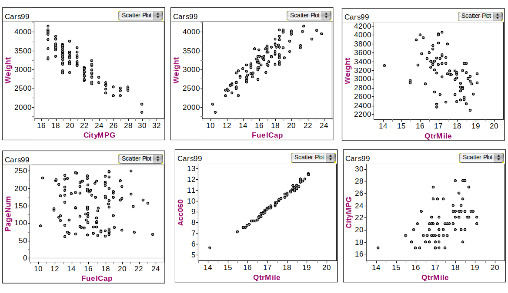
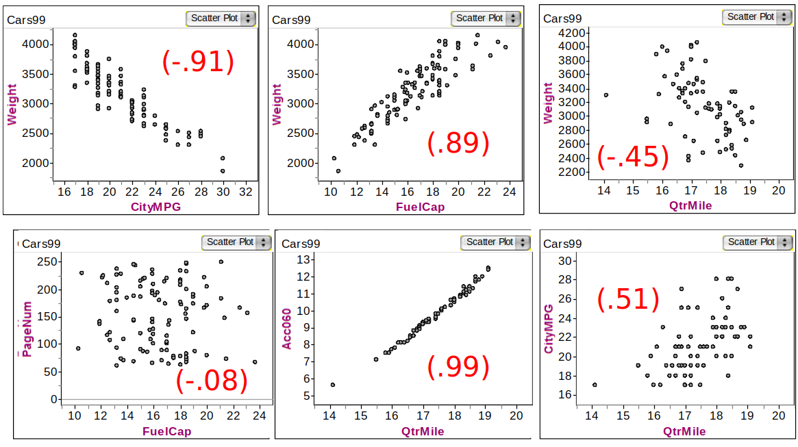
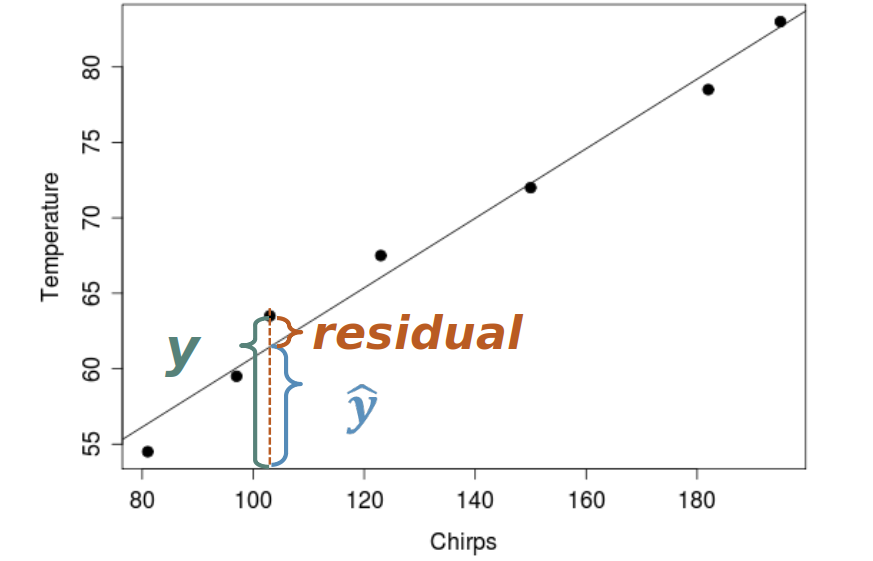

```{r setup, include=FALSE}
options(htmltools.dir.version = FALSE)
options(htmltools.preserve.raw = FALSE)
options(ggrepel.max.overlaps = Inf)

knitr::opts_chunk$set(echo = TRUE, 
                      dev = 'svg',
                      collapse = TRUE, 
                      comment = NA,  # PRINTS IN FRONT OF OUTPUT, default is '##' which comments out output
                      prompt = FALSE, # IF TRUE adds a > before each code input
                      warning = FALSE, 
                      message = FALSE,
                      fig.height = 3, 
                      fig.width = 4,
                      out.width = "100%"
                      )


# load necessary packages
library(tidyverse)
library(countdown)
library(mosaic)
library(ggthemes)
library(xaringanExtra)
library(forcats)
xaringanExtra::use_panelset()
xaringanExtra::use_tachyons()
xaringanExtra::use_clipboard()
xaringanExtra::use_extra_styles(
  hover_code_line = TRUE,         #<<
  mute_unhighlighted_code = TRUE  #<<
)
library(flipbookr)
library(patchwork)
library(Lock5Data)

# Set ggplot theme
theme_set(theme_tufte(base_size = 10))


yt <- 0

# read.csv("https://raw.githubusercontent.com/deepbas/statdatasets/main/APM_DougEvansCases.csv")

```


```{r xaringanExtra-clipboard, echo=FALSE}
htmltools::tagList(
  xaringanExtra::use_clipboard(
    button_text = "<i class=\"fa fa-clipboard\"></i>",
    success_text = "<i class=\"fa fa-check\" style=\"color: #90BE6D\"></i>",
    error_text = "<i class=\"fa fa-times-circle\" style=\"color: #F94144\"></i>"
  ),
  rmarkdown::html_dependency_font_awesome()
)
```


layout: true
  
<!-- <div class="my-footer"><span>Stat 230</span></div> -->
<!-- this adds the link footer to all slides, depends on my-footer class in css-->

---

class: title-slide, middle
<!-- background-image: url("assets/title-image2.jpg") -->
background-position: 10% 90%, 100% 50%
background-size: 160px, 100% 100%

# .fancy[Two Quantitative Variables: Association]

### .fancy[Stat 120]

`r format(Sys.Date(), ' %B %d %Y')`

---

# Describing associations between two quantitative variables

.bq[
.bold[Data]: each case $i$ has two measurements
- $x_i$ is explanatory variable
- $y_i$ is response variable
]

--
<br>

.bq[
A .bold[scatterplot] is the plot of $(x_i, y_i)$.
- form? linear or non-linear
- direction? positive, negative, no association
- strength? amount of variation in $y$ around a "trend"
]

---

# Example: Associations in Car dataset 


<center>
<br>
<a>Various Associations of quantitative variables in Cars data</a>
</center>


---

# Direction

.bq[
.bold[positive association:] as $x$ increases, $y$ increases 

- age of the husband and age of the wife
- height and diameter of a tree
]  
 
--

<br>

.bq[    
.bold[negative association:] as $x$ increases, $y$ decreases
- number of cigarettes smoked per day and lung capacity
- depth of tire tread and number of miles driven on the tires
]

---

# Correlation Coefficients

.bql.font80[
.bold[Correlation coefficient:] denoted $r$ (sample) or $\rho$ (population)

- Strength of linear association
    - $r\approx \pm 1:$ strong
    - $r\approx 0:$ weak
  
- Direction of linear association
    - $r > 0:$ positive
    - $r < 0:$ negative
]
  
--

.blue-h[Correlation can be heavily affected by outliers. Plot your data!]

--

```{r, eval=FALSE}
# R-code
cor(data$x, data$y)  # order of x and y doesn't matter!
```


---

## Car Correlations

<center>
<br>
<a>Correlations of various variables in Cars data</a>
</center>

---


# Linear Regression

.center.green-h[.bold[Goal:] To find a straight line that best fits the data in a scatterplot]
.bql.font80[
The estimated regression line is
$$ \hat{y} = a + bx$$
- x is the explanatory variable
- $\hat{y}$ is the predicted response variable.
]
<br>
.bq.font80[
.bold[Slope:] increase in predicted $y$ for every unit increase in $x$
$$ b = \frac{\text{change }\hat{y}}{\text{change } x} $$

.bold[Intercept:] predicted $y$ value when $x = 0$
 $$ \hat{y} = a + b(0) = a $$]


---

class: middle

# Residuals

.pull-left.font80[
.bql[
- .bold[Geometrically], residual is the vertical distance from each point to the line

- .bold[Mathematically], $y - \hat{y}$ is the residual of $y$ at $x$

- If the model is linear, measure how much variation in the response is explained by the model.
]
]
.pull-right[
<br>
<center>
<br>
<a>Residuals</a>
</center>
]


---

class: middle

# Least Squares Line

.bq[
The Least squares line is the line which minimizes the sum of squared residuals. Want to minimize:

$$\sum_{i=1}^n (y_i - \hat{y}_i)^2 = (y_1 - \hat{y}_1)^2 + (y_2 - \hat{y}_2)^2 + \cdots + (y_n - \hat{y}_n)^2 $$
]

.center[“least squares line” = “regression line”]


---

class: middle

# Regression Caution!

.bql.font80[
- Do not use the regression equation or line to predict values far from those that were used to create it --> .bold[Extrapolation!]

- The regression line/equation should only be used if the association is approximately linear

- Unlike correlation, for linear regression it does matter which is the explanatory variable and which is the response
]

---

class: middle

# Outliers Detection


.pull-left-40[

<br>
<br>

.bq[
.bold[Outliers] can be very influential on the regression line

- remove the points and see if the regression line changes significantly 
]

]

.pull-right-60[

```{r,  echo=FALSE, fig.align='center', fig.width=4, fig.height=4, out.width="90%"}
# SAT sscores
library(dplyr)
sat <- read.csv("https://math.carleton.edu/Stats215/RLabManual/sat.csv")
sat.MW <- filter(sat, region == "Midwest") # just MW states
sat.lm <- lm(math ~ verbal, data=sat.MW)

sat.lm.noIO <- lm( math ~ verbal, data=sat.MW, subset = -c(2,10)) 
# same figure
plot(math ~ verbal, data=sat.MW, pch=19, 
     main="Average SAT for Midwest States",
     xlab="Math SAT scores", 
     ylab = "Verbal SAT scores",
     cex.lab=0.7, cex.main = 0.7, cex.axis=0.7)
abline(sat.lm)
abline(sat.lm.noIO, col = "red")
legend("topleft", legend = c("With IN and OH", "Without IN and OH"), col = c("black", "red"), lty = c(1,1), cex = 0.7)
text(540, 535, "OH", ces = 0.5)
text(500, 495, "IN", cex = 0.5)
```

]


---

class: action

# <i class="fa fa-pencil-square-o" style="font-size:48px;color:purple">&nbsp;Your&nbsp;Turn&nbsp;`r (yt <- yt + 1)`</i>    

.pull-left-40[

]
.pull-right-60[

<br>
<br>
.bq[

Go to our class [moodle](https://moodle.carleton.edu) and skim through class activity 1

Feel free to talk to your neighbor
]
]

`r countdown(minutes = 5, seconds = 00, top = 0 , color_background = "inherit", padding = "3px 4px", font_size = "2em")`

---

# Regression line of Blood Alcohol Content (BAC) data

```{r, echo=FALSE}
bac <- read.csv("http://math.carleton.edu/kstclair/data/BAC.csv")
```

.pull-left-60[

Regression of BAC on number of beers

.code70[
```{r}
bac.lm <- lm(BAC ~ Beers, data=bac)
summary(bac.lm)
```
]
]

.pull-right-40[
<br>
<br>
.bq.font80[
Slope, $b= 0.0180$: 

- `Estimate` column and `Beers` row

Intercept, $a = -0.0127$: 

- `Estimate` column and `Intercept` row
]
]


---

class: middle

# Regressing BAC on number of beers

$$ \widehat{BAC} = -0.0127 + 0.0180(Beers) $$

.bql[
Slope Interpretation?
- Each additional beer consumed is associated with a $0.0180$ unit increase in BAC
]

--

<br>

.bql[
y-intercept Interpretation?
- Predicted BAC with 0 beers consumed 
]

---

# Regressing BAC on number of beers

.pull-left[
  
```{r, echo=TRUE, eval=FALSE}
plot(BAC ~ Beers, data=bac, pch=19, 
     main="Beer and BAC", 
     xlab="Number of beers drank", 
     ylab = "Blood Alcohol Content")
abline(bac.lm) # adds regression line 
```
  
> If your friend drank 2 beers, what is your best guess at their BAC after 30 minutes?
 $$\widehat{BAC} = -0.0127 + 0.0180(2) = 0.023$$
  
]

.pull-right[
```{r, echo=FALSE, eval=TRUE, fig.align='center', fig.width=4.5, fig.height=4.5, out.width="120%"}
plot(BAC ~ Beers, data=bac, pch=19, 
     main="Beer and BAC", 
     xlab="Number of beers drank", 
     ylab = "Blood Alcohol Content",
     cex.lab=0.7, cex.main = 0.7, cex.axis=0.7)
abline(bac.lm) # adds regression line 
```
]

---

class: middle

# Regressing BAC on number of beers

.pull-left[

<br>
<br>

> Find the residual for the student in the dataset who drank 2 beers and had a BAC of 0.03.
> The residual is about $y - \hat{y} = 0.03 - 0.023 = 0.007$

]

.pull-right[
 
```{r, echo = FALSE, eval=TRUE, fig.align='center', fig.width=4.5, fig.height=4.5, out.width="120%" }
# Beer and BAC

bac <- read.csv("http://math.carleton.edu/kstclair/data/BAC.csv")
bac.lm <- lm(BAC ~ Beers, data=bac)

plot(BAC ~ Beers, data=bac, pch=19, 
     main="Beer and BAC", 
     xlab="Number of beers drank", 
     ylab = "Blood Alcohol Content",
     cex.lab=0.7, cex.main = 0.7, cex.axis=0.7)
abline(bac.lm) # adds regression line to the plot
segments(2, 0, 2, 0.023, lty = 2, col = "red")
segments(0, 0.023, 2, 0.023, lty = 2, col = "red")
text(1,0.018, "0.023", col = "red", cex = 0.5)
segments(2, 0.023, 2, 0.03, lty = 3, col = "red", cex = 0.5)
segments(0, 0.03, 2, 0.03, lty = 3, col = "blue", cex = 0.5)
text(1, 0.035, "0.03", col = "blue", cex = 0.5)
```

]

---

# Residuals Plot

.pull-left[

```{r, echo = FALSE, eval=TRUE, fig.align='center', fig.width=4.5, fig.height=4.5, out.width="120%"}
# residual size plot
library(ggplot2)
bac <- read.csv("http://math.carleton.edu/kstclair/data/BAC.csv")
d <- bac

fit <- lm(BAC ~ Beers, data = d) # fit the model
d$predicted <- predict(fit)   # Save the predicted values
d$residuals <- residuals(fit) # Save the residual values

ggplot(d, aes(x = Beers, y = BAC)) +
  geom_smooth(method = "lm", se = FALSE, color = "lightgrey") +     # regression line  
  geom_segment(aes(xend = Beers, yend = predicted), alpha = .2) +      # draw line from point to line
  geom_point(aes(color = abs(residuals), size = abs(residuals))) +  # size of the points
  scale_color_continuous(low = "green", high = "red") +   
  labs(title = "BAC Vs. Beers") +# colour of the points mapped to residual size - green smaller, red larger
  guides(color = FALSE, size = FALSE) +                             # Size legend removed
  geom_point(aes(y = predicted), shape = 1, size = 2) +
  scale_x_continuous(breaks=1:9)+
  theme(axis.text=element_text(size=10),
        axis.title=element_text(size=10,face="bold"),
        plot.title = element_text(size = 10, face = "bold"))

```
]

.pull-right[

```{r, echo = FALSE, eval=TRUE, fig.align='center', fig.width=4.5, fig.height=4.5, out.width="120%"}
ggplot(d, aes(x = Beers, y = residuals)) +
  geom_point() +
  theme(legend.position = "none") +
  geom_segment(aes(xend = Beers, yend = 0), alpha = .2) +
  scale_color_continuous(low = "green", high = "red") +   
  geom_point(aes(color = abs(residuals), size = abs(residuals))) +  # size of the points
  geom_hline(yintercept = 0, col = "blue", size = 0.5, linetype = "dashed") + 
  labs(title = "BAC Vs. Beers",
       x = "Beers",
       y = "Residuals") +
  theme(plot.title = element_text(hjust=0.5, size=7, face='bold')) 
```

]

---

# R-squared
.bq.font80[
.bold[R-squared] is proportion (or percentage) of variability observed in the response y which can be explained by the explanatory variable x.

$$R^2 = 1 - \text{unexplained variation} = 1 - \frac{s^{2}_{\text{residuals}}}{s^2_y} $$
]

- $R^2 = r^2$ in simple linear regression model (One explanatory variable)

.bql.font80[
.bold[BAC] : $R^2 = 0.7998$

- The number of beers consumed explains about 80.0% of the observed variation in BAC
- What factors (variables) besides number of beers drank might explain the
other roughly 20% of variation in BAC?
]

---

# R-squared

Called .bold[Multiple R-squared] in the summary output

```{r}
summary(bac.lm)
```

---

# Additional Comments

.bql[Include confounding variables when appropriate
- augment scatterplot with colors for each category
]

```{r, echo = TRUE, eval=FALSE, fig.align='center', fig.width=4.5, fig.height=4, out.width="100%"}
ggplot(data, aes(x=x,y=y,color=z)) + geom_point()
```

--

.bq[
- split (subset) data by categories, run regressions for each group.
- look for outliers that affect the fitted model and correlation
- fit the model/correlation with and without case(s) to see the affects
]

---

class: middle

# Adding a categorical variable

.pull-left[

```{r, echo = FALSE, eval=TRUE, fig.align='center', fig.width=4, fig.height=4, out.width="80%"}
salarydata <- read.csv("https://www.lock5stat.com/datasets2e/SalaryGender.csv")
salarydata$PhD <- as.factor(salarydata$PhD)
salarydata$PhD <- ifelse(salarydata$PhD == "0", "No", "Yes")

ggplot(salarydata, aes(x=Age, y=Salary, color=PhD)) + 
  geom_point()+ theme(legend.position = "bottom")
  
```

]

.pull-right[
.code80[
```{r, eval=FALSE}
ggplot(salarydata, aes(x=Age,  
                       y=Salary,
                       color=PhD)) + 
  geom_point()
```
]
.bq[
- Visually split the data by PhD status
- Potentially different trends
]
]
  
---

class: middle

# Adding a categorical variable

.pull-left-60[

```{r, echo = FALSE, eval=TRUE, fig.align='center', fig.width=4.5, fig.height=4.5, out.width="0%"}
ggplot(salarydata, aes(x=Age, y=Salary, color=PhD))+
  geom_point() +
  geom_smooth(method ="lm", se=FALSE)+
  theme(legend.position = "bottom")
```

]

.pull-right-40[
<br>
<br>
.bq[
Visually infer difference in groups:
- Different correlation
- Different intercepts
]
]

---

# Adding a categorical variable: stats by group

> .green[Can also use `filter` function available under `dplyr` package to divide responses into the groups of interest]

```{r}
library(dplyr)
table(salarydata$PhD)
```

--

```{r}
salary.NoPhD <- filter(salarydata, PhD == "No")
salary.PhD <- filter(salarydata, PhD == "Yes")
```

--

```{r}
cor(salary.NoPhD$Salary,salary.NoPhD$Age)
cor(salary.PhD$Salary,salary.PhD$Age)
```

---

class: middle

# Outliers: Average SAT by state


.code80[
```{r}
library(dplyr)
sat <- read.csv("https://math.carleton.edu/Stats215/RLabManual/sat.csv")
sat.MW <- filter(sat, region == "Midwest") # just MW states
cor(sat.MW$math, sat.MW$verbal)

sat.lm <- lm(math ~ verbal, data=sat.MW)
sat.lm
```

```{r}
summary(sat.lm)$r.squared
```

]


.out-t[Correlation = 0.9732, Regression Slope = 1.0469, R-squared = 94.7%]

---

class: middle

# Outliers: Average SAT by state, excluding Indiana and Ohio

.code80[
```{r}
which(sat.MW$verbal < 550)
cor(sat.MW$math[-c(2,10)], sat.MW$verbal[-c(2,10)])
sat.lm.noIO <- lm( math ~ verbal, data=sat.MW, subset = -c(2,10))
sat.lm.noIO
```

```{r}
summary(sat.lm.noIO)$r.squared
```
]

.out-t[Correlation = 0.8465, Regression slope = 0.9956 , R-squared = 71.66%]

---

class: middle

# Non-linear Patterns

.bq.font80[.bold[James D. Forbes 1857 experiment:] Can atmospheric pressure be determined from the boiling point of water? Is the relationship linear?]

.pull-left[
.red.center[Seems Linear!]
```{r, echo = FALSE, eval=TRUE, fig.align='center', fig.width=4, fig.height=4, out.width="80%"}
forbes <- read.csv("http://math.carleton.edu/kstclair/data/forbes.csv")
plot(Pressure ~ Temp, data=forbes, pch=19, main = "Pressure vs. Temp", cex.lab=0.5, cex.main = 0.5, cex.axis=0.5)
forbes.lm <- lm(Pressure ~ Temp, data=forbes)
abline(forbes.lm)
```

]

.pull-right[
.red.center[Curvature!]
```{r, echo = FALSE, eval=TRUE, fig.align='center', fig.width=4, fig.height=4, out.width="80%"}
plot(resid(forbes.lm) ~ Temp, data=forbes, pch=19, main = "Residuals plot", cex.lab=0.5, cex.main = 0.5, cex.axis=0.5)
abline(h=0)
```

]

---

# Residuals Plot

> While the scatterplot of pressure vs. temp may look linear
relationship, the residuals plot reveals that there is curvature in the
relationship.

--

<br>

.bql[
Correlation is almost 1, so why not use linear regression!!

- Because the true nature of the relationship is not linear
- Would systematically overestimate pressure for midrange temps and underestimate pressure for high/low temps.
]

--

.out-t[However, temp and log(pressure) have a linear relationship and we can apply linear model after transformation of the variables!!]

---

class: action

# <i class="fa fa-pencil-square-o" style="font-size:48px;color:purple">&nbsp;Your&nbsp;Turn&nbsp;`r (yt <- yt + 1)`</i>    

.pull-left-40[

]
.pull-right-60[

<br>
<br>
.bq[

<br>

Go over the remaining portion of in class activity and let me know if you have any questions!

]
]

`r countdown(minutes = 10, seconds = 00, top = 0 , color_background = "inherit", padding = "3px 4px", font_size = "2em")`


