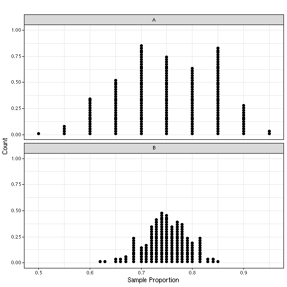

```{r setup, include=FALSE}
options(htmltools.dir.version = FALSE)
options(htmltools.preserve.raw = FALSE)
options(ggrepel.max.overlaps = Inf)

knitr::opts_chunk$set(echo = TRUE, 
                      dev = 'svg',
                      collapse = TRUE, 
                      comment = NA,  # PRINTS IN FRONT OF OUTPUT, default is '##' which comments out output
                      prompt = FALSE, # IF TRUE adds a > before each code input
                      warning = FALSE, 
                      message = FALSE,
                      fig.height = 3, 
                      fig.width = 4,
                      out.width = "100%"
                      )

set.seed(123)

# load necessary packages
library(tidyverse)
library(countdown)
library(mosaic)
library(ggthemes)
library(xaringanExtra)
library(forcats)
xaringanExtra::use_panelset()
xaringanExtra::use_tachyons()
xaringanExtra::use_clipboard()
xaringanExtra::use_extra_styles(
  hover_code_line = TRUE,         #<<
  mute_unhighlighted_code = TRUE  #<<
)
library(flipbookr)
library(patchwork)
library(Lock5Data)

# Set ggplot theme
theme_set(theme_tufte(base_size = 10))


yt <- 0

# read.csv("https://raw.githubusercontent.com/deepbas/statdatasets/main/APM_DougEvansCases.csv")

```


```{r xaringanExtra-clipboard, echo=FALSE}
htmltools::tagList(
  xaringanExtra::use_clipboard(
    button_text = "<i class=\"fa fa-clipboard\"></i>",
    success_text = "<i class=\"fa fa-check\" style=\"color: #90BE6D\"></i>",
    error_text = "<i class=\"fa fa-times-circle\" style=\"color: #F94144\"></i>"
  ),
  rmarkdown::html_dependency_font_awesome()
)
```


layout: true
  
<!-- <div class="my-footer"><span>Stat 230</span></div> -->
<!-- this adds the link footer to all slides, depends on my-footer class in css-->

---

class: title-slide, middle
<!-- background-image: url("assets/title-image2.jpg") -->
background-position: 10% 90%, 100% 50%
background-size: 160px, 100% 100%

# .fancy[Sampling Distribution and Bootstrap]

### .fancy[Stat 120]

`r format(Sys.Date(), ' %B %d %Y')`

---

# Statistical Inference

.bql.font90[.bold[Statistical inference]  is the process of drawing conclusions about the entire population based on information in a sample.]

<br>

<center>
<br>
<a>Statistical Inference</a>
</center>

---

# Motivating Example 1

<center>
<br>
<a>Regression line of Bood alcohol content (BAC) Vs. number of beers</a>
</center>

.out-t.center[Can you drink 5 beers and stay under the 0.08 limit?]

---

# Motivating Example 2

<center>
<br>
<a>Striking rates by race</a>
</center>

.out-t[Do the observed differences in strike rates between black and white eligible jurors indicate a potential bias, or are the differences just due to chance?]

---

# Statistic and Parameter

.bqt.font90[
- A .bold[parameter] is a number that describes some aspect of a population.
- A .bold[statistic] is a number that is computed from data in a sample.
]

<br>

&nbsp; | Parameter | Statistic 
---- | ---- | ---- 
Mean | $\mu$ | $\bar{x}$ 
Proportion | $p$ | $\hat{p}$ 
Std. Dev. | $\sigma$ | $s$ 
Correlation | $\rho$ | $r$ 
Slope | $\beta$ | $b$ 


---

# Parameter Vs. Statistic

.brown.font120[State whether the quantity described is a .bold[parameter]
or a .bold[statistic], and give the correct notation.]

.bql.font90[
  a. Average household income for all houses in the US, using data from the US census
] 

--

.bql.font90[
  b. The proportion of all residents in a county who voted in the last presidential election.]
  
--
.bql.font90[
  c. The difference in proportion who have ever smoked cigarettes, between a sample of 500 people who are 60 years old and a sample of 200 people who are 25 years old.
]

---


class: middle

# Point Estimate (PE)

.bql[
- .bold[Point estimate] is a single value constructed from the sample data

- .bold[Sample statistic] can serve as a point estimate  for an unknown parameter
]

---

# Sampling Distribution


.pull-left[


.bql[A .bold[sampling distribution] is the distribution of sample statistics computed for different samples of the same size from the same population.
- Sample statistics varies from sample to sample
- Sampling distribution gives us an idea of the variation
]
]

.pull-right[


```{r, echo=FALSE, fig.width=6, fig.height=4, fig.align='center', out.width="98%"}
library(Lock5Data)
library(tidyr)
library(Lock5withR)

my_data <- StatisticsPhD %>% drop_na()

set.seed(12564)
# r-code
# mean(my_data$FTGradEnrollment, na.rm = TRUE)
n.size <- 10
resamples <- lapply(1:1000, function(i) sample(my_data$FTGradEnrollment, size = n.size)) 
resamples.mean <- lapply(resamples, function(x) mean(x)) 
resamples.mean <- unlist(resamples.mean)
mydata1000 <- data.frame(x = resamples.mean[1:1000])
mydata500 <- data.frame(x = resamples.mean[1:500])

ggplot(mydata1000, aes(x = x)) +
   geom_dotplot(dotsize=0.9, stackratio=1, binwidth=1, color = "gold", fill =" blue") +
 ggtitle("") +  xlab("") + ylab("")+
 scale_x_continuous(limits = c(10,105), expand = c(0,0), breaks = c(seq(0,120,12)))+ 
  theme(axis.text.y = element_blank(), axis.ticks.y = element_blank(),
        axis.text.x = element_blank(), axis.ticks.x = element_blank(),
        plot.title = element_text(hjust = 0.5),
      panel.background = element_rect(fill = "#FFFDD0", colour = NULL, size = 0, linetype = "dotted")) + 
  labs(title = "Sampling distribution of sample mean")
```

]


---

class: middle

# Center and Shape

.bql[
.bold[Center:] If samples are randomly selected, the sampling distribution will be centered around the population parameter.

.bold[Shape:] For most of the statistics we consider, if the sample size is large enough the sampling distribution will be symmetric and bell-shaped.
]

---

class: middle

# Standard Error


.bql.font90[
Uncertainty in point estimates measured by the .bold[standard error (SE)]
- The .bold[standard error] of a statistic is the standard deviation of the sampling distribution
- The .bold[standard error] measures how much the statistic varies from sample to sample
]


---


class: action

# <i class="fa fa-pencil-square-o" style="font-size:48px;color:purple">&nbsp;Short&nbsp;Demo&nbsp;</i>    


.pull-left[


]

.pull-right[
<br>
<br>
<br>
.bql[

 [A Short demo on Sampling distribution](https://onlinestatbook.com/stat_sim/sampling_dist/index.html)
]
]
---

# Recall:  Gettysburg Address

.pull-left-40[
<br>
.bq.font80[
The standard error for the average word size in a random sample of 10 words is closest to

a. 0.5

b. 0.7

c. 1.0

d. 1.5
]
]


.pull-right-60[

```{r, echo=FALSE, fig.width=6, fig.height=4, fig.align='center', out.width="98%"}
pop <- read.csv("https://raw.githubusercontent.com/deepbas/statdatasets/main/GettysbergPopulationCounts.csv")
n.size <- 10
resamples <- lapply(1:1000, function(i) sample(pop$size, size = n.size)) 
resamples.mean <- lapply(resamples, function(x) mean(x)) 
resamples.mean <- unlist(resamples.mean)
mydata1000 <- data.frame(x = resamples.mean[1:1000])
mydata500 <- data.frame(x = resamples.mean[1:500])

ggplot(mydata1000, aes(x = x)) +
   geom_dotplot(dotsize=0.4, stackratio=0.7, binwidth=0.098, color = "gold", fill =" blue") +
 ggtitle("") +  xlab("") + ylab("")+
 scale_x_continuous(limits = c(2,7), expand = c(0,0), breaks = c(seq(2,8,0.5)))+ 
  # theme(axis.text.y = element_blank(), axis.ticks.y = element_blank(),
  #       axis.text.x = element_blank(), axis.ticks.x = element_blank(),
  #       plot.title = element_text(hjust = 0.5),
  #     panel.background = element_rect(fill = "#FFFDD0", colour = NULL, size = 0, linetype = "dotted")) + 
  labs(title = "Sampling distribution of mean word length")

```


]

---


# Sample Size Matters!

.pull-left-60[
<center>
<br>
</center>
]
.pull-right-40[
<br>

.bq.font90[
- As the sample size increases, the variability (SE) of the sample statistics tends to decrease.
- Smaller SE means the sample statistics tend to be closer to the true population parameter value! 
]
]

---


# Other Factors

.green-h[
Q. What else affects the standard error of a statistic?]

--

.blue-h[A. .blue[The variability of the population!]]

<br>

--

<br>

.bqt.font90[
- .bold[Quantitative variable:] the larger the population standard deviation, the larger the standard error of a statistic (like a mean)

- .bold[Categorical variable:] the closer the population proportion is to 0.5, the larger the standard error of the sample proportion
]

---

class: middle

# Sample Size vs. Simulation size

.red.bold[Do not confuse sample size and simulation size !!]

.pull-left[
.bql[
.bold.blue[Sample size (n)] = how many individuals are in the sample used to compute our stat?

]

]


.pull-right[

.bql[
.bold.blue[Simulation size (N)] = how many random samples did we take from the population to simulate the sampling distribution of our stat?


]

]

.bq.font80[
- The SE of your stat gets smaller as $n$ get bigger.
- Once you’ve simulated a couple $100$ samples, the shape/center/spread of the sampling distribution should remain about the same as you increase the simulation size.


]

---

# Random Vs. Non-random

.bq.font80[Samples of .bold[size] 5 are taken from a large population with .bold[population mean] 8, and the sampling distributions for the sample means are shown.  Dataset A (top) and Dataset B (bottom) were collected using different sampling methods.  Which dataset (A or B) used .bold[random sampling]?]

<center>
<br>
<a>Random Vs. non-random data distribution</a>
</center>

---


# Bootstrap 

.hljs[.bold[Bootstrap:] Sample with replacement from the original sample, using the same sample size.]

<center>
<br>
<a>Original sample (left) to bootstrap sample (right)</a>
</center>


---

# Bootstrap 

<center>
<br>
<a>Original sample (left) to population (right)</a>
</center>


.bold[Creating a bootstrap sample is the same as using the data simulate a “population” that contains an infinite number of copies of the data.]

---

# Bootstrap Sampling in R

.bql.font90[
- resample a set of observations with replacement

- same data points can appear multiple times
]

<br>

&nbsp; | Data | Statistic 
---- | ---- | 
Original sample | $x_1, x_2, ..., x_n$ | $\bar{x}_n$ 
Resample  | $x_1^*, x_2^*, ..., x_n^*$ | $\bar{x}^*_n$

```{r, eval=FALSE}
# R-code
boot <- sample(x, size, replace = TRUE)
```

---

class: middle

# Bootstrap Steps

.bq.font90[
1. Generate a bootstrap sample.

2. Compute the statistic of interest for your bootstrap sample.

3. Repeat steps (1) – (2) many times. Plot the distribution of all your bootstrap statistics
]

.center.bold[This is the bootstrap distribution!]


.footnote[[Statkey Demo Page](https://www.lock5stat.com/StatKey/bootstrap_1_quant/bootstrap_1_quant.html)]

---

class: action

# <i class="fa fa-pencil-square-o" style="font-size:48px;color:purple">&nbsp;Your&nbsp;Turn&nbsp;`r (yt <- yt + 1)`</i>    

.pull-left-40[

]
.pull-right-60[

<br>
<br>
.bq[

Please go over the class activity and [class helper page](https://stat120-fall23.netlify.app/) and let me know if you have any questions.

]
]

`r countdown(minutes = 20, seconds = 00, top = 0 , color_background = "inherit", padding = "3px 4px", font_size = "2em")`
