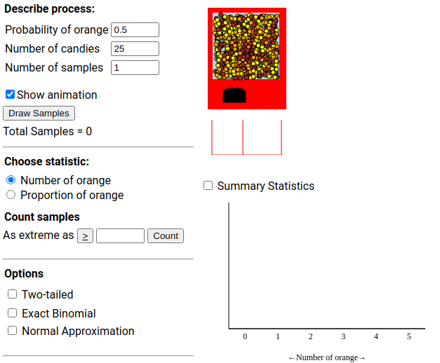
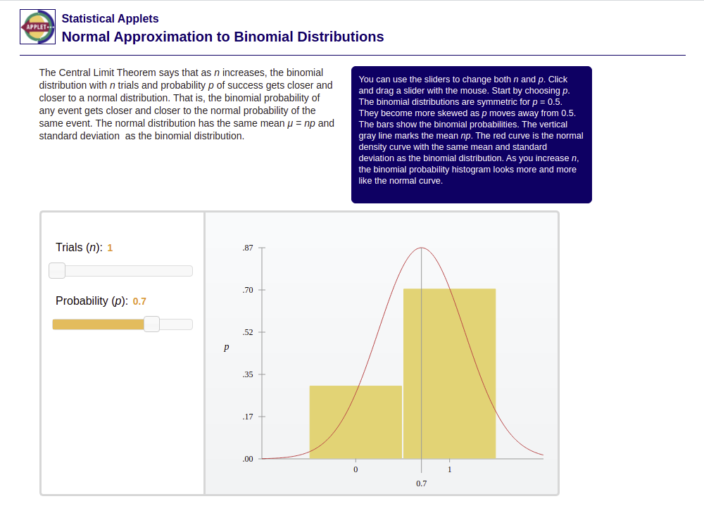

```{r setup, include=FALSE}
options(htmltools.dir.version = FALSE)
options(htmltools.preserve.raw = FALSE)
options(ggrepel.max.overlaps = Inf)

knitr::opts_chunk$set(echo = TRUE, 
                      dev = 'svg', 
                      collapse = FALSE, 
                      comment = NA,  # PRINTS IN FRONT OF OUTPUT, default is '##' which comments out output
                      prompt = FALSE, # IF TRUE adds a > before each code input
                      warning = FALSE, 
                      message = FALSE,
                      fig.height = 3, 
                      fig.width = 4,
                      out.width = "100%"
                      )

# load necessary packages
library(tidyverse)
library(dplyr)
library(countdown)
library(ggthemes)
library(xaringanExtra)
library(forcats)
xaringanExtra::use_panelset()
xaringanExtra::use_tachyons()
xaringanExtra::use_clipboard()
xaringanExtra::use_extra_styles(
  hover_code_line = TRUE,         
  mute_unhighlighted_code = TRUE  
)
library(flipbookr)
library(patchwork)
library(DT)
library(knitr)
library(grid)
library(gridExtra)
library(tikzDevice)


select <- dplyr::select

# Set ggplot theme
theme_set(theme_tufte(base_size = 10))

yt <- 0

# read.csv("https://raw.githubusercontent.com/deepbas/statdatasets/main/agstrat.csv")
```


```{r xaringanExtra-clipboard, echo=FALSE}
htmltools::tagList(
  xaringanExtra::use_clipboard(
    button_text = "<i class=\"fa fa-clipboard\"></i>",
    success_text = "<i class=\"fa fa-check\" style=\"color: #90BE6D\"></i>",
    error_text = "<i class=\"fa fa-times-circle\" style=\"color: #F94144\"></i>"
  ),
  rmarkdown::html_dependency_font_awesome()
)
```


layout: true
  
---

class: title-slide, middle

# .fancy[Probability, Random Variables and Probability Distributions]

### .fancy[Stat 120]

`r format(Sys.Date(), ' %B %d %Y')`

---

# Probability

<!-- Describe and understand apparent randomness -->

.blockquote[
.bold[Setup]: A random process giving rise to some outcome

$$\textbf{ Roll a die } \rightarrow 1,2,3,4,5, \text{ or } 6$$

$$\textbf{ Flip a coin }\rightarrow \mathrm{H} \text{ or } \mathrm{T}$$
]

--

<br>

.blockquote-list[
.bold[Probability:]

The probability of a random event is the .bold[long-run proportion] (or relative frequency) of times the event would occur if the .bold[random process] were repeated over and over under identical conditions.
]

--

.out-t[We can approximate a probability by simulating the process a large number of times!]

---

`r chunk_reveal("plot", font_size_code="70%", title = "## Law of large numbers (Head = 1, Tail = 0)")`

```{r plot, fig.width = 3, fig.height = 3.5, out.width = "100%", include=FALSE}
set.seed(123) # for reproducibility
n <- 10000 # total simulations
x <- sample(c(0,1), n, replace = TRUE)
s <- cumsum(x) # cumulative/running sum
p.hat <- s/(1:n) # prop. heads in N simulations
results <- data.frame(x = x,
                        s = s,
                        p.hat = p.hat)

results <- results %>% 
  mutate(n = row_number())

ggplot(results, aes(x = n, y = p.hat)) + 
  geom_line() + 
  geom_hline(yintercept = 0.5, 
             col = "blue", 
             linetype = "dashed")+
  labs(x = "Number of simulations",
       y = "Proportion of heads")

```


---

class: middle, inverse

## Law of large numbers

.blockquote[
As more observations are collected, the proportion $\hat{p}_{n}$ of occurrences with a particular outcome converges to the probability $p$ of that outcome.
]

---

# What are random variables?

.pull-left[


x | 0 | 1 | 2
-------- | ------| ------- | -------
$P(X=x)$ | 0.25 | 0.50 | 0.25 

]

.pull-right[

.blockquote.font80[
.bold[Random Variable (RV)]
- a variable whose value is a numerical outcome of a random process.
- .bold[Notation:] $P(X=x)$ means the probability that RV $X$ equals the number given by $x$.

.bold[Example:] flip a coin twice 
- $X=\#$ of Heads observed


$$\begin{align}
P(X=0)&=P(T T)=\frac{1}{4} \\
P(X=1)&=P(H T \text{ or } TH)=\frac{2}{4} \\
P(X=2)&=P(H H)=\frac{1}{4}
\end{align}$$
]
]

---

# Discrete random variables

.out-t[X is a discrete RV if you can list its possible values]

.blockquote[
Describe a distribution of a discrete RV with
- .bold[Shape] : plot $x$-values vs. $P(X=x)$
- .bold[Expected Value or Mean of X] :

$$\begin{align}
E(X)=\mu_{X}=\sum_{\substack{\text { allvalues } \\ \text { of }}} x P(X=x)
\end{align}$$

- .bold[Standard deviation and Variance of X] :
$$\begin{align}
\begin{array}{l}
S D(X)=\sigma_{X}=\sqrt{\operatorname{Var}(X)} \\
\operatorname{Var}(X)=\sigma_{X}^{2}=\sum_{\substack{\text { allvalues } \\
\text { of } \mathrm{X}}}\left(X-\mu_{X}\right)^{2} P(X=x)
\end{array}
\end{align}$$
]

---

# Recall: Sample proportions

.blockquote[
The .bold[sample proportion] is

$$\begin{align*}
\hat{p}=\frac{X}{n}
\end{align*}$$

The sample proportion is a .bold[Random Variable!] 

The .bold[mean] and .bold[SD] of this sample proportion are: 

$$E(\hat{p})=p$$

$$\begin{align*}
S D(\hat{p})=\sqrt{\frac{p(1-p)}{n}}
\end{align*}$$
]

---

class: middle

# Example: Blood testing

.pull-left[

.blockquote[
.bold[Context:] You want to find a Type B blood donor, but you only have enough money to test 4 people.
- $11 \%$ of the population are Type B
- What is the .bold[probability distribution] for the random variable?
]
]

.pull-right[

]

---

# Example: Blood testing

.yellow-h[Y = number of people tested until you find Type B donor or run out of money]

<br>

| y | 1 | 2 | 3 | 4 |
| -------- | ------| ------- | ------- | ------- |
| $P(Y=y)$ | 0.11 | 0.0979 | 0.0871 | 0.7050 |


<br>

.blockquote[
$$\begin{array}{l}
P(Y=1)=0.11, \\
P(Y=2)=(.89)(.11), \\
P(Y=3)=(.89)^{2}(.11), \\
P(Y=4)=(.89)^{3}(.11)+(.89)^{4}
\end{array}$$
]


---

# A special discrete model: The Binomial model: $Binom(n,p)$

- $X=$ number of "success" in $n$ independent trials
- $p=P$(success) for each trial

.blockquote-list.font80[
.bold[Probability model:]

$$\begin{align*}
P(X=x)=\left(\begin{array}{c}
n \\
x
\end{array}\right) p^{x}(1-p)^{n-x}
\end{align*}$$

The term $\left(\begin{array}{l}n \\ x\end{array}\right)$ (read "n choose $x$") counts the number of ways that we can see $x$ successes and $\mathbf{n}-\mathbf{x}$ failures:
$$\begin{align*}
\left(\begin{array}{l}
n \\
x
\end{array}\right)=\frac{n !}{x !(n-x) !}
\end{align*}$$

.bold[Expectation and SD:]

$$\begin{align*}
\mu=E(X)=n p \qquad \sigma=\operatorname{SD}(X)=\sqrt{n p(1-p)}
\end{align*}$$
]

---

class: middle

# Is it Binomial?

.blockquote[

.bold[Check the following four conditions:]

(1) The trials are .bold[independent].

(2) The number of trials, $n$, is .bold[fixed].

(3) Each trial outcome can be classified as a .bold[success or failure].

(4) The .bold[probability of a success], $p$, is the .bold[same] for each trial.
]

---


# Binomial or Not

.blockquote[
(1) Count the number of heads in 2 flips of a coin

(2) Two baseball teams play a series of games until one of them wins a total of four games. You count the total number of games played.

(3) You play ten games of solitaire and count how many times you win.

(4) You collect a sample of 50 M&M candies and count the number of green ones
]


<br>
<details>
<summary>.large.red[Click for answer]</summary>
.blockquote-list.font80[
(1) Binomial - all conditions are met

(2) Not Binomial - No fixed number of trials!

(3) Not Binomial - No fixed probability of winning!

(4) Binomial if 2 outcomes are considered with constant probability of green M&M's
]
</details>

---

# Reese's Pieces

.blockquote.font80[
- Reese's Pieces candies have three colors: .bold[orange, brown, and yellow].

- Which color do you think has more candies in a package: .bold[orange, brown or yellow]?
]

<br>

--

.blockquote-list.font90[
Suppose you wanted to draw 26 Reeses Pieces from a jar with 52% of the candies being orange. 
]

--

<br>

.out-t.center[Let's go to a web applet and simulate the distribution of the proportion of orange candies!!]

---

class: action

# <i class="fa fa-pencil-square-o" style="font-size:48px;color:purple">&nbsp;Your&nbsp;Turn&nbsp;`r (yt <- yt + 1)`</i>    

.pull-left-40[

]
.pull-right-60[
.out-t.center[Click on the link below!]

<center>
<br>
</center>

]

`r countdown(minutes = 5, seconds = 00, top = 0 , color_background = "inherit", padding = "3px 4px", font_size = "2em")`

.footnote.center[http://www.rossmanchance.com/applets/2021/oneprop/OneProp.htm?candy=1]

---

# Another example: Blood donor

.blockquote[
.bold[Previously], $\mathbf{Y}=$ .bold[number of people tested until you find Type B donor or run out of money]
- Does $Y$ have a .bold[binomial distribution]?]

--

- .out-t[No, you are counting something (# Type B) but you don't have a fixed number of trials (sample size)]

--

.blockquote[
.bold[Now], you are going to check the blood types of 4 people. Define the random variable: $X=$ the .bold[number of people in your sample with Type B blood]. 
- Does $X$ have a .bold[binomial distribution]?]

--

- .out-t[Yes, you are counting successes (Type B) with n=4 people sampled (trials), each with an p=11% of chance of success (Type B)]

---

# Blood donor
$$X \sim Binom(n=4, p = 0.11)$$

$$\begin{align*}
P(X=x)=\left(\begin{array}{l}
4 \\
x
\end{array}\right) 0.11^{x}(1-0.11)^{4-x}
\end{align*}$$

.pull-left.font90[
.blockquote[
<br>


| x | 0 | 1 | 2 | 3 | 4 |
| -------- | ------| ------- | ------- | ------- | ------ |
| $P(X=x)$ | 0.6274 | 0.3102 | 0.0575 | 0.0047 | 0.0002 |


$$\begin{align*}
\begin{array}{l}
\mu=E(X)=4(0.11)=0.44 \\
\sigma=S D(X)=\sqrt{4(0.11)(1-0.11)}=0.626
\end{array}
\end{align*}$$
]
]
.pull-right.font90[

.blockquote[


$$\begin{align*}
P(X=0)=&\left(\begin{array}{l}
4 \\
0
\end{array}\right) 0.11^{0}(1-0.11)^{4-0}\\=&0.6274
\end{align*}$$

$$\begin{align*}
P(X=1)=&\left(\begin{array}{l}
4 \\
1
\end{array}\right) 0.11^{1}(1-0.11)^{4-1}\\=&0.3102
\end{align*}$$

]
]

---

# Linear Combinations of RVs

.blockquote-list[
- Any function of a RV is itself a RV.
- Let $X$ be $a$ RV and $a$ and $b$ be constants.
$$E(a X \pm b)=a E(X) \pm b$$
$$V(a X \pm b)=a^{2} V(X) \quad S D(a X \pm b)=a\cdot SD(X)$$
- Let $X$ and $Y$ be any two RVs
$$E(X \pm Y)=E(X) \pm E(Y)$$
- Let $X$ and $Y$ be any two RVs that are independent of each other
$$V(X \pm Y)=V(X)+V(Y) \quad S D(X \pm Y)=\sqrt{V(X)+V(Y)}$$
]

---

# Back to sample proportions

.blockquote[
We can write the .bold[sample proportion] as a function of a Binomial random variable $X$ :

$$\begin{align*}
\hat{p}=\frac{X}{n}
\end{align*}$$
]

<br>

.blockquote[
We learned earlier this term that a sample proportion behaves like a .bold[normal distribution] when $\mathrm{n}$ is large (CLT).
]

<br>

.out-t[So... how are the binomial and normal distributions connected??]

---

class: action

# <i class="fa fa-pencil-square-o" style="font-size:48px;color:purple">&nbsp;Your&nbsp;Turn&nbsp;`r (yt <- yt + 1)`</i>    

.pull-left-60[
.out-t.center[Click on the link below!]

<br>
</center>
]
.pull-right-40[


]

`r countdown(minutes = 3, seconds = 00, top = 0 , color_background = "inherit", padding = "3px 4px", font_size = "2em")`

.footnote[https://digitalfirst.bfwpub.com/stats_applet/stats_applet_2_cltbinom.html]

---

# Normal approximation for a Binomial RV

.blockquote[
When $n$ is large, a .bold[Binomial] RV $X$ can be modeled, approximately, by a .bold[Normal] model with mean and SD
$$\begin{align*}
\begin{array}{l}
\mu=E(X)=n p \\
\sigma=S D(X)=\sqrt{n p(1-p)}
\end{array}
\end{align*}$$
]

<br>

.blockquote[
What is "large $n$"?
- expect .bold[at least] 10 successes .bold[and] at least 10 failures:
$n p \geq 10 \quad$ (expected successes) $n(1-p) \geq 10 \quad$ (expected failures)
]

---

# Where might you see Binomial RVs again?

.blockquote-list[
In .bold[regression models] when your response variable is .bold[categorical], or a binomial count!
- .bold[Logistic regression] models assumes that $Y=$ response $=$ .bold[binomial] $R V$

$$p(X)=P( Success \mid X)= \text{ function of } X \text{ (explanatory vars) }$$
]

<br>

.blockquote.font90[
.bold[Example]: What factors are related to success on the MN Comprehensive Assessment (MCA) reading test?
- Case $=$ student
- $Y=$ pass $(1)$ or fail $(0) \sim \operatorname{Binom}(n=1, p)$
- $p(X)=P($ a student passes $\mid X)=$ function of earlier reading assessments (grades)
]

---

# Where might you see Binomial RVs again?

.blockquote[
.bold[Example]: What factors are related to species extinction?
- Case = island
- $\mathrm{n}=\#$ animal species on island at the start of the study
- $Y=\#$ animals gone extinct over decade 

$$ Y \sim \operatorname{Binom}(n, p)$$
- $p(x)=$P(an animal goes extinct $\mid x)=$ function of island size, human population size, ...

.bold[Logistic regression]: models the .bold[log odds] of success as a linear function of $X$'s :

$$\begin{align*}
\begin{array}{l}
\text { odds of success }=\frac{p}{1-p} \\
\log \left(\frac{p}{1-p}\right)=\beta_{0}+\beta_{1} x_{1}+\beta_{2} x_{2}
\end{array}
\end{align*}$$
]

---

# Continuous random variables

.blockquote[
$X$ is a .bold[continuous] RV if it takes on values in some interval of numbers
- E.g. a .bold[random] number between 0 and 1
- E.g. a .bold[Normal Random Variable] with mean $\mu_{X}$ and SD $\sigma_{X}$
]

<br>

.blockquote[
Other .bold[continuous distributions] you've seen this term
- t-distribution
- chi-square distribution
- F-distribution
]

