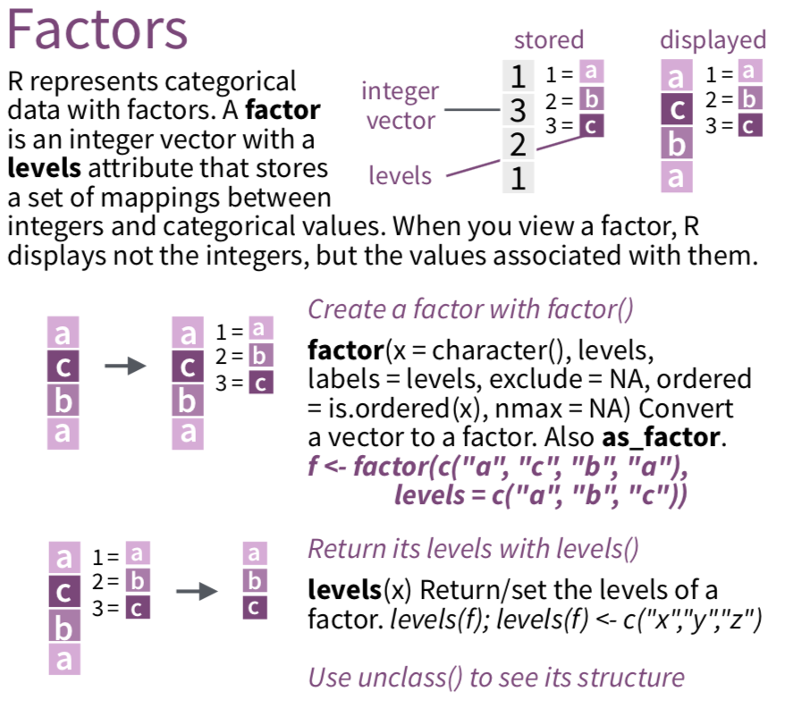

```{r setup, include=FALSE}
options(htmltools.dir.version = FALSE)
options(htmltools.preserve.raw = FALSE)
options(ggrepel.max.overlaps = Inf)

knitr::opts_chunk$set(echo = TRUE, 
                      dev = 'svg',
                      collapse = TRUE, 
                      comment = NA,  # PRINTS IN FRONT OF OUTPUT, default is '##' which comments out output
                      prompt = FALSE, # IF TRUE adds a > before each code input
                      warning = FALSE, 
                      message = FALSE,
                      fig.height = 3, 
                      fig.width = 4,
                      out.width = "100%",
                      prompt = FALSE,
                      rows.print=7
                      )

# load necessary packages
library(tidyverse)
library(countdown)
library(mosaic)
library(ggthemes)
library(xaringanExtra)
library(forcats)
xaringanExtra::use_panelset()
xaringanExtra::use_tachyons()
xaringanExtra::use_clipboard()
xaringanExtra::use_extra_styles(
  hover_code_line = TRUE,         
  mute_unhighlighted_code = TRUE  
)
library(flipbookr)
library(patchwork)
library(DT)
library(moderndive)
library(knitr)
library(grid)
library(gridExtra)
library(ggrepel)
library(lubridate)

# specific packages
library(polite)
library(rvest)
library(stringr)
library(gapminder)
select <- dplyr::select

# Set ggplot theme
# theme_set(theme_stata(base_size = 10))

yt <- 0

# read.csv("https://raw.githubusercontent.com/deepbas/statdatasets/main/agstrat.csv")
```


```{r xaringanExtra-clipboard, echo=FALSE}
htmltools::tagList(
  xaringanExtra::use_clipboard(
    button_text = "<i class=\"fa fa-clipboard\"></i>",
    success_text = "<i class=\"fa fa-check\" style=\"color: #90BE6D\"></i>",
    error_text = "<i class=\"fa fa-times-circle\" style=\"color: #F94144\"></i>"
  ),
  rmarkdown::html_dependency_font_awesome()
)
```


layout: true
  
---

class: title-slide, middle

# .fancy[Factors and Strings]

### .fancy[Fall 2022]

`r format(Sys.Date(), ' %B %d %Y')`

---


# Factors - categorical data

.pull-left-60[
<center></center>

]
.pull-right-40[
<br>
<br>
.bq.font90[
- Clean and order factors with `forcats` package

- Important for visualization, statistical modeling (i.e. for `lm()`), and creating tables

]

]

.footnote[See [`forcats` cheatsheet](https://github.com/rstudio/cheatsheets/raw/master/factors.pdf)
and [`forcats` vignette]()]

---

#  Example - specify levels `fct_relevel()`

.pull-left[
```{r}
mydata <- tibble(
  id = 1:4, 
  grade=c("9th","10th","11th","9th")) %>%
  mutate(grade_fac = factor(grade)) #<<
levels(mydata$grade_fac)
```


```{r}
mydata %>% 
  arrange(grade_fac)
```

]

.pull-right[

```{r}
mydata <- mydata %>% 
  mutate(
    grade_fac = #<<
      fct_relevel(grade_fac, #<<
                  c("9th","10th","11th"))) #<<
levels(mydata$grade_fac)
mydata %>% arrange(grade_fac)
```

]

---

# Example - collapse levels `fct_collapse()`

```{r}
mydata <- tibble(loc = c("SW","NW","NW","NE","SE","SE"))
mydata %>% mutate(
  loc_fac = factor(loc),
  loc2 = fct_collapse(loc_fac,                         # collapse levels #<<
                      south = c("SW","SE"), #<<
                      north = c("NE","NW")), #<<
  loc3 = fct_lump(loc_fac, n=2, other_level = "other") # most common 2 levels + other
  )
```

---

# Example - collapse levels `fct_collapse()`

```{r}
mydata <- tibble(loc = c("SW","NW","NW","NE","SE","SE"))
mydata %>% mutate(
  loc_fac = factor(loc),
  loc2 = fct_collapse(loc_fac,                         # collapse levels 
                      south = c("SW","SE"), 
                      north = c("NE","NW")), 
  loc3 = fct_lump(loc_fac,  #<<
                  n=2,       #<<
                  other_level = "other") # most common 2 levels + other #<<
  )
```

---

## `gss_cat`

> A sample of data from the General Social Survey, a long-running US survey conducted by NORC at the University of Chicago.

.code100[
```{r echo=FALSE}
gss_cat
```
]

---

`r chunk_reveal("gss-religion-tv", font_size_code="90%", title = "## Which religions watch the least TV?")`

```{r gss-religion-tv, fig.width = 3, fig.height = 3.5, out.width = "100%", include=FALSE}
gss_cat %>%
  drop_na(tvhours) %>%
  group_by(relig) %>%
  summarize(tvhours = mean(tvhours)) %>%
  ggplot(aes(tvhours, relig)) +
    geom_point()
```


---

# Which one do you prefer?

```{r gss-religion-oredering, fig.width = 8, fig.height = 3.5, out.width = "100%", echo=FALSE}
p1 <- gss_cat %>%
  drop_na(tvhours) %>%
  group_by(relig) %>%
  summarize(tvhours = mean(tvhours)) %>%
  ggplot(aes(tvhours, relig)) +
    geom_point()

p2 <- gss_cat %>%
  drop_na(tvhours) %>%
  group_by(relig) %>%
  summarize(tvhours = mean(tvhours)) %>%
  ggplot(aes(tvhours, fct_reorder(relig, tvhours))) +
    geom_point() +
  labs(y = "relig")

p1 + p2
```

---


## Why is the y-axis in this order?

```{r echo=FALSE, fig.height = 3.25, fig.width = 4, fig.align='center', out.width = "62%"}
p1
```

---

`r chunk_reveal("levels", font_size_code="90%", title = "## Use levels() to access a factor’s levels")`

.scroll-output-20[
```{r levels, fig.width = 3, fig.height = 3.5, out.width = "100%", include=FALSE}
gss_cat %>% 
  pull(relig) %>% 
  levels() %>% 
  kable()

```
]

---
class: middle 
# Most useful factor skills


## 1. **Reorder** the levels

## 2. **Recode** the levels

## 3. **Collapse** levels

## 4. **Lump** levels


---

`r chunk_reveal("reorder-tv-relig", break_type = "rotate", font_size_code="90%", widths = c(1,1), title = "## Reorder relig by tvhours")`

```{r reorder-tv-relig, echo=FALSE, eval=FALSE}
gss_cat %>%
  drop_na(tvhours) %>%
  group_by(relig) %>%
  summarize(tvhours = mean(tvhours)) %>%
  ggplot(aes(
    x = tvhours, 
    y = relig  #ROTATE
    y = fct_reorder(relig, tvhours)                 #ROTATE
  )) +
    geom_point()
```


---

## Which political leaning watches more TV?


```{r echo=FALSE, fig.height = 3, fig.width = 4, out.width = "50%", fig.align='center'}
gss_cat %>%
   drop_na(tvhours) %>%
   group_by(partyid) %>%
   summarize(tvhours = mean(tvhours)) %>%
   ggplot(aes(tvhours, fct_reorder(partyid, tvhours))) +
     geom_point() +
     labs(y = "partyid")
```

--

.out-t.center[How could we improve the `partyid` labels?]

---

`r chunk_reveal("fct-recode-partyid", widths = c(60, 40), font_size_code="90%", title = "## Recoding partyid with fct_recode()")`


```{r fct-recode-partyid, echo=FALSE, eval=FALSE}
gss_cat %>%
  drop_na(tvhours) %>%
  select(partyid, tvhours) %>%
    mutate(partyid = fct_recode(partyid,
    "Republican, strong"    = "Strong republican",
    "Republican, weak"      = "Not str republican",
    "Independent, near rep" = "Ind,near rep",
    "Independent, near dem" = "Ind,near dem",
    "Democrat, weak"        = "Not str democrat",
    "Democrat, strong"      = "Strong democrat")) %>% 
  group_by(partyid) %>%
  summarize(tvhours = mean(tvhours)) %>%
  ggplot(aes(tvhours, fct_reorder(partyid, tvhours))) +
  geom_point() + 
  labs(y = "partyid")
```

---

`r chunk_reveal("fct-collapse-partyid", widths = c(50, 50), font_size_code="90%", title = "## Collapsing partyid: fct_collapse()")`


```{r fct-collapse-partyid, eval=FALSE, echo=FALSE}
gss_cat %>%
  drop_na(tvhours) %>%
  select(partyid, tvhours) %>%
  mutate(
    partyid = 
      fct_collapse(
        partyid,
        conservative = c("Strong republican", 
                         "Not str republican", 
                         "Ind,near rep"),
        liberal = c("Strong democrat", 
                    "Not str democrat", 
                    "Ind,near dem"))
  ) %>% 
  group_by(partyid) %>%
  summarize(tvhours = mean(tvhours)) %>%
  ggplot(aes(tvhours, fct_reorder(partyid, tvhours))) +
  geom_point() + 
  labs(y = "partyid")
```

```{r include=FALSE}
gss_cat <- gss_cat %>%
  drop_na(tvhours) %>%
  mutate(
    partyid = 
      fct_collapse(
        partyid,
        conservative = c("Strong republican", 
                         "Not str republican", 
                         "Ind,near rep"),
        liberal = c("Strong democrat", 
                    "Not str democrat", 
                    "Ind,near dem"))
  )
```

---

`r chunk_reveal("fct-lump-partyid", widths = c(50, 50), font_size_code="80%", title = "## Lumping partyid: fct_lump()", break_type = "rotate")`


```{r fct-lump-partyid, eval=FALSE, echo=FALSE}
gss_cat %>%
  mutate(partyid = partyid) %>% #ROTATE
  mutate(partyid = fct_lump(partyid, n = 2)) %>% #ROTATE
  mutate(partyid = fct_lump(partyid, n = 2)) %>% #ROTATE
  mutate(partyid = fct_lump(partyid, n = 3)) %>% #ROTATE
  ggplot(aes(x = fct_infreq(partyid))) + 
  geom_bar() +
  theme(axis.text.x = element_text(angle = 20, 
                                  vjust = 1,
                                  hjust=1)) +
  labs(x = "partyid")
```

---

class: action, middle

# <i class="fa fa-pencil-square-o" style="font-size:48px;color:purple">&nbsp;Group&nbsp;Activity&nbsp;`r (yt <- yt + 1)`</i>    


.pull-left-40[

]
.pull-right-60[
<br>
<br>
.bq[
- Let's go over to maize server/ local Rstudio and our class [moodle](https://moodle.carleton.edu/course/view.php?id=39491)
- Get the class activity 12.Rmd file
- Work on problem 1
- Ask me questions
]

]

`r countdown(minutes = 10, seconds = 00, top = 0 , color_background = "inherit", padding = "3px 4px", font_size = "2em")`

---

class: inverse, middle

# .Large[Let's do some more string manipulation!!]


---

class: middle

# Last time: Quantifiers and Special Characters


.pull-left.font90[

Preceding characters are matched ...
..bq.font120[
- .yellow-h[`*`] = 0 or more
- .yellow-h[`?`] = 0 or 1
- .yellow-h[`+`] = 1 or more
- .yellow-h[`{n}`] = exactly n times
]
]
.pull-right.font90[

Matching character types 
.bq.font120[
- .yellow-h[`\\\d`] = digit
- .yellow-h[`\\\s`] = white space
- .yellow-h[`\\\w`] = word
- .yellow-h[`\\\t`] = tab
- .yellow-h[`\\\n`] = newline
]
]

---


class: middle

# More quantifiers

.font120[
> useful when you want to match a pattern a specific number of times
]

.font130[

- .out-t[`{n, }`] = n or more times

- .out-t[`{, m}`] =  at most m times

- .out-t[`{n, m}`] = between n & m times
]

---

class: middle

# Alternatives

.font120[
> useful for matching patterns more flexibly
]

.font130[
- .out-t[`[abc]`] = one of .bold[a], .bold[b], or .bold[c]

- .out-t[`[e-z]`] = a letter from .bold[e] to .bold[z]

- .out-t[`[^abc]`] = anything other than .bold[a], .bold[b], or .bold[c]
]

---

# `str_view_all()`

.code120[
```{r}
name_phone <- c("Moly Robins: 250-999-8878", 
       "Ali Duluth: 416-908-2044", 
       "Eli Mitchell: 204.192.9829", 
       "May Flowers: 250.209.7047")
```
]


```{r}
str_view_all(name_phone,
             pattern = "([2-9][0-9]{2})[.-]([0-9]{3})[.-]([0-9]{4})")
```

---

class: middle

# Replacing strings

.code120[
```{r}
str_replace_all(name_phone,
pattern = "([2-9][0-9]{2})[.-]([0-9]{3})[.-]([0-9]{4})",
replacement = "XXX-XXX-XXXX"
)
```
]

---


# `str_extract_all()`

.font120[
> pull all set of values matching the specified pattern
]

.code120[
```{r}
name_phone <- c("Moly Robins: 250-999-8878", 
                "Ali Duluth: 416-908-2044", 
                "Eli Mitchell: 204-192-9829", 
                "May Flowers: 250-209-7047")
```
]

--

.code120[
```{r}
str_extract_all(name_phone, "[:alpha:]{2,}", simplify = TRUE) 
```
]


---

# Duplicating Groups

.bq[
Use escaped numbers (\\\1, \\\2, etc) to repeat a group based on position
]

--

Which numbers have the same 1st and 3rd digits?

.code120[
```{r}
phone_numbers <- c("515 111 2244", "310 549 6892", "474 234 7548")
str_view(phone_numbers, "(\\d)\\d\\1")
```
]

---


# Repetition using `?`

.code120[
```{r}
aboutMe <- c("my SSN is 536-76-9423 and my age is 55")
```
]

.code120[
```{r, collapse=TRUE}
str_view_all(aboutMe, "\\s\\d?") # space followed by 0 or 1 digit
```

]

---

# Repetition using `+`

.code120[
```{r}
aboutMe <- c("my SSN is 536-76-9423 and my age is 55")
```
]

.code120[
```{r, , collapse=TRUE}
str_view_all(aboutMe, "\\s\\d+")  # space followed by 1 or more digits
```
]

---

# Repetition using `*`

.code120[
```{r}
aboutMe <- c("my SSN is 536-76-9423 and my age is 55")
```
]

.code120[
```{r, , collapse=TRUE}
str_view_all(aboutMe, "\\s\\d*")  # space followed by 0 or more digits

```
]

---


class: action, middle

# <i class="fa fa-pencil-square-o" style="font-size:48px;color:purple">&nbsp;Group&nbsp;Activity&nbsp;`r (yt <- yt + 1)`</i>    


.pull-left-40[

]
.pull-right-60[
<br>
.font120.bq[
- Go back to the activity file
- Work on problem 2
- Ask me questions
]


]

`r countdown(minutes = 10, seconds = 00, top = 0 , color_background = "inherit", padding = "3px 4px", font_size = "2em")`


