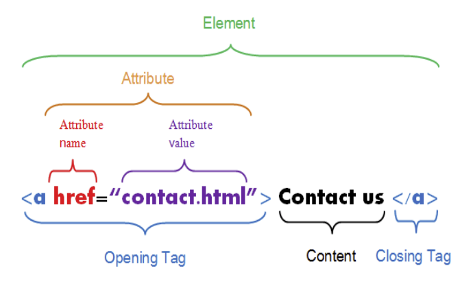
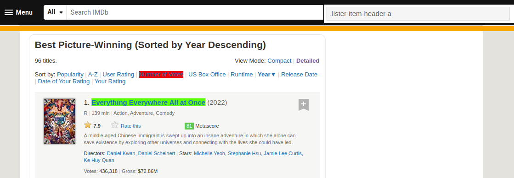
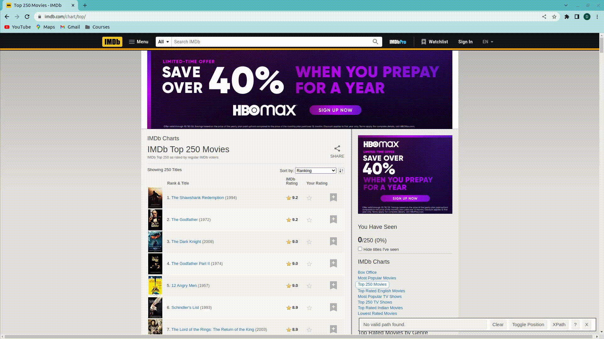

```{r setup, include=FALSE}
options(htmltools.dir.version = FALSE)
options(htmltools.preserve.raw = FALSE)
options(ggrepel.max.overlaps = Inf)

knitr::opts_chunk$set(echo = TRUE, 
                      dev = 'svg',
                      collapse = TRUE, 
                      comment = NA,  # PRINTS IN FRONT OF OUTPUT, default is '##' which comments out output
                      prompt = FALSE, # IF TRUE adds a > before each code input
                      warning = FALSE, 
                      message = FALSE,
                      fig.height = 3, 
                      fig.width = 4,
                      out.width = "100%",
                      prompt = FALSE,
                      rows.print=7
                      )

# load necessary packages
library(tidyverse)
library(countdown)
library(mosaic)
library(ggthemes)
library(xaringanExtra)
library(forcats)
xaringanExtra::use_panelset()
xaringanExtra::use_tachyons()
xaringanExtra::use_clipboard()
xaringanExtra::use_extra_styles(
  hover_code_line = TRUE,         
  mute_unhighlighted_code = TRUE  
)
library(flipbookr)
library(patchwork)
library(DT)
library(moderndive)
library(knitr)
library(grid)
library(gridExtra)
library(ggrepel)
library(lubridate)

# specific packages
library(polite)
library(rvest)
library(stringr)
library(gapminder)
select <- dplyr::select

# Set ggplot theme
# theme_set(theme_stata(base_size = 10))

yt <- 0

# read.csv("https://raw.githubusercontent.com/deepbas/statdatasets/main/agstrat.csv")

webpage <- read_html('https://www.imdb.com/search/title/?groups=best_picture_winner&sort=year,desc&count=100&view=advanced')

title_data <- webpage %>% 
  html_nodes(".lister-item-header a") %>% 
  html_text()

year_data <- html_nodes(webpage, '.text-muted.unbold') %>% 
  html_text() %>%
  parse_number()

description_data <- html_nodes(webpage,'.ratings-bar+ .text-muted') %>% 
  html_text() %>% 
  str_trim()
head(description_data,3)

runtime_data <- html_nodes(webpage,'.text-muted .runtime') %>% 
  html_text() %>% 
  str_replace_all(" min", "") %>% 
  as.numeric()

rating_data <- html_nodes(webpage,'.ratings-imdb-rating strong') %>% 
  html_text() %>% 
  as.numeric()

votes_data <- html_nodes(webpage,'.sort-num_votes-visible span:nth-child(2)') %>% 
  html_text() %>% 
  str_replace_all(",", "") %>%
  as.numeric()

movies_df <- data.frame(Year = year_data,
                      Title = title_data,
                      Description = description_data, 
                      Runtime = runtime_data,
                      Rating = rating_data,
                      Votes = votes_data) %>% as_tibble()


page <- read_html("http://www.imdb.com/chart/tvmeter")
name <- page %>%
  html_nodes(".titleColumn a") %>%
  html_text()

ranks <- page %>%
  html_nodes(".velocity") %>%
  html_text() %>%
  str_extract("\\d+") %>%
  as.numeric()

scores <-  page %>%
  html_nodes(".imdbRating") %>%
  html_text() %>%
  str_extract("\\d+.\\d+") %>%
  as.numeric()

# If you don't use the gadget selector carefully, 
# there is more string manipulation needed here
years <- page %>%
  html_nodes("a+ .secondaryInfo") %>%
  html_text() %>%
  str_extract("\\d+") %>%
  as.numeric()

tvshows <- tibble(
  rank = ranks,
  name = name,
  score = scores,
  year = years
)


xaringanExtra::style_panelset_tabs(
  active_foreground = "#0051BA",
  hover_foreground = "#d22",
  font_family = "Roboto"
)

```


```{r xaringanExtra-clipboard, echo=FALSE}
htmltools::tagList(
  xaringanExtra::use_clipboard(
    button_text = "<i class=\"fa fa-clipboard\"></i>",
    success_text = "<i class=\"fa fa-check\" style=\"color: #90BE6D\"></i>",
    error_text = "<i class=\"fa fa-times-circle\" style=\"color: #F94144\"></i>"
  ),
  rmarkdown::html_dependency_font_awesome()
)
```


layout: true
  
---

class: title-slide, middle

# .fancy[Web Scraping]

### .fancy[Stat 220]

`r format(Sys.Date(), ' %B %d %Y')`

---

class: inverse, middle

.Large[Web scraping]


.bql.Large[
the process of downloading, parsing, and extracting data presented in an HTML file and then converting it into a structured format that allows us to analyze it.]


---

class: middle

# .purple[Two different scenarios:]

.font100.bq[
1. .bold[Screen scraping:] extract data from source code of website, with html parser (easy) or regular expression matching (less easy).

2. .bold[Web APIs (application programming interface):] website offers a set of structured http requests that return JSON or XML files.
]

<!-- API is a messenger that takes requests, and then returns a response back to you -->
---

class: middle


background-image: url("images/polite.png") 
background-position: left 
background-size: 300px, 90% 90%

##  `polite` package


.pull-right-60[


.bq[

- Two main functions `bow` and `scrape` define and realize a web harvesting session
- Builds on awesome toolkits for defining and managing http sessions using `rvest`
]
]


.footnote[[Polite Documentation](https://www.rdocumentation.org/packages/polite/versions/0.1.2)]

---


class: center, inverse, top
background-image: url("images/mncorn.png")
background-size: cover

--

<br>
<br>
<br>

## .yellow.font150[Can we scrape this webpage?]


---

class: middle


# `polite`:: bow() 


.font120[
```{r}
session <- bow("https://www.mncorn.org/corn-facts/", 
               user_agent = "data enthusiast")
```

```{r, highlight.output = 5}
session
```


]


---

class: middle

# `polite`:: scrape()

.font120[
```{r}
session <- session %>%
  scrape()
```
]

```{r, highlight.output = 2}
session
```


---

class: middle

# HyperText Markup Language (HTML)

<!-- 

- Each line of code tells the browser how to show every element in your display by assigning tags to each component within the body tag. -->

<!-- - Most of the data on the web is still largely available as HTML -->

.bqt.font80[HTML page consists of series of elements which browsers use to interpret how to display the content]




<!--
- Contains all the metadata inside the head tag

- Only need to understand the document’s body tag as there’s where the content we want to scrape resides.

-->


---

## HyperText Markup Language (HTML)

.bqt.font100[While it is structured (hierarchical/tree based) it often is not available in a form useful for analysis (flat/tidy).]

<br>

.font120[
```html
<html>
  <head>
    <title>This is a title</title>
  </head>
  <body>
    <p align="center">Hello world!</p>
  </body>
</html>
```
]

.footnote[Try HTML code yourself by clicking [here](https://www.w3schools.com/html/tryit.asp?filename=tryhtml_default_default)]

---

## HTML tags

> HTML uses `tags` to describe different aspects of document content

<br>
<br>

.font120[
Tag         |  Example
------------|---------------------------------------------------------------
heading     | `<h1>My Title</h1>`
paragraph   | `<p>A paragraph of content...</p>`
table       | `<table> ... </table>`
anchor (with attribute)     | `<a href="https://www.mncorn.org/">click here for link</a>`
]

---

class: middle

.pull-left-40[


]

.pull-right-60[
# `Rvest`: collection of functions that make basic processing and manipulation of HTML data straight forward.
]


.font100[
Function      | Description
--------------|---------------------------------------------
`read_html`   | Read HTML data from a url or character string
`html_node `  | Select a specified node from HTML document
`html_nodes`  | Select specified nodes from HTML document
`html_table`  | Parse an HTML table into a data frame
`html_text`   | Extract tag pairs' content
`html_name`   | Extract tags' names
`html_attrs`  | Extract all of each tag's attributes
`html_attr`   | Extract tags' attribute value by name

]

---

background-image: url(images/f1_drivers.png)
background-position: center
background-size: 80%

<br>
<br>
<br>
<br>
<br>
<br>

# .center[https://en.wikipedia.org/wiki/List_of_Formula_One_drivers]

---

`r chunk_reveal("demo1", widths = c(40, 60), font_size_code="90%", title = "## Demo: read tables into R")`

```{r,demo1, eval=FALSE, echo=FALSE }
bow("https://en.wikipedia.org/wiki/List_of_Formula_One_drivers") %>%
  scrape() %>% 
  html_table() %>%
  purrr::pluck(3) 
```

---

class: middle, inverse

# CSS 

.bql[
- CSS (Cascading Style Sheets) is a language that describes how HTML elements should be displayed. 

- .bold[CSS selectors:] 

  * shortcuts for selecting HTML elements to style  
  * can also be used to extract the content of these elements

]

---

# SelectorGadget

.bq.font80[SelectorGadget is a point-and-click CSS selector, specifically for .bold[Chrome],  and it comes as a [Chrome Extension](https://chrome.google.com/webstore/detail/selectorgadget/mhjhnkcfbdhnjickkkdbjoemdmbfginb) .red[(Click to install!)]
]

<br>



.footnote[Click [here](https://www.w3schools.com/cssref/css_selectors.asp) for a list of selectors ]
---

## SelectorGadget: select all elements that are related to that object. Next, de-select anything in yellow you do not want


<center>

</center>

---

class: middle

## Read HTML into R

.code80[
```{r}
MinnesotaVikings <- bow("https://www.pro-football-reference.com/teams/min/2023.htm") %>% 
  scrape()
```
]

.code100[
```{r}
MinnesotaVikings
```
]

.footnote[Click [here]("https://www.pro-football-reference.com/teams/min/2023.htm) to go to webpage]


---

.panelset[

.panel[

.panel-name[Code]
```{r, eval=FALSE}
MinnesotaVikings <- bow("https://www.pro-football-reference.com/teams/min/2023.htm") %>% 
  scrape()

Team_Stats <- MinnesotaVikings %>% 
  html_elements("#div_team_stats") %>% 
  html_table() %>% .[[1]]

library(magrittr) 
Team_Stats %<>% #  %<>% which allows for direct assignment within the pipe
  set_names(.[1, ]) %>% # Set column names to the first row
  janitor::clean_names() %>% # Clean names
  slice(-1) %>% # Remove the first row
  mutate(across(everything(), ~na_if(.x, ""))) %>% # Convert any empty strings to NA
  type.convert(as.is = TRUE) # Convert columns to their most appropriate type

Team_Stats %>% knitr::kable(caption = "Scrapped data for various team stats") 
```
]

.panel[

.panel-name[Data]
```{r, echo=FALSE}
MinnesotaVikings <- bow("https://www.pro-football-reference.com/teams/min/2023.htm") %>% 
  scrape()

Team_Stats <- MinnesotaVikings %>% 
  html_elements("#div_team_stats") %>% 
  html_table() %>% .[[1]]

library(magrittr) 
Team_Stats %<>% #  %<>% which allows for direct assignment within the pipe
  set_names(.[1, ]) %>% # Set column names to the first row
  janitor::clean_names() %>% # Clean names
  slice(-1) %>% # Remove the first row
  mutate(across(everything(), ~na_if(.x, ""))) %>% # Convert any empty strings to NA
  type.convert(as.is = TRUE) # Convert columns to their most appropriate type

Team_Stats %>% knitr::kable(caption = "Scrapped data for various team stats") 
```

]

]


---

class: action, middle

# <i class="fa fa-pencil-square-o" style="font-size:48px;color:purple">&nbsp;Group&nbsp;Activity&nbsp;`r (yt <- yt + 1)`</i>    


.pull-left-40[

]
.pull-right-60[
<br>
.bql[
- Let's go over to maize server/ local Rstudio and our class [moodle](https://moodle.carleton.edu/course/view.php?id=41417)
- Get the class activity 16.Rmd file
- Work on activity 1
- Ask me questions
]

]

`r countdown(minutes = 20, seconds = 00, top = 0 , color_background = "inherit", padding = "3px 4px", font_size = "2em")`


