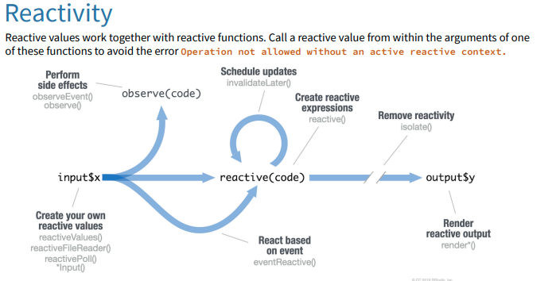

```{r setup, include=FALSE}
options(htmltools.dir.version = FALSE)
options(htmltools.preserve.raw = FALSE)
options(ggrepel.max.overlaps = Inf)

knitr::opts_chunk$set(echo = TRUE, 
                      dev = 'svg',
                      collapse = TRUE, 
                      comment = NA,  # PRINTS IN FRONT OF OUTPUT, default is '##' which comments out output
                      prompt = FALSE, # IF TRUE adds a > before each code input
                      warning = FALSE, 
                      message = FALSE,
                      fig.height = 3, 
                      fig.width = 4,
                      out.width = "100%",
                      prompt = FALSE,
                      rows.print=7
                      )


# load necessary packages
library(tidyverse)
library(ggplot2)
library(countdown)
library(ggthemes)
library(xaringanExtra)
xaringanExtra::use_panelset()
xaringanExtra::use_tachyons()
library(flipbookr)
library(htmlwidgets)
library(lubridate)

library(kableExtra)
library(fontawesome)
library(rvest)
library(forcats)
library(patchwork)
library(polite)
library(DT)
library(polite)
library(purrr)
library(leaflet)
library(maptools)
library(maps)     
library(sp)       
library(maptools) 
library(mapdata)
library(ggiraph)

select <- dplyr::select

# Set ggplot theme
# theme_set(theme_stata(base_size = 10))

yt <- 0

```


```{r xaringanExtra-clipboard, echo=FALSE}
htmltools::tagList(
  xaringanExtra::use_clipboard(
    button_text = "<i class=\"fa fa-clipboard\"></i>",
    success_text = "<i class=\"fa fa-check\" style=\"color: #90BE6D\"></i>",
    error_text = "<i class=\"fa fa-times-circle\" style=\"color: #F94144\"></i>"
  ),
  rmarkdown::html_dependency_font_awesome()
)
```


layout: true
  
---

class: title-slide, middle

# .fancy[Shiny Reactivity]

### .fancy[Spring 2023]

`r format(Sys.Date(), ' %B %d %Y')`


---

class: middle


# Shiny reactivity

<center>
 <br>
<a>Shiny reactivity 101</a>
</center>


.footnote[[Shiny reactivity](https://shiny.rstudio.com/articles/understanding-reactivity.html)]


---

class: middle

# `Shiny Reactivity:` Responding to User Input


.bql[
- Shiny .b[reactivity] is a system for managing data dependencies and updates in response to user input.

- Unlike typical R code, Shiny apps are .b[event-driven] and react to user interactions.

- Shiny monitors events and .b[triggers] the necessary code to update the app's state and output.
]


.footnote[[Understanding reactivity in R](https://shiny.rstudio.com/articles/understanding-reactivity.html)]

---

class: middle

# Reactive Expressions: Connecting Inputs and Outputs

.hljs.center[ "Reactive expressions transform reactive inputs into reactive outputs."]

.bql[
- .b[Reactive expressions] are the building blocks of Shiny reactivity.

- They are used to manage data dependencies and cache results.

- They automatically update when input values change, ensuring your app stays up-to-date.
]

---

class: middle

# Examples of common use cases

.bqt[
- Accessing a database based on user input.
- Reading data from a file when the user selects a new file.
- Downloading data over the network in response to user actions.
- Performing expensive computations that depend on user input.
]


---

class: middle

# Reactive values: Storing and Sharing Data

.hljs["Reactive values contain values that can be read by other reactive objects."]

.pull-left-40[
.bql.font90[
- .b[Reactive values] allow you to store and share data across different parts of your Shiny app.
- The input object is a special instance of .b[ReactiveValues] that holds user inputs.
]
]

.pull-right-60[
```
library(shiny)
ui <- fluidPage(
  titlePanel("Updating Plot Based on User Input"),
  sidebarLayout(
    sidebarPanel(
      numericInput("obs", "Number of observations:", 
                   value = 100, min = 1)
    ),
    mainPanel( plotOutput("distPlot"))
  )
)
server <- function(input, output) {
  output$distPlot <- renderPlot({
    hist(rnorm(input$obs))
  })
}
shinyApp(ui, server)
```

]

---


class: middle

# Triggering reactivity with `eventReactive()`

.pull-left[
.bql.font90[
- `eventReactive()` is used to create reactive expressions that only update when a specific event occurs.
- It takes an input, typically an action button, to trigger the update.
- Useful for controlling when calculations or updates occur, reducing unnecessary computation.
]
]


.pull-right[
```
ui <- fluidPage(
  mainPanel(
    actionButton("addButton", "Add 1"),
    textOutput("result")
  )
)

server <- function(input, output) {
  sum_so_far <- eventReactive(input$addButton, {
    if (is.null(input$addButton)) {
      0
    } else {
      input$addButton
    }
  })

  output$result <- renderText({
    paste("Sum so far:", sum_so_far())
  })
}

shinyApp(ui, server)
```
]

---

class: middle

# `actionButton()`: Triggering Actions on Demand

.hljs["actionButton() creates a button that lets users manually trigger reactive events."]


.pull-left[
.bql.font70[
- Use `actionButton()` to create a button in the UI that users can click to trigger specific actions.

- Combine with `eventReactive()` to execute code only when the button is clicked.

- Ideal for cases where you want to give users control over when certain actions are executed, rather than updating automatically.

]

]


.pull-right[

```
ui <- fluidPage(
  mainPanel(
    numericInput("obs", "Number of observations", value = 100, min = 1),
    actionButton("updateButton", "Update Plot"),
    plotOutput("distPlot")
  )
)

server <- function(input, output) {
  data_to_plot <- eventReactive(input$updateButton, {
    rnorm(input$obs)
  })

  output$distPlot <- renderPlot({
    hist(data_to_plot())
  })
}

shinyApp(ui, server)

```

]

---


class: middle

# Storing and managing state with `reactiveValues()`

.pull-left-40[
.bql.font80[
- `reactiveValues()` is used to create mutable, reactive objects.
- They can store multiple named values that can be updated independently.
- Useful for managing complex state or sharing data between multiple reactive expressions.
]
]

.pull-right-60[
```
ui <- fluidPage(
  mainPanel(
    numericInput("numInput", "Enter a number:", value = 1),
    actionButton("incrementButton", "Increment"),
    textOutput("incrementedValue")
  )
)
server <- function(input, output) {
  values <- reactiveValues(num = 1)
  incrementedValue <- reactive({
    if (input$incrementButton > 0) {
      values$num <- input$numInput + input$incrementButton
    }
    values$num
  })
  output$incrementedValue <- renderText(paste("Incremented value:", 
  incrementedValue()))
}
shinyApp(ui, server)
```

]

---

class: middle

# Observers: Responding to Changes in Reactive Values
.hljs[`observeEvent()` is used to create observers that react to specific events, often triggered by user interactions like button clicks.
]

.pull-left-40[

.bql.font80[
- Executes code in response to a specified event
- Can be used with `actionButton()` to perform actions when a button is clicked
- Doesn't return a value, but causes side effects (e.g., updating output or triggering other reactive expressions)
]
]


.pull-right-60[
```
ui <- fluidPage(
  mainPanel(
    actionButton("showAlert", "Show Alert"),
    textOutput("alertCount")
  )
)
server <- function(input, output) {
  alert_counter <- reactiveValues(count = 0)
  observeEvent(input$showAlert, {
    showModal(modalDialog(
      title = "Alert",
      "This is an alert message!"
    ))
    alert_counter$count <- alert_counter$count + 1
  })
  output$alertCount <- renderText({
    paste("Number of alerts shown:", alert_counter$count)
  })
}
shinyApp(ui, server)
```


]


---

class: middle

# Controlling reactivity with `isolate()`

.pull-left-40[
.bql.font80[
- The `isolate()` function is used to prevent reactivity within a reactive context.
- It allows you to use an input or reactive value without triggering a reaction.
- Useful when you want to control when a reactive expression or output updates.
]
]

.pull-right-60[
```
ui <- fluidPage(
  mainPanel(
    textInput("textInput", "Enter some text"),
    actionButton("submitButton", "Submit"),
    textOutput("outputText")
  )
)

server <- function(input, output) {
  observeEvent(input$submitButton, {
    output$outputText <- renderText({
      paste("You submitted:", isolate(input$textInput))
    })
  })
}

shinyApp(ui, server)

```

]


---

class: action, middle

# <i class="fa fa-pencil-square-o" style="font-size:48px;color:purple">&nbsp;Group&nbsp;Activity&nbsp;`r (yt <- yt + 1)`</i>    


.pull-left-40[

]
.pull-right-60[
<br>
.bql[
- Let's go over to maize server/ local Rstudio and our class [moodle](https://moodle.carleton.edu/course/view.php?id=41417)
- Get the class activity 19.Rmd file
- Let's work on the class activity together
- Ask me questions
]

]

`r countdown(minutes = 15, seconds = 00, top = 0 , color_background = "inherit", padding = "3px 4px", font_size = "2em")`
