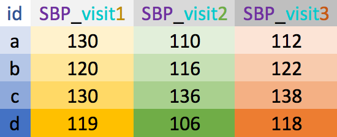
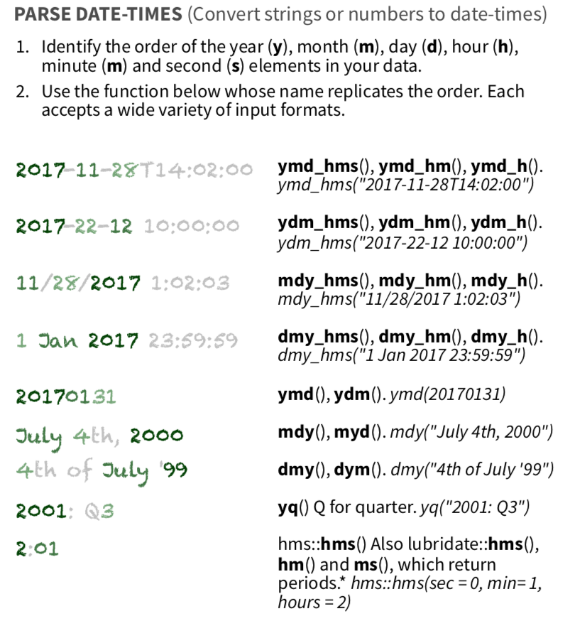

```{r setup, include=FALSE}
options(htmltools.dir.version = FALSE)
options(htmltools.preserve.raw = FALSE)
options(ggrepel.max.overlaps = Inf)

knitr::opts_chunk$set(echo = TRUE, 
                      dev = 'svg',
                      collapse = TRUE, 
                      comment = NA,  # PRINTS IN FRONT OF OUTPUT, default is '##' which comments out output
                      prompt = FALSE, # IF TRUE adds a > before each code input
                      warning = FALSE, 
                      message = FALSE,
                      fig.height = 3, 
                      fig.width = 4,
                      out.width = "100%",
                      prompt = FALSE,
                      rows.print=7
                      )

# load necessary packages
library(tidyverse)
library(dplyr)
library(countdown)
library(mosaic)
library(ggthemes)
library(xaringanExtra)
library(forcats)
xaringanExtra::use_panelset()
xaringanExtra::use_tachyons()
xaringanExtra::use_clipboard()
xaringanExtra::use_extra_styles(
  hover_code_line = TRUE,         
  mute_unhighlighted_code = TRUE  
)
library(flipbookr)
library(patchwork)
library(DT)
library(moderndive)
library(knitr)
library(grid)
library(gridExtra)
library(palmerpenguins)
library(broom)
library(ggResidpanel)
library(ggrepel)
library(lubridate)

# specific packages
library(maps)
library(maptools)
library(polite)
library(rvest)
library(stringr)
select <- dplyr::select

# Set ggplot theme
# theme_set(theme_stata(base_size = 10))

yt <- 0

# read.csv("https://raw.githubusercontent.com/deepbas/statdatasets/main/agstrat.csv")


# data

BP_wide <- tibble(id = letters[1:4],
                     sex = c("F", "M", "M", "F"),
                     SBP_v1 = c(130, 120, 130, 119),
                     SBP_v2 = c(110, 116, 136, 106),
                     SBP_v3 = c(112, 122, 138, 118))

```


```{r xaringanExtra-clipboard, echo=FALSE}
htmltools::tagList(
  xaringanExtra::use_clipboard(
    button_text = "<i class=\"fa fa-clipboard\"></i>",
    success_text = "<i class=\"fa fa-check\" style=\"color: #90BE6D\"></i>",
    error_text = "<i class=\"fa fa-times-circle\" style=\"color: #F94144\"></i>"
  ),
  rmarkdown::html_dependency_font_awesome()
)
```


layout: true
  
---

class: title-slide, middle

# .fancy[Tidy Data and Dates]

### .fancy[Spring 23]

`r format(Sys.Date(), ' %B %d %Y')`

---

# What are tidy data?

.hljs.font80[
1. Each .yellow-h[variable] forms a column
2. Each .yellow-h[observation] forms a row 
3. Each .yellow-h[value] has its own cell
]


.footnote[[G. Grolemond & H. Wickham's R for Data Science](https://r4ds.had.co.nz/tidy-data.html)]


---


.pull-left[## Untidy data: example 1

```{r, eval=FALSE}
untidy_data <- tibble(
  name = c("Ana","Bob","Cara"),
  wt_07_01_2021 = c(100, 150, 140),
  wt_08_01_2021 = c(104, 155, 138),
  wt_09_01_2021 = c(NA, 160, 142)
)
```

```{r, echo=FALSE}
untidy_data <- tibble(
  name = c("Ana","Bob","Cara"),
  wt_07_01_2021 = c(100, 150, 140),
  wt_08_01_2021 = c(104, 155, 138),
  wt_09_01_2021 = c(NA, 160, 142)
)
untidy_data
```

]

--

.pull-right[## Tidy data: example 1

```{r}
library(lubridate)  # for date manipulations
library(stringr) # for string manipulations
untidy_data %>% 
  pivot_longer(names_to = "date",  
               values_to = "weight", 
               cols = -name) %>%
  mutate(date = stringr::str_remove(date,"wt_"), 
         date = lubridate::dmy(date))    
```
]

---

## Wide vs. long data

.bqt.font70[
- .bold[Wide] data has one row per subject, with multiple columns for their repeated measurements
- .bold[Long] data has multiple rows per subject, with one column for the measurement variable and another indicating from when/where the repeated measures are from
]

.pull-left[
<br>
<center> 
<br>
wide
</center>
]
.pull-right[
<center>
<br>
long
</center>
]

---


# Wide to long: `pivot_longer()`

.pull-left[

```{r}
BP_wide
```

]

.pull-right[

```{r}
BP_long <- BP_wide %>%
  pivot_longer(names_to = "visit",   #<<
               values_to = "SBP",  #<<
               cols = SBP_v1:SBP_v3)   #<<
BP_long
```
]

---

class: middle

# Wide to long: `pivot_longer()`

.hljs[`pivot_longer`  lengthens data, increasing the number of rows and decreasing the number of columns.]

<br>


.bql.font90[Need to **specify**:

- *new column names*

  - .b[names_to]: stores row names of wide data's columns 
  - .b[values_to]: stores data values
  
- *which columns to pivot*
]


---

class: middle


# Long to wide: `pivot_wider()`


.pull-left-40[
```{r}
BP_long
```

]
.pull-right-60[


```{r}
BP_wide1 <- BP_long %>% 
  pivot_wider(names_from = "visit", #<<
              values_from = "SBP") #<<
BP_wide1
```
]

---

class: middle

# Long to wide: `pivot_wider()`

.hljs[`pivot_wider`  increases number of columns and decreases the number of rows.]

.bql.font90[Need to **specify**:

- *new column names*

  + .b[names_from]: get the name of the column 
  + .b[values_from]: get the cell values from
]

---

class: middle

# Separate Info

.pull-left[

```{r}
BP_long
```

]

.pull-right[
```{r}
BP_long1 <- BP_long %>%
  separate(visit, c("acrnym", "visit")) #<<
BP_long1
```

]

---

# `readr::parse_number()`

.hljs[**Goal**: Extract first number from the visit column and remove the characters]

.pull-left-40[
```{r}
BP_long
```

]

--

.pull-right[

```{r}
BP_long2 <- BP_long %>% 
  mutate(visit = parse_number(visit)) #<<
BP_long2
```
]


---

# Make cleaned-up long data wide

.pull-left[
```{r}
head(BP_long2, 4)
```

```{r}
BP_wide2 <- BP_long2 %>% 
  pivot_wider(names_from = "visit", #<<
              values_from = "SBP") #<<
BP_wide2
```
]

--

.pull-right[

.b[Problem]: have numbers as column names  
.b[Solution]: have row names start with the `key` column's name separated by a character


```{r}
BP_wide3 <- BP_long2 %>% 
  pivot_wider(names_from = "visit",     
              values_from = "SBP",      
              names_prefix = "value_")  
BP_wide3
```

]

---


class: action, middle

# <i class="fa fa-pencil-square-o" style="font-size:48px;color:purple">&nbsp;Group&nbsp;Activity&nbsp;`r (yt <- yt + 1)`</i>    


.pull-left-40[

]
.pull-right-60[
<br>
.bql[
- Let's go over to maize server/ local Rstudio and our class [moodle](https://moodle.carleton.edu/course/view.php?id=41417)
- Get the class activity 8.Rmd file
- Work on your turn 1
]

]

`r countdown(minutes = 10, seconds = 00, top = 0 , color_background = "inherit", padding = "3px 4px", font_size = "2em")`

---


# Dates with `lubridate`

.pull-left[
<br>
.bql.font80[
- Convert characters to special "Date" type

- Easy date magic examples:

    + add and subtract dates
    + convert to minutes/years/etc
    + change timezones
    + add 1 month to a date...
]
]


.pull-right[
<center><a href="https://github.com/allisonhorst/stats-illustrations"><br>Allison Horst</a>
</center>
]

.footnote[[`lubridate` cheat sheet](https://www.rstudio.com/resources/cheatsheets/#lubridate)]


---

class: middle

## What kind of date do you have?


<center></center>
[`lubridate` cheat sheet](https://www.rstudio.com/resources/cheatsheets/#lubridate)

---

class: middle

# Parsing Complex Dates


```{r}
complex_dates <- tibble(
  name = c("Yi", "Mo", "Dee"),
  dob = c("31-October-1952 14:30:15",
          "12-Jan-1984 22:15:00",
          "02-Feb-2002 10:45:30")
)

complex_dates %>%
  mutate(
    dob_date = dmy_hms(dob),
  ) %>% knitr::kable()
```


---

class: middle

# Advanced Date Arithmetic


```{r}
complex_dates %>%
  mutate(
    dob_date = dmy_hms(dob),
    dob_year = year(dob_date),
    time_since_birth = interval(dob_date, now()),
    age_exact = as.duration(time_since_birth) / dyears(1),
  ) %>% knitr::kable()
```

---

class: middle

# Creating Date-Time Objects with `make_datetime()`

.pull-left-40[
```{r}
# Components of date and time
year_component <- 2023
month_component <- 3
day_component <- 23
hour_component <- 18
minute_component <- 45
second_component <- 30
```
]
.pull-right-60[
```{r}
# Using make_datetime() to create a date-time object
date_time_object <- make_datetime(
  year = year_component,
  month = month_component,
  day = day_component,
  hour = hour_component,
  min = minute_component,
  sec = second_component
)
```
]


```{r}
date_time_object %>% knitr::kable()
```

---

# Combining Date and Time Objects

```{r}
date_only <- ymd("2023-03-23")
time_only <- hms("18:45:30")

date_time_combined <- make_datetime(
  year = year(date_only),
  month = month(date_only),
  day = day(date_only),
  hour = hour(time_only),
  min = minute(time_only),
  sec = second(time_only)
)

date_time_combined %>% knitr::kable()
```


---

class: middle

# Extracting Components from Date-Time Objects

```{r}
date_components <- tibble(
  date_time = ymd_hms("2023-03-23 18:45:30")
)

date_components %>%
  mutate(
    year = year(date_time),
    month = month(date_time, label = TRUE),
    day = day(date_time),
    hour = hour(date_time),
    minute = minute(date_time),
    second = second(date_time)
  ) %>% knitr::kable()
```

---


# Advanced Date-Time Arithmetic with Periods


```{r}
date_periods <- tibble(
  date = ymd("2023-01-31")
)

date_periods %>%
  mutate(
    add_month = date + month(1),
    add_year = date + years(1),
    subtract_week = date - weeks(1)
  ) %>% knitr::kable()
```


---

# Duration and Time Differences


```{r}
time_diff_example <- tibble(
  start_date = ymd("2023-01-01"),
  end_date = ymd("2023-12-31")
)

time_diff_example %>%
  mutate(
    time_diff = end_date - start_date,
    duration_days = as.duration(time_diff),
    duration_weeks = duration_days / dweeks(1),
    duration_months = duration_days / dmonths(1),
    duration_years = duration_days / dyears(1)
  )  %>% knitr::kable()
```


---

class: action, middle

# <i class="fa fa-pencil-square-o" style="font-size:48px;color:purple">&nbsp;Group&nbsp;Activity&nbsp;`r (yt <- yt + 1)`</i>    


.pull-left-40[

]
.pull-right-60[
<br>
<br>
.bql[
- Work on your turn 2
- Ask me questions
]
]

`r countdown(minutes = 10, seconds = 00, top = 0 , color_background = "inherit", padding = "3px 4px", font_size = "2em")`

