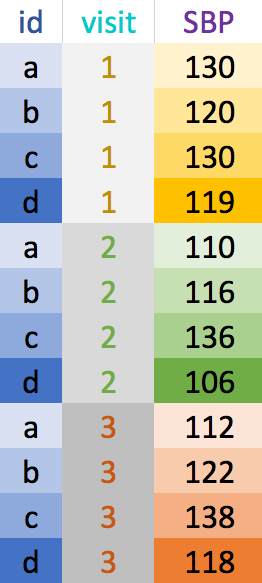

```{r setup, include=FALSE}
options(htmltools.dir.version = FALSE)
options(htmltools.preserve.raw = FALSE)
options(ggrepel.max.overlaps = Inf)

knitr::opts_chunk$set(echo = TRUE, 
                      dev = 'svg',
                      collapse = TRUE, 
                      comment = NA,  # PRINTS IN FRONT OF OUTPUT, default is '##' which comments out output
                      prompt = FALSE, # IF TRUE adds a > before each code input
                      warning = FALSE, 
                      message = FALSE,
                      fig.height = 3, 
                      fig.width = 4,
                      out.width = "100%",
                      prompt = FALSE,
                      rows.print=7
                      )

# load necessary packages
library(tidyverse)
library(dplyr)
library(countdown)
library(mosaic)
library(ggthemes)
library(xaringanExtra)
library(forcats)
xaringanExtra::use_panelset()
xaringanExtra::use_tachyons()
xaringanExtra::use_clipboard()
xaringanExtra::use_extra_styles(
  hover_code_line = TRUE,         
  mute_unhighlighted_code = TRUE  
)
library(flipbookr)
library(patchwork)
library(DT)
library(moderndive)
library(knitr)
library(grid)
library(gridExtra)
library(palmerpenguins)
library(broom)
library(ggResidpanel)
library(ggrepel)
library(lubridate)

# specific packages
library(maps)
library(maptools)
library(polite)
library(rvest)
library(stringr)
select <- dplyr::select

# Set ggplot theme
# theme_set(theme_stata(base_size = 10))

yt <- 0

# read.csv("https://raw.githubusercontent.com/deepbas/statdatasets/main/agstrat.csv")


# data

BP_wide <- tibble(id = letters[1:4],
                     sex = c("F", "M", "M", "F"),
                     SBP_v1 = c(130, 120, 130, 119),
                     SBP_v2 = c(110, 116, 136, 106),
                     SBP_v3 = c(112, 122, 138, 118))

```


```{r xaringanExtra-clipboard, echo=FALSE}
htmltools::tagList(
  xaringanExtra::use_clipboard(
    button_text = "<i class=\"fa fa-clipboard\"></i>",
    success_text = "<i class=\"fa fa-check\" style=\"color: #90BE6D\"></i>",
    error_text = "<i class=\"fa fa-times-circle\" style=\"color: #F94144\"></i>"
  ),
  rmarkdown::html_dependency_font_awesome()
)
```


layout: true
  
---

class: title-slide, middle

# .fancy[Tidy Data]

### .fancy[Fall 2022]

`r format(Sys.Date(), ' %B %d %Y')`

---

# Last time: Combining data sets


<center>
<br>


 <br>


<a href="https://deepbas.io/cheatsheets/data-transformation.pdf">dplyr data transformation cheatsheet</a>
</center>


---

# What are tidy data?

1. Each .yellow-h[variable] forms a column
2. Each .yellow-h[observation] forms a row 
3. Each .yellow-h[value] has its own cell


.footnote[[G. Grolemond & H. Wickham's R for Data Science](https://r4ds.had.co.nz/tidy-data.html)]


---

# Untidy data: example 1

```{r}
untidy_data <- tibble(
  name = c("Ana","Bob","Cara"),
  wt_07_01_2021 = c(100, 150, 140),
  wt_08_01_2021 = c(104, 155, 138),
  wt_09_01_2021 = c(NA, 160, 142)
)
untidy_data

```


---

# Tidy data: example 1


```{r}
library(lubridate)
library(stringr)
untidy_data %>% 
  pivot_longer(names_to = "date", 
               values_to = "weight",
               cols = -name) %>%
  mutate(date = str_remove(date,"wt_"),
         date = dmy(date))     # dmy() is a function in the lubridate package
```

--

.out-t[We will learn how to do this!]

---

class: center, middle, inverse

# Reshaping data 

wide vs. long


.pull-left[
  
[Allison Horst](https://github.com/allisonhorst/stats-illustrations)
]
.pull-right[
  
[tidyr](https://tidyr.tidyverse.org)
]
---

## Wide vs. long data
.bq.font80[
- __Wide__ data has one row per subject, with multiple columns for their repeated measurements
- __Long__ data has multiple rows per subject, with one column for the measurement variable and another indicating from when/where the repeated measures are from
]

.pull-left[
<br>
<center> 
<br>
wide
</center>
]
.pull-right[
<center>
<br>
long
</center>
]

---


# Wide to long: `pivot_longer()`

.pull-left[

```{r}
BP_wide
```

]

.pull-right[

```{r}
BP_long <- BP_wide %>%
  pivot_longer(names_to = "visit",   #<<
               values_to = "SBP",  #<<
               cols = SBP_v1:SBP_v3)   #<<
BP_long
```
]

---

class: middle

# Wide to long: `pivot_longer()`

.bq-l[`pivot_longer`  lengthens data, increasing the number of rows and decreasing the number of columns.]

<br>


.bq[
## Need to **specify**:

- *new column names*

  - __names_to__: stores row names of wide data's columns 
  - __values_to__: stores data values

- *which columns to pivot*
]


---


# Long to wide: `pivot_wider()`


.pull-left-40[
```{r}
BP_long
```

]
.pull-right-60[


```{r}
BP_wide1 <- BP_long %>% 
  pivot_wider(names_from = "visit", #<<
              values_from = "SBP") #<<
BP_wide1
```
]

---

class: middle

# Long to wide: `pivot_wider()`

.bq[
`pivot_wider`  increases number of columns and decreases the number of rows. Need to **specify**:
- *new column names*
    + __names_from__: get the name of the column 
    + __values_from__: get the cell values from
]

---

# Separate Info

.pull-left[

```{r}
BP_long
```

]

.pull-right[
```{r}
BP_long1 <- BP_long %>%
  separate(visit, c("acrnym", "visit")) #<<
BP_long1
```

]

---

# Remove and Clean up Columns

.pull-left[
```{r}
BP_long1
```

**Goal**: Get rid of `acrnym` column and remove the string `v` from the `visit` variable's values.

]

--

.pull-right[

```{r}
library(stringr)
BP_long2 <- BP_long1 %>% 
  select(-acrnym) %>%   #<<
  mutate(visit = str_replace(visit,"v","")) %>% #<<
  mutate_at(vars(visit), as.double) #<<
BP_long2
```
]


---

# Make cleaned-up long data wide

.pull-left[
```{r}
head(BP_long2, 4)
```

```{r}
BP_wide2 <- BP_long2 %>% 
  pivot_wider(names_from = "visit", #<<
              values_from = "SBP") #<<
BP_wide2
```
]

--

.pull-right.font80[
**Problem**: have numbers as column names  
**Solution**: have row names start with the `key` column's name separated by a character

<br>

```{r}
BP_wide3 <- BP_long2 %>% 
  pivot_wider(names_from = "visit",     #<<
              values_from = "SBP",      #<<
              names_prefix = "value_")  #<< 
BP_wide3
```
]

---


class: action, middle

# <i class="fa fa-pencil-square-o" style="font-size:48px;color:purple">&nbsp;Group&nbsp;Activity&nbsp;`r (yt <- yt + 1)`</i>    


.pull-left-40[

]
.pull-right-60[
<br>
<br>
.bq[
- Let's go over to maize server/ local Rstudio and our class [moodle](https://moodle.carleton.edu/course/view.php?id=39491)
- Get the class activity 8.Rmd file
- Work on problem 1
- Ask me questions
]

]

`r countdown(minutes = 10, seconds = 00, top = 0 , color_background = "inherit", padding = "3px 4px", font_size = "2em")`

---

class: center, middle, inverse


<center><a href="https://github.com/allisonhorst/stats-illustrations"><br>Allison Horst</a></center>


---

# Clean messy column names with `janitor::clean_names()`

```{r}
bar <- tibble("First Name"= c("Yi","DJ"), "last init" = c("C","R"), "% in" = c(0.1, 0.5), 
              "ñ$$$"= 1:2, " "=3:2," hi"=c("a","b"),  "null"=c(NA,NA))
bar
```


```{r}
library(janitor)
bar %>% clean_names() %>%        # in the janitor package #<<
  remove_empty(c("rows","cols"))    # also useful #<<
```

---


# Removing missing data: `drop_na()`

<!-- These examples might be clearer with a small dataset and showing what the outcomes are. -->

.pull-left[

A simple example:

```{r}
foo <- tibble(id = 3:5, 
                 name = c("Al",
                          "Wu",
                          "Flo"), 
                 height = c(3, NA, 2.8), 
                 years = c(50,33,NA))
foo
```
]

--

.pull-right[

Remove *all* rows with **any missing data**

```{r}
foo %>% drop_na()
```

Remove rows with `NA` in **selected columns**

```{r}
foo %>% drop_na(height)
```
]

---

class: middle

# Replace `NA`s with another value: `replace_na()`

.pull-left-40[
Use with `mutate()`
```{r}
foo
```

]

.pull-right-60[
<br>
```{r}
foo %>% mutate(height = replace_na(height , 0),
               years = replace_na(years, 0))
```
]


---

class: center, middle, inverse

# Date manipulation


---


# Dates with `lubridate`

.pull-left[
<br>
.bq.font80[
- Convert characters to special "Date" type

- Easy date magic examples:

    + add and subtract dates
    + convert to minutes/years/etc
    + change timezones
    + add 1 month to a date...
]
]

.footnote[[`lubridate` cheat sheet](https://www.rstudio.com/resources/cheatsheets/#lubridate)]


.pull-right[
<center><a href="https://github.com/allisonhorst/stats-illustrations"><br>Allison Horst</a>
</center>
]

---

## What kind of date do you have?

.pull-left[
<center></center>
[`lubridate` cheat sheet](https://www.rstudio.com/resources/cheatsheets/#lubridate)
]
.pull-right[
.code80[
<br>
```{r}
timedata <- tibble(name = c("Yi","Mo","Dee"), 
                   dob=c("10/31/1952",
                         "1/12/1984",
                         "2/02/2002"),
                   age= c("69", "38", "19"))

timedata %>%
  mutate(dob_date = mdy(dob), #<<
        age_num = as.numeric(age))

```
]
]

---

class: middle

# Math with dates

```{r}
timedata %>% 
  mutate(dob = mdy(dob),                            # convert to a date
         dob_year = year(dob),                      # extract the year
         time_since_birth = dob %--% today(),       # create an "interval"
         age = time_since_birth %/% years(1),       # modulus on "years"
         dobplus = dob + days(30)                   # add 30 days
  )                  
```

---

class: action, middle

# <i class="fa fa-pencil-square-o" style="font-size:48px;color:purple">&nbsp;Group&nbsp;Activity&nbsp;`r (yt <- yt + 1)`</i>    


.pull-left-40[

]
.pull-right-60[
<br>
<br>
.bq[
- Work on problems 2
- Ask me questions
- Any hw-related questions? 
]
]

`r countdown(minutes = 10, seconds = 00, top = 0 , color_background = "inherit", padding = "3px 4px", font_size = "2em")`


---

class: center, middle, inverse

# Acknowledgements

.Large[Parts of the slides are adapted from Jessica Minnier's OCTRI BERD R Courses instruction materials.]


