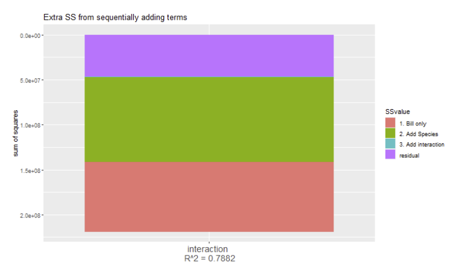

```{r setup, include=FALSE}
options(htmltools.dir.version = FALSE)
options(htmltools.preserve.raw = FALSE)
options(ggrepel.max.overlaps = Inf)

knitr::opts_chunk$set(echo = TRUE, 
                      dev = 'svg',
                      collapse = FALSE, 
                      comment = NA,  # PRINTS IN FRONT OF OUTPUT, default is '##' which comments out output
                      prompt = FALSE, # IF TRUE adds a > before each code input
                      warning = FALSE, 
                      message = FALSE,
                      fig.height = 3, 
                      fig.width = 4,
                      out.width = "100%"
                      )

# load necessary packages
library(Sleuth3)   # Data-set for Sleuth
library(tidyverse)
library(dplyr)
library(countdown)
library(mosaic)
library(ggthemes)
library(xaringanExtra)
library(forcats)
xaringanExtra::use_panelset()
xaringanExtra::use_tachyons()
xaringanExtra::use_clipboard()
xaringanExtra::use_extra_styles(
  hover_code_line = TRUE,         
  mute_unhighlighted_code = TRUE  
)
library(flipbookr)
library(patchwork)
library(DT)
library(moderndive)
library(knitr)
library(grid)
library(gridExtra)
library(Stat2Data)
library(palmerpenguins)

# Set ggplot theme
theme_set(theme_tufte(base_size = 10))

yt <- 0

set.seed(1234)

sim_mlr = function(x1, x2, beta_0 = 2, beta_1 = 3, beta_2 = 2, sigma = 3) {
  n = length(x1)
  epsilon = rnorm(n, mean = 0, sd = sigma)
  y = beta_0 + beta_1 * x1 + beta_2 * x2 + epsilon
  data.frame(predictor1 = x1, predictor2 = x2, response = y)
}

num_obs = 25
x_vals1 = runif(num_obs, 0, 10)
x_vals2 = rbeta(num_obs, 1,5)*10
sim_data = sim_mlr(x1 = x_vals1, x2 = x_vals2, beta_0 = 3, beta_1 = 2, beta_2= 1.6, sigma = 3)


```


```{r xaringanExtra-clipboard, echo=FALSE}
htmltools::tagList(
  xaringanExtra::use_clipboard(
    button_text = "<i class=\"fa fa-clipboard\"></i>",
    success_text = "<i class=\"fa fa-check\" style=\"color: #90BE6D\"></i>",
    error_text = "<i class=\"fa fa-times-circle\" style=\"color: #F94144\"></i>"
  ),
  rmarkdown::html_dependency_font_awesome()
)
```


layout: true
  
---

class: title-slide, middle

# .fancy[MLR: More ANOVA and Diagnostics using residuals]

### .fancy[Stat 230]

`r format(Sys.Date(), ' %B %d %Y')`

---

# Overview

.pull-left[
```{r, echo=FALSE, fig.align='center', fig.width=4, fig.height=4, out.width="100%"}
library(gg3D)
ggplot(sim_data, aes(predictor1, y=predictor2, z=response)) + 
  theme_void()+
  axes_3D() +
  stat_3D()
```

]
.pull-right[

Today: 
.blockquote-list[
- Some additional topics on ANOVA
- Assessing Model Assumptions
]


]

---

# Overview

.pull-left[
```{r, echo=FALSE, fig.align='center', fig.width=4, fig.height=4, out.width="100%"}
library(gg3D)
ggplot(sim_data, aes(predictor1, y=predictor2, z=response)) + 
  theme_void()+
  axes_3D() +
  stat_3D()
```

]
.pull-right[

Today: 
.blockquote-list[
- Some additional topics on ANOVA
- Assessing Model Assumptions
]


<br>

.blockquote.font80[
Important Comment:
- The class lecture notes use $p$ to represent the number of terms in your regression model (# betas minus the intercept).
- Your textbook uses $p$ to denote the number of betas in your model. The textbook $p$ will always be 1 greater than lecture notes $p$.
]

]

---

# `Penguins` Example

```{r, echo=FALSE, out.width="60%", fig.align='center'}
ggplot(penguins, aes(x = bill_length_mm, 
                     y = body_mass_g, 
                     color = species)) +
theme(legend.position = "bottom")+
geom_point() +
geom_smooth(method = "lm",
             se = FALSE, 
             aes(color=species))+
labs(title = "Regression of mass on bill length and species") 
```


---
## One-term F-test

```{r, echo=FALSE}
library(palmerpenguins)
library(tidyr) # has `drop_na()` function that drops rows having missing values
penguins <- penguins %>% tidyr::drop_na(bill_length_mm, body_mass_g, species)
peng_bill_lm <-  lm(body_mass_g ~ bill_length_mm, data = penguins)
peng_nointeraction_lm <- lm(body_mass_g ~ bill_length_mm + species, data = penguins)
peng_interaction_lm <-  lm(body_mass_g ~ bill_length_mm*species, data = penguins)

peng_bill_summary <- get_regression_summaries(peng_bill_lm, digits = 5)
peng_bill_table <- get_regression_table(peng_bill_lm, digits = 5)

peng_nointeraction_summary <- get_regression_summaries(peng_nointeraction_lm, digits = 5)
peng_interaction_summary <- get_regression_summaries(peng_interaction_lm, digits = 5)


# bill
ssreg.bill <- sum((peng_bill_lm$fitted.values - mean(peng_bill_lm$fitted.values))^2)
ssr.bill <- sum(((peng_bill_lm$fitted.values - penguins$body_mass_g)^2))
ss.total <- ssreg.bill + ssr.bill

# no interaction
ssreg.nointeraction <- sum((peng_nointeraction_lm$fitted.values - mean(peng_nointeraction_lm$fitted.values))^2)
ssr.nointeraction <- sum(((peng_nointeraction_lm$fitted.values - penguins$body_mass_g)^2))
ss.total <- ssreg.bill + ssr.bill


# interaction

ssreg.interaction <- sum((peng_interaction_lm$fitted.values - mean(peng_interaction_lm$fitted.values))^2)
ssr.interaction <- sum(((peng_interaction_lm$fitted.values - penguins$body_mass_g)^2))
ss.total <- ssreg.bill + ssr.bill

# make data.frame for plotting

my_data <- data.frame(SS = c(ssreg.bill,ssr.bill, ssreg.nointeraction,ssr.nointeraction,ssreg.interaction,ssr.interaction),
            SStype = c("SSreg", "SSR", "SSreg", "SSR", "SSreg", "SSR"),
            model = c("bill \n R^2 = 35.4", "bill \n R^2 = 35.4",
                      "parallel \n R^2 = 78.3", "parallel \n R^2 = 78.3", 
                      "interaction \n R^2 = 78.8", "interaction \n R^2 = 78.8"))

```

.blockquote[
$$\begin{array}{l}
H_{0}: \mu_{Y \mid x}=\beta_{0}+0+\beta_{2} x_{2}+\cdots+\beta_{p} x_{p} \Rightarrow \beta_{1}=0 \\
H_{A}: \mu_{Y \mid x}=\beta_{0}+\beta_{1} x_{1}+\beta_{2} x_{2}+\cdots+\beta_{p} x_{p} \Rightarrow \beta_{1} \neq 0
\end{array}$$
]

<br>

.blockquote-list[
.bold[Question being asked:] Is the effect of $x_{1}$ on $\mu_{y}$ statistically significant holding all other predictors $x_{2}, \ldots, x_{p}$ fixed?
- We can test "one term" with either a t-test or F-test.
- t-test is "easier" since we get these results from `summary` or `tidy` without having to fit a reduced model!
]

---

## Overall F-test

.blockquote[
\begin{align*}
H_{0}: & \mu_{Y \mid x}=\beta_{0} \\
H_{A}:  &\mu_{Y \mid x}=\beta_{0}+\beta_{1} x_{1}+\beta_{2} x_{2}+\cdots+\beta_{p} x_{p}
\end{align*}
]

Question being asked: .out-t[Are any of our predictors effects statistically significant??]

```{r, eval=FALSE}
summary(peng_interaction_lm)

... output omitted to save space! ....

Residual standard error: 371.8 on 336 degrees of freedom
Multiple R-squared:  0.7882,	Adjusted R-squared:  0.7851 
F-statistic: 250.1 on 5 and 336 DF,  p-value: < 2.2e-16 #<<
```

.blockquote.font90[At least one term in the interaction model has a statistically significant
effect on mass (F = 250.1, df = 5, 336, p < 0.0001)]

---

# More on ANOVA

```r
# R-code
anova(my_model)
```

> `anova` on one `lm` model gives a table of extra SS for sequentially
increasing terms in a model


```{r, collapse=TRUE}
anova(peng_interaction_lm)
```


---

# More on ANOVA


```{r, collapse=TRUE, echo=FALSE, highlight.output = c(5)}
anova(peng_interaction_lm)
```


.blockquote[
.bold[Sum Sq column:]
$$S S r e g(\text { Bill length })=77,669,072$$
.bold[Df column:] including this variable adds 1 term to the model

.bold[F value], $\operatorname{Pr}(>F)$ .bold[columns:] ignore!! (not a valid $F$ test)
]

---

# More on ANOVA

```{r, collapse=TRUE, echo=FALSE, highlight.output = c(6)}
anova(peng_interaction_lm)
```

.blockquote[
.bold[Sum Sq column:] extra SS for adding species to a model already containing bill_length_mm
$$\text{ SSreg(Bill length, species)}-\text{SSreg(Bill length)}=94,024,918$$

.bold[Df column:] including this variable adds 2 terms to the model

.bold[F value], $\operatorname{Pr}(>F)$ .bold[columns:] ignore!! (not a valid F test)
]

---

# More on ANOVA

```{r, collapse=TRUE, echo=FALSE, highlight.output = c(7)}
anova(peng_interaction_lm)
```

.blockquote.font90[
.bold[Sum Sq column:] extra SS for adding
bill_length_mm: species to a model already containing bill_length_mm and species

$$\text{SSreg(Bill length, species, interaction)}-
\text{SSreg(Bill length, species)}=1,166,702$$
.bold[Df column:] including this variable adds 2 terms to the model

.bold[F value], $\operatorname{Pr}(>F)$ .bold[columns:] The last row in this table is a valid F-test comparing the model with no interaction (null) to the interaction model (alt).

]

---

# More on ANOVA

Here we can see the sequential extra SS "add up" to the overall SSreg for
the interaction model.


```{r, out.width="60%", fig.align='center', echo=FALSE}
# plot

```

---

class: middle, inverse

## Let's talk about disgnostics of MLR with focus on residuals


---

# Multiple Linear Regression Model

$$Y_{i}=\beta_{0}+\beta_{1} x_{1, i}+\beta_{2} x_{2, i}+\cdots \beta_{p} x_{p, i}+\epsilon_{i} \quad \epsilon_{i} \stackrel{\text { i.i.d. }}{\sim} N(0, \sigma)$$

.blockquote[
- i.i.d = independent and identically distributed
- These model errors $\epsilon_{i}$ 's are independent of $x$ !
- We only need to check that the errors are i.i.d. $N(0, \sigma)$.
- We don't actually see the model errors $\epsilon_{i}$ but we can inspect their equivalent, $r_{i}$ the residuals, from the fitted regression model.
]

---

class: middle

# Diagnostic Tools for model checking

.blockquote.font90[
.bold[Linearity]
- Residual plot(s): Plot residuals $r_{i}=y_{i}-\hat{y}_{i}$ against the fitted values $\hat{y}_{i}$ and all explanatory variables

.bold[Equal/Constant variance a.k.a. homoscedastic]
- Residual plot(s)
- (Non-constant variance test)

.bold[Normality]
- Normal QQ plot of residuals

.bold[Independence]
- Plot residuals vs. time (temporal association) or explore spatial association within residuals.
]


---

class: middle

# What if assumption is violated? (same as SLR)


.blockquote[
What if model assumptions are violated? Possible Solutions:
- .bold[Linearity, Variance, Normality:] Transform one or both variables
- .bold[Linearity:] change mean function, use non-linear regression
- .bold[Variance:] weighted regression, "robust SEs"
- .bold[Independence:] use time variable in model, or use time series or spatial regression model, or random effects (mixed model) for correlated data
]

---

class: middle

# How “robust” is regression against violation of the assumptions? (same as SLR)

.blockquote.font90[
- .bold[Robust:] can violate and still get valid inference results
- .bold[Normality:] the t-tests and CI for model parameters and the mean response are saved by the Central Limit Theorem when $\mathrm{n}$ is large, even if your subpopulation of responses are not normally distributed.
- .bold[Not very robust:] can give misleading results if violated
]

---

class: middle

# How “robust” is regression against violation of the assumptions? (same as SLR)


.blockquote.font90[
- .bold[Linearity:] if the mean function is wrong then your estimated effects, mean response, or predicted response will be biased!
- .bold[Constant variance and independence:] if you are not correctly modeling your response variability, then your SEs will not be an accurate reflection of your actual uncertainty (meaning CIs/tests might be misleading)
- .bold[Normality only when computing prediction intervals:] these intervals need the normal subpopulation assumption to hold
]


---

class: middle

# Residuals plot in R using `ggResidpanel`

.blockquote[
`resid_xpanel(my_lm):` all residuals vs. explanatory plots

`resid_panel(my_lm):`
- residual vs fitted (linearity, variance)
- QQ plot and histogram of residuals (normality)
- residual vs row number (not all that useful!)

`resid_panel(my_lm, plots = "resid"):` residual vs fitted
]


---

# Residual plots using `moderndive` and `ggplot2`

- augment the data set with residual values

```r
# get regression points (fitted vals + residuals + original vars in the model)
# transformation tip: mutate new variables for transformed values
regression_points <- get_regression_points(my_lm)
```

.code90[
```r
# Residual plot fitted/predicted values
ggplot(regression_points, aes(x = response_hat, y = residual)) +
 geom_point() +
 geom_hline(yintercept = 0)
```
]

.code90[
```r
# Residual plot of each xvars
ggplot(regression_points, aes(x = xvar, y = residual)) +
 geom_point() +
 geom_hline(yintercept = 0)
```
]

---


`r chunk_reveal("penguins", widths=c(1,1), font_size_code="60%", title = "## Penguins example")`

```{r penguins, fig.width = 3, fig.height = 3.5, out.width = "100%", include=FALSE}
peng_interaction_lm <-  lm(body_mass_g ~ bill_length_mm*species, data = penguins)
peng_regression_points <- get_regression_points(peng_interaction_lm)
ggplot(peng_regression_points, aes(x = bill_length_mm, y = residual)) +
 geom_point() +
  theme(legend.position = "none") +
  geom_segment(aes(xend = bill_length_mm, yend = 0), alpha = .2) +
  scale_color_continuous(low = "black", high = "red") +  # Colors to use here
  geom_point(aes(color = abs(residual))) +
  geom_hline(yintercept = 0, col = "blue", size = 0.5, linetype = "dashed") + 
   labs(x = "Bill length (in mm)", 
       y = "Residuals",
       title = "Residual Plot") +
  theme(plot.title = element_text(hjust=0.5, size=7, face='bold')) 
```

---

# `Penguins` example

```r
library(ggResidpanel)
peng_interaction_lm <-  lm(body_mass_g ~ bill_length_mm*species, data = penguins)
resid_panel(peng_interaction_lm, plots = "resid")
```

.pull-left[

```{r, echo=FALSE}
library(ggResidpanel)
resid_panel(peng_interaction_lm, plots = "resid")
```

]

.pull-right[
.blockquote[
.bold[residuals vs fitted:]
- .bold[linearity:] seems ok (no systematic over/under estimation, expect maybe for a few large penguins)
- .bold[constant variance:] seems ok, though the larger fitted group may have slightly less variation than the lower group

]

]


---

# `Penguins` example


```{r, eval=FALSE, fig.width=3.5, fig.height=3}
resid_xpanel(peng_interaction_lm, smoother = TRUE)
```

.pull-left-60[

```{r, echo= FALSE}
resid_xpanel(peng_interaction_lm, smoother = TRUE)
```

]
.pull-right-40[
<br>
.blockquote[
residuals vs bill:
- looks good

residuals vs. species
- roughly centered around 0 , variation is a bit less in Chinstrap
]

]


---


# `Penguins` example


```{r, echo=FALSE, fig.width = 3.5, fig.height = 3, out.width = "60%", fig.align='center'}
resid_panel(peng_interaction_lm, plots = c("hist","qq"), axis.text.size = 7, title.text.size = 7, scale = 1)
```

.pull-left-60[

```{r}
resid_panel(peng_interaction_lm, plots = c("hist","qq"))
```


]
.pull-right-40[
.blockquote[
Normality of residuals:
- slightly right skewed
]

]

---

# `Penguins` example

Top 5 largest residual cases

```{r, collapse=TRUE}
peng_regression_points %>%
  slice_max(residual, n= 5)
```


---

# `Penguins` example

Top 5 smallest (most negative) residual cases

```{r, collapse=TRUE}
peng_regression_points %>%
  slice_min(residual, n= 5)
```


---

# `Penguins` example

Top 5 largest predicted mass cases

```{r, collapse=TRUE}
peng_regression_points %>%
  slice_max(body_mass_g_hat, n= 5)
```


---

class: action

# <i class="fa fa-pencil-square-o" style="font-size:48px;color:purple">&nbsp;Your&nbsp;Turn&nbsp;`r (yt <- yt + 1)`</i>    


.pull-left-40[

]
.pull-right-60[

<br>
<br>

.blockquote[
- Get the in class activity file from [moodle](https://moodle.carleton.edu/)
- Skim through it with your group members
]
]

`r countdown(minutes = 5, seconds = 00, top = 0 , color_background = "inherit", padding = "3px 4px", font_size = "2em")`

