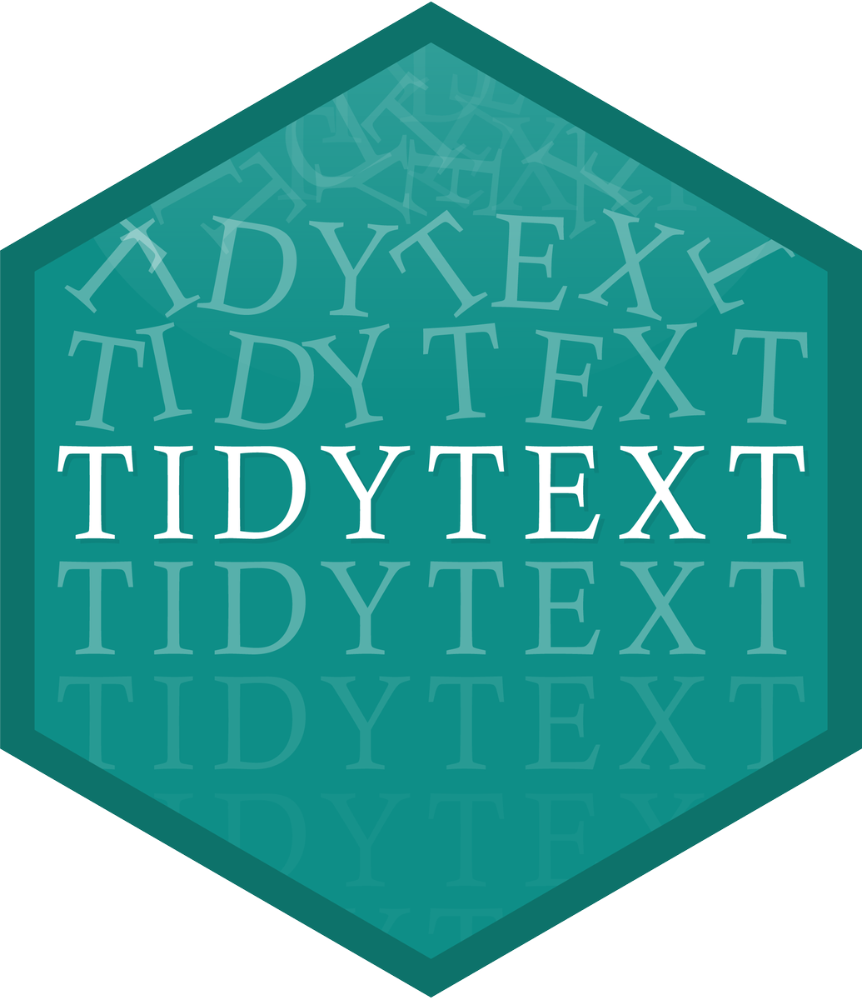

```{r setup, include=FALSE}
options(htmltools.dir.version = FALSE)
options(htmltools.preserve.raw = FALSE)


knitr::opts_chunk$set(echo = TRUE, 
                      dev = 'svg',
                      collapse = TRUE, 
                      comment = NA,  # PRINTS IN FRONT OF OUTPUT, default is '##' which comments out output
                      prompt = FALSE, # IF TRUE adds a > before each code input
                      warning = FALSE, 
                      message = FALSE,
                      fig.height = 3, 
                      fig.width = 4,
                      out.width = "100%"
                      )


# load necessary packages
library(tidyr)
library(dplyr)
library(ggplot2)
library(countdown)
library(ggthemes)
library(tidyverse)
library(stringr)
library(xaringanExtra)
xaringanExtra::use_panelset()
xaringanExtra::use_tachyons()
library(flipbookr)
library(htmlwidgets)


library(knitr)
library(kableExtra)
library(fontawesome)
library(rvest)
library(forcats)
library(patchwork)
library(readr)
library(stringr)
library(gapminder) 
library(icons)
library(babynames)

library(lubridate)
library(scales)
library(tidytext)


# set ggplot theme
# theme_set(theme_bw(base_size = 24))

yt <- 0

# Some codes

tweets <- read_csv("https://raw.githubusercontent.com/deepbas/statdatasets/main/TrumpTweetData.csv")

tweets_df <- tweets %>%
  select(id, statusSource, text, created) %>%
  extract(statusSource, "source", "Twitter for (.*?)<") %>%
  filter(source %in% c("iPhone", "Android"))


tweets_df %>%
  count(source, hour = hour(with_tz(created, "EST"))) %>%
  mutate(percent = n / sum(n)) %>%
  ggplot(aes(hour, percent, color = source)) +
  geom_line() +
  scale_y_continuous(labels = scales::label_percent(accuracy = 1L)) +
  labs(x = "Hour of day (EST)",
       y = "% of tweets",
       color = "")

reg <- "([^A-Za-z\\d#@']|'(?![A-Za-z\\d#@]))"

tweet_words <- tweets_df %>%
  filter(!str_detect(text, '^"')) %>%
  mutate(text = str_replace_all(text, "https://t.co/[A-Za-z\\d]+|&amp;", "")) %>%
  unnest_tokens(word, text, token = "regex", pattern = reg) %>%
  filter(!word %in% stop_words$word,
         str_detect(word, "[a-z]"))


```


```{r xaringan-themer, include = FALSE}
# Use xaringan theme from first set
```


layout: true
  
<!-- <div class="my-footer"><span>Bastola</span></div> -->
<!-- this adds the link footer to all slides, depends on my-footer class in css-->

---
class: title-slide, middle
<!-- background-image: url("assets/title-image2.jpg") -->
background-position: 10% 90%, 100% 50%
background-size: 160px, 100% 100%

# .fancy[Advanced Text Mining]

### .fancy[Stat 220]

.large[Bastola]

`r format(Sys.Date(), ' %B %d %Y')`

---


<!-- 
  .out-t[`(?=)`] = look ahead, e.g. `i(?=e)` = .bold[i] when it comes before .bold[e]

- .out-t[`(?!)`] = negative look ahead, e.g. `i(?!e)` .bold[i] when it comes before something that isn’t .bold[e]

- .out-t[`(?<)`] = look behind, e.g. `(?<=e)i` = .bold[i] when it follows .bold[e]

- .out-t[`(?<!)`] = negative look behind, e.g. `(?<!e)i` = .bold[i] when it does not follow .bold[e]

-->


# Some more regexes

.code120[
```{r}
aboutMe <- c("My phone number is 236-748-4508.")
```
]

--

.code[
```{r}
str_view_all(aboutMe, "\\.") # literal period "."
```
]

--

.code120[
```{r}
str_view_all(aboutMe, "[^(\\d)(\\s)(\\-)(\\.)]") # everything except
```
]

---

# Alternates: OR

.code120[
```{r}
aboutMe <- c("My phone number is 236-748-4508.")
```
]

--


.pull-left[
.code120[
```{r}
str_view(aboutMe,"8|6-")  
```
]
]
.pull-right[
.code120[
```{r}
str_view(aboutMe,"(8|6-)")  
```
]
]

<br>
--
<br>

.code120[
```{r}
str_view_all(aboutMe,"(8|6)-")  
```

]


---

# More Duplicating Groups

.code100[
```{r}
foo <- c("addidas", "missim")
```
]


.pull-left[
.code110[
```{r}
# anything then repeat anything
str_view(foo, "(.)\\1") 
```
]
]
.pull-right[
.code110[
```{r}
# strings like `xyzzyx`
str_view(foo, "(.)(.)(.)\\3\\2\\1")
```
]
]

--

<br>

```{r}
str_view(foo, "(.)(.)\\1")
```


---

# Finding patterns

.pull-left[

```{r}
# find the last word in a sentence
str_view_all("it's a goat.", 
             "[a-z]+\\.")
```
]
.pull-right[

```{r}
# find word with  `'s`
str_view_all("it's a goat.", 
             "[a-z]+\\'\\w")
```

]

--

<br>

```{r}
# find a single letter word separated by spaces
str_view_all("it's a goat.", 
             "(\\s)(\\w)\\s")
```


---
name: yourturn
template: section
class: action

# <i class="fa fa-pencil-square-o" style="font-size:48px;color:purple">&nbsp;Your&nbsp;Turn&nbsp;`r (yt <- yt + 1)`</i>    

.font120[Please git clone the repository on [advanced string manipulations](https://github.com/stat220/11-advanced-strings) to your local folder.]

```{r, eval=FALSE}
x <- "My SSN is 593-29-9502 and my age is 55"
y <- "My phone number is 612-643-1539"
z <- "My old SSN number is 39532 9423."
out <- str_flatten(c(x,y,z), collapse = ". ")
```

Please complete the assigned tasks.

```{r echo=FALSE}
countdown(4)
```

---


# Look ahead example

.font120[
> .bold[Positive look ahead] operator `x(?=[y])` will find `x` when it comes before `y`

> .bold[Negative] version is `x(?![y])` (`x` when it comes before something that isn’t `y`)
]

```{r}
str_view_all("it's a goat.", "t(?=[\\.])") # t before a period
```

---

# Look ahead example

.font120[
> .bold[Positive look ahead] operator `x(?=[y])` will find `x` when it comes before `y`

> .bold[Negative] version is `x(?![y])` (`x` when it comes before something that isn’t `y`)
]


```{r}
str_view_all("it's a goat.","[a-z]+(?=[\\.])") # 1+ letters before a period
```


---

# Look behind example

.font120[
> .bold[Positive look behind] operator `(?<=[x])y` will find `y` when it follows `x`

> .bold[Negative] version is `(?<![x])y` (`y` when it does not follow `x`)
]


```{r}
str_view_all("that is a top cat.","(?<=[a-z])t+")
```

---

# Look behind example

.font120[
> .bold[Positive look behind] operator `(?<=[x])y` will find `y` when it follows `x`

> .bold[Negative] version is `(?<![x])y` (`y` when it does not follow `x`)
]


```{r}
str_view_all("that is a top cat.","(?<![a-z])t[a-z]+") 
```


---

name: yourturn
class: action
template: section

# <i class="fa fa-pencil-square-o" style="font-size:48px;color:purple">&nbsp;Your&nbsp;Turn&nbsp;`r (yt <- yt + 1)`</i>    

.font120[Use .bold[negative look behind] `?<!` and .bold[negative look ahead] `?!` operator to correct this!]


```{r}
ssn <- "([0-8]\\d{2})[-\\s]?(\\d{2})[-\\s]?(\\d{4})"
test <- c("123-45-67890","1123 45 6789")
str_view_all(test, ssn)
```


```{r echo=FALSE}
countdown(4)
```

---

# Analyzing Trump tweets

.font120[
> What proportion of tweets (text) mention “Hillary” or “Clinton”?
]

--

```{r}
tweets %>% 
  summarize(prop = mean(str_detect(str_to_lower(text),"hillary|clinton"))) 
```

--
.font120[
- About 17.4% of these tweets mention Hillary or Clinton.
]
---

# Analyzing Trump tweets

.font120[
> What proportion of these tweets include “crooked”?
]

--

```{r}
tweets %>%   
  filter(str_detect(str_to_lower(text), "hillary|clinton")) %>%
  summarize(prop = mean(str_detect(str_to_lower(text), "crooked"))) 
```

--
.font120[
- Of the Hillary/Clinton tweets, about 54% of include the word “crooked.”
]

---

`r chunk_reveal("demo1", widths = c(40, 40), font_size_code="100%", title = "## How are the hashtags used?")`

```{r, demo1, eval=FALSE, echo=FALSE}
tweets %>% 
  mutate(ct = str_count(text, "#")) %>% 
  select(ct, text) %>%
  summarize(prop = mean(ct > 0))
```


---

# Finding URLs

.font120[
> URLs in tweets start with https://t.co/ followed by a string of letters or numbers
]

```{r}
link <- "https://t.co/[A-Za-z\\d]+"
tweets$text[992]
```

--

```{r}
str_view(tweets$text[992], link)
```


---

# What proportion of tweets have links?

--

```{r}
tweets %>%
  summarize(prop = mean(str_detect(text, link))) 
```

--

.font120[
- about 34.2% of tweets have a link.
]

---

# Removing links from tweets

.code120[
```{r}
tw_noLink <- tweets %>%
  mutate(textNoLink = str_replace_all(text, link, "")) 
```
]

--

```{r}
tw_noLink$text[992]
tw_noLink$textNoLink[992]
```


---

# Get the tweets with links

```{r}
tweets %>% 
  filter(str_detect(text, link)) %>% 
  select(text)
```


---

# Extract all tweets with links

.scroll-box-20[

```{r}
tweets %>% select(text) %>%
  str_extract_all(link)
```
]

---

# Unlist the list entries 

.scroll-box-20[

```{r}
tweets %>% select(text) %>%
  str_extract_all(link) %>%
  unlist()            # unlist and coerce into a vector #<<
```
]

---
name: yourturn
template: section
class: action

# <i class="fa fa-pencil-square-o" style="font-size:48px;color:purple">&nbsp;Your&nbsp;Turn&nbsp;`r (yt <- yt + 1)`</i>    

```{r}
tweets<- read_csv("https://raw.githubusercontent.com/deepbas/statdatasets/main/TrumpTweetData.csv")
```

.font120[
Use `tweets` dataset to answer the following:]

a.  What proportion of tweets (text) mention "America"?

b.  What proportion of these tweets in .bold[a.] include "great"?

c.  What proportion of the tweets mention "@"?

d.  Remove the tweets having mentions "@".


```{r echo=FALSE}
countdown(4)
```


---
class:middle

# Tidy Text

.pull-left[

.font120[
- tidy data principles

- works with existing data manipulation tools

- streamlined integration with other text mining libraries
]
]
.pull-right[




]

---
class: middle

# Tidy Text Data

.font120[
- Each variable is a column

- Each observation is a row

- Each type of observational unit is a table

- tidy text format is a .bold[table with one-token-per-row]

]

---

# Tokenization

```{r}
text <- c("US opposition politicians and aid agencies have questioned  
          a decision by President Donald Trump to cut off aid to three 
          Central American states --- or so the story reports!")
```


--

```{r}
text_data <- tibble(text = text)
text_data
```

---

# Tokenization of words

```{r}
text_data %>% 
  unnest_tokens(word,text,token = "words") # Words are Default
```


---

# Tokenization of tweets

```{r}
tibble(text = "Hey @professor, this assignment is very challenging") %>% 
  unnest_tokens(word, text, token = "tweets") %>% head(3)
```

--

```{r}
tibble(text = "Hey @professor, this assignment is very challenging") %>% 
  unnest_tokens(word, text, token = "words") %>% head(3)
```

---

# Counting words

```{r}
text_data %>% 
  unnest_tokens(word,text) %>% 
  count(word, sort = TRUE)
```

---

# Stopwords

- `tidytext` comes with a database of common stop words

- carry little to no unique information, and need to be removed

```{r}
stop_words %>% sample_n(10)
```


---
name: yourturn
template: section
class: action

# <i class="fa fa-pencil-square-o" style="font-size:48px;color:purple">&nbsp;Your&nbsp;Turn&nbsp;`r (yt <- yt + 1)`</i>    

```{r}
reg <- "([^A-Za-z\\d#@']|'(?![A-Za-z\\d#@]))"
Links <- "https://t.co/[A-Za-z\\d]+"
```

.font120[Using the `tweets` dataset again, perform the following tasks:]

- `filter` out words that start with `"`
- `replace` all instances of url links
-  split the text column into tokens, flattening the table into .bold[one-token-per-row].
- `filter` the `stop_words` and words starting with numbers out


```{r echo=FALSE}
countdown(5)
```


