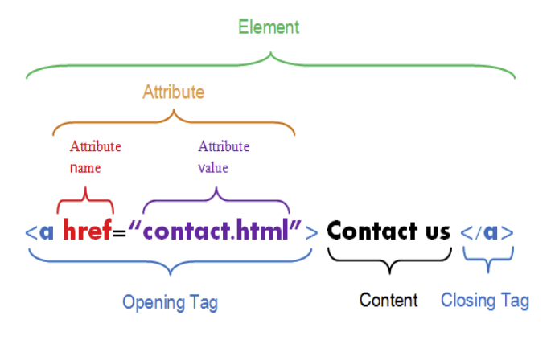

```{r setup, include=FALSE}
options(htmltools.dir.version = FALSE)
options(htmltools.preserve.raw = FALSE)


knitr::opts_chunk$set(echo = TRUE, 
                      dev = 'svg',
                      collapse = TRUE, 
                      comment = NA,  # PRINTS IN FRONT OF OUTPUT, default is '##' which comments out output
                      prompt = FALSE, # IF TRUE adds a > before each code input
                      warning = FALSE, 
                      message = FALSE,
                      fig.height = 3, 
                      fig.width = 4,
                      out.width = "100%"
                      )


# load necessary packages
library(tidyr)
library(dplyr)
library(ggplot2)
library(countdown)
library(ggthemes)
library(tidyverse)
library(stringr)
library(xaringanExtra)
xaringanExtra::use_panelset()
xaringanExtra::use_tachyons()
library(flipbookr)
library(htmlwidgets)
library(lubridate)
library(palmerpenguins)

library(knitr)
library(kableExtra)
library(fontawesome)
library(rvest)
library(forcats)
library(patchwork)
library(readr)
library(stringr)
library(icons)
library(tidytext)

yt <- 0

tables <- read_html("http://www.imdb.com/chart/top") %>%
  html_nodes("table") 

top250 <- html_table(tables[[1]])

tidy_top250 <- 
  top250[,2:3] %>%  # Grab the middle two columns, select won't work with duplicate names
  separate(`Rank & Title`, into = c("rank", "title", "year"), sep = "\n") %>%
  mutate(rank = parse_number(rank),
         title = str_trim(title),
         year = parse_number(year)) %>%
  rename(imdb.rating = `IMDb Rating`)  %>%
  as_tibble()

page <- read_html("http://www.imdb.com/chart/tvmeter")
name <- page %>%
  html_nodes(".titleColumn a") %>%
  html_text()

ranks <- page %>%
  html_nodes(".velocity") %>%
  html_text() %>%
  str_extract("\\d+") %>%
  as.numeric()

scores <-  page %>%
  html_nodes(".imdbRating") %>%
  html_text() %>%
  str_extract("\\d+.\\d+") %>%
  as.numeric()

# If you don't use the gadget selector carefully, 
# there is more string manipulation needed here
years <- page %>%
  html_nodes("a+ .secondaryInfo") %>%
  html_text() %>%
  str_extract("\\d+") %>%
  as.numeric()

tvshows <- tibble(
  rank = ranks,
  name = name,
  score = scores,
  year = years
)

tvshows

```


```{r xaringan-themer, include = FALSE}
# Use xaringan theme from first set
```


layout: true
  
<!-- <div class="my-footer"><span>Bastola</span></div> -->
<!-- this adds the link footer to all slides, depends on my-footer class in css-->

---
class: title-slide, middle
<!-- background-image: url("assets/title-image2.jpg") -->
background-position: 10% 90%, 100% 50%
background-size: 160px, 100% 100%

# .fancy[Web Scraping]

### .fancy[Stat 220]

.large[Bastola]

`r format(Sys.Date(), ' %B %d %Y')`

---

class: inverse, middle

.Big-text[Web scraping]


## the process of downloading, parsing, and extracting data presented in an HTML file and then converting it into a structured format that allows us to analyze it.


---
class: middle

# .purple[Two different scenarios:]

.font120[
1. .bold[Screen scraping:] extract data from source code of website, with html parser (easy) or regular expression matching (less easy).

2. .bold[Web APIs (application programming interface):] website offers a set of structured http requests that return JSON or XML files.
]

<!-- API is a messenger that takes requests, and then returns a response back to you -->
---

## `robotstxt` for permission

> Use `robotstxt::paths_allowed()` to see if you have permission to scrape

You can scrape IMDB
```{r warning=FALSE, collapse=TRUE}
library(robotstxt)
paths_allowed("http://www.imdb.com")
```


But not Facebook!
```{r warning=FALSE, collapse=TRUE}
paths_allowed("http://www.facebook.com")
```


---
class: middle

# HyperText Markup Language (HTML)

<!-- 

- Each line of code tells the browser how to show every element in your display by assigning tags to each component within the body tag. -->

<!-- - Most of the data on the web is still largely available as HTML -->

> HTML page consists of series of elements which browsers use to interpret how to display the content



<br>


<!--
- Contains all the metadata inside the head tag

- Only need to understand the document’s body tag as there’s where the content we want to scrape resides.

-->


---

# HyperText Markup Language (HTML)

> While it is structured (hierarchical/tree based) it often is not available in a form useful for analysis (flat / tidy).

```html
<html>
  <head>
    <title>This is a title</title>
  </head>
  <body>
    <p align="center">Hello world!</p>
  </body>
</html>
```

---


## HTML tags

> HTML uses `tags` to describe different aspects of document content

<br>

Tag         |  Example
------------|---------------------------------------------------------------
heading     | `<h1>My Title</h1>`
paragraph   | `<p>A paragraph of content...</p>`
table       | `<table> ... </table>`
anchor (with attribute)     | `<a href="http://www.ratebeer.com">click here for link</a>`


---
background-image: url(https://github.com/rstudio/hex-stickers/raw/master/PNG/rvest.png)
background-position: left
background-size: 48%
class: clear, middle


.pull-right[
##   Makes basic processing and manipulation of HTML data straight forward.
]


---

## Core `rvest` functions


Function      | Description
--------------|---------------------------------------------
`read_html`   | Read HTML data from a url or character string
`html_node `  | Select a specified node from HTML document
`html_nodes`  | Select specified nodes from HTML document
`html_table`  | Parse an HTML table into a data frame
`html_text`   | Extract tag pairs' content
`html_name`   | Extract tags' names
`html_attrs`  | Extract all of each tag's attributes
`html_attr`   | Extract tags' attribute value by name

---
background-image: url(images/imdb_top_250.png)
background-position: right
background-size: 50%
## Top 250 movies on IMDB

.pull-left[
http://www.imdb.com/chart/top

- Take a look at the web page **and** the html source code 

    Chrome: right click -> View page source

- Look for the tag `<table>` tag
]
---

## Read HTML into R

.code90[
```{r}
page <- read_html("http://www.imdb.com/chart/top") #<<
```
]

--

.code90[
```{r}
page
```
]

--

.code90[
```{r}
str(page)
```
]

---

## Extract tables

Use `html_nodes()` to extract pieces out of HTML documents

.code100[
```{r eval=TRUE}
tables <- page %>% html_nodes("table")
```
]

--

.code100[
```{r}
str(tables)
```
]

---

## Not a data frame yet!

It points to the correct node ...

.code90[
```{r collapse=TRUE}
tables
```
]

--

but no data frame yet!

.code90[
```{r, collapse=TRUE}
tables[[1]]
```
]

---

## Parse a table into a data frame

.code90[
```{r}
top250 <- html_table(tables[[1]])
glimpse(top250)
```
]

---

## Parse tables into data frames

`html_table()` is vectorized so you can input a list of HTML tables and it will return a list of data frames

.code90[
```{r}
table_list <- html_table(tables)
str(table_list)
```
]

---

class: action

# <i class="fa fa-pencil-square-o" style="font-size:48px;color:purple">&nbsp;Your&nbsp;Turn&nbsp;`r (yt <- yt + 1)`</i>    
Please clone the repository on [web scraping](https://github.com/stat220/14-web-scraping) to your local folder.
.font90[
- Why isn't `top250` data frame we just scraped tidy? Use your data-wrangling toolkit to create a tidy data set with columns:  `rank`, `title`, `year`, and `imdb.rating`]
  
.scroll-box-12[  
```{r, echo=FALSE}
knitr::kable(tidy_top250, format = "html")
```
]

`r countdown(minutes = 5, seconds = 00, top = 0 , color_background = "inherit", padding = "3px 4px", font_size = "2em")`


---
class: middle, inverse

# CSS 

- CSS (Cascading Style Sheets) is a language that describes how HTML elements should be displayed. 

- .bold[CSS selectors:] 

  * shortcuts for selecting HTML elements to style  
  * can also be used to extract the content of these elements

---
background-image: url(images/best-picture.png)
background-position: center
background-size: contain


.footnote[Click [here](https://www.imdb.com/search/title/?count=100&groups=oscar_best_picture_winners&sort=year%2Cdesc&ref_=nv_ch_osc) to take a look at the webpage]

---

# SelectorGadget

- SelectorGadget is a point-and-click CSS selector, specifically for .bold[Chrome]

- Comes as a [Chrome Extension](https://chrome.google.com/webstore/detail/selectorgadget/mhjhnkcfbdhnjickkkdbjoemdmbfginb) .red[(Click to install!)]


.footnote[Click [here](https://www.w3schools.com/cssref/css_selectors.asp) for a list of selectors ]
---

# SelectorGadget

- Select all elements that are related to that object. Next, select anything in yellow you do not want


<center>

<a>Source: Adam Loy</a>
</center>

---

## Read HTML into R

.code100[
```{r}
webpage <- read_html('https://www.imdb.com/search/title/?groups=best_picture_winner&sort=year,desc&count=100&view=advanced') #<<
```
]

.code90[
```{r}
webpage
```
]
.code90[
```{r}
str(webpage)
```
]


---

# Extract titles

Use `html_nodes()` to extract pieces out of HTML documents

.code100[
```{r eval=TRUE}
title_data <- webpage %>% html_nodes(".lister-item-header a") %>% html_text()
```
]
.scroll-box-12[
```{r}
title_data
```
]

---

class: action

# <i class="fa fa-pencil-square-o" style="font-size:48px;color:purple">&nbsp;Your&nbsp;Turn&nbsp;`r (yt <- yt + 1)`</i>    

- Use the selector gadget tool to find the CSS for extracting .bold[year] the movie came out. 

- Tidy the data

  + Using `parse_number()`
  
  + Using regex

Final Result:

```{r, echo=FALSE}
year_data <- html_nodes(webpage, '.text-muted.unbold') %>% 
  html_text() %>%
  parse_number()
year_data
```


`r countdown(minutes = 3, seconds = 00, top = 0, color_background = "inherit", padding = "3px 4px", font_size = "2em")`

---

class: action

# <i class="fa fa-pencil-square-o" style="font-size:48px;color:purple">&nbsp;Your&nbsp;Turn&nbsp;`r (yt <- yt + 1)`</i>    


```{r, echo=FALSE}
description_data <- html_nodes(webpage,'.ratings-bar+ .text-muted') %>%
  html_text() %>% 
  str_trim()
head(description_data,6)
```

.fancy[
These are the .bold[descriptions] of the movies in the IMDb webpage. ]

  - Parse the webpage to produce a vector of the descriptions.
  
  - Tidy the description by removing unwanted regexes. 

```{r echo=FALSE}
countdown(3)
```

---

# Runtime

```{r}
runtime_data <- html_nodes(webpage,'.text-muted .runtime') %>% 
  html_text() %>% 
  str_replace_all(" min", "") %>% 
  as.numeric()
```

--

.scroll-box-12[
```{r}
runtime_data
```
]

---

# Ratings


```{r}
rating_data <- html_nodes(webpage,'.ratings-imdb-rating strong') %>% 
  html_text() %>% 
  as.numeric()
```

--

.scroll-box-12[
```{r}
rating_data
```
]

---

# Number of votes

```{r}
votes_data <- html_nodes(webpage,'.sort-num_votes-visible span:nth-child(2)') %>% 
  html_text() %>% 
  str_replace_all(",", "") %>%
  as.numeric()

```

--

.scroll-box-12[
```{r}
votes_data
```
]

---

# Combine all

```{r, echo=FALSE}
movies_df <- data.frame(Year = year_data,
                      Title = title_data,
                      Description = description_data, 
                      Runtime = runtime_data,
                      Rating = rating_data,
                      Votes = votes_data) %>% as_tibble()
```

.scroll-box-20[
```{r, echo=FALSE}
DT::datatable(
  movies_df,
  fillContainer = FALSE, options = list(pageLength = 10)
)
```
]

.footnote[ [Original webpage](https://www.imdb.com/search/title/?count=100&groups=oscar_best_picture_winners&sort=year%2Cdesc&ref_=nv_ch_osc)]
---

template: section
class: action

# <i class="fa fa-pencil-square-o" style="font-size:48px;color:purple">&nbsp;Your&nbsp;Turn&nbsp;`r (yt <- yt + 1)`</i>    
.font90[
- Scrape the names, scores, and years of most popular TV shows on IMDB:
[www.imdb.com/chart/tvmeter](http://www.imdb.com/chart/tvmeter)

- Create a data frame called `tvshows` with four variables:
  `rank`, `name`, `score`, `year`
]
.scroll-box-14[  
```{r, echo=FALSE}
knitr::kable(tvshows, format = "html")
```
]

```{r echo=FALSE}
countdown(5)
```


