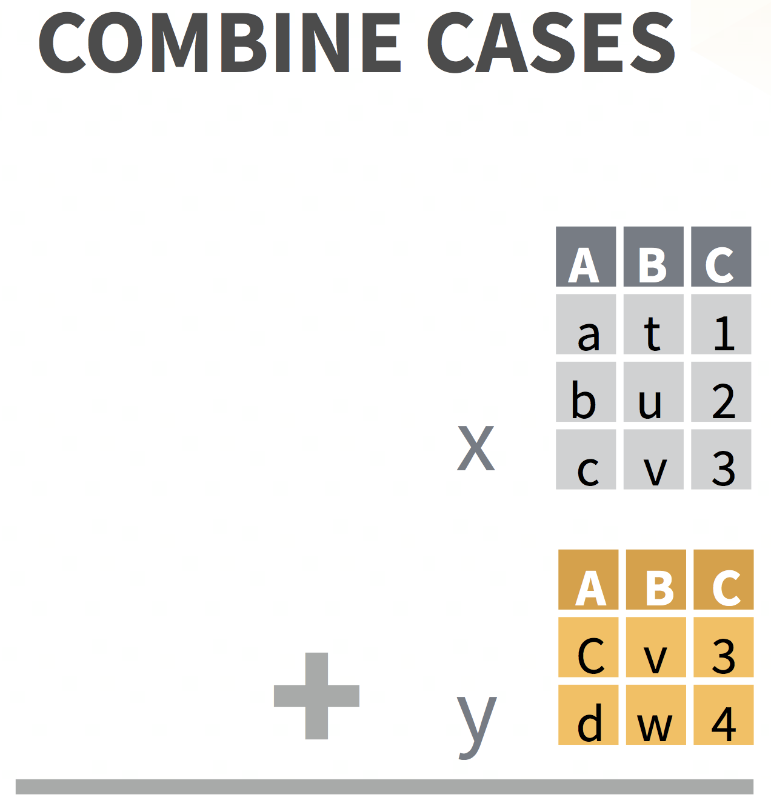

```{r setup, include=FALSE}
options(htmltools.dir.version = FALSE)

knitr::opts_chunk$set(echo = TRUE, 
                      dev = 'svg',
                      collapse = TRUE, 
                      comment=NA,  # PRINTS IN FRONT OF OUTPUT, default is '##' which comments out output
                      prompt = FALSE, # IF TRUE adds a > before each code input
                      warning = FALSE, 
                      message = FALSE,
                      #fig.height = 4, 
                      #fig.width = 6, 
                      fig.align='center',
                      rows.print=7
                      )


# load necessary packages
library(tidyr)
library(dplyr)
library(dslabs)
library(ggplot2)
library(countdown)
library(ggthemes)
library(tidyverse)
library(stringr)
library(xaringanExtra)
xaringanExtra::use_panelset()

library(knitr)
library(kableExtra)
library(fontawesome)
library(lubridate)
library(janitor)


# set ggplot theme
theme_set(theme_bw(base_size = 24))


yt <- 0

```


```{r xaringan-themer, include = FALSE}
# Use xaringan theme from first set
```


class: center, inverse, middle

# Last time: Combining data sets


<center>
<br>


 <br>


<a href="https://deepbas.io/cheatsheets/data-transformation.pdf">dplyr data transformation cheatsheet</a>
</center>


---

# What are tidy data?

1. Each .yellow-h[variable] forms a column
2. Each .yellow-h[observation] forms a row 
3. Each .yellow-h[value] has its own cell


[G. Grolemond & H. Wickham's R for Data Science](https://r4ds.had.co.nz/tidy-data.html)

---

# Untidy data: example 1

```{r}
untidy_data <- tibble(
  name = c("Ana","Bob","Cara"),
  meds = c("advil 600mg 2xday","tylenol 650mg 4xday", "advil 200mg 3xday")
)
```

--

```{r}
untidy_data
```

---

# Tidy data: example 1

We will learn how to do this!
```{r}
untidy_data %>% 
  separate(col = meds, 
           into = c("med_name","dose_mg","times_per_day"), 
           sep=" ") %>%
  mutate(times_per_day = as.numeric(str_remove(times_per_day, "xday")),
         dose_mg = as.numeric(str_remove(dose_mg, "mg")))
```


---

# Untidy data: example 2

```{r}
untidy_data2 <- tibble(
  name = c("Ana","Bob","Cara"),
  wt_07_01_2021 = c(100, 150, 140),
  wt_08_01_2021 = c(104, 155, 138),
  wt_09_01_2021 = c(NA, 160, 142)
)
```

--

```{r}
untidy_data2
```


---

# Tidy data: example 2

We will learn how to do this!

```{r}
untidy_data2 %>% 
  gather(key = "date", value = "weight", -name) %>%
  mutate(date = str_remove(date,"wt_"),
         date = dmy(date))     # dmy() is a function in the lubridate package
```


---


class: center, middle, inverse

# Reshaping data 

wide vs. long


.pull-left[
  
[Allison Horst](https://github.com/allisonhorst/stats-illustrations)
]
.pull-right[
  
[tidyr](https://tidyr.tidyverse.org)
]
---

# Wide vs. long data

<!-- TO DO: define, show pic -->
- __Wide__ data has one row per subject, with multiple columns for their repeated measurements
- __Long__ data has multiple rows per subject, with one column for the measurement variable and another indicating from when/where the repeated measures are from

--

.pull-left[
wide  

]
.pull-right[
long  

]

---
class: action

# Your Turn `r yt <- yt +1;yt`

Please git clone the repository on [tidy R](https://github.com/stat220/07-tidy-data) to your local folder.

```{r, echo=FALSE}
BP_wide <- tibble(id = letters[1:4],
                     sex = c("F", "M", "M", "F"),
                     SBP_v1 = c(130, 120, 130, 119),
                     SBP_v2 = c(110, 116, 136, 106),
                     SBP_v3 = c(112, 122, 138, 118))
```

```{r, echo=TRUE}
BP_wide
```

- What do you think the data in the table are measures of? How can we tell the data are wide?

- What would a long data look like? How many columns will it have?


`r countdown(minutes = 3, seconds = 00, top = 0, color_background = "inherit")`

---

# Wide to long .out-t[(Old Version)] : `gather()` 

.pull-left[
```{r}
BP_wide
```

`gather` columns into rows to make the data long. Need to **specify**:
- __new column names__
    + __key__: stores row names of wide data's gathered columns 
    + __value__: stores data values
- __which columns to gather__
]
.pull-right[
```{r}
BP_long1 <- BP_wide %>% 
  gather(key = "visit", value = "SBP",  #<<
         SBP_v1:SBP_v3)  #<<
BP_long1
```
]

---

# Wide to long: `pivot_longer()`

.pull-left[
```{r}
BP_wide
```

`pivot_longer`  lengthens data, increasing the number of rows and decreasing the number of columns. Need to **specify**:
- __new column names__
    + __names_to__: stores row names of wide data's columns 
    + __values_to__: stores data values
- __which columns to pivot__
]
.pull-right[
```{r}
BP_long2 <- BP_wide %>%
  pivot_longer(names_to = "visit",   #<<
               values_to = "SBP",  #<<
               cols = SBP_v1:SBP_v3)   #<<
BP_long2
```
]

---

# Long to wide .out-t[(Old Version)] : `spread()`


.pull-left[
```{r}
BP_long1
```

]
.pull-right[
`spread` rows into columns to make the data wide. Need to __specify__ which columns in the long data to use:
- __key__ column: has the variable names 
- __value__ column: has the data values
    
```{r}
BP_wide1 <- BP_long1 %>% 
  spread(key = "visit", value = "SBP") #<<
BP_wide1
```
]

---

# Long to wide: `pivot_wider()`


.pull-left-40[
```{r}
BP_long1
```

]
.pull-right-60[
`pivot_wider`  increases number of columns and decreases the number of rows. Need to **specify**:
- __new column names__
    + __names_from__: get the name of the column 
    + __values_from__: get the cell values from
```{r}
BP_wide2 <- BP_long1 %>% 
  pivot_wider(names_from = "visit", #<<
              values_from = "SBP") #<<
BP_wide2
```
]


---

# Separate Info

.pull-left[

```{r}
BP_long2
```

]
.pull-right[
```{r}
BP_long3 <- BP_long2 %>%
  separate(visit, c("acrnym", "visit")) #<<
BP_long3
```

]

---

# Remove and Clean up Columns

.pull-left[
```{r}
BP_long3
```
**Goal**: Get rid of `acrnym` column and remove the string `v` from the `visit` variable's values.
]
.pull-right[

```{r}
BP_long3 <- BP_long3 %>% 
  select(-acrnym) %>%   #<<
  mutate(visit = str_replace(visit,"v",""))   #<<
BP_long3
```
]

---

# Make cleaned-up long data wide

.pull-left[
```{r}
head(BP_long3, 2)
BP_wide4 <- BP_long3 %>% 
  pivot_wider(names_from = "visit", #<<
              values_from = "SBP") #<<
BP_wide4
```
]

--

.pull-right[

**Problem**: have numbers as column names  

**Solution**: have row names start with the `key` column's name separated by a character

```{r}
BP_wide5 <- BP_long3 %>% 
  pivot_wider(names_from = "visit",     #<<
              values_from = "SBP",      #<<
              names_prefix = "value_")  #<< 
BP_wide5
```
]


---
class: action

# Your Turn `r yt <- yt +1;yt`

.pull-left[

```{r, echo=FALSE}
DBP_wide <- tibble(id = letters[1:4],
 sex = c("F", "M", "M", "F"),
 v1.DBP = c(88, 84, 102, 70),
 v2.DBP = c(78, 78, 96, 76),
 v3.DBP = c(94, 82, 94, 74),
 age=c(23, 56, 41, 38)
 )
```

```{r}
DBP_wide
```

- Transform
- Clean-up
- Rename
- Join


]
.pull-right[
```{r, echo=FALSE}
BP_long <- BP_wide %>% 
  gather(key = "visit", 
         value = "SBP", 
         SBP_v1:SBP_v3)
BP_long2 <- BP_long %>% 
  mutate(visit = str_replace(visit,
                             "SBP_v",""))
```

```{r}
BP_long2
```
]


`r countdown(minutes = 6, seconds = 00, left = 0, color_background = "inherit")`

---
class: center, middle, inverse

# Data cleaning

## (messy NAs, dates, factors)


---

# Removing missing data: `drop_na()`

<!-- These examples might be clearer with a small dataset and showing what the outcomes are. -->

.pull-left[

A simple example:

```{r}
foo <- tibble(id = 3:5, 
                 name = c("Al",
                          "Wu",
                          "Flo"), 
                 height = c(3, NA, 2.8), 
                 years = c(50,33,NA))
foo
```
]

--

.pull-right[

Remove *all* rows with **any missing data**

```{r}
foo %>% drop_na()
```

Remove rows with `NA` in **selected columns**

```{r}
foo %>% drop_na(height)
```
]

---

# Replace `NA`s with another value: `replace_na()`

.pull-left-40[
Use with `mutate()`
```{r}
foo
```

--

]
.pull-right-60[
```{r}
foo %>% 
  mutate(height = replace_na(height, "Unknown"), #<<
         years = replace_na(years, 0) ) #<<
```
]

---

# Dates with `lubridate`

.pull-left[
- Convert characters to special "Date" type

- Easy date magic examples:

    + add and subtract dates
    + convert to minutes/years/etc
    + change timezones
    + add 1 month to a date...
    
- [`lubridate` cheat sheet](https://www.rstudio.com/resources/cheatsheets/#lubridate)

]

--

.pull-right[
<center><a href="https://github.com/allisonhorst/stats-illustrations"><br>Allison Horst</a>
</center>
]

---

# What kind of date do you have?

.pull-left-40[
<center></center>
[`lubridate` cheat sheet](https://www.rstudio.com/resources/cheatsheets/#lubridate)
]
.pull-right-60[
```{r}
timedata <- tibble(name = c("Yi","Mo","Dee"), 
                   dob=c("10/31/1952",
                         "1/12/1984",
                         "2/02/2002"),
                   age= c("69", "38", "19"))

timedata %>%
  mutate(dob_date = mdy(dob), #<<
        age_num = as.numeric(age))

```
]

---
# Math with dates

```{r}
timedata %>% 
  mutate(dob = mdy(dob),                            # convert to a date
         dob_year = year(dob),                      # extract the year
         time_since_birth = dob %--% today(),       # create an "interval"
         age = time_since_birth %/% years(1),       # modulus on "years"
         dobplus = dob + days(30)                   # add 30 days
  )                  
```

---

class: center, middle, inverse


<center><a href="https://github.com/allisonhorst/stats-illustrations"><br>Allison Horst</a></center>

---

# Clean messy column names with `clean_names()`

```{r}
bar <- tibble("First Name"= c("Yi","DJ"), "last init" = c("C","R"), "% in" = c(0.1, 0.5), 
              "ñ$$$"= 1:2, " "=3:2," hi"=c("a","b"),  "null"=c(NA,NA))
bar
```

--

```{r}
bar %>% clean_names() %>%        # in the janitor package #<<
  remove_empty(c("rows","cols"))    # also useful
```

---
class: action

# Your Turn `r yt <- yt +1;yt`

```{r, echo=FALSE}
messy_data <- tibble(NAME = c("J N","A C","D E"), 
                     `months follow up` = c("", 10, 11), 
                     `Date of visit` = c("July 31, 2003", "Nov 12, 2005", "Aug 3, 2007"))
```

```{r}
messy_data
```


Perform the following data cleaning tasks
- Clean column names
- Replace missing data
- Convert column types
- Math with date
- Missing data
- String manipulation

`r countdown(minutes = 10, seconds = 00, top = 0, color_background = "inherit")`

---

# Factors - categorical data

.pull-left-40[
- Clean and order factors with `forcats` package

- Important for visualization, statistical modeling (i.e. for `lm()`), and creating tables

- See [`forcats` cheatsheet](https://github.com/rstudio/cheatsheets/raw/master/factors.pdf)
and [`forcats` vignette]()
]
.pull-right-60[
<center></center>
]

---

# `forcats` examples - specify levels `fct_relevel()`

.pull-left[
```{r}
mydata <- tibble(
  id = 1:4, 
  grade=c("9th","10th","11th","9th")) %>%
  mutate(grade_fac = factor(grade)) #<<
levels(mydata$grade_fac)
```


```{r}
mydata %>% 
  arrange(grade_fac)
```

]

.pull-right[

```{r}
mydata <- mydata %>% 
  mutate(
    grade_fac = #<<
      fct_relevel(grade_fac, #<<
                  c("9th","10th","11th"))) #<<
levels(mydata$grade_fac)
mydata %>% arrange(grade_fac)
```

]

---

# `forcats` examples - collapse levels

```{r}
mydata <- tibble(loc = c("SW","NW","NW","NE","SE","SE"))
mydata %>% mutate(
  loc_fac = factor(loc),
  loc2 = fct_collapse(loc_fac,                         # collapse levels #<<
                      south = c("SW","SE"), #<<
                      north = c("NE","NW")), #<<
  loc3 = fct_lump(loc_fac, n=2, other_level = "other") # most common 2 levels + other
  )
```

---

class: center, middle, inverse

# Acknowledgements

- Parts of the slides are adapted from Jessica Minnier's OCTRI BERD R Courses instruction materials.


