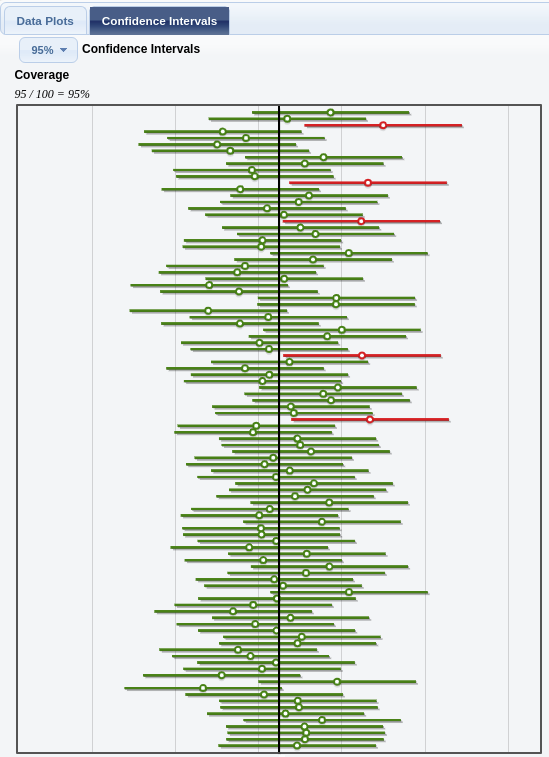

```{r setup, include=FALSE}
options(htmltools.dir.version = FALSE)
options(htmltools.preserve.raw = FALSE)
options(ggrepel.max.overlaps = Inf)

knitr::opts_chunk$set(echo = TRUE, 
                      dev = 'svg',
                      collapse = TRUE, 
                      comment = NA,  # PRINTS IN FRONT OF OUTPUT, default is '##' which comments out output
                      prompt = FALSE, # IF TRUE adds a > before each code input
                      warning = FALSE, 
                      message = FALSE,
                      fig.height = 3, 
                      fig.width = 4,
                      out.width = "100%"
                      )


# load necessary packages
library(tidyverse)
library(countdown)
library(mosaic)
library(ggthemes)
library(xaringanExtra)
library(forcats)
xaringanExtra::use_panelset()
xaringanExtra::use_tachyons()
xaringanExtra::use_clipboard()
xaringanExtra::use_extra_styles(
  hover_code_line = TRUE,         #<<
  mute_unhighlighted_code = TRUE  #<<
)
library(flipbookr)
library(patchwork)
library(Lock5Data)

# Set ggplot theme
theme_set(theme_tufte(base_size = 10))


yt <- 0

# read.csv("https://raw.githubusercontent.com/deepbas/statdatasets/main/APM_DougEvansCases.csv")

```


```{r xaringanExtra-clipboard, echo=FALSE}
htmltools::tagList(
  xaringanExtra::use_clipboard(
    button_text = "<i class=\"fa fa-clipboard\"></i>",
    success_text = "<i class=\"fa fa-check\" style=\"color: #90BE6D\"></i>",
    error_text = "<i class=\"fa fa-times-circle\" style=\"color: #F94144\"></i>"
  ),
  rmarkdown::html_dependency_font_awesome()
)
```


layout: true
  
<!-- <div class="my-footer"><span>Stat 230</span></div> -->
<!-- this adds the link footer to all slides, depends on my-footer class in css-->

---

class: title-slide, middle
<!-- background-image: url("assets/title-image2.jpg") -->
background-position: 10% 90%, 100% 50%
background-size: 160px, 100% 100%

# .fancy[Understanding Confidence Intervals and Bootstrap]

### .fancy[Stat 120]

`r format(Sys.Date(), ' %B %d %Y')`


---

class: middle

## Confidence Interval Recap

.bql[A .bold[confidence interval] for a parameter is an interval computed from sample data by a method that will capture the parameter for a specified proportion of all samples.

$$CI = PE \pm ME$$
.bold[95 % CI] $$ statistic \pm 2\times SE $$

]


---

## Confidence level analogy and recap

.bql.font60[
### Target Analogy:
  - Target represents the data distribution and bullseye is the true mean of the data.
]

.pull-left[
.bq.font60[
### Shooting Arrows:

    - Bow's confidence level determines accuracy.
    
    - A "95% confident" bow:
      - 95 arrows hit inside the bullseye out of 100
      - 5 arrows miss

### Single Shot Principle:

     - Each arrow either hits or misses.
  
     - No in-between or partial accuracy.


]
]


.pull-right[
<br>
<center>
<br>
<a style="font-size: smaller;">Confidence level analogy with throwing darts</a>
</center>


]


---

class: middle

#  Conceptual Understanding: Repeated Sampling

.pull-left[
<br>
.bq.font90[
- The success rate (proportion of all samples whose intervals contain the parameter) is known as the .bold[confidence level]

- A 95% confidence interval will contain the true .bold[parameter] for 95% of all samples
]
]

.pull-right[
<center>
<br>
<a style="font-size: smaller;">Repeated Sampling of 100 95% Confidence Intervals, Truth = Vertical Line</a>
</center>
]

---


# Example 1

A survey of .bold[1,502] Americans in January 2012 found that .bold[86%] consider the economy a “top priority” for the president and congress. The standard error for this statistic is .bold[0.01]. 

.bql[

What is the .bold[95% confidence interval] for the true proportion of all Americans that considered the economy a “top priority” at that time?


(1). (0.85, 0.87)

(2). (0.84, 0.88)

(3). (0.82, 0.90)

]

<br>
<details>
<summary>Click for answer</summary>
The correct answer is (2).
</details>

.footnote[Click [here](https://www.pewresearch.org/politics/2012/01/23/public-priorities-deficit-rising-terrorism-slipping/) for the link]

---


# Confidence Interval Interpretation

.bql[

Which of the following is an appropriate .bold[interpretation] for a 95% confidence interval:

A. “we are 95% sure the interval contains the parameter”

B. “there is a 95% chance the interval contains the parameter”

C. Both A and B

D. Neither A nor B
]

<br>
<details>
<summary>Click for answer</summary>
The correct answer is A.
</details>


---


# Common Misintepretations

.bql[
- .bold[Misinterpretation 1:] “A 95% confidence interval contains 95% of the data in the population"
- .bold[Misinterpretation 2:] “I am 95% sure that the mean of a sample will fall within a 95% confidence interval for the mean”
- .bold[Misinterpretation 3:] “The probability that the population parameter is in this particular 95% confidence interval is 0.95”
]

--


.yellow-h.font120[.b[Correct:] I am 95% sure that the mean of a population will fall within a 95% confidence interval for the mean]

---


<br>
<br>

# Example 2

.bql[
A 98% confidence interval for mean pulse rate is 65 to 71.  The interpretation “I am 98% sure that all students will have pulse rates between 65 and 71.” is

A. Correct

B. Incorrect

]

<br>
<details>
<summary>Click for answer</summary>
The correct answer is B.
</details>

---

<br>
<br>

# Example 3

.bql[
A 98% confidence interval for mean pulse rate is 65 to 71.  The interpretation “I am 98% sure that the mean pulse rate for this sample of students will fall between 65 and 71” is


A. Correct

B. Incorrect

]

<br>
<details>
<summary>Click for answer</summary>
The correct answer is B.
</details>

---

<br>
<br>

# Example 4

.bql[
A 98% confidence interval for mean pulse rate is 65 to 71.  The interpretation “I am 98% sure that the mean pulse rate for the population of all students will fall between 65 and 71” is


A. Correct

B. Incorrect

]

<br>
<details>
<summary>Click for answer</summary>
The correct answer is A.
</details>

---

<br>
<br>

# Level of Confidence

.bql[Which is wider? a 99% confidence interval or a 95% confidence interval?

(a) 95% CI

(b) 99% CI

]

<br>
<details>
<summary>Click for answer</summary>
The correct answer is (b). We need a larger interval (range of likely parameter values) to have more confidence.
</details>

---

background-image: url("images/cireview.png") 
background-position: cover
background-size: 800px, 100% 100%

---

<br>
<br>

# Recap: Sampling Distribution Vs Bootstrap Distribution

.pull-left[

.bq.font80[
.bold[Sampling Distribution of a statistic]

- Take .green[many samples] from the population, compute the statistic for each sample
- .bold[Shape:] bell-shaped when n is large
- .bold[Center:] population parameter
- .bold[Spread:] called the SE of the statistic
<br>
<br>
]
]

.pull-right[
.bq.font80[

.bold[Bootstrap Distribution of a statistic]

- Take .green[many bootstrap samples] from the original sample, compute the statistic for each bootstrap sample
- .bold[Shape:] bell-shaped when n is large
- .bold[Center:] original sample statistic!
- .bold[Spread:] called the bootstrap SE of the statistic
]

]

--

<br>
.out-t.center[The .bold[standard errors] from both approaches should be similar!!]


---

# Percentile Method Bootstrap

.bq.font90[If the bootstrap distribution is approximately symmetric, a P% confidence interval equals the percentiles in the bootstrap distribution so that the proportion of bootstrap statistics between the percentiles equal P%.]

<center>
<br>
<a>Percentiles of a bootstrap distribution</a>
</center>

---

class: middle

# The Magic of Bootstrapping

.bql.font90[
- We can use bootstrapping to approximate the SE for .bold[many types] of sample statistic!
    - Mean, proportion, differences, correlation, slope
    - Standard deviation, *median*

- What should the bootstrap distribution .bold[look] like?
    - “smooth” (i.e. not a lot of spikey-ness)
    - If using $95\% ME = 2SE$, should be symmetric and bell-shaped.
]


---

# Mercury and pH in Lakes

For Florida lakes, what is the correlation between average mercury level (ppm) in fish taken from a lake and acidity (pH) of the lake?

.pull-left[


<center>
<br>
<a>Mercury levels vs. pH</a>
</center>


]
.pull-right[

<center>
<br>
<a>A lake in Florida</a>
</center>

.bqt.font90[
$r = -0.575$

Give a 90% CI for $\rho$?
]
]


.footnote[Lange, Royals, and Connor, Transactions of the American Fisheries Society (1993)]

---

## Mercury and pH in Lakes (Link to [Statkey](http://www.lock5stat.com/StatKey/index.html))

<center>
<br>
<a>Bootstrapping correlation parameter.</a>
</center>

.out-t.font80[We are 90% confident that the true correlation between average mercury level and pH of Florida lakes is between -0.702 and -0.433.]


---

class: action

# <i class="fa fa-pencil-square-o" style="font-size:48px;color:purple">&nbsp;Your&nbsp;Turn&nbsp;`r (yt <- yt + 1)`</i>    

.pull-left-40[

]
.pull-right-60[

<br>
<br>
.bql[

- Let's head over to the [course helper page](https://stat120-fall23.netlify.app/) to see some more examples 
- We will then do a class activity together

]
]

`r countdown(minutes = 15, seconds = 00, top = 0 , color_background = "inherit", padding = "3px 4px", font_size = "2em")`


