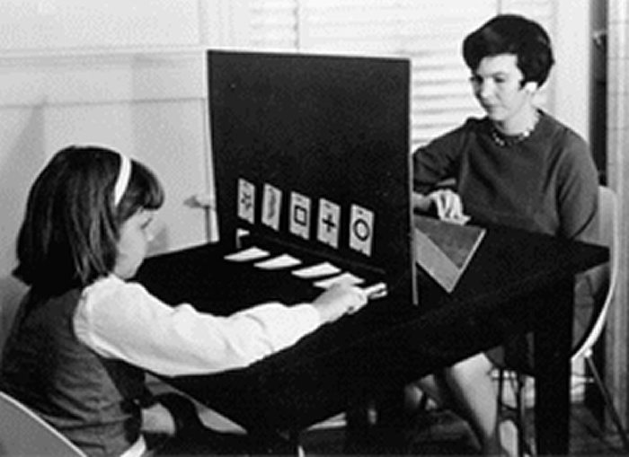

```{r setup, include=FALSE}
options(htmltools.dir.version = FALSE)
options(htmltools.preserve.raw = FALSE)
options(ggrepel.max.overlaps = Inf)

knitr::opts_chunk$set(echo = TRUE, 
                      dev = 'svg',
                      collapse = TRUE, 
                      comment = NA,  # PRINTS IN FRONT OF OUTPUT, default is '##' which comments out output
                      prompt = FALSE, # IF TRUE adds a > before each code input
                      warning = FALSE, 
                      message = FALSE,
                      fig.height = 3, 
                      fig.width = 4,
                      out.width = "100%"
                      )


# load necessary packages
library(tidyverse)
library(countdown)
library(mosaic)
library(ggthemes)
library(xaringanExtra)
library(forcats)
xaringanExtra::use_panelset()
xaringanExtra::use_tachyons()
xaringanExtra::use_clipboard()
xaringanExtra::use_extra_styles(
  hover_code_line = TRUE,         #<<
  mute_unhighlighted_code = TRUE  #<<
)
library(flipbookr)
library(patchwork)
library(Lock5Data)

# Set ggplot theme
theme_set(theme_tufte(base_size = 10))


yt <- 0

# read.csv("https://raw.githubusercontent.com/deepbas/statdatasets/main/APM_DougEvansCases.csv")

```


```{r xaringanExtra-clipboard, echo=FALSE}
htmltools::tagList(
  xaringanExtra::use_clipboard(
    button_text = "<i class=\"fa fa-clipboard\"></i>",
    success_text = "<i class=\"fa fa-check\" style=\"color: #90BE6D\"></i>",
    error_text = "<i class=\"fa fa-times-circle\" style=\"color: #F94144\"></i>"
  ),
  rmarkdown::html_dependency_font_awesome()
)
```


layout: true
  
<!-- <div class="my-footer"><span>Stat 230</span></div> -->
<!-- this adds the link footer to all slides, depends on my-footer class in css-->

---

class: title-slide, middle
<!-- background-image: url("assets/title-image2.jpg") -->
background-position: 10% 90%, 100% 50%
background-size: 160px, 100% 100%

# .fancy[Randomization Distributions and P-values]

### .fancy[Stat 120]

`r format(Sys.Date(), ' %B %d %Y')`


---

class: middle

# Statistical Hypothesis

.bql.font120[
.bold[Null Hypothesis] $(H_0):$ Claim that there is no effect or difference.

.bold[Alternative Hypothesis] $(H_a):$ Claim for which we seek evidence.
]


.out-t[Always claims about population parameters.]

---

# Statistical Significance

.bql[
When results as extreme as the observed sample statistic are unlikely to occur by random chance alone (assuming the null
hypothesis is true), we say the sample results are .bold[statistically significant]
]

--

<br>

.bq.font90[
- If our sample is .bold[statistically significant], we have convincing
evidence against $H_0$, .bold[in favor of] $H_a$
- If our sample is .bold[not statistically significant], our test is
.bold[inconclusive. The null hypothesis may be true (or maybe not)].

]

---

class: inverse, middle

# Key Question: How unusual is it to see a sample statistic as extreme as that observed, if $H_0$ is true?


---

# Extrasensory Perception


.pull-left[
.bq[p= Proportion of correct guesses
$$\begin{array}{l}
\mathrm{H}_{0}: \boldsymbol{p}=\mathbf{1} / 5 \\
\mathrm{H}_{\mathrm{a}}: \boldsymbol{p}>\mathbf{1} / \mathbf{5}
\end{array}$$
]
]

.pull-right[
<center>
<br>
<a></a>
</center>

]

--

.bql.font80[
- Suppose we try this $n=10$ times and get 3 correct guesses.
- What kinds of statistics (sample proportions) would we observe just by chance, if the null were true and ESP does not exist?
- How can we generate this distribution?
]

--

.out-t[Simulate many samples of size $n=10$ with $p=0.2$ and look at the distribution of sample proportions.]


---

# Randomization Distribution

.bql[
A randomization distribution is a collection of statistics from samples simulated assuming the null hypothesis is true
]

<br>

.bq[

- Also known as a .bold[permutation distribution].

- A randomization distribution is .bold[centered] at the value of the .bold[parameter given in the null hypothesis].

]


---


class: action

# <i class="fa fa-pencil-square-o" style="font-size:48px;color:purple">&nbsp;Your&nbsp;Turn&nbsp;`r (yt <- yt + 1)`</i>    

.pull-left-40[

]
.pull-right-60[
<br>
.bq[

Randomly choose a letter from A B C D E and write it down (don’t show anyone!)

Find a partner, telepathically communicate your letter (no auditory or visual clues!) and have them guess your
letter.

Repeat a couple of times then switch roles.


]

.out-t[How often did you guess correctly?]
]

`r countdown(minutes = 5, seconds = 00, top = 0 , color_background = "inherit", padding = "3px 4px", font_size = "2em")`

