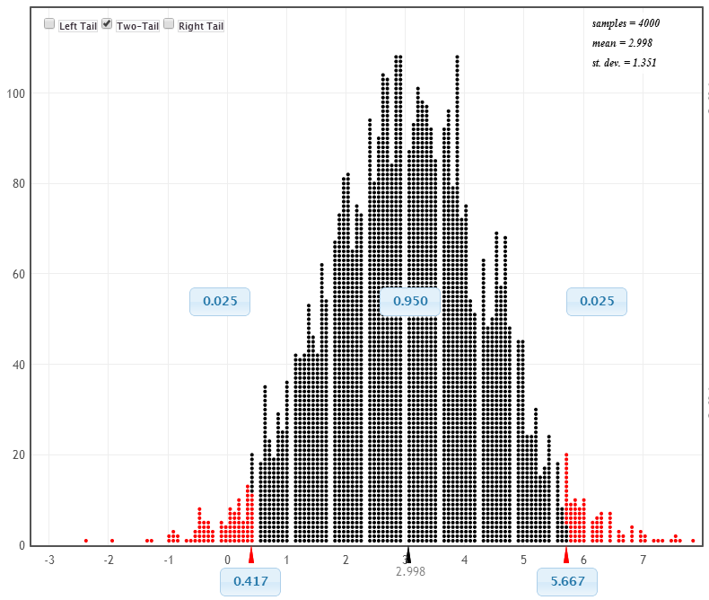

```{r setup, include=FALSE}
options(htmltools.dir.version = FALSE)
options(htmltools.preserve.raw = FALSE)
options(ggrepel.max.overlaps = Inf)

knitr::opts_chunk$set(echo = TRUE, 
                      dev = 'svg',
                      collapse = TRUE, 
                      comment = NA,  # PRINTS IN FRONT OF OUTPUT, default is '##' which comments out output
                      prompt = FALSE, # IF TRUE adds a > before each code input
                      warning = FALSE, 
                      message = FALSE,
                      fig.height = 3, 
                      fig.width = 4,
                      out.width = "100%"
                      )


# load necessary packages
library(tidyverse)
library(countdown)
library(mosaic)
library(ggthemes)
library(xaringanExtra)
library(forcats)
xaringanExtra::use_panelset()
xaringanExtra::use_tachyons()
xaringanExtra::use_clipboard()
xaringanExtra::use_extra_styles(
  hover_code_line = TRUE,         #<<
  mute_unhighlighted_code = TRUE  #<<
)
library(flipbookr)
library(patchwork)
library(Lock5Data)

# Set ggplot theme
theme_set(theme_tufte(base_size = 10))


yt <- 0

# read.csv("https://raw.githubusercontent.com/deepbas/statdatasets/main/APM_DougEvansCases.csv")

```


```{r xaringanExtra-clipboard, echo=FALSE}
# Icon for your turn
htmltools::tagList(
  xaringanExtra::use_clipboard(
    button_text = "<i class=\"fa fa-clipboard\"></i>",
    success_text = "<i class=\"fa fa-check\" style=\"color: #90BE6D\"></i>",
    error_text = "<i class=\"fa fa-times-circle\" style=\"color: #F94144\"></i>"
  ),
  rmarkdown::html_dependency_font_awesome()
)
```


layout: true
  
<!-- <div class="my-footer"><span>Stat 230</span></div> -->
<!-- this adds the link footer to all slides, depends on my-footer class in css-->

---

class: title-slide, middle
<!-- background-image: url("images/title-image2.png") -->
background-position: 10% 90%, 100% 50%
background-size: 160px, 100% 100%

# .fancy[Additional topics in testing]

### .fancy[Stat 120]

`r format(Sys.Date(), ' %B %d %Y')`


---

class: middle

# Significance Level $\&$ Formal  Decisions

.bql[The .bold[significance level], $\alpha$ is  the threshold below which the p-value is deemed small enough to reject the null hypothesis (evidence is statistically significant).
]

$$ \mathrm{p} \text {-value }<\alpha \quad \Longrightarrow \quad \text { Reject } \mathrm{H}_0 $$
$$\mathrm{p} \text {-value } \geq \alpha \quad \Longrightarrow \text { Do not Reject } \mathrm{H}_0$$
Common levels:
.bq[
- $10 \%$ : need some evidence to reject the null
- $5 \%$ : need moderate evidence to reject the null
- $1 \%$ : need strong evidence to reject the null
]

---

# Errors


|  | Reject $H_0$ | Do not reject $H_0$ |
| :--- | :--- | :--- |
| $H_0$ true | .red.bold[TYPE I ERROR] | <p style="text-align: center;">&#128516;</p> |
| $H_0$ false | <p style="text-align: center;">&#128516;</p> | .red.bold[TYPE II ERROR] |

<br>

.bq[
- A Type I Error is rejecting a true null (false positive)
- A Type II Error is not rejecting a false null (false negative)
]

---

class: middle

# Statistical Significance

Hypothesis testing is similar to how our justice system works (or is supposed to work!).
\begin{align*}
H_0 & \text { : defendant is innocent }  \\ H_A & \text { : defendant is guilty }
\end{align*}

Assumption: Defendant is innocent $(H_0)$

.bq.font80[
.bold[Verdicts:]

Guilty: evidence (data) "beyond a reasonable doubt" points to guilt (Statistically significant)
- Type I error possible: convict an innocent person

Not Guilty: evidence (data) not beyond a reasonable doubt, but we don't know if they are truly innocent $\left(H_0\right)$
- Type II error possible: release a guilty person
]

---

class: middle

# Examples

.bq.font80[
Science study of gender stereotypes:
- Comparing interest between 5-year-old boys and girls in a game for "really, really smart kids"
- test using $\alpha=0.05$; reported $p$-value of $0.46$

Decision?
- Do not reject $\mathrm{H}_0$ : no evidence of a difference in mean interest level

Possible error?
- Type II: if a difference in mean interest level exists, then we would have made an error when not finding evidence of a gender difference in interest levels.

Consequence of making this error?
- Mislead the public about when gender stereotypes start emerging in young children
]


---

class: middle

# Examples

.bq[
Memory: test using $\alpha=0.05$; data gives $p$-value of $0.048$

Decision?
- Reject $\mathrm{H}_0$

Possible error?
- Type I: if there is no difference in treatments, then we would have made an error in claiming that there was.

Consequences of making this error?
- Mislead the public about the benefits of sleep over caffeine.
- The nice thing about type I errors is that we can control the chance of such an error...
]

---

class: middle

#  $\alpha=$ Probability of Type I Error

.out-t[The significance level $\alpha$ controls the type I error rate.]

.pull-left[

.bq.font80[
- Recall the Florida Lakes slope test: $$\mathrm{H}_0: \beta=0 \quad \mathrm{H}_{\mathrm{a}}: \beta<0$$

- If $\mathrm{H}_0$ is true and $\alpha=0.05$, then $5 \%$ of sample slopes will be lower red tail $(b \leq 0.06)$.

- $5 \%$ of the sample slopes will give $p$-values less than $0.05$, so $5 \%$ of statistics will lead to rejecting $\mathrm{H}_0$ if it is true (Type I error)!!!

]
]


.pull-right[

<center>
 <br>
<a>Null distribution</a>
</center>

]

---

class: middle

#  $\alpha=$ Probability of Type I Error

.out-t[The significance level $\alpha$ controls the type I error rate.]

.pull-left[

.bq.font80[
- Recall the Florida Lakes slope test: $$\mathrm{H}_0: \beta=0 \quad \mathrm{H}_{\mathrm{a}}: \beta<0$$

- If $\mathrm{H}_0$ is true and $\alpha=0.05$, then $5 \%$ of sample slopes will be lower red tail $(b \leq 0.06)$.

- $5 \%$ of the sample slopes will give $p$-values less than $0.05$, so $5 \%$ of statistics will lead to rejecting $\mathrm{H}_0$ if it is true (Type I error)!!!

]
]


.pull-right[

<center>
 <br>
<div style="position: absolute; top: 50%; left: 50%;">
<span style="content: '\2192'; font-size: 20px; color: #920; text-align: center; white-space: pre-line;">
  <p>Any b here will <br> mean we reject <br> null</p>
   <i class="gg-arrow-long-right"></i>
</span>
</div>
<a>Null distribution</a>
</center>

]

---

class: middle

# Selecting a significance level

.bq.font80[
Decreasing $\alpha$ will lower your Type I error rate (makes it harder to reject the null)
  - but it will also increase your type II error rate (makes it harder to accept a true alternative)]
.bq.font80[
If a Type I error (rejecting a true null) is much worse than a Type II error, we may choose a smaller $\alpha$, like $\alpha=0.01$ (need lots of evidence to reject null).
  - E.g. sending an innocent person to jail]
.bq.font80[
If a Type II error (not rejecting a false null) is much worse than a Type I error, we may choose a larger $\alpha$, like $\alpha=0.10$
- E.g. a false negative test for a serious disease
]
]

---

class: middle

# Probability of Type II Error

.bq.font80[
Not as simple to compute since the alternative is assumed to be true
- E.g. which value in $\mathrm{H}_{\mathrm{a}}: \beta<0$ do we select to create an "alternative" randomization distribution?]
<br>
.bq.font80[
The probability of making a Type II Error (not rejecting a false null) depends on
- Effect size (how far the truth is from the null)
- Sample size (bigger $\mathrm{n}$ means less uncertainty)
- Variability of measurements
- Significance level (bigger $\alpha$ means more false positives but fewer false negatives)]
<br>
.bq.font80[
The power of a test is the chance that it will correctly reject the null, or
$$1 - \text{Prob(Type II error)}$$
]

---

# Statistical Conclusions

Formal decision of hypothesis test, based on a = 0.05 :

<center>
 <br>
</center>


Informal strength of evidence against H0:


<center>
 <br>
</center>

---

Smaller p-values give us stronger and stronger evidence for the alternative hypothesis.
Larger p-values indicate little evidence for the alternative hypothesis. 


---

<center>
 <br>
</center>

---

<center>
 <br>
</center>

---


.bq[
If a $95 \%$ CI contains the parameter in $\mathrm{H}_0$, then a two-tailed test should not reject $\mathrm{H}_0$ at a $5 \%$ significance level.
]

--

.bq[
If a $95 \%$ CI misses the parameter in $\mathrm{H}_0$, then a two-tailed test should reject $\mathrm{H}_0$ at a $5 \%$ significance level.
]

---

<center>
 <br>
</center>

.bq[The 95% confidence interval misses null difference of 0. Reject the null at 5% level]


---

<center>
 <br>
</center>


.bq[The 99% confidence interval contains null difference of 0. Do not reject the null at 1% level]

---

# Sample Size and Statistical Significance

.bql[
- With small sample sizes, even large differences or effects may not be significant.
- With large sample sizes, even a very small difference or effect can be significant
]

---

<center>
 <br>
</center>


---

<center>
 <br>
</center>

---

# Multiple Testing/Comparison


When multiple hypothesis tests are conducted, the chance that at least one test incorrectly rejects a true null hypothesis increases with the number of tests.

- If the null hypotheses are all true, α of the tests will yield statistically significant results just by random chance.


---

# Diet and Sex of Baby


.bq[
- Are certain foods in your diet associated with whether or not you conceive a boy or a girl? 
- To study this, researchers asked women about their eating habits, including asking whether or not they ate 133 different foods regularly
]


.footnote[http://www.newscientist.com/article/dn13754-breakfast-cereals-boost-chances-of-conceiving-boys.html]

---

# Diet and Sex of Baby


> For each of the 133 foods studied, a hypothesis test was conducted for a difference between mothers who conceived boys and girls in the proportion who consume each food


.bq[What are the null and alternative hypotheses?

Compare two populations: mothers who have boys vs. mothers who have girls

$\boldsymbol{p}_b$ : proportion of mothers who have boys that consume the food regularly

$\boldsymbol{p}_g$ : proportion of mothers who have girls that consume the food regularly
]

\begin{aligned}
& \mathrm{H}_0: p_b=p_g \\
& \mathrm{H}_a: p_b \neq p_g
\end{aligned}

---

# Diet and Sex of Baby

A significant difference was found for breakfast cereal (mothers of boys eat more), prompting the headline

.green-h.center[“Breakfast Cereal Boosts Chances of 	Conceiving Boys”]

How might you explain this?

.bq[Random chance; several tests (about 6 or 7) are going to be significant, even if no differences exist]

---

# Diet and Sex of Baby

> If there are NO differences (all 133 null hypotheses are true), about how many significant differences would be found using α = 0.05?

$$133 \pm 0.05 = 6.65$$
.bq[Expect about 6-7 statistically significant foods even if the rate of food consumption is equal for women who have boys and women who have girls]


---

class: middle

# Multiple Comparisons

.bq[The most important thing is to be aware of this issue, and not to trust claims that are obviously one of many tests (unless they specifically mention an adjustment for multiple testing)]

.bq[There are ways to account for this (e.g. Bonferroni’s Correction), but these are beyond the scope of this class]


---

class: action

# <i class="fa fa-pencil-square-o" style="font-size:48px;color:purple">&nbsp;Your&nbsp;Turn&nbsp;`r (yt <- yt + 1)`</i>    

.pull-left-40[

]

<br>


`r countdown(minutes = 5, seconds = 00, top = 0 , color_background = "inherit", padding = "3px 4px", font_size = "2em")`

