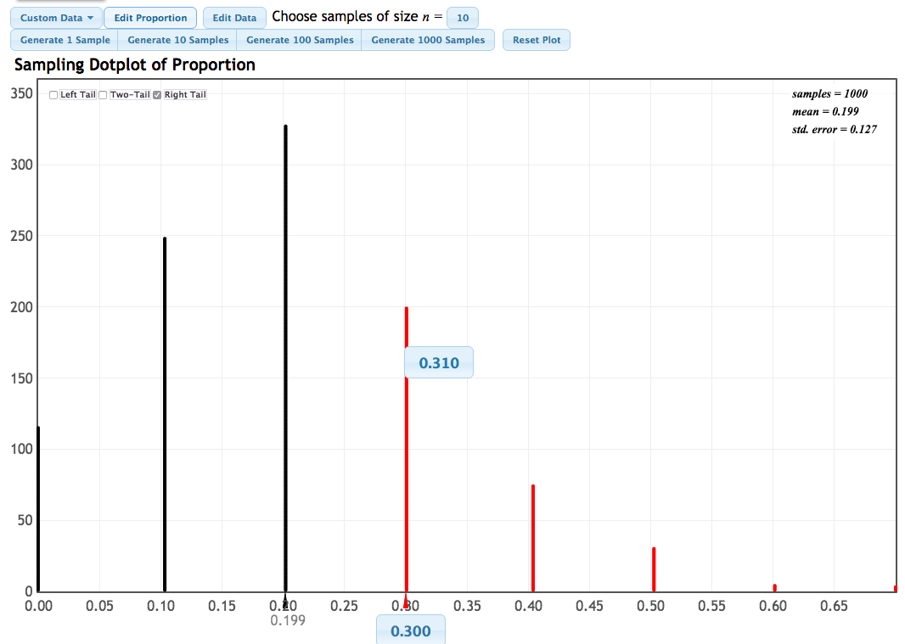
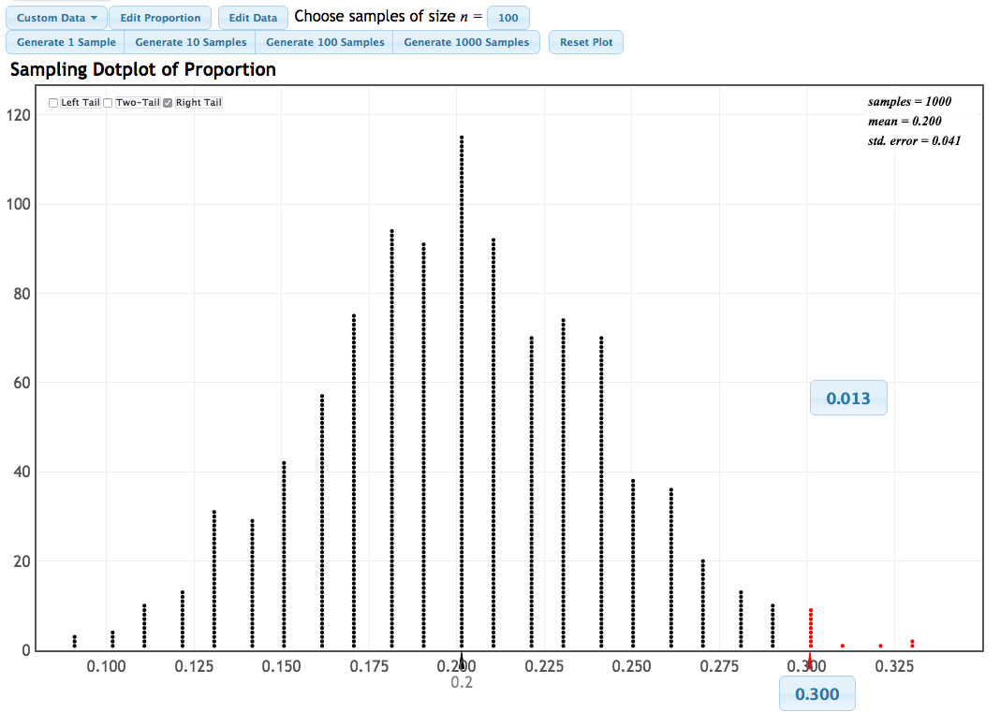
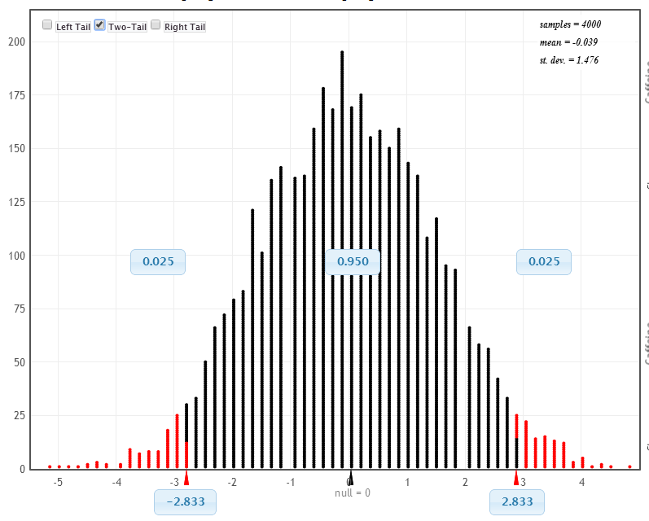
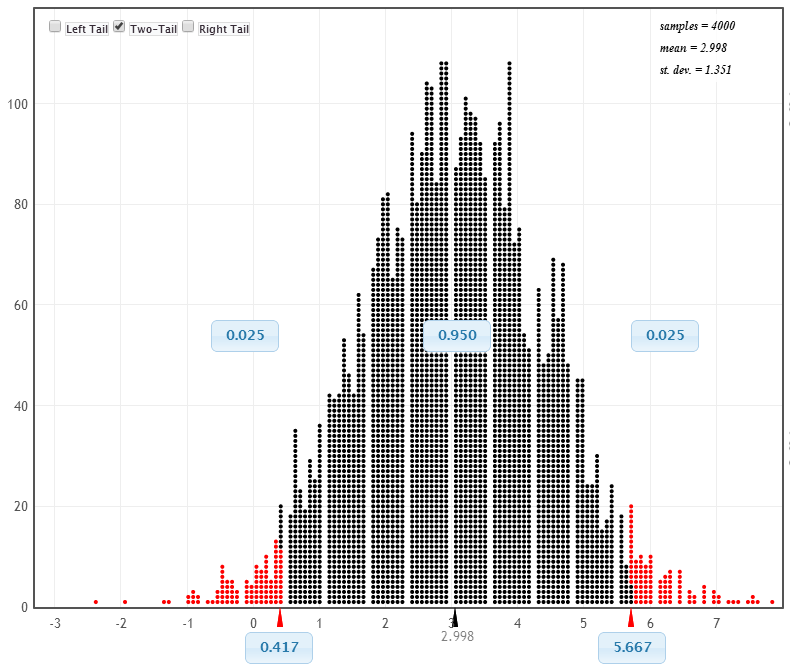
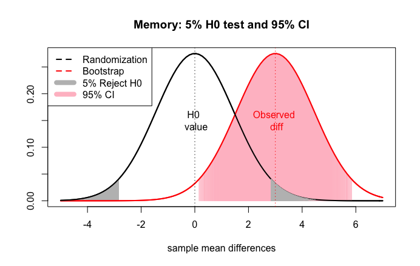
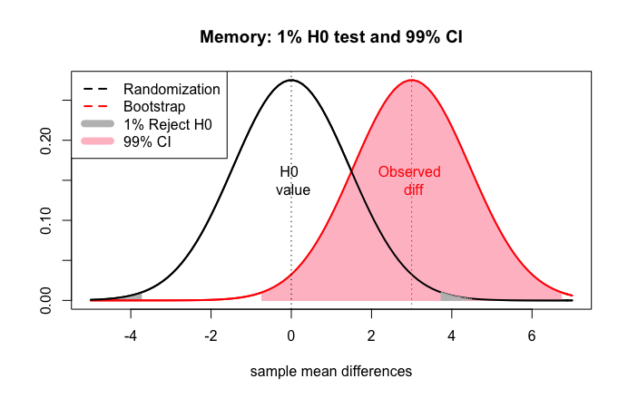
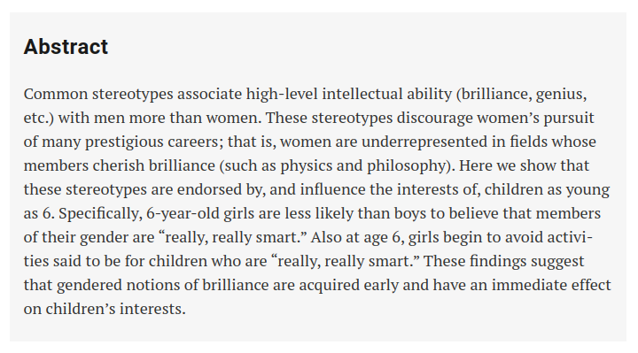

```{r setup, include=FALSE}
options(htmltools.dir.version = FALSE)
options(htmltools.preserve.raw = FALSE)
options(ggrepel.max.overlaps = Inf)

knitr::opts_chunk$set(echo = TRUE, 
                      dev = 'svg',
                      collapse = TRUE, 
                      comment = NA,  # PRINTS IN FRONT OF OUTPUT, default is '##' which comments out output
                      prompt = FALSE, # IF TRUE adds a > before each code input
                      warning = FALSE, 
                      message = FALSE,
                      fig.height = 3, 
                      fig.width = 4,
                      out.width = "100%"
                      )


# load necessary packages
library(tidyverse)
library(countdown)
library(mosaic)
library(ggthemes)
library(xaringanExtra)
library(forcats)
xaringanExtra::use_panelset()
xaringanExtra::use_tachyons()
xaringanExtra::use_clipboard()
xaringanExtra::use_extra_styles(
  hover_code_line = TRUE,         #<<
  mute_unhighlighted_code = TRUE  #<<
)
library(flipbookr)
library(patchwork)
library(Lock5Data)

# Set ggplot theme
theme_set(theme_tufte(base_size = 10))


yt <- 0

# read.csv("https://raw.githubusercontent.com/deepbas/statdatasets/main/APM_DougEvansCases.csv")

```


```{r xaringanExtra-clipboard, echo=FALSE}
# Icon for your turn
htmltools::tagList(
  xaringanExtra::use_clipboard(
    button_text = "<i class=\"fa fa-clipboard\"></i>",
    success_text = "<i class=\"fa fa-check\" style=\"color: #90BE6D\"></i>",
    error_text = "<i class=\"fa fa-times-circle\" style=\"color: #F94144\"></i>"
  ),
  rmarkdown::html_dependency_font_awesome()
)
```


layout: true
  
<!-- <div class="my-footer"><span>Stat 230</span></div> -->
<!-- this adds the link footer to all slides, depends on my-footer class in css-->

---

class: title-slide, middle
<!-- background-image: url("images/title-image2.png") -->
background-position: 10% 90%, 100% 50%
background-size: 160px, 100% 100%

# .fancy[Additional topics in testing]

### .fancy[Stat 120]

`r format(Sys.Date(), ' %B %d %Y')`


---

# Question 1

.bql.font80[
A new blood thinning drug is being tested against the current drug in a double-blind experiment. Is there evidence that the mean blood thinness rating is higher for the new drug? Using $n$ for the new drug and $o$ for the old drug, which of the following are the null and alternative hypotheses?
]

<br>


.hljs[
A. $\mathrm{H}_0: \mu_{\mathrm{n}}>\mu_0 \quad\mathrm{Vs}\quad \mathrm{H}_{\mathrm{a}}: \mu_{\mathrm{n}}=\mu_{\mathrm{o}}$

B. $H_0: \mu_n=\mu_0 \quad \mathrm{Vs} \quad H_2: \mu_n \neq \mu_0$

C. $\mathrm{H}_0: \mu_{\mathrm{n}}=\mu_0\quad\mathrm{Vs}\quad\mathrm{H}_{\mathrm{a}}: \mu_{\mathrm{n}}>\mu_0$

D. $\mathrm{H}_0: \bar{x}_n=\bar{x}_o \quad \mathrm{Vs} \quad \mathrm{H}_{\mathrm{a}}: \bar{x}_n \neq \bar{x}_o$

E. $\mathrm{H}_0: \bar{x}_n=\bar{x}_o\quad\mathrm{Vs}\quad\mathrm{H}_{\mathrm{a}}: \bar{x}_n>\bar{x}_o$
]


<details>
<summary class="answer">Click for answer</summary>
The correct answer is C.
</details>


---

# Question 2

.bql.font80[
A new blood thinning drug is being tested against the current drug in a double-blind experiment, and the hypotheses are:
$$\mathrm{H}_0: \mu_{\mathrm{n}}=\mu_{\mathrm{o}} \quad \text { vS } \quad \mathrm{H}_{\mathrm{a}}: \mu_{\mathrm{n}}>\mu_{\mathrm{o}}$$
What does a Type I Error mean in this situation?
]


.hljs[
A. We reject $\mathrm{H}_0$

B. We do not reject $\mathrm{H}_0$

C. We find evidence the new drug is better when it is really not better.

D. We are not able to conclude that the new drug is better even though it really is.

E. We are able to conclude that the new drug is better.
]


<details>
<summary class="answer">Click for answer</summary>
The correct answer is C.
</details>


---


# Question 3

.bql.font80[
A new blood thinning drug is being tested against the current drug in a double-blind experiment, and the hypotheses are:
$$\mathrm{H}_0: \mu_{\mathrm{n}}=\mu_{\mathrm{o}} \quad \text { vS } \quad \mathrm{H}_{\mathrm{a}}: \mu_{\mathrm{n}}>\mu_{\mathrm{o}}$$

What does a Type II Error mean in this situation?
]


.hljs[
A. We reject $\mathrm{H}_0$

B. We do not reject $\mathrm{H}_0$

C. We find evidence the new drug is better when it is really not better.

D. We are not able to conclude that the new drug is better even though it really is.

E. We are able to conclude that the new drug is better.
]


<details>
<summary class="answer">Click for answer</summary>
The correct answer is D.
</details>

---


# Question 4

.bql.font80[
A new blood thinning drug is being tested against the current drug in a double-blind experiment, and the hypotheses are:
$$\mathrm{H}_0: \mu_{\mathrm{n}}=\mu_{\mathrm{o}} \quad \text { vS } \quad \mathrm{H}_{\mathrm{a}}: \mu_{\mathrm{n}}>\mu_{\mathrm{o}}$$

If the new drug has potentially serious side effects, we should pick a significance level that is:]


.hljs[
A. Relatively small (such as $1 \%$ )

B. Middle of the road $(5\%)$

C. Relatively large (such as $10 \%$ )

]


<details>
<summary class="answer">Click for answer</summary>
The correct answer is A. Since a Type 1 error would be serious, we use a small significance level
</details>


---

class: middle

# Factors Affecting Type I and Type II Error Rates


## Sample Size

.hljs[
- **Larger Sample Sizes**:
  - Improve the accuracy of the test.
  - Decrease the chance of Type II error.

- **Smaller Sample Sizes**:
  - Increase the risk of not detecting a true effect (Type II error).
]

---

class: middle

# Factors Affecting Type I and Type II Error Rates

## Variability

.hljs[
- **Greater Variability**:
  - Increases chances of both Type I and Type II errors.

- **Lesser Variability**:
  - Reduces chances of both errors.
]

--

.blue-h[**Note**: Ensuring a sufficiently large sample and considering the inherent variability in the population are vital in hypothesis testing.]

---

# Example: Randomization distribution with $n=10$

<center>
 <br>
</center>

---

# Example: Randomization distribution with $n=100$


<center>
 <br>
</center>


---

<br>

.pull-left[## .bold[Bootstrap Distribution]

.bq.font80[
- Our best guess at the distribution of sample statistics

- Centered around the observed sample statistic

- Simulate sampling from the population by resampling from the original sample
]
]

.pull-right[## .bold[Randomization Distribution]

.bq.font80[
- Our best guess at the distribution of sample statistics, if $\mathrm{H}_0$ were true 

- Centered around the null hypothesized value

- Simulate samples assuming $\mathrm{H}_0$ were true
<br>
]
]

--

.out-t[
.b[Big difference]: a randomization distribution assumes $H_0$ is true, while a bootstrap distribution does not]

---

# Example: bootstrap or randomization?

<center>
 <br>
</center>

---

# Example: bootstrap or randomization?

<center>
 <br>
</center>


---


# Using confidence intervals for hypothesis testing

.bq.font110[
If a $95 \%$ CI contains the parameter in $\mathrm{H}_0$, then a two-tailed test should not reject $\mathrm{H}_0$ at a $5 \%$ significance level.
]

<br>
--

.bq.font110[
If a $95 \%$ CI misses the parameter in $\mathrm{H}_0$, then a two-tailed test should reject $\mathrm{H}_0$ at a $5 \%$ significance level.
]

---

<center>
 <br>
</center>

.bq[The 95% confidence interval misses null difference of 0. Reject the null at 5% level]


---

<center>
 <br>
</center>


.bq[The 99% confidence interval contains null difference of 0. Do not reject the null at 1% level]

---

# Gender stereotypes in children

<center>
 <br>
</center>

.footnote[[Click here for the article](https://www.science.org/doi/10.1126/science.aah6524)]

---

class: action

# <i class="fa fa-pencil-square-o" style="font-size:48px;color:purple">&nbsp;Your&nbsp;Turn&nbsp;`r (yt <- yt + 1)`</i>    

.pull-left[

]

<br>


.pull-right[
<br>
.bql[
- Let's go over to the [course helper page](https://stat120-fall23.netlify.app/)
- Please do the class activity and let me know if you have any questions
- Feel free to talk to your neighbor
]
]

`r countdown(minutes = 20, seconds = 00, top = 0 , color_background = "inherit", padding = "3px 4px", font_size = "2em")`

