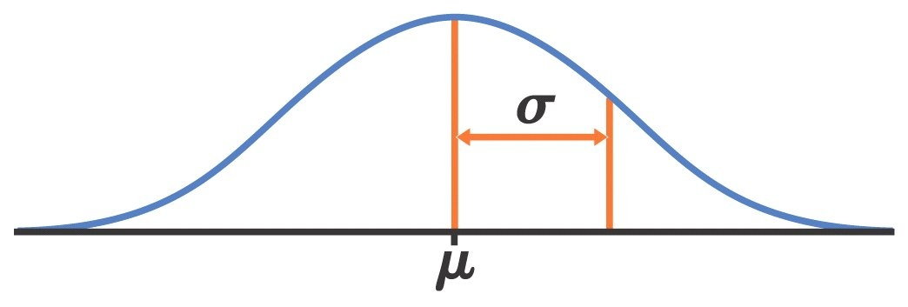
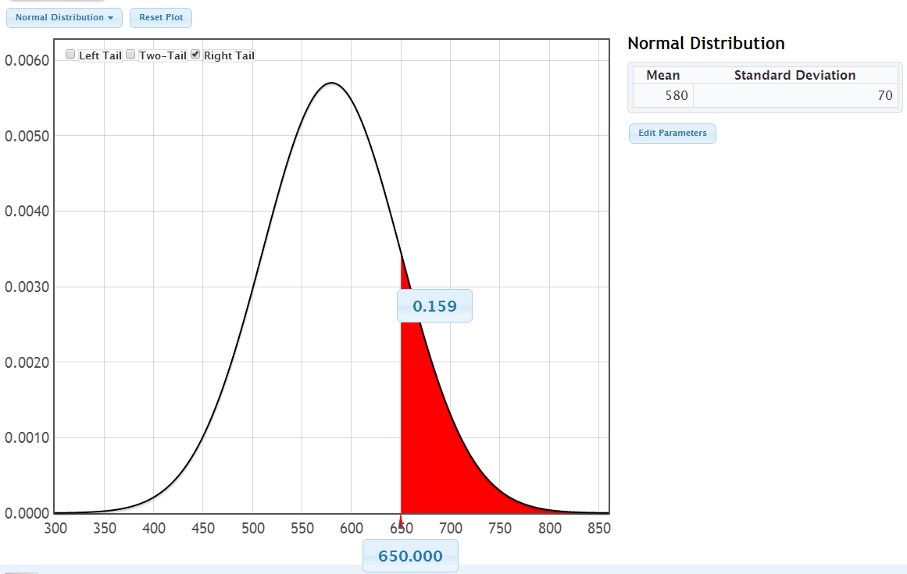
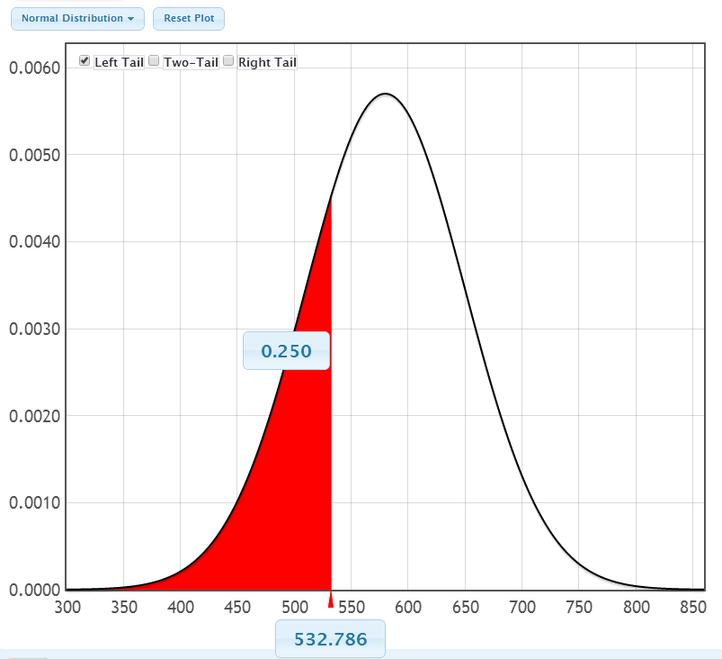

```{r setup, include=FALSE}
options(htmltools.dir.version = FALSE)
options(htmltools.preserve.raw = FALSE)
options(ggrepel.max.overlaps = Inf)

knitr::opts_chunk$set(echo = TRUE, 
                      dev = 'svg',
                      collapse = TRUE, 
                      comment = NA,  # PRINTS IN FRONT OF OUTPUT, default is '##' which comments out output
                      prompt = FALSE, # IF TRUE adds a > before each code input
                      warning = FALSE, 
                      message = FALSE,
                      fig.height = 3, 
                      fig.width = 4,
                      out.width = "100%",
                      fig.align = "center"
                      )


# load necessary packages
library(tidyverse)
library(countdown)
library(mosaic)
library(ggthemes)
library(xaringanExtra)
library(forcats)
xaringanExtra::use_panelset()
xaringanExtra::use_tachyons()
xaringanExtra::use_clipboard()
xaringanExtra::use_extra_styles(
  hover_code_line = TRUE,         #<<
  mute_unhighlighted_code = TRUE  #<<
)
library(flipbookr)
library(patchwork)
library(Lock5Data)

# Set ggplot theme
theme_set(theme_tufte(base_size = 10))


yt <- 0

# read.csv("https://raw.githubusercontent.com/deepbas/statdatasets/main/APM_DougEvansCases.csv")

```


```{r xaringanExtra-clipboard, echo=FALSE}
htmltools::tagList(
  xaringanExtra::use_clipboard(
    button_text = "<i class=\"fa fa-clipboard\"></i>",
    success_text = "<i class=\"fa fa-check\" style=\"color: #90BE6D\"></i>",
    error_text = "<i class=\"fa fa-times-circle\" style=\"color: #F94144\"></i>"
  ),
  rmarkdown::html_dependency_font_awesome()
)
```


layout: true
  
<!-- <div class="my-footer"><span>Stat 230</span></div> -->
<!-- this adds the link footer to all slides, depends on my-footer class in css-->

---

class: title-slide, middle
<!-- background-image: url("assets/title-image2.jpg") -->
background-position: 10% 90%, 100% 50%
background-size: 160px, 100% 100%

# .fancy[The Normal Distribution!]

### .fancy[Stat 120]

`r format(Sys.Date(), ' %B %d %Y')`


---

class: middle

# Density Curve

> A density curve is a theoretical model to describe a distribution.

<br>

.bq[
Distribution for 
- individual measurements in population (for a quantitative variable)
- Sampling distribution for a statistic
]

.bq[
All density curves have an area under the curve of 1 (100%)
- give proportions/percents as areas under the curve
]

---

# Normal Distribution

.bq[A normal distribution has a symmetric bell-shaped density curve.]

```{r, echo=FALSE, out.width="50%"}
ggplot(data = data.frame(x = c(-4, 4)), aes(x)) + 
  stat_function(fun = dnorm, args = list(mean = 0, sd = 1)) +
  labs(title = "Standard Normal Curve") +
  xlab("") + ylab("") + 
  theme(plot.title = element_text(hjust = 0.5))
```


---

# The Normal Model: $X \sim N(\mu, \sigma)$

.bq[The mean and SD determine how a normal density curve looks.
The normal model parameters are
- $\mu$ = model mean (center)
- $\sigma=$ model SD (variability)
]

<br>

<center>
 <br>
</center>

---

# What proportion of people score above 650?

```{r, echo=FALSE, out.width="70%"}
x <- seq(from = 300, to = 900, by = 0.1)
y <- dnorm(x, mean = 580, sd = 70)
ggplot(data = data.frame(x, y), aes(x = x, y = y)) +
  geom_line(color = "blue") +
  geom_polygon(data = data.frame(x = c(650, x[x >= 650], 650), y = c(0, y[x >= 650], 0)),
              aes(x = x, y = y), fill = "red", alpha = 0.5) +
  theme(axis.title.y = element_blank(),
        axis.text.y = element_blank(),
        axis.ticks.y = element_blank())
```


<center>
<div style="position: absolute; top: 20%; left: 70%;">
<span style="content: '\2192'; font-size: 20px; color: #FF00FF; text-align: center; white-space: pre-line;">
  <p>Area under the curve <br> for scores 650 & higher</p>
</span>
</div>
</center>

---

# How can we find areas under a normal density?


```{r, echo=FALSE, out.width="50%"}
x <- seq(from = 300, to = 900, by = 0.1)
y <- dnorm(x, mean = 580, sd = 70)
ggplot(data = data.frame(x, y), aes(x = x, y = y)) +
  geom_line(color = "blue") +
  geom_polygon(data = data.frame(x = c(500, x[x >= 500 & x <= 700], 700), y = c(0, y[x >= 500 & x <= 700], 0)),
              aes(x = x, y = y), fill = "#346B5A", alpha = 0.5) +
  theme(axis.title.y = element_blank(),
        axis.text.y = element_blank(),
        axis.ticks.y = element_blank(),
        axis.text.x = element_blank(),
        axis.ticks.x = element_blank(),
        axis.title.x = element_blank()) +
  annotate("text", x = 500, y = -0.0001, label = "a") +
  annotate("text", x = 700, y = -0.0001, label = "b")
```


\begin{align*}
\text { Area }=\int_a^b \frac{1}{\sqrt{2 \pi} \sigma} e^{-\frac{(x-\mu)^2}{2 \sigma^2}} d x
\end{align*}

---

# StatKey – Verbal SAT population 

<center>
 <br>
</center>

---

# StatKey – Verbal SAT population

<center>
 <br>
</center>

---

```{r, echo=FALSE, out.width="70%"}
library(gridExtra)
x <- seq(from = 300, to = 900, by = 0.1)
y <- dnorm(x, mean = 580, sd = 70)
p1 <- ggplot(data = data.frame(x, y), aes(x = x, y = y)) +
  geom_line(color = "blue") +
  geom_polygon(data = data.frame(x = c(510, x[x >= 510 & x <= 650], 650), y = c(0, y[x >= 510 & x <= 650], 0)),
              aes(x = x, y = y), fill = "maroon", alpha = 0.5) +
  theme(axis.title.y = element_blank(),
        axis.text.y = element_blank(),
        axis.ticks.y = element_blank(),
        axis.title.x = element_blank(),
        axis.text.x = element_text(size = 5)) +
    scale_x_continuous(breaks = seq(300, 900, by = 50)) 
 

x <- seq(from = 0, to = 1, by = 0.01)
y <- dnorm(x, mean = 0.5, sd = 0.1)
p2 <- ggplot(data = data.frame(x, y), aes(x = x, y = y)) +
  geom_line(color = "blue") +
  geom_polygon(data = data.frame(x = c(0.4, x[x >= 0.4 & x <= 0.6], 0.6), y = c(0, y[x >= 0.4 & x <= 0.6], 0)),
              aes(x = x, y = y), fill = "maroon", alpha = 0.5) +
    theme(axis.title.y = element_blank(),
        axis.text.y = element_blank(),
        axis.ticks.y = element_blank(),
        axis.title.x = element_blank(),
        axis.text.x = element_text(size = 6)) +
    scale_x_continuous(breaks = seq(0, 1, by = 0.1)) 
 


x <- seq(from = 25, to = 32, by = 0.1)
y <- dnorm(x, mean = 29.1, sd = 0.9)
p3 <- ggplot(data = data.frame(x, y), aes(x = x, y = y)) +
  geom_line(color = "blue") +
  geom_polygon(data = data.frame(x = c(28.2, x[x >= 28.2 & x <= 30], 30), y = c(0, y[x >= 28.2 & x <= 30], 0)),
              aes(x = x, y = y), fill = "maroon", alpha = 0.5) +
    theme(axis.title.y = element_blank(),
        axis.text.y = element_blank(),
        axis.ticks.y = element_blank(),
        axis.title.x = element_blank(),
        axis.text.x = element_text(size = 6)) +
    scale_x_continuous(breaks = seq(25.4, 31.9, by = 0.9)) 
 


x <- seq(from = -25, to = 26, by = 1)
y <- dnorm(x, mean = 0, sd = 5)
p4 <- ggplot(data = data.frame(x, y), aes(x = x, y = y)) +
  geom_line(color = "blue") +
  geom_polygon(data = data.frame(x = c(-5, x[x >= -5 & x <= 5], 5), y = c(0, y[x >= -5 & x <= 5], 0)),
              aes(x = x, y = y), fill = "maroon", alpha = 0.5) +
   theme(axis.title.y = element_blank(),
        axis.text.y = element_blank(),
        axis.ticks.y = element_blank(),
        axis.title.x = element_blank(),
        axis.text.x = element_text(size = 6)) +
    scale_x_continuous(breaks = seq(-24, 24, by = 4)) 
 


grid.arrange(p1, p2, p3, p4, ncol = 2)

```

---

# Connecting any Normal model to the standard normal model

```{r, echo=FALSE, out.width="680%", fig.width=7}
x <- seq(from = 300, to = 900, by = 0.1)
y <- dnorm(x, mean = 580, sd = 70)
p1 <- ggplot(data = data.frame(x, y), aes(x = x, y = y)) +
  geom_line(color = "blue") +
  geom_polygon(data = data.frame(x = c(300, x[x <= 440], 440), y = c(0, y[x <= 440], 0)),
              aes(x = x, y = y), fill = "red", alpha = 0.5) +
  theme(axis.title.y = element_blank(),
        axis.text.y = element_blank(),
        axis.ticks.y = element_blank(),
                axis.text.x = element_text(size = 5)) +
  scale_x_continuous(breaks = seq(340, 870, by = 50)) +
   labs(x = "X")


x <- (x - 580)/70
y <- dnorm(x)

p2 <-  ggplot(data = data.frame(x, y), aes(x = x, y = y)) +
  geom_line(color = "blue") +
  geom_polygon(data = data.frame(x = c(-4, x[x <= -2], -2), y = c(0, y[x <= -2], 0)),
              aes(x = x, y = y), fill = "red", alpha = 0.5) +
  theme(axis.title.y = element_blank(),
        axis.text.y = element_blank(),
        axis.ticks.y = element_blank(),
                axis.text.x = element_text(size = 5)) +
  scale_x_continuous(breaks = seq(-4, 4, by = 1)) +
  labs(x = "Z")


grid.arrange(p1, p2, ncol = 2)


```


---

# Big question

.bq[
When have we already been using normal models??
- Bootstrap distributions – get confidence intervals if a bootstrap distribution is roughly bell-shaped
- Randomization distributions – many of these are bell-shaped. 

- Normal models play a huge role in statistical inference.

- If we know the (bootstrap/randomization) standard error* then we can just use a normal model rather than a resampling model (which requires more computational effort)
]


---

class: action

# <i class="fa fa-pencil-square-o" style="font-size:48px;color:purple">&nbsp;Your&nbsp;Turn&nbsp;`r (yt <- yt + 1)`</i>    

.pull-left-40[

]
.pull-right-60[
<br>
.bq[

Randomly choose a letter from A B C D E and write it down (don’t show anyone!)

Find a partner, telepathically communicate your letter (no auditory or visual clues!) and have them guess your
letter.

Repeat a couple of times then switch roles.


]

.out-t[How often did you guess correctly?]
]

`r countdown(minutes = 5, seconds = 00, top = 0 , color_background = "inherit", padding = "3px 4px", font_size = "2em")`

