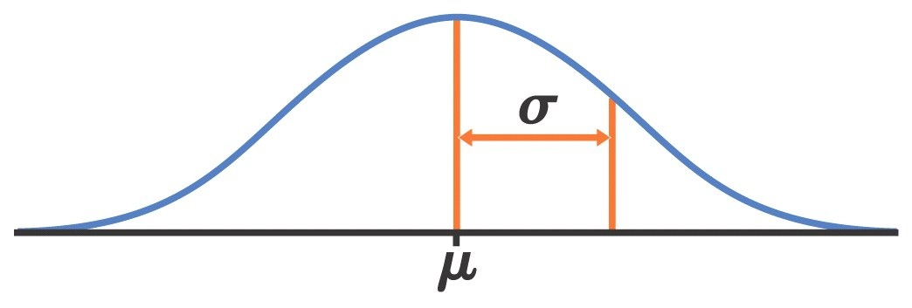
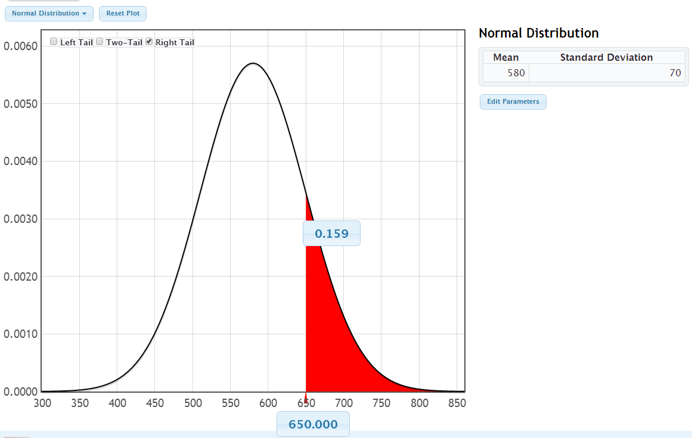
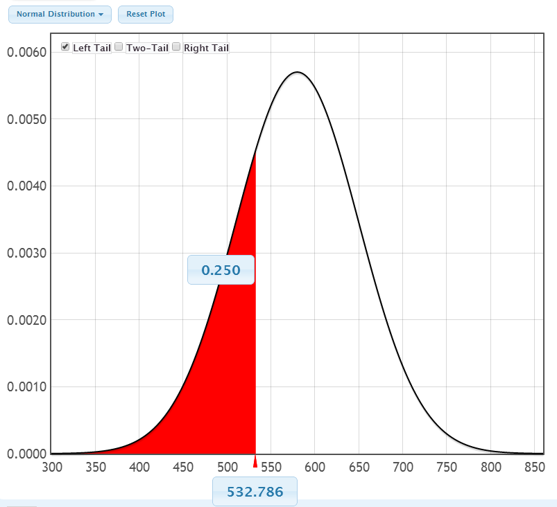

```{r setup, include=FALSE}
options(htmltools.dir.version = FALSE)
options(htmltools.preserve.raw = FALSE)
options(ggrepel.max.overlaps = Inf)

knitr::opts_chunk$set(echo = TRUE, 
                      dev = 'svg',
                      collapse = TRUE, 
                      comment = NA,  # PRINTS IN FRONT OF OUTPUT, default is '##' which comments out output
                      prompt = FALSE, # IF TRUE adds a > before each code input
                      warning = FALSE, 
                      message = FALSE,
                      fig.height = 3, 
                      fig.width = 4,
                      out.width = "100%",
                      fig.align = "center"
                      )


# load necessary packages
library(tidyverse)
library(countdown)
library(mosaic)
library(ggthemes)
library(xaringanExtra)
library(forcats)
xaringanExtra::use_panelset()
xaringanExtra::use_tachyons()
xaringanExtra::use_clipboard()
xaringanExtra::use_extra_styles(
  hover_code_line = TRUE,         #<<
  mute_unhighlighted_code = TRUE  #<<
)
library(flipbookr)
library(patchwork)
library(Lock5Data)

# Set ggplot theme
theme_set(theme_tufte(base_size = 10))


yt <- 0

# read.csv("https://raw.githubusercontent.com/deepbas/statdatasets/main/APM_DougEvansCases.csv")

```


```{r xaringanExtra-clipboard, echo=FALSE}
htmltools::tagList(
  xaringanExtra::use_clipboard(
    button_text = "<i class=\"fa fa-clipboard\"></i>",
    success_text = "<i class=\"fa fa-check\" style=\"color: #90BE6D\"></i>",
    error_text = "<i class=\"fa fa-times-circle\" style=\"color: #F94144\"></i>"
  ),
  rmarkdown::html_dependency_font_awesome()
)
```


layout: true
  
<!-- <div class="my-footer"><span>Stat 230</span></div> -->
<!-- this adds the link footer to all slides, depends on my-footer class in css-->

---

class: title-slide, middle
<!-- background-image: url("assets/title-image2.jpg") -->
background-position: 10% 90%, 100% 50%
background-size: 160px, 100% 100%

# .fancy[The Normal Distribution!]

### .fancy[Stat 120]

`r format(Sys.Date(), ' %B %d %Y')`


---

class: middle

## Overview

.bql[
.b[Core intro stats covered:] EDA for data comprehension, estimation with confidence, and hypothesis testing via p-values.

.b[Upcoming focus:] Advanced inference methods, transitioning from simulations to probability models for bootstrap/randomization distributions.


]


---

class: middle

# Density Curve

> A density curve is a theoretical model to describe a distribution.

<br>

.bql.font80[
Distribution for 
- individual measurements in population (for a quantitative variable)
- Sampling distribution for a statistic

All density curves have an area under the curve of 1 (100%)
- give proportions/percents as areas under the curve
]

---

# Normal Distribution

.bq.font80[A .b[normal distribution] has a symmetric bell-shaped density curve.]

```{r, echo=FALSE, out.width="50%"}
ggplot(data = data.frame(x = c(-4, 4)), aes(x)) + 
  stat_function(fun = dnorm, args = list(mean = 0, sd = 1)) +
  labs(title = "Standard Normal Curve") +
  xlab("") + ylab("") + 
  theme(plot.title = element_text(hjust = 0.5))
```


---

# The Normal Model: $X \sim N(\mu, \sigma)$

.bq.font90[The mean and SD determine how a normal density curve looks.
The normal model parameters are
- $\mu$ = model mean (center)
- $\sigma=$ model SD (variability)
]

<br>

<center>
 <br>
</center>

---

# Verbal SAT $\sim N(580,70)$

## What proportion of people score above 650?

--

```{r, echo=FALSE, out.width="60%"}
library(ggplot2)

x <- seq(from = 300, to = 900, by = 0.1)
y <- dnorm(x, mean = 580, sd = 70)

ggplot(data = data.frame(x, y), aes(x = x, y = y)) +
  geom_line(color = "blue") +
  geom_polygon(data = data.frame(x = c(650, x[x >= 650], 650), y = c(0, y[x >= 650], 0)),
              aes(x = x, y = y), fill = "red", alpha = 0.5) +
  scale_x_continuous(breaks = seq(min(x), max(x), by = 70)) + 
  theme(axis.title.y = element_blank(),
        axis.text.y = element_blank(),
        axis.ticks.y = element_blank())

```


<center>
<div style="position: absolute; top: 20%; left: 70%;">
<span style="content: '\2192'; font-size: 20px; color: #FF00FF; text-align: center; white-space: pre-line;">
  <p><strong>Area under the curve <br> for scores 650 & higher</strong></p>
</span>
</div>
</center>

---

# How can we find areas under a normal density?


.pull-left-40[
.bq.font80[
- The curve represents the normal distribution, denoted by $N(\mu, \sigma)$. 

- .red[(CALCULUS!)] Calculating the exact area requires integration, as given by the formula: 

 Area $=\int_a^b \frac{1}{\sqrt{2 \pi \sigma}} e^{-\frac{(x-\mu)^2}{2 \sigma^2}} d x$
 
-  We'll just utilize technological tools. 

]
]
.pull-right-60[
```{r, echo=FALSE, out.width="100%"}
x <- seq(from = 300, to = 900, by = 0.1)
y <- dnorm(x, mean = 580, sd = 70)
ggplot(data = data.frame(x, y), aes(x = x, y = y)) +
  geom_line(color = "blue") +
  geom_polygon(data = data.frame(x = c(500, x[x >= 500 & x <= 700], 700), y = c(0, y[x >= 500 & x <= 700], 0)),
              aes(x = x, y = y), fill = "#346B5A", alpha = 0.5) +
  theme(axis.title.y = element_blank(),
        axis.text.y = element_blank(),
        axis.ticks.y = element_blank(),
        axis.text.x = element_blank(),
        axis.ticks.x = element_blank(),
        axis.title.x = element_blank()) +
  annotate("text", x = 500, y = -0.0001, label = "a") +
  annotate("text", x = 700, y = -0.0001, label = "b")
```

]


---

# [StatKey](https://www.lock5stat.com/StatKey/) – Verbal SAT population 

<center>
 <br>
</center>

---

class: middle

# Some observations!

.bql[
- About $16 \%$ of individuals scored 650 or above.

- The $25^{th}$ percentile score lies between 440 ( 2 SD below 580 ) and the median of 580 . 

- Utilize `Statkey` to fine-tune the left-tail area to 0.25 for precise percentile calculation.


]


---

# [StatKey](https://www.lock5stat.com/StatKey/) – Verbal SAT scores

<center>
 <br>
</center>

<center>
<div style="position: absolute; top: 20%; left: 70%;">
<span style="content: '\2192'; font-size: 24px; color: #FF00FF; text-align: center; white-space: pre-line;">
  <p>The 25th percentile is 533.</p>
<p>About 75% of people in the population score above 533.</p>


</span>
</div>
</center>

---


# Example: Verbal SAT scores Using R

.pull-left[
## What percent of the population scored 650 or higher?


```{r}
1 - pnorm(650, 580,70)
```


]

.pull-right[

### Alternatively:

```{r}
pnorm(650, 580,70, lower.tail = FALSE)
```


]

--

## What score is the $25^{th}$ percentile?

```{r}
qnorm(.25,580,70)
```

--

## What score is the $75^{th}$ percentile?

```{r}
qnorm(.75,580,70)
```


---

```{r, echo=FALSE, out.width="70%"}
library(gridExtra)
x <- seq(from = 300, to = 900, by = 0.1)
y <- dnorm(x, mean = 580, sd = 70)
p1 <- ggplot(data = data.frame(x, y), aes(x = x, y = y)) +
  geom_line(color = "blue") +
  geom_polygon(data = data.frame(x = c(510, x[x >= 510 & x <= 650], 650), y = c(0, y[x >= 510 & x <= 650], 0)),
              aes(x = x, y = y), fill = "maroon", alpha = 0.5) +
  theme(axis.title.y = element_blank(),
        axis.text.y = element_blank(),
        axis.ticks.y = element_blank(),
        axis.title.x = element_blank(),
        axis.text.x = element_text(size = 5)) +
    scale_x_continuous(breaks = seq(300, 900, by = 50)) 
 

x <- seq(from = 0, to = 1, by = 0.01)
y <- dnorm(x, mean = 0.5, sd = 0.1)
p2 <- ggplot(data = data.frame(x, y), aes(x = x, y = y)) +
  geom_line(color = "blue") +
  geom_polygon(data = data.frame(x = c(0.4, x[x >= 0.4 & x <= 0.6], 0.6), y = c(0, y[x >= 0.4 & x <= 0.6], 0)),
              aes(x = x, y = y), fill = "maroon", alpha = 0.5) +
    theme(axis.title.y = element_blank(),
        axis.text.y = element_blank(),
        axis.ticks.y = element_blank(),
        axis.title.x = element_blank(),
        axis.text.x = element_text(size = 6)) +
    scale_x_continuous(breaks = seq(0, 1, by = 0.1)) 
 


x <- seq(from = 25, to = 32, by = 0.1)
y <- dnorm(x, mean = 29.1, sd = 0.9)
p3 <- ggplot(data = data.frame(x, y), aes(x = x, y = y)) +
  geom_line(color = "blue") +
  geom_polygon(data = data.frame(x = c(28.2, x[x >= 28.2 & x <= 30], 30), y = c(0, y[x >= 28.2 & x <= 30], 0)),
              aes(x = x, y = y), fill = "maroon", alpha = 0.5) +
    theme(axis.title.y = element_blank(),
        axis.text.y = element_blank(),
        axis.ticks.y = element_blank(),
        axis.title.x = element_blank(),
        axis.text.x = element_text(size = 6)) +
    scale_x_continuous(breaks = seq(25.4, 31.9, by = 0.9)) 
 


x <- seq(from = -25, to = 26, by = 1)
y <- dnorm(x, mean = 0, sd = 5)
p4 <- ggplot(data = data.frame(x, y), aes(x = x, y = y)) +
  geom_line(color = "blue") +
  geom_polygon(data = data.frame(x = c(-5, x[x >= -5 & x <= 5], 5), y = c(0, y[x >= -5 & x <= 5], 0)),
              aes(x = x, y = y), fill = "maroon", alpha = 0.5) +
   theme(axis.title.y = element_blank(),
        axis.text.y = element_blank(),
        axis.ticks.y = element_blank(),
        axis.title.x = element_blank(),
        axis.text.x = element_text(size = 6)) +
    scale_x_continuous(breaks = seq(-24, 24, by = 4)) 
 


grid.arrange(p1, p2, p3, p4, ncol = 2)

```


<center>
    <div style="position: absolute; top: 10%; left: 4%; border: 2px solid black; display: inline-block; padding: 10px; height: 80px; line-height: 0;">
        <span style="content: '\2192'; font-size: 42px; color: #FF00FF; text-align: center; white-space: pre-line;">
            <strong> \( N(580,70) \)</strong>
        </span>
    </div>
</center>

--

<center>
    <div style="position: absolute; top: 10%; left: 76%; border: 2px solid black; display: inline-block; padding: 10px; height: 80px; line-height: 0;">
        <span style="content: '\2192'; font-size: 42px; color: #FF00FF; text-align: center; white-space: pre-line;">
            <strong> \( N(0.5,0.1) \)</strong>
        </span>
    </div>
</center>

--

<center>
    <div style="position: absolute; top: 60%; left: 4%; border: 2px solid black; display: inline-block; padding: 10px; height: 80px; line-height: 0;">
        <span style="content: '\2192'; font-size: 42px; color: #FF00FF; text-align: center; white-space: pre-line;">
            <strong> \( N(29.1,0.9) \)</strong>
        </span>
    </div>
</center>


--

<center>
    <div style="position: absolute; top: 60%; left: 76%; border: 2px solid black; display: inline-block; padding: 10px; height: 80px; line-height: 0;">
        <span style="content: '\2192'; font-size: 42px; color: #FF00FF; text-align: center; white-space: pre-line;">
            <strong> \( N(0,5) \)</strong>
        </span>
    </div>
</center>

--

<center>
    <div style="position: absolute; top: 45%; left: 6%; border: 1px dashed black; display: inline-block; padding: 10px; height: 30px; line-height: 0;">
        <span style="content: '\2192'; font-size: 22px; color: #800080; text-align: center; white-space: pre-line;">
            <strong>Observation: about 68% should be within one  standard deviation of the mean </strong>
        </span>
    </div>
</center>


---


# Connecting any Normal model to the standard normal model

## .center.blue-h[Area below x = Area below z]

```{r, echo=FALSE, out.width="680%", fig.width=7}
x <- seq(from = 300, to = 900, by = 0.1)
y <- dnorm(x, mean = 580, sd = 70)
p1 <- ggplot(data = data.frame(x, y), aes(x = x, y = y)) +
  geom_line(color = "blue") +
  geom_polygon(data = data.frame(x = c(300, x[x <= 440], 440), y = c(0, y[x <= 440], 0)),
              aes(x = x, y = y), fill = "red", alpha = 0.5) +
  theme(axis.title.y = element_blank(),
        axis.text.y = element_blank(),
        axis.ticks.y = element_blank(),
                axis.text.x = element_text(size = 5)) +
  scale_x_continuous(breaks = seq(340, 870, by = 50)) +
   labs(x = "X")


x <- (x - 580)/70
y <- dnorm(x)

p2 <-  ggplot(data = data.frame(x, y), aes(x = x, y = y)) +
  geom_line(color = "blue") +
  geom_polygon(data = data.frame(x = c(-4, x[x <= -2], -2), y = c(0, y[x <= -2], 0)),
              aes(x = x, y = y), fill = "red", alpha = 0.5) +
  theme(axis.title.y = element_blank(),
        axis.text.y = element_blank(),
        axis.ticks.y = element_blank(),
                axis.text.x = element_text(size = 5)) +
  scale_x_continuous(breaks = seq(-4, 4, by = 1)) +
  labs(x = "Z")


grid.arrange(p1, p2, ncol = 2)


```


<center>
<div style="position: absolute; top: 15%; left: 3%;">
<span style="content: '\2192'; font-size: 32px; color: #CC00FF; text-align: center; white-space: pre-line;">
  <strong> \( X \text { is } N(\mu, \sigma)\) </strong>
\( \mu = 580, \sigma = 70\)</strong>


</span>
</div>
</center>


---


# Connecting any Normal model to the standard normal model

## .center.blue-h[Area below x = Area below z]

```{r, echo=FALSE, out.width="680%", fig.width=7}
x <- seq(from = 300, to = 900, by = 0.1)
y <- dnorm(x, mean = 580, sd = 70)
p1 <- ggplot(data = data.frame(x, y), aes(x = x, y = y)) +
  geom_line(color = "blue") +
  geom_polygon(data = data.frame(x = c(300, x[x <= 440], 440), y = c(0, y[x <= 440], 0)),
              aes(x = x, y = y), fill = "red", alpha = 0.5) +
  theme(axis.title.y = element_blank(),
        axis.text.y = element_blank(),
        axis.ticks.y = element_blank(),
                axis.text.x = element_text(size = 5)) +
  scale_x_continuous(breaks = seq(340, 870, by = 50)) +
   labs(x = "X")


x <- (x - 580)/70
y <- dnorm(x)

p2 <-  ggplot(data = data.frame(x, y), aes(x = x, y = y)) +
  geom_line(color = "blue") +
  geom_polygon(data = data.frame(x = c(-4, x[x <= -2], -2), y = c(0, y[x <= -2], 0)),
              aes(x = x, y = y), fill = "red", alpha = 0.5) +
  theme(axis.title.y = element_blank(),
        axis.text.y = element_blank(),
        axis.ticks.y = element_blank(),
                axis.text.x = element_text(size = 5)) +
  scale_x_continuous(breaks = seq(-4, 4, by = 1)) +
  labs(x = "Z")


grid.arrange(p1, p2, ncol = 2)


```

<center>
<div style="position: absolute; top: 15%; left: 3%;">
<span style="content: '\2192'; font-size: 32px; color: #CC00FF; text-align: center; white-space: pre-line;">
  <strong> \( X \text { is } N(\mu, \sigma)\) </strong>
\( \mu = 580, \sigma = 70\)</strong>


</span>
</div>
</center>


<center>
<div style="position: absolute; top: 10%; left: 79%;">
<span style="content: '\2192'; font-size: 32px; color: #FF00FF; text-align: center; white-space: pre-line;">
  <p><strong> \( Z \text { is } N(0, 1) \)</strong></p>


</span>
</div>
</center>

---

# Connecting any Normal model to the standard normal model

## .center.blue-h[Area below x = Area below z]

```{r, echo=FALSE, out.width="680%", fig.width=7}
x <- seq(from = 300, to = 900, by = 0.1)
y <- dnorm(x, mean = 580, sd = 70)
p1 <- ggplot(data = data.frame(x, y), aes(x = x, y = y)) +
  geom_line(color = "blue") +
  geom_polygon(data = data.frame(x = c(300, x[x <= 440], 440), y = c(0, y[x <= 440], 0)),
              aes(x = x, y = y), fill = "red", alpha = 0.5) +
  theme(axis.title.y = element_blank(),
        axis.text.y = element_blank(),
        axis.ticks.y = element_blank(),
                axis.text.x = element_text(size = 5)) +
  scale_x_continuous(breaks = seq(340, 870, by = 50)) +
   labs(x = "X")


x <- (x - 580)/70
y <- dnorm(x)

p2 <-  ggplot(data = data.frame(x, y), aes(x = x, y = y)) +
  geom_line(color = "blue") +
  geom_polygon(data = data.frame(x = c(-4, x[x <= -2], -2), y = c(0, y[x <= -2], 0)),
              aes(x = x, y = y), fill = "red", alpha = 0.5) +
  theme(axis.title.y = element_blank(),
        axis.text.y = element_blank(),
        axis.ticks.y = element_blank(),
                axis.text.x = element_text(size = 5)) +
  scale_x_continuous(breaks = seq(-4, 4, by = 1)) +
  labs(x = "Z")


grid.arrange(p1, p2, ncol = 2)


```

<center>
<div style="position: absolute; top: 15%; left: 3%;">
<span style="content: '\2192'; font-size: 32px; color: #CC00FF; text-align: center; white-space: pre-line;">
  <strong> \( X \text { is } N(\mu, \sigma)\) </strong>
\( \mu = 580, \sigma = 70\)</strong>


</span>
</div>
</center>


<center>
<div style="position: absolute; top: 10%; left: 79%;">
<span style="content: '\2192'; font-size: 32px; color: #FF00FF; text-align: center; white-space: pre-line;">
  <p><strong> \( Z \text { is } N(0, 1) \)</strong></p>


</span>
</div>
</center>

<center>
    <div style="position: absolute; top: 40%; left: 40%; border: 2px solid black; display: inline-block; padding: 10px; height: 90px; line-height: 0;">
        <span style="content: '\2192'; font-size: 42px; color: #FF00FF; text-align: center; white-space: pre-line;">
            <strong> \( z = \frac{x - \mu}{\sigma} \)</strong>
        </span>
    </div>
</center>

---

class: center, middle

# Big Idea for Normal Models: .bold[All we need is a z-score.]


.bql.font180[
## .b[Standard Normal:]

\begin{align*}
\mu=0, \sigma=1 \quad \Longrightarrow Z \sim N(0,1)
\end{align*}

]


---

# Big picture

.bql.font90[
When have we already been using normal models??
- .b[Bootstrap distributions] – get confidence intervals if a bootstrap distribution is roughly bell-shaped

- .b[Randomization distributions] – many of these are bell-shaped. 

- Normal models play a huge role in statistical inference.

- If we know the .bold[(bootstrap/randomization) standard error] then we can just use a normal model rather than a resampling model (which requires more computational effort)
]


---

class: action

# <i class="fa fa-pencil-square-o" style="font-size:48px;color:purple">&nbsp;Your&nbsp;Turn&nbsp;`r (yt <- yt + 1)`</i>    

.pull-left-40[

]
.pull-right-60[
<br>
.bql[
- Let's go over to the [course helper page](https://stat120-fall23.netlify.app/)
- Please do the class activity and let me know if you have any questions
- Feel free to talk to your neighbor
]

]

`r countdown(minutes = 15, seconds = 00, top = 0 , color_background = "inherit", padding = "3px 4px", font_size = "2em")`

