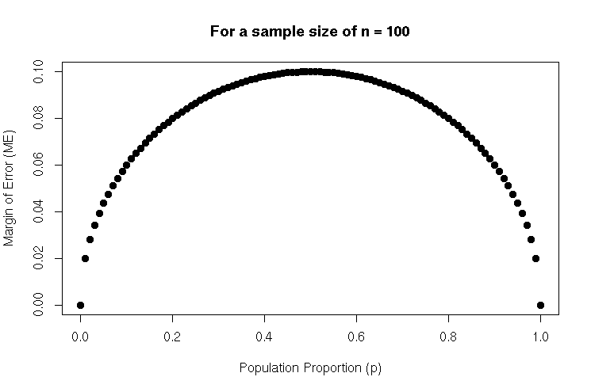

```{r setup, include=FALSE}
options(htmltools.dir.version = FALSE)
options(htmltools.preserve.raw = FALSE)
options(ggrepel.max.overlaps = Inf)

knitr::opts_chunk$set(echo = TRUE, 
                      dev = 'svg',
                      collapse = TRUE, 
                      comment = NA,  # PRINTS IN FRONT OF OUTPUT, default is '##' which comments out output
                      prompt = FALSE, # IF TRUE adds a > before each code input
                      warning = FALSE, 
                      message = FALSE,
                      fig.height = 3, 
                      fig.width = 4,
                      out.width = "100%"
                      )


# load necessary packages
library(tidyverse)
library(countdown)
library(mosaic)
library(ggthemes)
library(xaringanExtra)
library(forcats)
xaringanExtra::use_panelset()
xaringanExtra::use_tachyons()
xaringanExtra::use_clipboard()
xaringanExtra::use_extra_styles(
  hover_code_line = TRUE,         #<<
  mute_unhighlighted_code = TRUE  #<<
)
library(flipbookr)
library(patchwork)
library(Lock5Data)

# Set ggplot theme
theme_set(theme_tufte(base_size = 10))


yt <- 0

# read.csv("https://raw.githubusercontent.com/deepbas/statdatasets/main/APM_DougEvansCases.csv")

```


```{r xaringanExtra-clipboard, echo=FALSE}
htmltools::tagList(
  xaringanExtra::use_clipboard(
    button_text = "<i class=\"fa fa-clipboard\"></i>",
    success_text = "<i class=\"fa fa-check\" style=\"color: #90BE6D\"></i>",
    error_text = "<i class=\"fa fa-times-circle\" style=\"color: #F94144\"></i>"
  ),
  rmarkdown::html_dependency_font_awesome()
)
```


layout: true
  
<!-- <div class="my-footer"><span>Stat 230</span></div> -->
<!-- this adds the link footer to all slides, depends on my-footer class in css-->

---

class: title-slide, middle
<!-- background-image: url("assets/title-image2.jpg") -->
background-position: 10% 90%, 100% 50%
background-size: 160px, 100% 100%

# .fancy[Inference for Single Proportions using the Normal Distribution]

### .fancy[Stat 120]

`r format(Sys.Date(), ' %B %d %Y')`


---

class: middle

# Background


.bq[
- .b[Resampling] inference methods like the bootstrap (CI) and randomization tests require the use of computers!
- We can achieve the same using statistical theory
]

---


# Why are most resampling distributions bell-shaped?

> .b[CLT]: when n is big enough, means and proportions behave like a normal distribution.

<br>
--

.bq[
- Today we will compute SE using formulas derived from probability theory
- The inference methods in ch. 6+ are “classical” methods that could be done just with pen and paper.
]

---

class: middle

# .red[The big question:] Resampling vs. Classical methods

.pull-left[
- Resampling methods are intuitive and don’t require lots of statistical theory/background.
- But in your research fields you will likely only see classical methods used
]

--

.pull-right[
- In the “olden days”, classical methods were the only thing taught in stats methods classes. 
- More advanced methods usually do rely on classical theory due to their complexity. 
]

---

# Quiz


.bql[The Central Limit Theorem applies to the distribution of the

1. statistic
2. parameter
3. null value
4. data
5. standard error
]

<br>
<details>
<summary>.red[Click for answer]</summary>
The correct answer is 1. (since CLT gives us condition under which the sampling distribution of sample means and proportions follow the normal distribution!)
</details>

---

## Distribution of sample proportions

<center>
 <br>
</center>

---

class: middle

# The SE for a Sample Proportion

.bqt[
The standard error for $\hat{p}$ is
\begin{align*}
S E_{\hat{p}}=\sqrt{\frac{p(1-p)}{n}}
\end{align*}
]

.green-h.center[The larger the sample size, the smaller the SE]

---

class: middle

# Central Limit Theorem 

.bql[
For a sufficiently large sample size, the distribution of sample statistics for a mean or a proportion is normal

- .bold[One sample proportion:] The sampling distribution for a sample proportion is approximately normally distributed:

\begin{align*}
\hat{p} \approx N\left(p, \sqrt{\frac{p(1-p)}{n}}\right)
\end{align*}

.purple[Need n large enough so np ≥ 10 and n(1 – p) ≥ 10 ]
]

---

class: middle

# Election polling

.bql[
President Biden won 52.4% of the popular vote in Minnesota in the 2020 election.

- If we had sampled 100 likely voters just prior to the election, what would be the SE for the sample proportion of voters for Biden?

\begin{align*}
S E=\sqrt{\frac{0.524 \times 0.476}{100}} \approx 0.05
\end{align*}
]

---

class: middle

# Margin of Error 

.bql[
For a single proportion, what is the margin of error?

\begin{align*}
\hat{p} \pm z^* \times \sqrt{\frac{\hat{p}(1-\hat{p})}{n}}
\end{align*}

1. $\sqrt{\frac{\hat{p}(1-\hat{p})}{n}}$
2. $z^* \times \sqrt{\frac{\hat{p}(1-\hat{p})}{n}}$
3. $2 \times z^* \times \sqrt{\frac{\hat{p}(1-\hat{p})}{n}}$
]

<br>
<details>
<summary>.red[Click for answer]</summary>
The correct answer is 2. (since margin of error is a numerical multiple of SE that is determined by how much confidence we want on the confidence interval)
</details>

---

class: middle

# Margin of Error and Sample Size

.bql[
\begin{align*}
M E=z^* \times \sqrt{\frac{\hat{p}(1-\hat{p})}{n}}
\end{align*}

You can choose your sample size in advance, depending on your desired margin of error!

Given the formula for margin of error, solve for n.

- Neither $p$ nor $\hat{p}$ is known in advance. To be conservative, use $p=0.5$. For a $95 \%$ confidence interval, $z^* \approx 2$

\begin{align*}
n=\left(\frac{z^*}{M E}\right)^2 \hat{p}(1-\hat{p}) \qquad \Longleftrightarrow \qquad n \approx \frac{1}{M E^2}
\end{align*}
]

---

# Margin of Error and p

<center>
 <br>
<div style="position: absolute; top: 10%; left: 75%;">
<span style="content: '\2192'; font-size: 40px; color: #FF00FF; text-align: center; white-space: pre-line;">
  <p>\[n &asymp; \frac{1}{M E^2}\]</p>
</span>
</div>
</center>

--

<center>
<div style="position: absolute; top: 40%; left: 37%;">
<span style="content: '\2192'; font-size: 24px; color: blue; text-align: center; white-space: pre-line;">
<p><b>Maximized at p = 0.5</b></p>
</span>
</div>
</center>

---

# Margin of Error and n: $n \approx \frac{1}{M E^2}$

.bql[
Suppose we want to estimate a proportion with a margin of error of 0.03 with 95% confidence. How large a sample size do we need?


1. About 100
2. About 500
3. About 1000
4. About 5000
]

<br>
<details>
<summary>.red[Click for answer]</summary>
The correct answer is 3.
</details>

---

class: middle

# Election polling continued.. 

.bqt[
What should n be to get a margin of error of 3%?

\begin{gathered}
0.03=2 \times \text { SE } \\
0.015=S E=\sqrt{\frac{0.482 \times 0.518}{n}} \\
n=\frac{0.524 \times 0.476}{0.015^2} \approx 1109
\end{gathered}
]


---


# Test for a Single Proportion: Standardized Test Stat and P-value

.bql.font120[
\begin{align*}
\mathrm{H}_0: & \quad p=p_0\\
\mathrm{H}_A: & \quad p\neq p_0
\end{align*}

\begin{align*}
z&=\frac{\hat{p} -p_0}{\sqrt{\frac{p_0\left(1-p_0\right)}{n}}}
\end{align*}
]

--

.bq[
If $np_0 ≥ 10$ and $n(1 – p_0) ≥ 10$, then the p-value can be computed as the area in the tail(s) of a standard normal beyond z.
]


---

# Recap: Global Warming

.hljs[Do a majority of Americans believe in global warming?

\begin{aligned}
& H_0: p=0.50 \\
& H_A: p>0.50
\end{aligned}

$$p=\text { proportion of all Americans who believe in global warming }$$]

> A survey on 2,251 randomly selected individuals conducted in October 2010 found that 1328 answered “Yes” to the question


.out-t[“Is there solid evidence of global warming?”]


.footnote[Source: “Wide Partisan Divide Over Global Warming”, Pew Research Center, 10/27/10.s]
---

# Is there solid evidence of global warming?

.pull-left[
.b[Sample proportion:]
\begin{align*}
\hat{p}=\frac{1328}{2251}=0.590
\end{align*}

.b[Standardized test stat:]
\begin{align*}
z=\frac{0.590-0.50}{\sqrt{\frac{0.50(0.50)}{2251}}}=\frac{0.09}{0.0105}=8.54
\end{align*}


]

.pull-right[

.b[P-value:]
```{r}
1 - pnorm(8.54, 0, 1)
```

.b[C.I. for p:] $\hat{p} \pm z^* \sqrt{\frac{\hat{p}(1-\hat{p})}{n}}$

\begin{align*}
0.59 \pm& 1.96 \sqrt{\frac{0.59 \times(1-0.59)}{2251}} \\
0.59 \pm& 1.96 \times 0.0104 = (0.570,0.610)
\end{align*}
]

.bq.font80[
.blue[P-value:] proportion above z=8.54 on a N(0,1) curve. Yes, there is strong evidence that the percentage of Americans that believe in global warming is greater than 50% (z=8.51, p<0.0001).

.green[We are 95% confident that between 57% and 61% of Americans believe in global warming.]

]

---

# Does this agree with the bootstrap CI? 

<center>
 <br>
<div style="position: absolute; top: 20%; left: 70%;">
<span style="content: '\2192'; font-size: 20px; color: #FF00FF; text-align: center; white-space: pre-line;">
  <p><b> We are <em>95%</em> sure that <br> the true percentage of all Americans <br> that believe there is solid evidence <br> of global warming is between <br> <em>57.0%</em> and <em>61.0%</em>.</b></p>
</span>
</div>
</center>


---

class: middle

# Summary


.bql[

.blue[Standard error for a sample proportion:] Central Limit Theorem for a proportion: If counts for each category are at least 10 (meaning $n p \geq 10$ and $n(1-p) \geq 10)$, then 
- For a $\mathrm{CI}$, use $p$-hat in place of $p$ 
- For a Hypothesis Test, use $p_0$ in place of $p$ when calculating the standardized statistic
]


---


class: action

# <i class="fa fa-pencil-square-o" style="font-size:48px;color:purple">&nbsp;Your&nbsp;Turn&nbsp;`r (yt <- yt + 1)`</i>    

.pull-left-40[

]
.pull-right-60[
<br>
.bq[

Let's go over to the class activity .Rmd file and complete the tasks for today.


]

]

`r countdown(minutes = 10, seconds = 00, top = 0 , color_background = "inherit", padding = "3px 4px", font_size = "2em")`

