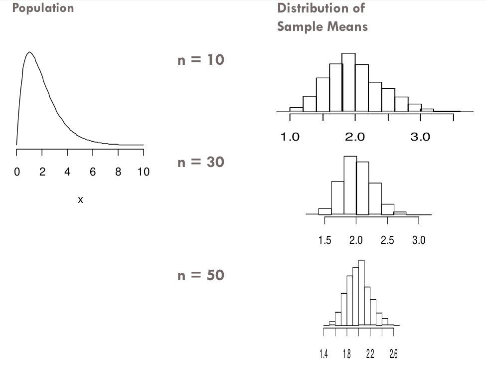
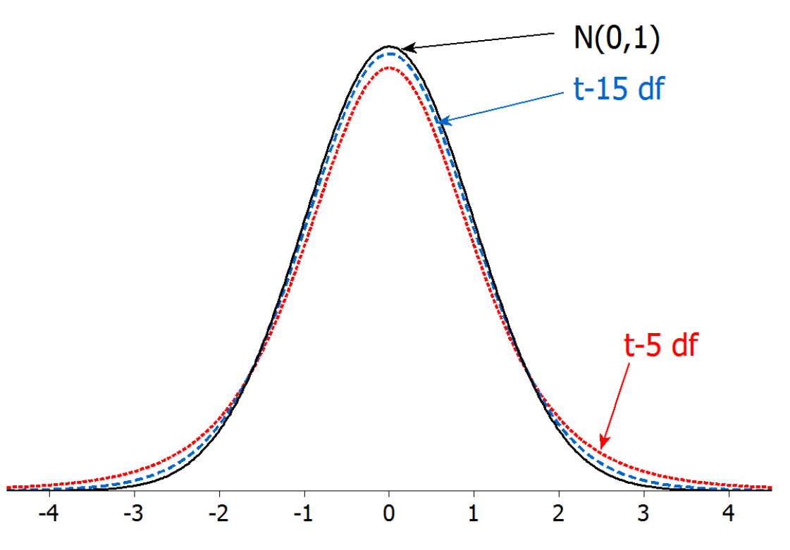
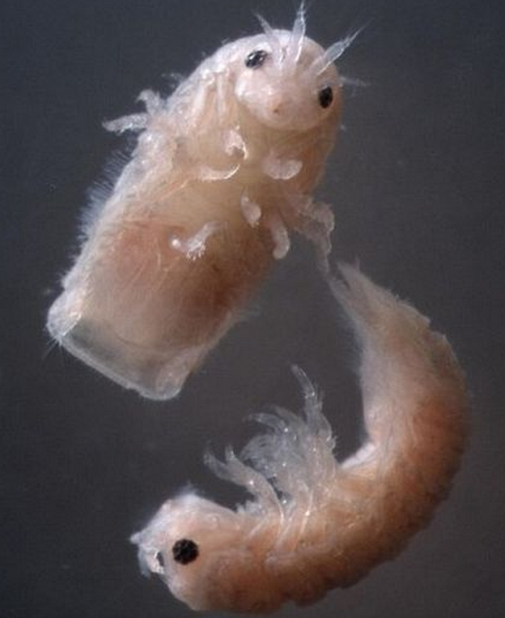
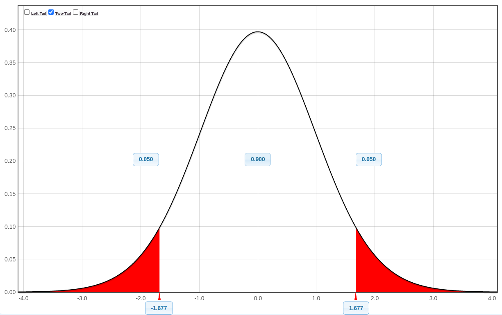
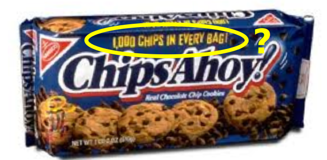
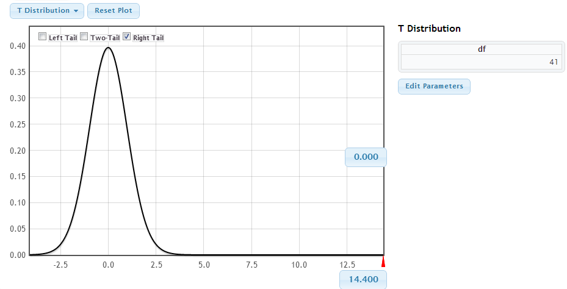
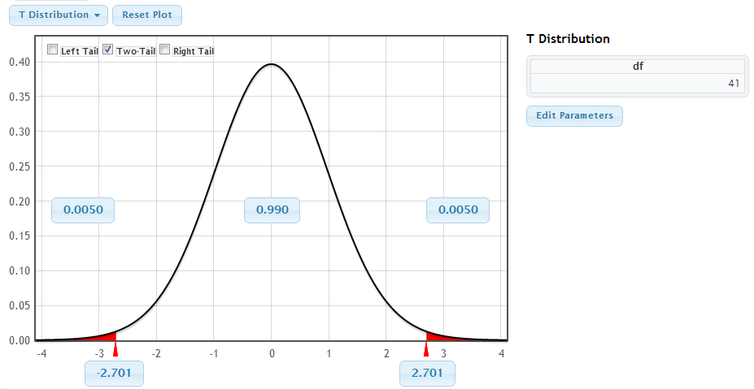

```{r setup, include=FALSE}
options(htmltools.dir.version = FALSE)
options(htmltools.preserve.raw = FALSE)
options(ggrepel.max.overlaps = Inf)

knitr::opts_chunk$set(echo = TRUE, 
                      dev = 'svg',
                      collapse = TRUE, 
                      comment = NA,  # PRINTS IN FRONT OF OUTPUT, default is '##' which comments out output
                      prompt = FALSE, # IF TRUE adds a > before each code input
                      warning = FALSE, 
                      message = FALSE,
                      fig.height = 3, 
                      fig.width = 4,
                      out.width = "100%"
                      )


# load necessary packages
library(tidyverse)
library(countdown)
library(mosaic)
library(ggthemes)
library(xaringanExtra)
library(forcats)
xaringanExtra::use_panelset()
xaringanExtra::use_tachyons()
xaringanExtra::use_clipboard()
xaringanExtra::use_extra_styles(
  hover_code_line = TRUE,         #<<
  mute_unhighlighted_code = TRUE  #<<
)
library(flipbookr)
library(patchwork)
library(Lock5Data)

# Set ggplot theme
theme_set(theme_tufte(base_size = 10))


yt <- 0

# read.csv("https://raw.githubusercontent.com/deepbas/statdatasets/main/APM_DougEvansCases.csv")

```


```{r xaringanExtra-clipboard, echo=FALSE}
htmltools::tagList(
  xaringanExtra::use_clipboard(
    button_text = "<i class=\"fa fa-clipboard\"></i>",
    success_text = "<i class=\"fa fa-check\" style=\"color: #90BE6D\"></i>",
    error_text = "<i class=\"fa fa-times-circle\" style=\"color: #F94144\"></i>"
  ),
  rmarkdown::html_dependency_font_awesome()
)
```


layout: true
  
<!-- <div class="my-footer"><span>Stat 230</span></div> -->
<!-- this adds the link footer to all slides, depends on my-footer class in css-->

---

class: title-slide, middle
<!-- background-image: url("assets/title-image2.jpg") -->
background-position: 10% 90%, 100% 50%
background-size: 160px, 100% 100%

# .fancy[Inference for one mean]

### .fancy[Stat 120]

`r format(Sys.Date(), ' %B %d %Y')`


---

class: middle

# CLT for a Mean

If $n \geq 30^*$, then

.bql[

$$\bar{X} \approx N\left(\mu, \frac{\sigma}{\sqrt{n}}\right)$$

]

.hljs[
*Smaller sample sizes may be sufficient for symmetric distributions, and 30 may not be sufficient for very skewed distributions or distributions with high outliers
]

---


class: middle

#  CLT for mean

<center>
 <br>
</center>


---


class: middle

# Standard Deviation

.bql[
The standard deviation of the population is

a) $\sigma$

b) $s$

c) $\frac{\sigma}{\sqrt{n}}$
]

<br>
<details>
<summary>.red[Click for answer]</summary>
The correct answer is a.
</details>

---

class: middle

# Standard Deviation

.bql[
The standard deviation of the sample is

a) $\sigma$

b) $s$

c) $\frac{\sigma}{\sqrt{n}}$
]

<br>
<details>
<summary>.red[Click for answer]</summary>
The correct answer is b.
</details>

---

class: middle

# Standard Deviation

.bql[
The standard deviation of the sample mean is

a) $\sigma$

b) $s$

c) $\frac{\sigma}{\sqrt{n}}$
]

<br>
<details>
<summary>.red[Click for answer]</summary>
The correct answer is c. The standard error is the standard deviation of the statistic.
</details>


---

class: middle

#  T-distribution

.bql[
- Replacing $\sigma$ with $s$ changes the distribution of the z-statistic from a .bold[normal distribution] to a .b[t-distribution]
- The $t$ distribution is very similar to the standard normal, but with slightly fatter tails to reflect this added uncertainty
]

---

class: middle

#  T-distribution

<center>
 <br>
</center>


---


# Inference for means

.green-h[.purple[Check:] Check the one sample size conditions for the CLT]

.pull-left[
.bql[
Tests: Use t-ratios of the form
$$t=\frac{\text { stat }-\text { null value }}{S E}$$
P-values computed from a t-distribution with appropriate $\mathrm{df}$
- `pt(t, df= )` gives the area to the left of $t$
]
]

.pull-right[
.bql[
Confidence intervals: $\mathrm{CI}$ of the form
$$\text { stat } \pm t^{*} S E$$
The $t^{*}$ multiplier comes from a t-distribution with appropriate $d f$
- `qt(0.975, df= )` gives $t^{*}$ for $95 \%$ confidence

]

]


---

# Florida lakes

.bql.font80[53 lakes were sampled, pH recorded
- Is average pH in Florida lakes different from 7 (neutral)?
- Let $\mu$ be the mean pH for all Florida lakes
$$H_0: \mu = 7 \qquad\qquad H_A: \mu \neq 7$$
]

<br>

.bqt.font80[Can we use a t-test?
- $n=53$ is a decent sample size
- check sample distribution of pHs
]


---

`r chunk_reveal("hist", widths = c(0.5, 0.5), font_size_code="70%", title = "## Florida lakes")`

```{r hist, fig.width = 3, fig.height = 3.5, out.width = "100%", include=FALSE}
library(ggplot2)
lakes <- read.csv("http://www.lock5stat.com/datasets2e/FloridaLakes.csv")
ggplot(lakes, aes(x = pH)) +
  geom_histogram(fill = "steelblue", 
                 bins = 7,
                 col = "lightblue")
```

---

# Florida lakes

.bql.font80[
$$H_0: \mu = 7  \qquad\qquad  H_A: \mu \neq 7$$
Data: The average pH was $\bar{x}=6.591$ with a standard deviation of $s=1.288$.]

.pull-left[
```{r, collapse=TRUE}
mean(lakes$pH)
```
]

.pull-right[
```{r, collapse=TRUE}
sd(lakes$pH)
```
]

.bql.font80[

- The t-test stat is
$$t = \dfrac{6.591 - 7}{1.288/\sqrt{53}} \approx -2.31$$

- .bold[Interpret t]: The observed mean of 6.591 is 2.31 SEs below 7.

]


---

# Florida lakes

.pull-left[
.bql.font80[
$$H_0: \mu = 7 \qquad\qquad  H_A: \mu \neq 7$$
- .bold[p-value] $2 \times P(t < -2.31)$, or double left tail area below -2.31
  - use t-distribution with $df = 53-1= 52$
]
    
```{r, collapse=TRUE}
2*pt(-2.31, df=53-1)  # df = n-1
```

]

.pull-right[
.bql.font80[
- .bold[Interpret:] The p-value is 0.025. If the mean pH of all lakes is 7, then we would see a sample mean that is at least 2.31 SEs away from 7 about 2.5% of the time in samples of 53 lakes. 


- .bold[Conclusion:] There is a statistically significant difference between the observed mean pH of 6.591 and the hypothesized mean of 7 (t=-2.31, df=52, p=0.025). 
]
]

---

## Florida lakes: `t.test` in R

- We can also use `t.test` in R !

```{r, size = "huge"}
t.test(lakes$pH, mu  = 7)
```


---

# Florida lakes

.bql[
How different is the population mean from 7?

- 95% CI for $\mu$:


$$6.591 \pm 2.0066 \dfrac{1.288}{\sqrt{53}} = 6.591 \pm 0.355 = (6.236, 6.946)$$
where $t^*$ corresponds to 95% confidence (97.5th percentile):
]


```{r, collapse=TRUE}
qt(.975, df=53-1)
```

..hljs[We are 95% confident that the mean pH of all lakes is between 6.236 and 6.946 (slightly acidic)]

---


class: inverse, middle

.Large.bql.center[Confidence Interval for a Mean]


---


class: middle

# Gribbles

.hljs[Gribbles are small marine worms that bore through wood, and the enzyme they secrete may allow us to turn inedible wood and plant waste into biofuel]

.pull-left[

.bql.font80[
- A sample of 50 gribbles finds an average length of $3.1 \mathrm{~mm}$ with a standard deviation of $0.72 \mathrm{~mm}$.

- Give a $90 \%$ confidence interval for the average length of gribbles.
]
]

.pull-right[
<center>
 <br>
</center>


]


---

class: middle

# Gribbles

.pull-left[

.bql.font80[
A sample of 50 gribbles finds an average length of $3.1 \mathrm{~mm}$ with a standard deviation of $0.72 \mathrm{~mm}$. For a $90 \%$ confidence interval for the average length of gribbles, what is $t^*$ ?

a). 1.645

b). 1.677

c). 1.960

d). 1.690


]

<br>
<details>
<summary>.red[Click for answer]</summary>
$\begin{gathered}d f=n-1=49 \\ \text { and } \\ t^*=1.677\end{gathered}$
</details>
]

.pull-right[
<center>
 <br>
</center>


]


---

class: middle

# Gribbles

.pull-left[

.bql.font80[
A sample of 50 gribbles finds an average length of $3.1 \mathrm{~mm}$ with a standard deviation of $0.72 \mathrm{~mm}$. For a $90 \%$ confidence interval for the average length of gribbles, what is the standard error?

a). 0.171

b). 0.720

c). 1.960

d). 0.102

]

<br>
<details>
<summary>.red[Click for answer]</summary>
$\frac{s}{\sqrt{n}}=\frac{0.72}{\sqrt{50}}=0.102$</details>
]

.pull-right[
<center>
 <br>
</center>


]


---

class: middle

# Gribbles

.pull-left[

.bql.font80[
A sample of 50 gribbles finds an average length of $3.1 \mathrm{~mm}$ with a standard deviation of $0.72 \mathrm{~mm}$. For a $90 \%$ confidence interval for the average length of gribbles, what is the margin of error?

a). 0.171

b). 0.720

c). 1.960

d). 0.102

]

<br>
<details>
<summary>.red[Click for answer]</summary>
$t^* \cdot \frac{s}{\sqrt{n}}=1.677 \cdot \frac{0.72}{\sqrt{50}}=0.171$
</details>
]

.pull-right[
<center>
 <br>
</center>


]


---

class: middle

# Gribbles

.pull-left[

.bq[
$\begin{gathered}\text { statistic } \pm t^* \cdot S E \\ \bar{x} \pm t^* \cdot \frac{s}{\sqrt{n}} \\ 3.1 \pm 1.677 \cdot \frac{0.72}{\sqrt{50}} \\ 3.1 \pm 0.17 \\ (2.93,3.27)\end{gathered}$
]


]


.pull-right[

<center>
 <br>
</center>

]


.hljs[
We are $90 \%$ confident that the average length of gribbles is between 2.93 and $3.27 \mathrm{~mm}$.
]


---

# Margin of error


$$\mathrm{CI}: \bar{x} \pm t^* \cdot \frac{s}{\sqrt{n}}$$

.bql[
For a single mean, what is the margin of error?

a) $\frac{s}{\sqrt{n}}$

b) $t^* \cdot \frac{s}{\sqrt{n}}$

c) $2 \cdot \mathrm{t}^* \cdot \frac{s}{\sqrt{n}}$


]


<br>
<details>
<summary>.red[Click for answer]</summary>
$\text {CI = statistic } \pm \text { margin of error }$
</details>

---

class: middle

# GPA

.bql[Suppose we want to estimate average GPA at a college (where GPA's go from 0 to 4.0), with a margin of error of 0.1 with $95 \%$ confidence. How large a sample size do we need?

(a) About 100

(b) About 400

(c) About 800

(d) About 1000


]

<details>
<summary>.red[Click for answer]</summary>
\begin{aligned}
& s \approx \frac{\max -\min }{4}=\frac{4-0}{4}=1.0 \\
& n=\left(\frac{Z * s}{M E}\right)^2 \approx\left(\frac{2 \cdot 1}{0.1}\right)^2=400
\end{aligned}
</details>


---

class: inverse, middle

.Large.bql.center[Hypothesis Test for a Mean]

---

class: middle

# Chips Ahoy!

.hljs[A group of Air Force cadets bought bags of Chips Ahoy! cookies from all over the country to verify this claim.  They hand counted the number of chips in 42 bags.]


.pull-left[

<center>
 <br>
</center>


]

.pull-right[

.bql[
\begin{aligned}
& \bar{x}=1261.6 \text { chips } \\
& s=117.6 \text { chips } \\
& n=42 \text { bags }
\end{aligned}
]

]


.footnote[
Source: Warner, B. $\&$ Rutledge, J. (1999). “Checking the Chips Ahoy! Guarantee,” Chance, 12(1).
]

---

class: middle

# Chips Ahoy! Hypothesis Test


.pull-left-60[
.bql.font90[

1. State hypotheses: $H_0: \mu=1000 \quad \& \quad H_a: \mu>1000$

2. Check conditions:  $n=42 \geq 30 \quad$ `r emo::ji("check")`

3. Calculate test statistic: $$t=\frac{\bar{X}-\mu_0}{s / \sqrt{n}}=\frac{1261.6-1000}{117.6 / \sqrt{42}}=14.4$$

4. Compute p-value: $p-$ value $\approx 0$

5. Interpret in context:

]

]

.pull-right-40[

<center>
 <br>
</center>

.hljs.yellow-h[This provides extremely strong evidence that the average number of chips per bag of Chips Ahoy! cookies is significantly greater than 1000.]

]


---

class: middle

# Chips Ahoy! Give a 99% confidence interval for the average number of chips in each bag.

.pull-left-60[

.bql.font90[

1. State hypotheses: $H_0: \mu=1000 \quad \& \quad H_a: \mu>1000$

2. Check conditions:  $n=42 \geq 30 \quad$ `r emo::ji("check")`

3. Find $t^*$: $t^*=2.7$

4. Compute confidence interval: $\begin{aligned}  \bar{X} \pm t^* \times \frac{s}{\sqrt{n}} &=  1261.6 \pm 2.7 \times \frac{117.6}{\sqrt{42}} \\ & = (1212.6,1310.6)\end{aligned}$

5. Interpret in context:


]

]

.pull-right-40[

<center>
 <br>
</center>

.hljs[We are 99% confident that the average number of chips per bag of Chips Ahoy! cookies is between 1212.6 and 1310.6 chips.]

]

---

# Sanity check!

.bql[
Which of the following properties is/are necessary for $t=\frac{\bar{X}-\mu_0}{s / \sqrt{n}}$ to have a $t$-distribution?

a) the data is normal

b) the sample size is large

c) the null hypothesis is true

d) $a$ or $b$

e) $d$ and $c$

]

<br>
<details>
<summary>.red[Click for answer]</summary>
.hljs[To use the t-distribution, either n has to be large or the population has to be normally distributed. If these conditions are met, then t has a t-distribution when the null hypothesis is true]
</details>


---

class: action

# <i class="fa fa-pencil-square-o" style="font-size:48px;color:purple">&nbsp;Your&nbsp;Turn&nbsp;`r (yt <- yt + 1)`</i>    

.pull-left-40[

]
.pull-right-60[
<br>
<br>
.bql[

Let's go over to the class activity .Rmd file and complete the tasks for today.


]

]

`r countdown(minutes = 10, seconds = 00, top = 0 , color_background = "inherit", padding = "3px 4px", font_size = "2em")`

