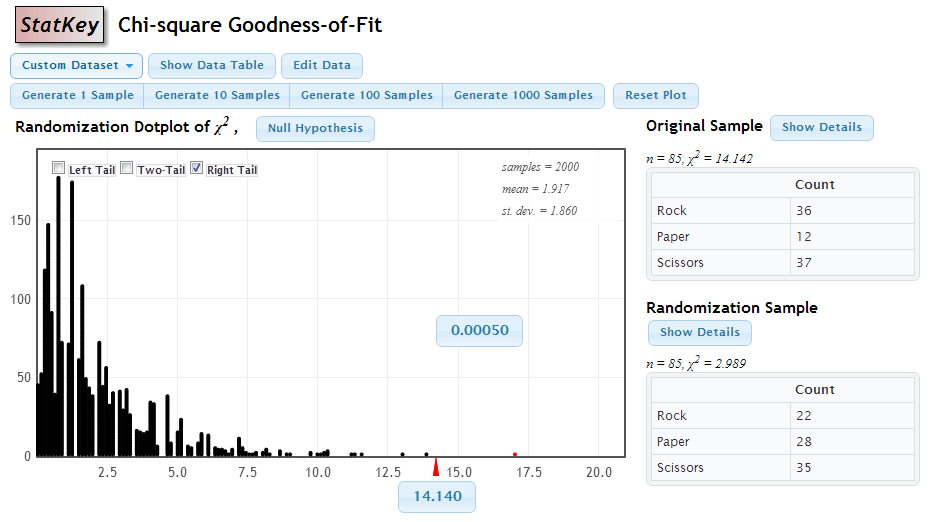
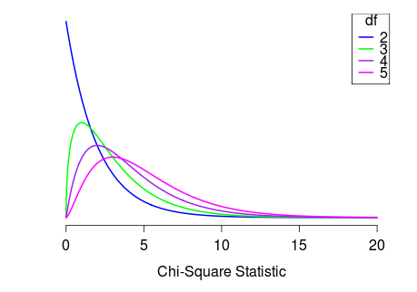
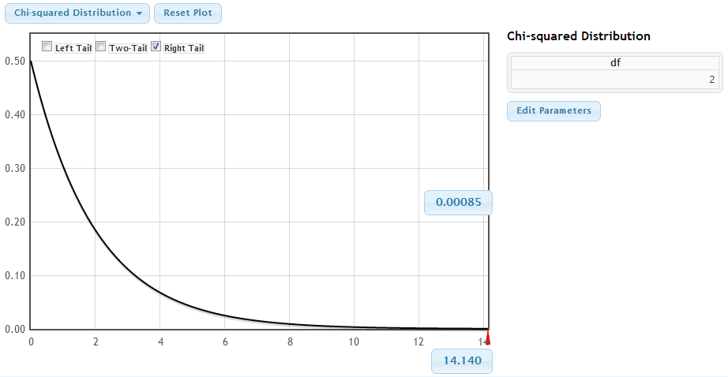

```{r setup, include=FALSE}
options(htmltools.dir.version = FALSE)
options(htmltools.preserve.raw = FALSE)
options(ggrepel.max.overlaps = Inf)

knitr::opts_chunk$set(echo = TRUE, 
                      dev = 'svg',
                      collapse = FALSE, 
                      comment = NA,  # PRINTS IN FRONT OF OUTPUT, default is '##' which comments out output
                      prompt = FALSE, # IF TRUE adds a > before each code input
                      warning = FALSE, 
                      message = FALSE,
                      fig.height = 3, 
                      fig.width = 4,
                      out.width = "100%"
                      )

# load necessary packages
library(tidyverse)
library(dplyr)
library(countdown)
library(ggthemes)
library(xaringanExtra)
library(forcats)
xaringanExtra::use_panelset()
xaringanExtra::use_tachyons()
xaringanExtra::use_clipboard()
xaringanExtra::use_extra_styles(
  hover_code_line = TRUE,         
  mute_unhighlighted_code = TRUE  
)
library(flipbookr)
library(patchwork)
library(DT)
library(knitr)
library(grid)
library(gridExtra)


select <- dplyr::select

# Set ggplot theme
theme_set(theme_tufte(base_size = 10))

yt <- 0

set.seed(1234)

# read.csv("https://raw.githubusercontent.com/deepbas/statdatasets/main/agstrat.csv")

```


```{r xaringanExtra-clipboard, echo=FALSE}
htmltools::tagList(
  xaringanExtra::use_clipboard(
    button_text = "<i class=\"fa fa-clipboard\"></i>",
    success_text = "<i class=\"fa fa-check\" style=\"color: #90BE6D\"></i>",
    error_text = "<i class=\"fa fa-times-circle\" style=\"color: #F94144\"></i>"
  ),
  rmarkdown::html_dependency_font_awesome()
)
```


layout: true
  
---

class: title-slide, middle

# .fancy[Inference for multiple proportions: One Categorical Variable]

### .fancy[Stat 120]

`r format(Sys.Date(), ' %B %d %Y')`

---

class: middle

# Tests for One Categorical Variable

.bq.font80[**Goodness-of-fit test**

- Test a claim about the distribution of one categorical variable
- E.g. are 6 M&M colors equally likely?
- E.g. is Biden's approval rating 50%?
]

<br>


---

# Tests for One Categorical Variable

.bql.font80[Seen single proportion tests before
  - Example : Test if the proportion of Reese’s Pieces that are orange is different from 1/3.

\begin{aligned}
H_0 : p = 1/3\\
H_a : p \neq 1/3
\end{aligned}
]

<br>

.bq.font80[What if we want to test proportions for several categories at once?

  - Example: Are the three colors (orange, yellow, brown) of Reese’s Pieces equally likely?

$H_0$ specifies a proportion,  $p_i$ , for each category.
]

---

# Rock-Paper-Scissors

.hljs[
ROCK | PAPER | SCISSORS | TOTAL
----| ---- | ------|-------
36 | 12 | 37 | 85 
]

.out-t[How would we test whether all of these categories are equally likely?]

--

.bql.font80[
Conduct a hypothesis test
  - State Hypothesis
  - Calculate a test statistic, based on your sample data
  - Create a distribution of this statistic, as it would be observed if the null hypothesis were true
  - Measure how extreme your test statistic is, as compared to the distribution generated under null
]

---

class: middle

# Test Statistic

.hljs[Why can’t we use the familiar formula to get the test statistic?

$$\frac{\text { sample statistic - null value }}{\text { SE }}$$
]

- More than one sample statistic
- More than one null value


.out-t[We need something a bit more complicated ...]


---

# Observed Counts


.hljs[The observed counts are the actual counts observed in the study

ROCK | PAPER | SCISSORS | TOTAL
----| ---- | ------|-------
36 | 12 | 37 | 85 
]

--

.bq.font80[
- The expected counts are the expected counts if the null hypothesis were true
- For each cell, the expected count is the sample size $n$ times the null proportion, $p_o$
]

.hljs[
&nbsp; | ROCK | PAPER | SCISSORS | TOTAL
----| ----| ---- | ------|-------
Observed | 36 | 12 | 37 | 85 
Expected | 28.33 | 28.33 | 28.33 | 85 
]


---

class: middle

# Chi-Square Statistic

.bq.font80[
- A test statistic is one number, computed from the data, which we can use to assess the null hypothesis
- The chi-square statistic is a test statistic for categorical variables:
]

<br>

.hljs[

\begin{aligned}
\chi^2 = \sum{\frac{(observed - expected)^2}{expected}} = \sum{\frac{(O - E)^2}{E}}
\end{aligned}

]

---

class: middle

#  Rock-Paper-Scissors

.hljs[
&nbsp; | ROCK | PAPER | SCISSORS | TOTAL
----| ----| ---- | ------|-------
Observed | 36 | 12 | 37 | 85 
Expected | 28.33 | 28.33 | 28.33 | 85 


\begin{aligned}
\chi^2 &= \frac{(36-28.33)^2}{28.33} + \frac{(12 - 28.33)^2}{28.33} + \frac{(37 - 28.33)^2}{28.33}\\
&= 2.076 + 9.379 + 2.628 \\
&= 14.083
\end{aligned}
]

---

class: middle

# What next?

.bql[
We have a test statistic.  What else do we need to perform the hypothesis test?
- A distribution of the test statistic assuming $H_0$ is true
]

---

class: middle

.bql[How do we get this? Two options:
1. Simulation
2. Theoretical Distribution
]

---

# Simulation

.bqt.font90[
1. Take 3 scraps of paper and label them Rock, Paper, Scissors. Fold or crumple them so they are indistinguishable. Choose one at random and record the result.

2. Repeat a number of times to match the original sample size and get a table of observed counts. 

3. Calculate the $\chi^{2}$-statistic.

4. Repeat this many times to get a randomization distribution of many $\chi^{2}$-statistics.

5. How extreme is the actual test statistic in this randomization distribution?
]

---

class: middle

# [Statkey:](https://www.lock5stat.com/StatKey/index.html) Chi-Square Distribution

<center>
<br>
</center>


---

class: middle

# Chi-Square Distribution

.bql[
If each of the expected counts are at least 5, AND if the null hypothesis is true, then the $\chi^2$ statistic follows a $\chi^2$ distribution, with degrees of freedom equal to

$$df = \text{number of categories} -1$$
]

.hljs[
Rock-Paper-Scissors:

```
df = 3 - 1 = 2 # degrees of freedom 
```
]
---

class: middle

# Chi-Square Distribution

<center>
<br>
</center>


---

class: middle

# [Statkey:](https://www.lock5stat.com/StatKey/index.html) p-value using Chi-square distribution

<center>
<br>
</center>

---

class: middle

# Goodness of Fit

.bq[
- A $\chi^2$ test for goodness of fit test determines whether the distribution of a categorical variable is the same as some null hypothesized distribution

- The null hypothesized proportions for each category do not have to be the same
]

---

# Chi-Square Test for Goodness of Fit

.bql.font90[
- State null hypothesized proportions for each category, pi.  Alternative is that at least one of the proportions is different than specified in the null.

- Calculate the expected counts for each cell as $n\cdot p_i$.  Make sure they are all greater than 5 to proceed.

- Calculate the $\chi^2$ statistic: $\chi^2 = \sum{\frac{(observed - expected)^2}{expected}}$

- Compute the p-value as the area in the tail above the $\chi^2$ statistic, for a $\chi^2$ distribution with   $df = (\text{number of categories - 1})$.

- Interpret the p-value in context and conclude.
]

---


class: action

# <i class="fa fa-pencil-square-o" style="font-size:48px;color:purple">&nbsp;Your&nbsp;Turn&nbsp;`r (yt <- yt + 1)`</i>    


.pull-left-40[

]
.pull-right-60[

<br>
.bql[
- Let's go over to the [course helper page](https://stat120-winter24.netlify.app/)
- Please do the class activity and let me know if you have any questions
- Feel free to talk to your neighbor
]
]

`r countdown(minutes = 25, seconds = 00, top = 0 , color_background = "inherit", padding = "3px 4px", font_size = "2em")`

