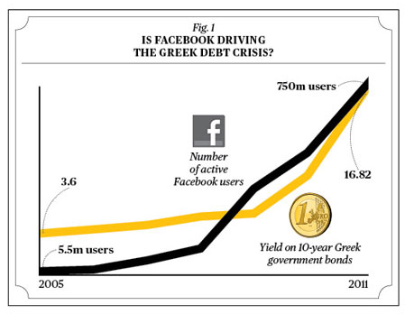
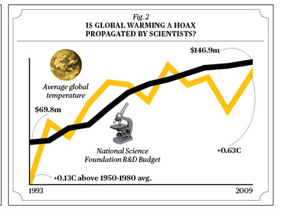

```{r setup, include=FALSE}
options(htmltools.dir.version = FALSE)
options(htmltools.preserve.raw = FALSE)
options(ggrepel.max.overlaps = Inf)

knitr::opts_chunk$set(echo = TRUE, 
                      dev = 'svg',
                      collapse = TRUE, 
                      comment = NA,  # PRINTS IN FRONT OF OUTPUT, default is '##' which comments out output
                      prompt = FALSE, # IF TRUE adds a > before each code input
                      warning = FALSE, 
                      message = FALSE,
                      fig.height = 3, 
                      fig.width = 4,
                      out.width = "100%"
                      )


# load necessary packages
library(Sleuth3)   # Data-set for Sleuth
library(tidyverse)
library(countdown)
library(mosaic)
library(ggthemes)
library(xaringanExtra)
library(forcats)
#library(NHSRtheme)  # color themes, nhs
xaringanExtra::use_panelset()
xaringanExtra::use_tachyons()
xaringanExtra::use_clipboard()
xaringanExtra::use_extra_styles(
  hover_code_line = TRUE,         #<<
  mute_unhighlighted_code = TRUE  #<<
)
library(flipbookr)
library(patchwork)


# Set ggplot theme
theme_set(theme_tufte(base_size = 10))


yt <- 0


```


```{r xaringanExtra-clipboard, echo=FALSE}
htmltools::tagList(
  xaringanExtra::use_clipboard(
    button_text = "<i class=\"fa fa-clipboard\"></i>",
    success_text = "<i class=\"fa fa-check\" style=\"color: #90BE6D\"></i>",
    error_text = "<i class=\"fa fa-times-circle\" style=\"color: #F94144\"></i>"
  ),
  rmarkdown::html_dependency_font_awesome()
)
```


layout: true
  
<!-- <div class="my-footer"><span>Stat 230</span></div> -->
<!-- this adds the link footer to all slides, depends on my-footer class in css-->

---

class: title-slide, middle
<!-- background-image: url("assets/title-image2.jpg") -->
background-position: 10% 90%, 100% 50%
background-size: 160px, 100% 100%

# .fancy[ Experiments and Observational Studies]

### .fancy[Stat 120]

`r format(Sys.Date(), ' %B %d %Y')`

---

# Association and Causation


.bql[Two variables are .b[associated] if values of one variable tends to
be related to values of the other variable
- e.g. .green-h[Families with many cars tend to own many television sets]
]

--

<br>

.bql[Two variables are .b[causally associated] if changing the value of
the explanatory variable influences the value of the response
variable
- e.g. .green-h[Studies show that taking a practice exam increases your score on an exam]
]

---

# College Education and Aging

.bql[
.font80[
“Education seems to be an elixir that can bring us a healthy body and mind
throughout adulthood and even a longer life,” says Margie E. Lachman, a psychologist
at Brandeis University who specializes in aging. “For those in midlife and beyond, a
college degree appears to slow the brain’s aging process by up to a decade, adding a
new twist to the cost-benefit analysis of higher education - for young students as
well as those thinking about returning to school.”]]


Which of the following is true?

.bql.font80[
1. Explanatory Variable = brain aging; Response Variable = elixir
2. Explanatory Variable = brain aging; Response Variable = college
degree
3. Explanatory Variable = college degree; Response Variable = brain
aging
]

<details>
<summary class="answer">Click for answer</summary>
The correct answer is 3.
</details>


.footnote[A Sharper Mind, Middle Age and Beyond, NY Times, 1/19/12]

---

class: middle

# College Education and Aging

.bqt[Based on this passage, should we conclude that obtaining a college
degree causes a slowdown in the brain’s aging process?
- Yes
- No
]

<details>
<summary class="answer">Click for answer</summary>
No. There could be other factors, such as socioeconomic status, lifestyle choices, or genetic predispositions, that contribute to both higher education attainment and slower brain aging
</details>

---

# Should you buy more TVs to live longer?


```{r, echo=FALSE, out.width="65%", fig.align='center'}
# Generate data frame
df <- data.frame(Country = c("United States", "China", "India", "Japan", "Germany", "United Kingdom", "France", "Brazil", "Italy", "Russia", "Canada", "South Korea", "Spain", "Australia", "Mexico", "Indonesia", "Nigeria", "Turkey", "Iran", "Thailand", "Egypt", "Vietnam", "South Africa", "Philippines", "Poland", "Ukraine", "Bangladesh", "Greece", "Portugal", "Sweden"),
                  Life_Expectancy = c(78.7, 76.4, 68.3, 84.2, 81.2, 81.1, 82.8, 75.2, 82.7, 72.2, 82.2, 82.6, 82.8, 82.8, 76.9, 71.5, 54.2, 77.2, 74.3, 75.2, 72.2, 75.2, 68.2, 67.3, 78.2, 76.2, 72.2, 74.2, 81.2, 81.2),
                  TVs_per_1000 = c(871.2, 463.2, 82.3, 645.2, 745.2, 745.2, 645.2, 463.2, 545.2, 463.2, 871.2, 745.2, 645.2, 871.2, 463.2, 82.3, 54.2, 463.2, 82.3, 463.2, 54.2, 82.3, 54.2, 72.3, 645.2, 545.2, 82.3, 463.2, 745.2, 745.2))


library(ggrepel)
library(ggthemes)

ggplot(data = df, aes(x = TVs_per_1000, y = Life_Expectancy)) +
  geom_point(aes(color = Country), size = 3) +
  geom_text_repel(aes(label = Country), size = 2, max.overlaps = getOption("ggrepel.max.overlaps", default = 10),
  nudge_x = 1,
  nudge_y = .3,) +
  geom_smooth(method = "lm", se = FALSE) +
  theme(plot.title = element_text(hjust = 0.5)) +
  annotate("text", x=700, y=60, label=paste("r=", round(cor(df$TVs_per_1000, df$Life_Expectancy),2))) +
  theme_tufte() +
  theme(legend.position = "none") 
```


---

class: middle

# TVs and Life Expectancy

<center>
 <br>
<a>Extra lurking variable</a>
</center>

---

# Facebook and Greek Debt Crisis


<center>
 <br>
</center>

.footnote[https://www.bloomberg.com/news/articles/2011-12-01/correlation-or-causation]

---

# Global Warming and Scientists

<center>
 <br>
</center>

.footnote[https://www.bloomberg.com/news/articles/2011-12-01/correlation-or-causation]

---

class: middle

# Confounding Variable

.bq.font100[
A third variable that is associated with both the explanatory
variable and the response variable is called a .b[confounding variable]
- A confounding variable can offer a plausible explanation for an association between the two variables.
]
<br>

.blue-h[Whenever confounding variables are present (or may be present), a causal association .b[CANNOT] be determined!]


---

<br>
<br>
<br>

# Experiment Vs Observational Study

.font120.bq[
An .out-t.b[observational study] is a study in which the researcher does
not actively control the value of any variable, but simply
observes the values as they naturally exist
]

--
<br>

.font120.bq[
An .out-t.b[experiment] is a study in which the researcher actively
controls one or more of the explanatory variables
]

---


class: middle

# Experiment or Observational Study?

.bq[
To examine whether farm-grown salmon contain more omega-3 oils
if water is more acidic, we collect samples of salmon and water from
multiple fish farms to see if the two variables are related.

- Experiment
- Observational Study
]

<details>
<summary class="answer">Click for answer</summary>
This is an observational study because the researchers do not actively manipulate or control the acidity of the water; they simply observe the naturally occurring conditions at each fish farm.
</details>

---

class: middle

# Observational Studies and Confounding Variable

.bql[
- There are almost always confounding variables in observational
studies

- Observational studies can almost never be used to establish
causation!!
]


.blue-h[To avoid confounding variables: Randomly assign values of the explanatory variable!]


---

class: middle

# Randomized Experiments

<center>
 <br>
</center>


.footnote[Source: click [here](https://bookdown.org/jgscott/DSGI/experiments.html)]
---

class: middle

# Randomized Experiments

.bql[
- In a .b[randomized experiment], the explanatory variable for each
unit is determined randomly, before the response variable is
measured
- The different levels of the explanatory variable are known as
.b[treatments]
- Randomly divide the units into groups, and randomly assign a
different treatment to each group
- Observe the response variable after treatments are applied
]

---


# Elimination of confounding variables

<center>
 <br>
</center>

--


.out-t[Because the explanatory variable is randomly assigned, it is not associated with any other variables.  Confounding variables are eliminated!!!]

---

# Exercise and the Brain

.bql[
- A sample of mice were divided randomly into two groups. One
group was given access to an exercise wheel, the other group
was kept sedentary
- "The brains of mice and rats that were allowed to run on wheels
pulsed with vigorous, newly born neurons, and those animals
then breezed through mazes and other tests of rodent IQ"
compared to the sedentary mice
]

Is this evidence that exercise causes an increase in brain
activity and IQ, at least in mice?


.center.out-t[Randomized experiment can yield causal conclusions!]


.footnote[Reynolds, "Phys Ed: Your Brain on Exercise", NY Times, July 7, 2010]

---

# Knee Surgery and Arthritis

> Researchers conducted a study on the effectiveness of a knee
surgery to cure arthritis. It was randomly determined whether
people got the knee surgery. Everyone who underwent the
surgery reported feeling less pain

--

- Is this evidence that the surgery causes a decrease in pain?

--

.out-t[Need a control or comparison group. What would happen without surgery?]

---

class: middle

# Control Group

.bql[
- When determining whether a treatment is effective, it is
important to have a comparison group, known as the .b[control group]

- All randomized experiments need either a control group, or at
least two different treatments to compare
]

---


# Knee Surgery for Arthritis

.bql[
- In the knee surgery study, those in the control group received a
.b[fake knee surgery]. They were put under and cut open, but the
doctor did not actually perform the surgery. All of these patients
also reported less pain!

- The improvement was .b[indistinguishable] between those receiving
the real surgery and those receiving the fake surgery!
]

--

.center.font140.b[What is the reason?]


.footnote[Source: The Placebo Prescription, NY Times Magazine, 1/9/00]

---

class: middle

# Placebo Effect


.bql[
-  Control groups are often given a .b[placebo], a fake treatment that resembles the active treatment as much as possible

- People can experience the effect they think they should be
experiencing, even if they aren’t actually receiving the treatment

- One study estimated that 75% of the effectiveness of
anti-depressant medication is due to the .b[placebo effect]

]

---

class: middle

# Double-blinded Experiments

> Neither the participants or the researchers evaluating participants should know which treatment the participants are actually getting

<br>
.bql.font80[Example: Clinical trial testing new drug for reducing blood pressure

- Participants split into drug and placebo groups
- Drug and placebo made identical to ensure double-blinding, preventing participant knowledge and eliminating placebo effect
- Researchers evaluating outcomes remain unaware of group assignments, avoiding unintentional biases and preserving result accuracy

]


---

class: middle

# Randomized Experiments: randomized comparative experiment

.bql[
- In this type of experiment, individuals are randomly assigned to a treatment or control group. 
- This method is most effective when the investigator has no prior knowledge of the individuals who are part of the experiment. 
]

.blue-h[Example: A researcher randomly assigns participants to either a drug treatment group or a control group to measure the effectiveness of the drug.]

---

class: middle

# Randomized Experiments: matched pairs experiment


.bql[
- In this type of experiment, each individual in the experimental group is matched with an individual in the control group based on a specific criterion. 
- This method is most effective when the investigator has prior knowledge of the individuals involved in the experiment.
]

.blue-h[Example: A researcher matches participants based on age, gender, and education level, then assigns one participant in the matched pair to the drug treatment group and the other to the control group to measure the effectiveness of the drug.]

---

# Variations of matched pairs experiments:

.pull-left[## Pretest-posttest design: 
.bq.font90[
- Match experimental and control group members based on pretest scores or baseline measurements
- Apply intervention to experimental group
- Compare posttest scores between matched pairs to evaluate treatment effect, accounting for initial differences
<br>
]
]
.pull-right[## Repeated measures design: 
.bq.font90[
- Each participant receives treatment and control interventions in random order
- Measurements taken after each intervention; treatment effect evaluated by comparing outcomes within individuals
- Reduces between-subject variability and often requires fewer participants for adequate statistical power
]
]

---

class: action, middle

# <i class="fa fa-pencil-square-o" style="font-size:48px;color:purple">&nbsp;Group&nbsp;Work&nbsp;`r (yt <- yt + 1)`</i>    


.pull-left-40[

]

.pull-right-60[
<br>
<br>
.bq[

- Go over to [moodle](https://moodle.carleton.edu/login/index.php) to get the class activity .Rmd file
- Continue working with your neighbors and let me know of you have any questions
]
]


`r countdown(minutes = 10, seconds = 00, top = 0 , color_background = "inherit", padding = "3px 4px", font_size = "2em")`

