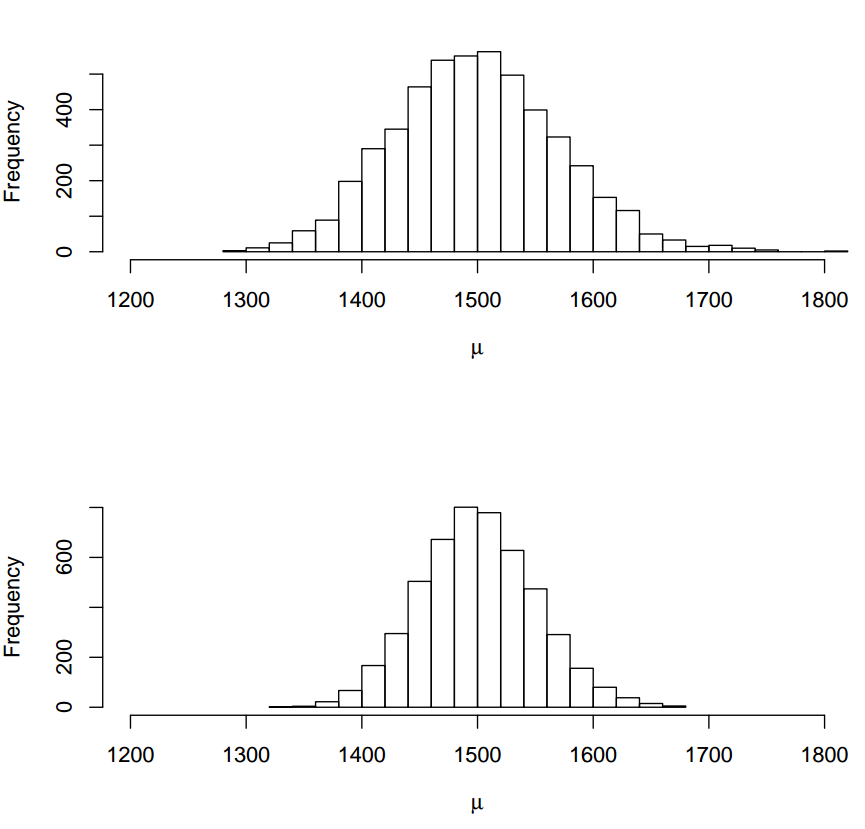
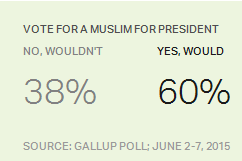
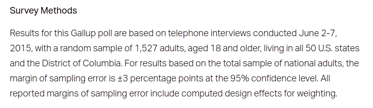

```{r setup, include=FALSE}
options(htmltools.dir.version = FALSE)
options(htmltools.preserve.raw = FALSE)
options(ggrepel.max.overlaps = Inf)

knitr::opts_chunk$set(echo = TRUE, 
                      dev = 'svg',
                      collapse = TRUE, 
                      comment = NA,  # PRINTS IN FRONT OF OUTPUT, default is '##' which comments out output
                      prompt = FALSE, # IF TRUE adds a > before each code input
                      warning = FALSE, 
                      message = FALSE,
                      fig.height = 3, 
                      fig.width = 4,
                      out.width = "100%"
                      )

# load necessary packages
library(tidyverse)
library(countdown)
library(mosaic)
library(ggthemes)
library(xaringanExtra)
library(forcats)
xaringanExtra::use_panelset()
xaringanExtra::use_tachyons()
xaringanExtra::use_clipboard()
xaringanExtra::use_extra_styles(
  hover_code_line = TRUE,         #<<
  mute_unhighlighted_code = TRUE  #<<
)
library(flipbookr)
library(patchwork)
library(Lock5Data)

# Set ggplot theme
theme_set(theme_tufte(base_size = 10))


yt <- 0

# read.csv("https://raw.githubusercontent.com/deepbas/statdatasets/main/APM_DougEvansCases.csv")

```


```{r xaringanExtra-clipboard, echo=FALSE}
htmltools::tagList(
  xaringanExtra::use_clipboard(
    button_text = "<i class=\"fa fa-clipboard\"></i>",
    success_text = "<i class=\"fa fa-check\" style=\"color: #90BE6D\"></i>",
    error_text = "<i class=\"fa fa-times-circle\" style=\"color: #F94144\"></i>"
  ),
  rmarkdown::html_dependency_font_awesome()
)
```


layout: true
  
<!-- <div class="my-footer"><span>Stat 230</span></div> -->
<!-- this adds the link footer to all slides, depends on my-footer class in css-->

---

class: title-slide, middle
<!-- background-image: url("assets/title-image2.jpg") -->
background-position: 10% 90%, 100% 50%
background-size: 160px, 100% 100%

# .fancy[Confidence Intervals and Bootstrap]

### .fancy[Stat 120]

`r format(Sys.Date(), ' %B %d %Y')`

---

class: middle

# Let's start with a question!

.bql.font80[
The higher the standard error of a statistic, the $\ldots \ldots$ the uncertainty surrounding the statistic.

  1. higher
  2. lower
]

---


# Sampling distribution


<center>
<a>Sampling distributions. Top n=50, Bottom n=100</a>
<br>
</center>


---

class: middle

# Interval Estimation

.bql[
- .bold[Point estimates] are almost always not accurate
- Uncertainty in point estimates measured by the .bold[Standard Error (SE)]
- A plausible range of values for the population parameter is more reliable
-  .bold[Interval Estimate:] An interval estimate is an interval of numbers within which the parameter value is believed to fall
]

---

# A Gallup Poll

.pull-left[

<center>
<br>
</center>


]

.pull-right[
<br>
> How accurate is an estimate of $60\%$?

]

<br>

<center>
<br>
</center>


.footnote[[Link](https://news.gallup.com/poll/183713/socialist-presidential-candidates-least-appealing.aspx?utm_source=genericbutton&utm_medium=organic&utm_campaign=sharing) to the Gallup poll]

---

# A Gallup Poll

.pull-left[

<center>
<br>
</center>

> " $\ldots$  the margin of sampling error is $\pm$ 3 percentage points at the $95\%$ confidence level."


]

.pull-right[
<br>
.bql.font90[
- Interval estimate: $60\% \pm 3\% = (57\% , 63\%)$
- The percentage of American adults who would vote for a Muslim for president is likely between $57\%$ and $63\%$.
- Would a majority of US adults vote for a qualified Muslim presidential candidate?

]

]

---

class: middle

# Margin of Error

.bql.font90[
- The .bold[margin of error] measures how accurate a point estimate is likely to be in estimating a parameter.

- To determine the margin of error, we can use the statistic's .bold[sampling distribution] and .bold[standard error]
]

---

class: middle

# Confidence Intervals

.bql.font90[
- A .bold[confidence interval] is an interval containing the most believable values for a parameter
- A confidence interval is centered on the .bold[point estimate] and extends a certain number of .bold[standard errors] on either side of the estimate
- The .bold[confidence level] tells us what percent of the intervals will contain the population parameter.
]

<br>

.bqt.font90[
A .bold[95% confidence interval] means that if we were to draw numerous samples and calculate their confidence intervals, about 95% of these intervals would be expected to contain the true population parameter.]

---

class: middle


# $95\%$ Confidence Interval

.bql[
If the sampling distribution is relatively .bold[symmetric] and .bold[bell-shaped], a $95\%$ confidence interval can be estimated using $$\mathbf{statistic} \pm 2 \times \mathbf{SE}$$]

<br>


.bq.font90[A 95% confidence interval suggests that if we were to take many samples and compute the confidence interval for each, we would expect about 95% of these intervals to capture the true, but unknown, population proportion, with the current interval estimating this proportion to be within 3 percentage points of the sample proportion]


---

class: middle

# Confidence Intervals are ...

.bql[
- always about the .bold[population]
- not .bold[probability statements]
- only about .bold[population parameters], not individual observations
- only reliable if the sample statistic they’re based on is an .bold[unbiased] estimator of the population parameter
]

---

# A short demo

Let's all go to [Statkey](http://www.lock5stat.com/StatKey/index.html) web app.

<center>
<br>
</center>

---

class: middle

# Take Home Points

.pull-left[

.bql[
- The parameter is .bold[fixed]
- The statistic is .bold[random] (depends on the sample)
- The interval is also .bold[random] (depends on the statistic)
- Confidence level is the .bold[proportion] of intervals that capture the true parameter
]
]
.pull-right[
<center>
<br>
<a style="font-size: smaller;">Repeated Sampling of 100 95% Confidence Intervals, Truth = Vertical Line</a></center>


]

---

class: middle

# What to do when we only have one sample - .bold[BOOTSTRAP!]

.bq[
- .bold[Repeated sampling] is needed to compute the standard error of a sample statistic
- Can .bold[estimate the SE] from a bootstrap distribution
- Use this SE to compute a .bold[confidence interval] for an unknown parameter
]

---

class: middle

# Bootstrap Distribution

> A .bold[bootstrap distribution] is the distribution of many bootstrap statistics.

<br>

.bql[

- The standard deviation of this distribution is called the .bold[bootstrap standard error] of the statistic.

- The bootstrap distribution is .bold[centered] near the original sample mean.
]

---


`r chunk_reveal("bootstrap-demo", widths = c(0.4, 0.6), title = "## Bootstrap Distrubution using CarletonStats R Package")`

.font50[
```{r bootstrap-demo, fig.width = 5, fig.height = 5, out.width = "80%", include=FALSE}
library(CarletonStats)
X <- c(20,24,19,23,22,16) # data
boot(X) # bootstrap
```
]


---

class: action

# <i class="fa fa-pencil-square-o" style="font-size:48px;color:purple">&nbsp;Your&nbsp;Turn&nbsp;`r (yt <- yt + 1)`</i>    

.pull-left-40[

]
.pull-right-60[
<br>
<br>
<br>
.bq[

Please go over the class activity and [class helper page](https://stat120-winter24.netlify.app/) and let me know if you have any questions.

]
]

`r countdown(minutes = 15, seconds = 00, top = 0 , color_background = "inherit", padding = "3px 4px", font_size = "2em")`


