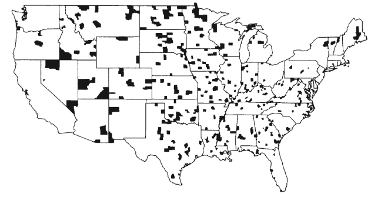

```{r setup, include=FALSE}
options(htmltools.dir.version = FALSE)
options(htmltools.preserve.raw = FALSE)
options(ggrepel.max.overlaps = Inf)

knitr::opts_chunk$set(echo = TRUE, 
                      dev = 'svg',
                      collapse = TRUE, 
                      comment = NA,  # PRINTS IN FRONT OF OUTPUT, default is '##' which comments out output
                      prompt = FALSE, # IF TRUE adds a > before each code input
                      warning = FALSE, 
                      message = FALSE,
                      fig.height = 3, 
                      fig.width = 4,
                      out.width = "100%"
                      )


# load necessary packages
library(Lock5Data)
library(Lock5withR)
library(tidyverse)
library(countdown)
library(mosaic)
library(ggthemes)
library(xaringanExtra)
library(forcats)
xaringanExtra::use_panelset()
xaringanExtra::use_tachyons()
xaringanExtra::use_clipboard()
xaringanExtra::use_extra_styles(
  hover_code_line = TRUE,         #<<
  mute_unhighlighted_code = TRUE  #<<
)
library(flipbookr)
library(patchwork)


# Set ggplot theme
theme_set(theme_tufte(base_size = 10))


yt <- 0
```


```{r xaringanExtra-clipboard, echo=FALSE}
htmltools::tagList(
  xaringanExtra::use_clipboard(
    button_text = "<i class=\"fa fa-clipboard\"></i>",
    success_text = "<i class=\"fa fa-check\" style=\"color: #90BE6D\"></i>",
    error_text = "<i class=\"fa fa-times-circle\" style=\"color: #F94144\"></i>"
  ),
  rmarkdown::html_dependency_font_awesome()
)
```


layout: true
  
<!-- <div class="my-footer"><span>Stat 230</span></div> -->
<!-- this adds the link footer to all slides, depends on my-footer class in css-->

---

class: title-slide, middle
<!-- background-image: url("assets/title-image2.jpg") -->
background-position: 10% 90%, 100% 50%
background-size: 160px, 100% 100%

# .fancy[Introduction to Statistics]

### .fancy[Stat 120]

`r format(Sys.Date(), ' %B %d %Y')`

---

# Something about me

.pull-left[
.blockquote[
- First year at Carleton
- Originally from Nepal
- PhD in Applied Statistics from
UC-Riverside
- Diverse education background
- Avid learner and traveler
]

]
.pull-right[
<center>
<br>
<a href="https://deepbas.io/">My webpage</a>
</center>
]

---

class: middle

# COVID-19 related policies

.blockquote-list[
- Stay home when sick. (Even if you don’t have COVID-19, you should
stay home if you aren’t feeling well.)
- Follow [CDC](https://www.cdc.gov/coronavirus/2019-ncov/vaccines/stay-up-to-date.html) on testing, quarantine, and isolation.
- Follow the College mask-wearing policy
]


---

class: middle

## What will you learn?

.blockquote-list[
- Analyzing data by doing exploratory data analysis

- Estimate some parameter of interest from the population

- Infer the population characteristics based in your estimation

- Quantify the uncertainty in the estimation
]
---

# What will a typical day/week look like?

Before Class:

.blockquote[
1. Some reading/video to introduce some topics
2. Will be updated in the weekly planner
]

During Class:

.blockquote[
1. Mini-lectures
2. Hands-on group activities
]
---

# Your introduction

.pull-left[
.blockquote-list[
- Your name?
- What gender pronouns do
you use?
- Favourite Mathematician/Scientist/Person?
- Recent fun memories?
]
]
.pull-right[
<center>
<br>
<a>Please fill in!</a>
</center>
]

---

class: inverse, middle


.font120[
Statistics is distinct from mathematics

Study of data and the uncertainties surrounding them

We will take a more conceptual route to statistics in this course
]

---


# Software Component

.blockquote[
- Statistical computing software called R
- RStudio gives nice user-friendly interface to R
- RMarkdown is platform in Rstudio to write your codes and results
]

--

<br>

.center.font120.purple[We will gradually learn these things!]

---

class: middle

# What and Why of Statistics.

.blockquote-list[
- Science of collecting, describing, and analyzing data
  + Sampling
  + Exploratory Data Analysis
  + Inference

- Makes it easier to know the source of uncertainties

- Let's us take an unbiased viewpoint
]

---

class: middle

# Data: Cases and Variables

.blockquote-list[
Data are a set of measurements taken on a set of individual units
- These are .bold[cases] or units

Data is stored and presented in a dataset that comprises of variables measured on cases
- A .bold[variable] is any characteristic that is recorded for each case
]

---

## `EducationLiteracy` dataset from Lock5

.scroll-box-16[
```{r, echo=FALSE}
knitr::kable(EducationLiteracy, format = "html")
```
]

--

<br>
<center>
<a> Each row = case & Each column = variable  </a>
</center>

.footnote[Click [here](https://www.lock5stat.com/datapage2e.html) for Lock5 datasets for the second edition]

---

class: middle

# Categorical Versus Quantitative

> Variables are classified as either categorical or quantitative:

<br>

- A categorical variable divides the cases into groups. e.g. gender,
country, state etc.

- A quantitative variable measures a numerical quantity for each
case, e.g. age, height, sleep hours, blood pressure etc


---

# Kidney cancer

> Counties with the highest kidney cancer rates

<center>
<br>
<a>Source: Gelman et. al. Bayesian Data Anaylsis, CRC Press, 2004</a>
</center>

---


# Kidney cancer

> If the cases in the kidney cancer dataset are people, then the measured variable is .bold[categorical]

--

- We categorize each person as either having kidney
cancer or not which is categorical.

---

# Kidney cancer

> If the cases in the kidney cancer dataset are counties, then the measured variable is .bold[quantitative]

- Data collected at the county level is aggregated
across all people living in the county. We then get
rates of cancer which are numbers (quantitative).

---

# Variable manipulations

.blockquote[
Can use numbers to code categories of categorical variable
- e.g Gender (1 for male and 2 for female)
]

--

.blockquote[
Can convert quantitative variable into categorical groups
- e.g. Income (0-50000 as Low, 50000+ as High)
]

--

.blockquote[
Categorical variables are sometimes collapsed into fewer levels
- e.g. no HS degree, HS degree, some college, 2 year degree
]


---

# Explanatory and Response Variable

> When one variable helps us understand or predict values of another variable, we call the former the .bold[explanatory variable] and the latter the .bold[response variable]

--

<br>
.pull-left[

.blockquote[
Does meditation help reduce stress?
- explanatory variable: .bold[meditation]
- response variable: .bold[stress level]
]
]

.pull-right[
.blockquote[
Does sugar consumption increase hyperactivity?
- explanatory variable: .bold[sugar consumption]
- response variable: .bold[hyperactive behavior]
]
]

---

class: action

# <i class="fa fa-pencil-square-o" style="font-size:48px;color:purple">&nbsp;Your&nbsp;Turn&nbsp;`r (yt <- yt + 1)`</i>    

.blockquote-list[
- Your turn features are regularly used in this class
- This is your time to gauge your learning 
- Think of these as lab time under my supervision
- Feel free to communicate with your neighbors and form groups
]

--

Please download the in class activity file for Day 1 from [moodle](https://moodle.carleton.edu/). 
- Save this file to your course folder. 
- We will go over this .Rmd file together. 
- Once you are done, save the file for further reading.


`r countdown(minutes = 10, seconds = 00, top = 0 , color_background = "inherit", padding = "3px 4px", font_size = "2em")`


