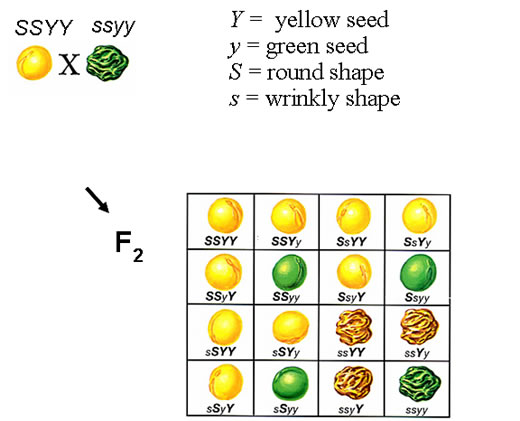
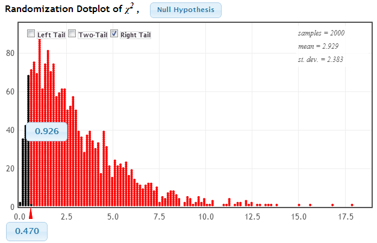
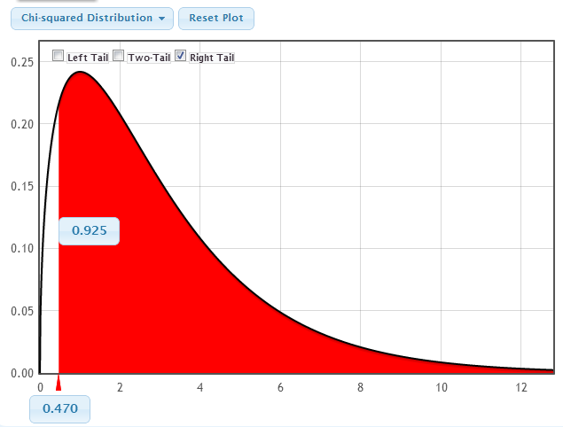

```{r setup, include=FALSE}
options(htmltools.dir.version = FALSE)
options(htmltools.preserve.raw = FALSE)
options(ggrepel.max.overlaps = Inf)

knitr::opts_chunk$set(echo = TRUE, 
                      dev = 'svg',
                      collapse = FALSE, 
                      comment = NA,  # PRINTS IN FRONT OF OUTPUT, default is '##' which comments out output
                      prompt = FALSE, # IF TRUE adds a > before each code input
                      warning = FALSE, 
                      message = FALSE,
                      fig.height = 3, 
                      fig.width = 4,
                      out.width = "100%"
                      )

# load necessary packages
library(tidyverse)
library(dplyr)
library(countdown)
library(ggthemes)
library(xaringanExtra)
library(forcats)
xaringanExtra::use_panelset()
xaringanExtra::use_tachyons()
xaringanExtra::use_clipboard()
xaringanExtra::use_extra_styles(
  hover_code_line = TRUE,         
  mute_unhighlighted_code = TRUE  
)
library(flipbookr)
library(patchwork)
library(DT)
library(knitr)
library(grid)
library(gridExtra)


select <- dplyr::select

# Set ggplot theme
theme_set(theme_tufte(base_size = 10))

yt <- 0

set.seed(1234)


# read.csv("https://raw.githubusercontent.com/deepbas/statdatasets/main/agstrat.csv")

```


```{r xaringanExtra-clipboard, echo=FALSE}
htmltools::tagList(
  xaringanExtra::use_clipboard(
    button_text = "<i class=\"fa fa-clipboard\"></i>",
    success_text = "<i class=\"fa fa-check\" style=\"color: #90BE6D\"></i>",
    error_text = "<i class=\"fa fa-times-circle\" style=\"color: #F94144\"></i>"
  ),
  rmarkdown::html_dependency_font_awesome()
)
```


layout: true
  
---

class: title-slide, middle

# .fancy[Inference for multiple proportions]

### .fancy[Stat 120]

`r format(Sys.Date(), ' %B %d %Y')`

---

# Tests for Categorical Variable(s)

**Goodness-of-fit test**

- Test a claim about the distribution of one categorical variable
- E.g. are 6 M&M colors equally likely?
- E.g. is Biden's approval rating 50%?


**Chi-square test for association**

- Determine if a relationship between two categorical variables is statistically significant
- E.g. Does M&M color distribution depend on type (chocolate vs. peanut)?

---

# Test for one categorical variable

Seen single proportion tests before
  - Example : Test if the proportion of Reese’s Pieces that are orange is different from 1/3.


\begin{aligned}
H_0 : p = 1/3\\
H_a : p \neq 1/3
\end{aligned}

What if we want to test proportions for several categories at once?

  - Example: Are the three colors (orange, yellow, brown) of Reese’s Pieces equally likely?

$H_0$ specifies a proportion,  $p_i$ , for each category.


---

# Test for one categorical variable


The proportions do not have to be the same. e.g: Grade distribution

\begin{aligned}
H_0 :p_{A}=0.2 \quad p_{B}=0.3 \quad p_{C}=0.3 \quad p_{D}=0.1 \quad p_{F}=0.1\\
H_a :\text{ at least one proportion different}
\end{aligned}


---

# Rock-Paper-Scissors


ROCK | PAPER | SCISSORS | TOTAL
----| ---- | ------|-------
36 | 12 | 37 | 85 

.out-t[How would we test whether all of these categories are equally likely?]

Conduct a hypothesis test
  - State Hypothesis
  - Calculate a test statistic, based on your sample data
  - Create a distribution of this statistic, as it would be observed if the null hypothesis were true
  - Measure how extreme your test statistic is, as compared to the distribution generated under null

---

# Test Statistic

Why can’t we use the familiar formula to get the test statistic?

$$\frac{\text { sample statistic - null value }}{\text { SE }}$$


- More than one sample statistic
- More than one null value

.out-t[We need something a bit more complicated ...]


---

# Observed Counts


- The observed counts are the actual counts observed in the study

ROCK | PAPER | SCISSORS | TOTAL
----| ---- | ------|-------
36 | 12 | 37 | 85 

--

- The expected counts are the expected counts if the null hypothesis were true

- For each cell, the expected count is the sample size $(n)$ times the null proportion, $p_i$


&nbsp; | ROCK | PAPER | SCISSORS | TOTAL
----| ----| ---- | ------|-------
Observed | 36 | 12 | 37 | 85 
Expected | 28.33 | 28.33 | 28.33 | 85 


---

# Chi-Square Statistic

- A test statistic is one number, computed from the data, which we can use to assess the null hypothesis

- The chi-square statistic is a test statistic for categorical variables:


\begin{aligned}
\chi^2 = \sum{\frac{(observed - expected)^2}{expected}}
\end{aligned}

---

#  Rock-Paper-Scissors

&nbsp; | ROCK | PAPER | SCISSORS | TOTAL
----| ----| ---- | ------|-------
Observed | 36 | 12 | 37 | 85 
Expected | 28.33 | 28.33 | 28.33 | 85 


\begin{aligned}
\chi^2 &= \ldots \\
&\approx \ldots
\end{aligned}

---

# What next?

We have a test statistic.  What else do we need to perform the hypothesis test?

A distribution of the test statistic assuming $H_0$ is true

How do we get this? Two options:
1. Simulation
2. Theoretical Distribution

---

# Simulation

1. Take 3 scraps of paper and label them Rock, Paper, Scissors. Fold or crumple them so they are indistinguishable. Choose one at random and record the result.

2. Repeat a number of times to match the original sample size and get a table of observed counts. 

3. Calculate the $x^{2}$-statistic.

4. Repeat this many times to get a randomization distribution of many $x^{2}$-statistics.

5. How extreme is the actual test statistic in this randomization distribution?


---

# Chi-Square Distribution

<center>
<br>
</center>


---

# Chi-Square Distribution

- If each of the expected counts are at least 5, AND if the null hypothesis is true, then the $\chi^2$ statistic follows a $\chi^2$ distribution, with degrees of freedom equal to

$$df = \text{number of categories} -1$$

- Rock-Paper-Scissors:

```
df = 3 - 1 = 2
```

---

# Chi-Square Distribution

<center>
<br>
</center>


---


# p-value using Chi-square distribution

<center>
<br>
</center>

---

# Goodness of Fit

- A $\chi^2$ test for goodness of fit test determines whether the distribution of a categorical variable is the same as some null hypothesized distribution

- The null hypothesized proportions for each category do not have to be the same

---

# Chi-Square Test for Goodness of Fit

- State null hypothesized proportions for each category, pi.  Alternative is that at least one of the proportions is different than specified in the null.

- Calculate the expected counts for each cell as $n\cdot p_i$.  Make sure they are all greater than 5 to proceed.

- Calculate the $\chi^2$ statistic:

\begin{aligned}
\chi^2 = \sum{\frac{(observed - expected)^2}{expected}}
\end{aligned}

- Compute the p-value as the area in the tail above the $\chi^2$ statistic, for a $\chi^2$ distribution with   $df = (\text{number of categories - 1})$.

- Interpret the p-value in context.


---

# Mendel’s Pea Experiment

Between 1856 and 1863 Gregor Mendel cultivated and tested roughly 29,000 pea plants. This study showed that one in four pea plants was purebred recessive, two out of four were hybrid and one out of four were purebred dominant. 

Mendel's work was rejected at first and was not widely accepted until after he died. He is now known as the “father of modern genetics

.footnote[Source: Mendel, Gregor. (1866). Versuche ber Pflanzen-Hybriden. Verh. Naturforsch. Ver. Brünn 4: 3–47 (in English in 1901, Experiments in Plant Hybridization, J. R. Hortic. Soc. 26: 1–32)]

---

# Mendel’s Pea Experiment

.pull-left[
<center>
<br>
</center>

]
.pull-right[

S, Y: Dominant and s, y: Recessive
Mate SSYY with ssyy: 1st Generation: all Ss Yy
Mate 1st Generation: $\rightarrow$ 2nd Generation

Phenotype | Theoretical Proportion
----| ---- 
Round, Yellow | 9/16 
Round, Green | 3/16
Wrinkled, Yellow | 3/16
Wrinkled, Green | 1/16
]

---

# Mendel’s Pea Experiment
 
Phenotype | Theoretical Proportion | Observed Counts
----| ---- | ---- | ----
Round, Yellow | 9/16 | 315
Round, Green | 3/16 | 101
Wrinkled, Yellow | 3/16 | 108
Wrinkled, Green | 1/16 | 32

Let’s test this data against the null hypothesis of each $p_i$ equal to the theoretical value, based on genetics

$$H_{0}: p_{1}=9 / 16, p_{2}=3 / 16, p_{3}=3 / 16, p_{4}=1 / 16$$
$$H_{a} : \text{ At least one } p_{i} \text{ is not as specified in } H_{0}$$
---

# Mendel’s Pea Experiment

.pull-left[
What is the expected count for round green peas?

A. 0.182

B. 108

C. 104.25

D. 139
]

.pull-right[
Phenotype | Theoretical Proportion | Observed Counts
----| ---- | ---- | ----
Round, Yellow | 9/16 | 315
Round, Green | 3/16 | 101
Wrinkled, Yellow | 3/16 | 108
Wrinkled, Green | 1/16 | 32
]

---

# Mendel’s Pea Experiment


.pull-left[
Phenotype | Theoretical Proportion | Observed Counts
----| ---- | ---- | ----
Round, Yellow | 9/16 | 315
Round, Green | 3/16 | 101
Wrinkled, Yellow | 3/16 | 108
Wrinkled, Green | 1/16 | 32
]
.pull-right[
The $\chi$^2 statistic is the sum of 4 components (because there are 4 categories).  What is the contribution to the $\chi$^2 statistic from the “Round, Yellow” category?

1. 0.016

2. 1.05

3. 5.21

4. 107.2

]

---

# Mendel’s Pea Experiment

$$\chi^{2}=0.47$$

Two options:
- Simulate a randomization distribution
- Compare to a $\chi^{2}$ distribution with 4-1


.pull-left[
<center>
<br>
</center>
]
.pull-right[
<center>
<br>
</center>
]

---

# Mendel’s Pea Experiment

.blockquote[
Does this prove Mendel’s theory of genetics?  Or at least prove that his theoretical proportions for pea phenotypes were correct?

1. Yes
2. No
]

<br>

.out-t[p-value = 0.925]

---

class: action

# <i class="fa fa-pencil-square-o" style="font-size:48px;color:purple">&nbsp;Your&nbsp;Turn&nbsp;`r (yt <- yt + 1)`</i>    


.pull-left-40[

]
.pull-right-60[

<br>
<br>

.blockquote[
- Go over to the in class activity file
- Complete the activity in your group
]
]

`r countdown(minutes = 5, seconds = 00, top = 0 , color_background = "inherit", padding = "3px 4px", font_size = "2em")`

