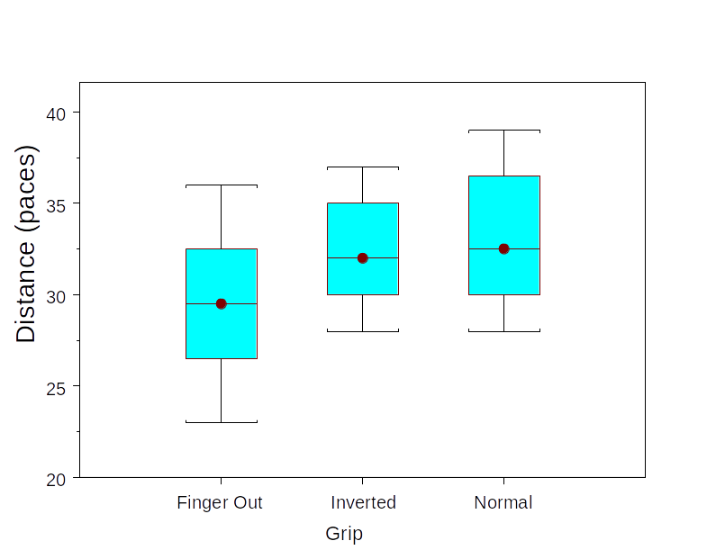
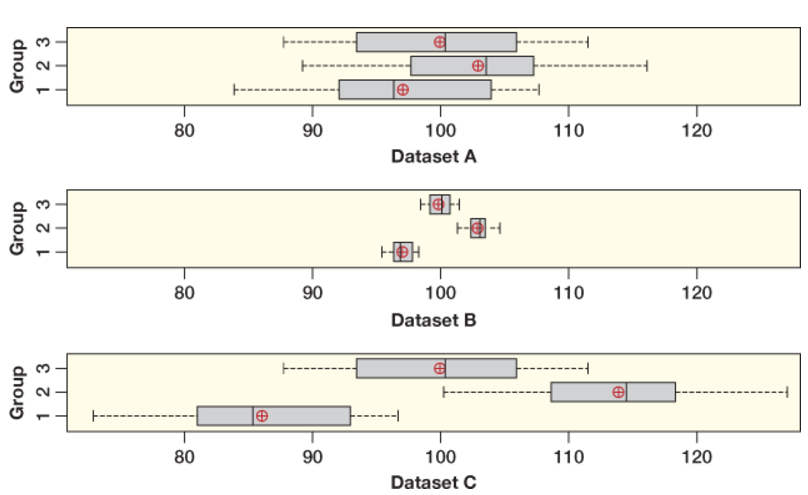
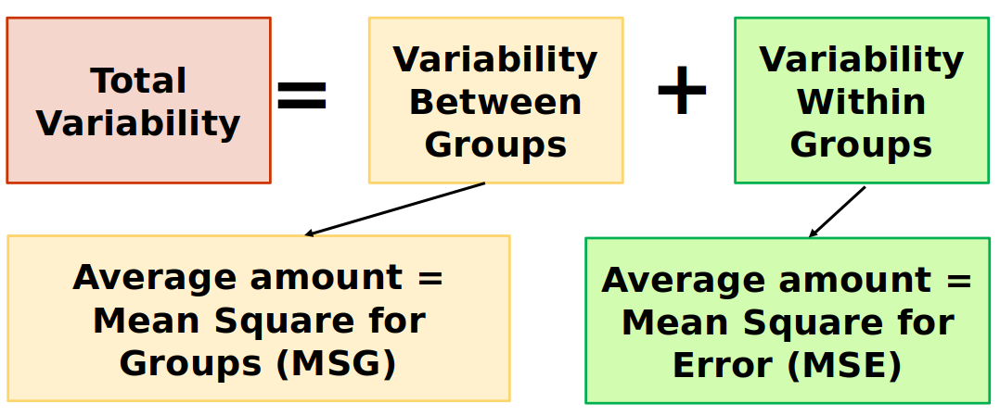
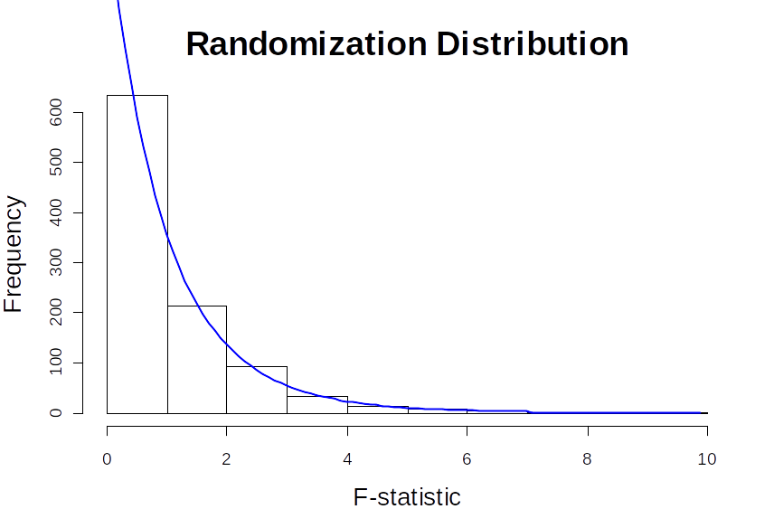
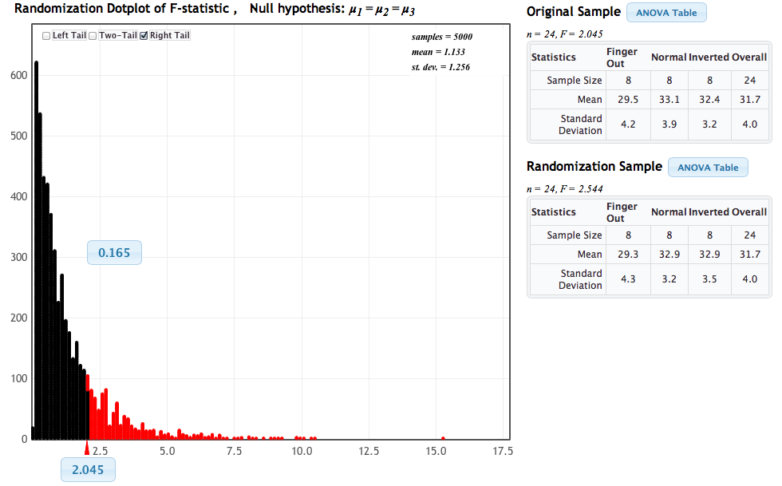
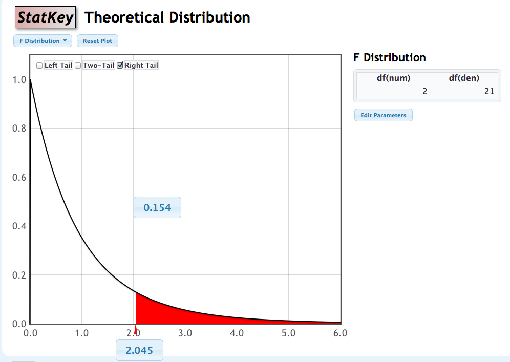
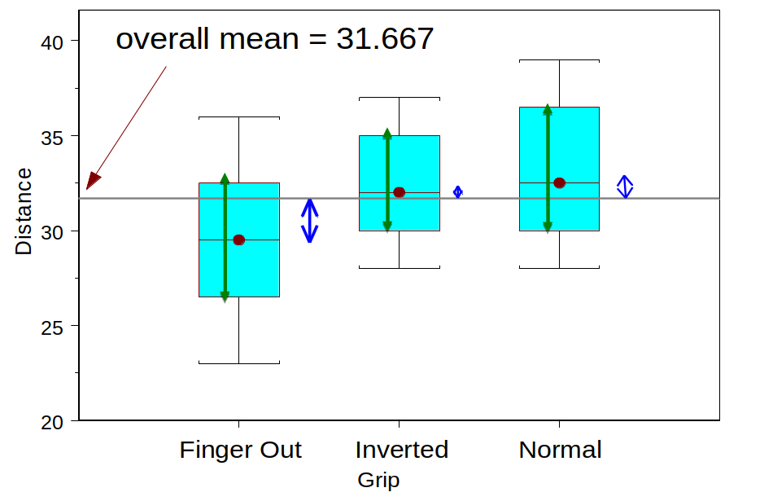
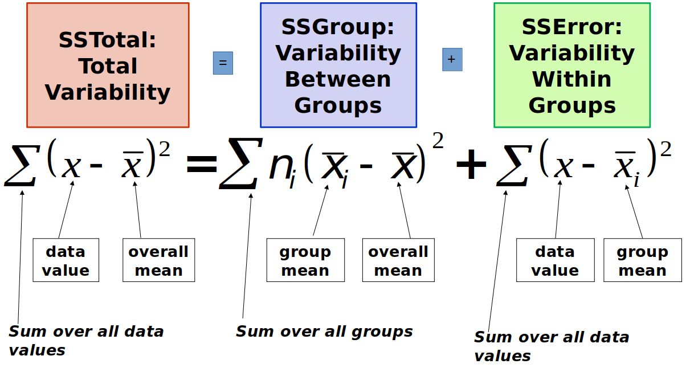
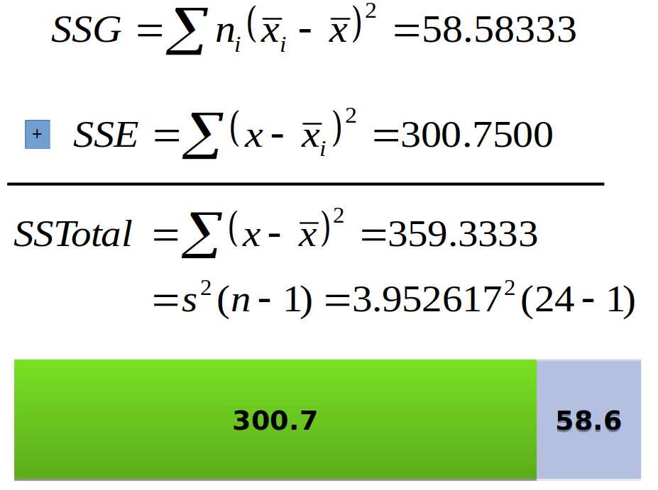

```{r setup, include=FALSE}
options(htmltools.dir.version = FALSE)
options(htmltools.preserve.raw = FALSE)
options(ggrepel.max.overlaps = Inf)

knitr::opts_chunk$set(echo = TRUE, 
                      dev = 'svg',
                      collapse = FALSE, 
                      comment = NA,  # PRINTS IN FRONT OF OUTPUT, default is '##' which comments out output
                      prompt = FALSE, # IF TRUE adds a > before each code input
                      warning = FALSE, 
                      message = FALSE,
                      fig.height = 3, 
                      fig.width = 4,
                      out.width = "100%"
                      )

# load necessary packages
library(tidyverse)
library(dplyr)
library(countdown)
library(ggthemes)
library(xaringanExtra)
library(forcats)
xaringanExtra::use_panelset()
xaringanExtra::use_tachyons()
xaringanExtra::use_clipboard()
xaringanExtra::use_extra_styles(
  hover_code_line = TRUE,         
  mute_unhighlighted_code = TRUE  
)
library(flipbookr)
library(patchwork)
library(DT)
library(knitr)
library(grid)
library(gridExtra)


select <- dplyr::select

# Set ggplot theme
theme_set(theme_tufte(base_size = 10))

yt <- 0

set.seed(1234)


# read.csv("https://raw.githubusercontent.com/deepbas/statdatasets/main/agstrat.csv")

```


```{r xaringanExtra-clipboard, echo=FALSE}
htmltools::tagList(
  xaringanExtra::use_clipboard(
    button_text = "<i class=\"fa fa-clipboard\"></i>",
    success_text = "<i class=\"fa fa-check\" style=\"color: #90BE6D\"></i>",
    error_text = "<i class=\"fa fa-times-circle\" style=\"color: #F94144\"></i>"
  ),
  rmarkdown::html_dependency_font_awesome()
)
```


layout: true
  
---

class: title-slide, middle

# .fancy[Comparing Two or more Means]

### .fancy[Stat 120]

`r format(Sys.Date(), ' %B %d %Y')`

---

# Inference tools (Classical methods)

.pull-left[
.blockquote.font80[
Categorical Response

1. One proportion:

  - 1 sample z test/CI

2. Difference in 2 props

  - 2 sample z test/CI
  - OR chi-square test

3. Association between 2 categorical variables?

  - chi-square test
]
]
.pull-right[
.blockquote.font80[
Quantitative Response

1. One mean:

  - 1 sample t test/CI
  
2. Difference in 2 means

  - 2 independent sample t test/CI
  - Matched pairs
  
3. Compare >2 means

  - .brand-red.bold[One-way ANOVA]
  <br>

]
]

---

class: middle

# Multiple Categories

.blockquote[
So far, we’ve learned how to do inference for a difference in means IF the categorical variable has only two categories (i.e. compare two groups)
]
<br>

.blockquote[
In this section, we’ll learn how to do hypothesis tests for a difference in means across multiple categories (i.e. compare more than two groups)
]

---

class: middle

# Hypotheses

.blockquote[To test for a difference in true/population means across k groups:

\begin{align*}
H_{0}:& \quad \mu_{1}=\mu_{2}=\ldots=\mu_{k}\\
H_{a}:& \quad \text{At least one } \mu_{i} \neq \mu_{j}
\end{align*}


]

---

# Frisbee Example 

.out-t[Does Frisbee grip affect the distance of a throw?]

.blockquote.font80[
- A student performed the following experiment: 3 grips, 8 throws using each grip

    1. Normal grip
    2. One finger out grip
    3. Frisbee inverted grip
]

<br>

.blockquote.font80[
- A grip type is randomly assigned to each of the 24 throws she plans on making

  - Response: measured in paces how far her throw went
  - Question: How might you summarize her data?
]

---

# Frisbee Example

.pull-left[
<center>
 <br>
</center>
]
.pull-right[
<br>
<br>

&nbsp; | Finger-out | Inverted   | Normal
-------- | ------------- | ----------- | -----------
n | 8  |  8   |   8  
Mean |  29.5  | 32.375    | 33.125
SD |  4.175 | 3.159  |  3.944

]

.blockquote[
Question: Is this evidence that grip affects mean distance thrown? 
\begin{align*}
H_{0}:& \quad \mu_{1}=\mu_{2}=\mu_{3}\\
H_{a}:& \quad \text{At least one } \mu_{1}, \mu_{2}, \mu_{3} \text{ is not the same}
\end{align*}
]

---

# Why Analyze Variability to Test for a Difference in Means?

.pull-left-40[

.blockquote.font90[
- The group means in Datasets $A$ and $B$ are the same, but the boxes show different spread.

- Datasets $A$ and $C$ have the same spread for the boxes, but different group means.
]
]
.pull-right-60[
<center>
 <br>
</center>
.out-t[Which of these graphs appear to give strong visual evidence for a difference in the group means?]
]

---

# Why Analyze Variability to Test for a Difference in Means?

.pull-left-40[

.blockquote[
- Dataset A = weakest evidence for a difference in means.
- Datasets B and C = strong evidence for a difference in means.
]
]
.pull-right-60[
<center>
 <br>
</center>

]

---

# Why Analyze Variability to Test for a Difference in Means?

.pull-left-40[

.blockquote[
Conclusion: An assessment of the difference in means between several groups depends on two kinds of variability:
1. How different the means are from each other
2. The amount of variability in the samples.
]
]
.pull-right-60[
<center>
 <br>
</center>
]

---

# Analysis of Variance

.blockquote[
Analysis of Variance (ANOVA) compares the variability between groups to the variability within groups
]

<center>
 
</center>

---

# F-Statistic

.blockquote[
The F-statistic is a ratio:
$$F=\frac{M S G}{M S E}=\frac{\text { average between group variability }}{\text { average within group variability }}$$

If there really is a difference between the groups $(H_A \text{ true})$, we would expect the F-statistic to be

a) Large positive

b) Large negative

C) Close to 0
]

<br>
<details>
<summary>.large.red[Click for answer]</summary>
The correct answer is a. If there is a difference, we expect the between group variability to be higher than within group variability. .red[RIGHT TAIL test!]
</details>

---

# Frisbee Example

```{r, highlight.output = c(2)}
frisbee <- read.csv("https://raw.githubusercontent.com/deepbas/statdatasets/main/Frisbee.csv")
frisbee.anova <- aov(Distance ~ Grip, data = frisbee)
summary(frisbee.anova)
```

.blockquote[
F-test statistic: 2.045

P-value: 0.154
]

---

# How to determine significance?

.out-t[We have a test statistic. What else do we need to perform the hypothesis test?]

--

.blockquote-list[A distribution of the test statistic assuming $H_0$ is true.]

--

.blockquote[
<br>
How do we get this? Two options:
  1. Simulation
  2. Theory
]

---

# F-distribution

<center>
 <br>
</center>

---

# F-Distribution

.blockquote[
We can use the F-distribution to generate a p-value if:

  1. Sample sizes in each group are large (each $n_{i} \geq 30$ ) OR the data within each group are relatively normally distributed
  2. Variability is similar in all groups
]
<br>
.blockquote[

- The F-distribution has two degrees of freedom, one for the numerator of the ratio $(\boldsymbol{k}-\mathbf{1})$ and one for the denominator $(n-k)$
- For F-statistics, the p-value (the area as extreme or more extreme) is always the right tail

]

---

# Simulation – how is this done?

.pull-left-60[
<center>
 
</center>

]
.pull-right-40[
.blockquote[
- An F-statistic as large as 2.045 would occur by chance about 16% of the time if the means were all equal.
- Our results are inconclusive and do not support the claim that grips affects average distance.
]
]

.footnote[https://www.lock5stat.com/StatKey/]

---

# F-distribution


.pull-left-60[
<center>
 
</center>
]
.pull-right-40[

<br>
<br>

```{r}
1 - pf(2.045,2,21)
```

]


---

# Check assumptions: large sample size (or normality)

.pull-left[
<center>
 <br>
</center>

> Small $n_i$ but all groups are roughly normal

]

.pull-right[
```{r, collapse=TRUE}
table(frisbee$Grip)  # check n's
```

```{r, echo=FALSE}
ggplot(frisbee, aes(sample = Distance)) + geom_qq() + geom_qq_line() +  facet_wrap(~Grip)
```

]

---

# Check Assumptions: Equal Variance

.blockquote[
The F-distribution assumes equal within group variability for each group

* This is also an assumption when using the .bold[randomization distribution].

- As a rough .bold[rule of thumb], this assumption is violated if the largest group standard deviation is more than double the smallest group standard deviation
]

```{r}
tapply(frisbee$Distance, frisbee$Grip, sd)
```

--

.out-t[Equal Variances - yes, rule of thumb followed]

---

# Frisbee Example: Inference

One-way ANOVA hypotheses:

.blockquote-list.font90[
.bold[Question:] Is this evidence that grip affects mean distance thrown? 
\begin{align*}
H_{0}:& \quad \mu_{1}=\mu_{2}=\mu_{3}\\
H_{a}:& \quad \text{At least one } \mu_{1}, \mu_{2}, \mu_{3} \text{ is not the same}
\end{align*}
$\mu_{\mathrm{i}}$ is the true mean distance thrown using grip $i$.
]

$$F=2.05(\mathrm{df}=2,21), \text { P-value }=0.1543$$


.blockquote.font90[
.bold[Conclusion:] Do not reject the Null hypothesis. The difference in observed means is not statistically significant.

About 15% of the time we would see the grip differences like those observed, or even bigger, when there is actually no difference between the true mean distances thrown with different grips.
]

---

# Picturing the variation
.pull-left[
.left.green[Green: Variation within groups] ]

.pull-right[
.right.blue[Blue: Variation between groups]
]
<center>
 <br>
</center>


---

# Sums of Squares

<center>
 <br>
</center>

---

# Sums of Squares: Frisbee Data

<center>
 <br>
</center>


---

# ANOVA Table for Frisbee data

$$\text{F test stat} = 29.29/14.32 = 2.045$$
<br>

Source | df | Sum of Squares   | Mean Square
-------- | ------------- | ----------- | -----------
Groups <br> &nbsp; | #groups -1 <br> .red.bold[3-1 = 2]|  SSG <br> .red.bold[58.583]  |   SSG/df <br> .red.bold[58.583/2 = 29.29]
Error <br> (residual) | n - #groups <br> .red.bold[24-3 = 21]  | SSE <br>  .red.bold[300.750] | SSE/df <br> .red.bold[300.75/21= 14.32]
Total |  n-1 <br> .red.bold[24-1 = 23] | SSTotal <br> .red.bold[359.333]  |  &nbsp;


---

# Frisbee Example: ANOVA table in R


```{r}
frisbee.anova <- aov(Distance ~ Grip, data = frisbee)
```

```{r}
summary(frisbee.anova)
```


```{r}
library(broom) 
knitr::kable(tidy(frisbee.anova)) # nicer summary tables
```

---

class: action

# <i class="fa fa-pencil-square-o" style="font-size:48px;color:purple">&nbsp;Your&nbsp;Turn&nbsp;`r (yt <- yt + 1)`</i>    


.pull-left-40[

]
.pull-right-60[

<br>
<br>

.blockquote[
- Go over to the in class activity file
- Complete the activity in your group
]
]

`r countdown(minutes = 5, seconds = 00, top = 0 , color_background = "inherit", padding = "3px 4px", font_size = "2em")`
