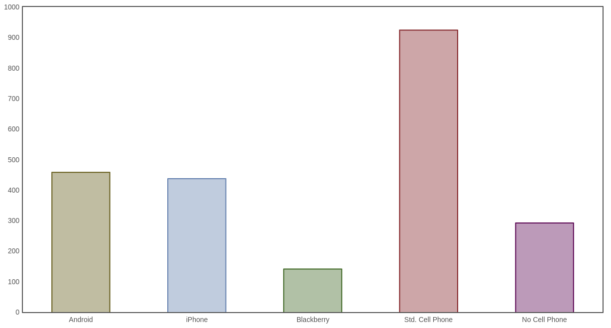
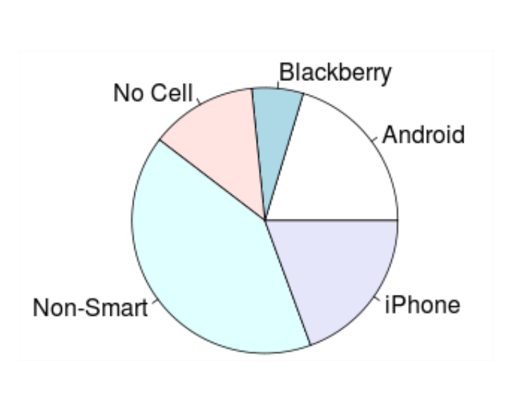
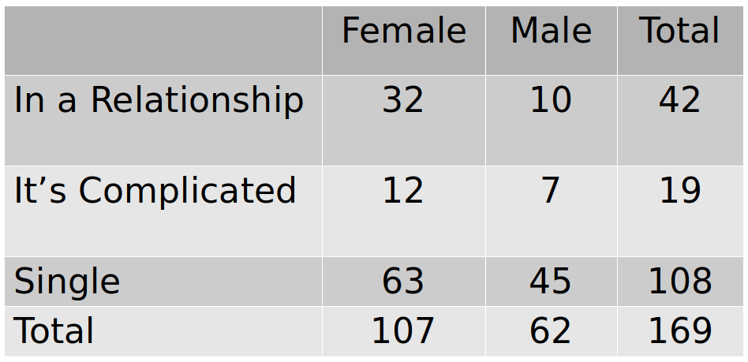
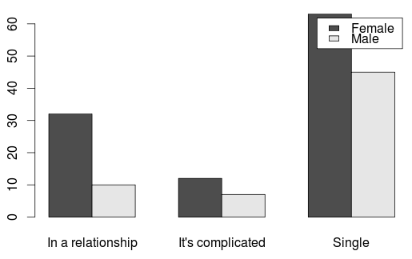
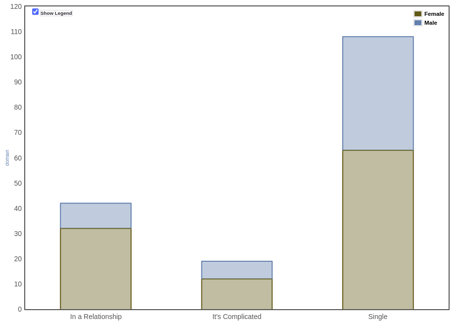

```{r setup, include=FALSE}
options(htmltools.dir.version = FALSE)
options(htmltools.preserve.raw = FALSE)
options(ggrepel.max.overlaps = Inf)

knitr::opts_chunk$set(echo = TRUE, 
                      dev = 'svg',
                      collapse = TRUE, 
                      comment = NA,  # PRINTS IN FRONT OF OUTPUT, default is '##' which comments out output
                      prompt = FALSE, # IF TRUE adds a > before each code input
                      warning = FALSE, 
                      message = FALSE,
                      fig.height = 3, 
                      fig.width = 4,
                      out.width = "100%"
                      )


# load necessary packages
library(tidyverse)
library(countdown)
library(mosaic)
library(ggthemes)
library(xaringanExtra)
library(forcats)
xaringanExtra::use_panelset()
xaringanExtra::use_tachyons()
xaringanExtra::use_clipboard()
xaringanExtra::use_extra_styles(
  hover_code_line = TRUE,         #<<
  mute_unhighlighted_code = TRUE  #<<
)
library(flipbookr)
library(patchwork)
library(Lock5Data)

# Set ggplot theme
theme_set(theme_tufte(base_size = 10))


yt <- 0

# read.csv("https://raw.githubusercontent.com/deepbas/statdatasets/main/APM_DougEvansCases.csv")


```


```{r xaringanExtra-clipboard, echo=FALSE}
htmltools::tagList(
  xaringanExtra::use_clipboard(
    button_text = "<i class=\"fa fa-clipboard\"></i>",
    success_text = "<i class=\"fa fa-check\" style=\"color: #90BE6D\"></i>",
    error_text = "<i class=\"fa fa-times-circle\" style=\"color: #F94144\"></i>"
  ),
  rmarkdown::html_dependency_font_awesome()
)
```


layout: true
  
<!-- <div class="my-footer"><span>Stat 230</span></div> -->
<!-- this adds the link footer to all slides, depends on my-footer class in css-->

---

class: title-slide, middle
<!-- background-image: url("assets/title-image2.jpg") -->
background-position: 10% 90%, 100% 50%
background-size: 160px, 100% 100%

# .fancy[Describing Categorical Variables]

### .fancy[Stat 120]

`r format(Sys.Date(), ' %B %d %Y')`

---

class: middle

# Descriptive Statistics

.blockquote-list[
- In order to make sense of data, we need ways to .bold[summarize] and .bold[visualize] it
- Summarizing and visualizing variables and relationships between two variables is often known as descriptive statistics, also known as .bold[exploratory data analysis (EDA)]
- The type of summary statistics and visualization methods depend on the type of variable(s) being analyzed (categorical or quantitative)
]

---

# One Categorical Variable

.blockquote.font80[A random sample of US adults in 2012 were surveyed regarding the type of cell phone owned]

<center>
 <br>
<a>Android?  iPhone?  Blackberry? Non-smartphone?  No cell phone?
</a>
</center>

---

# Frequency Table

.blockquote.font80[A frequency table shows the number of cases or counts that fall
in each category:]

.font80.pull-left[
$$\begin{array}{|l|l|}
\hline  & \textbf{Subset of Raw Data } \\
\hline \text { Case } 1 & \text { Android } \\
\hline \text { Case } 2 & \text { none } \\
\hline \text { Case } 3 & \text { none } \\
\hline \text { Case } 4 & \text { iPhone } \\
\hline \text { Case } 5 & \text { Non Smartphone } \\
\hline \text { Case } 6 & \text { iPhone } \\
\hline \text { Case } 7 & \text { Blackberry } \\
\hline \text { Case } 8 & \text { Non Smartphone } \\
\hline \text { Case } 9 & \text { Android } \\
\hline \text { Case } 10 & \text { Android } \\
\hline \ldots & \text { (for } 2253 \text{ cases} \ldots) \\
\hline
\end{array}$$
]

.pull-right[

<br>
<br>

Cell Phone Type  | Frequency
------------- | -------------
Android  | 458
iPhone  | 437
Blackberry | 141
Non Smartphone | 924
No Cell Phone | 293
Total | 2253
]

---

# Proportion

> The proportion in a category is found by $$\text{proportion} = \frac{\text{number in category}}{\text{total sample size}}$$

--

<br>

.blockquote[
Percentages/proportions  (relative frequencies)
- $p$ = proportion for a .bold[population] (parameter)
- $\hat{p}$ = proportion for a .bold[sample] (statistic) ("p-hat")
]

---

# Proportion

> What proportion of adults sampled do not own a cell phone?

<br>

Cell Phone Type  | Frequency | Proportion
------------- | ------------- | -----------
Android  | 458 | 0.203
iPhone  | 437 | 0.194
Blackberry | 141 | 0.063
Non Smartphone | 924 | 0.41
No Cell Phone | 293 | 0.13
Total | 2253 | 1.000

.out-t.center[Proportions and percentages can be used interchangeably]

---

class: middle

# Distribution of a variable

.blockquote[The .yellow-h["distribution of variable Y"]
- describes the count or percent of observations that fall into each category of “variable Y”
]

- E.g. In the 2020 election, 51.3% of voters voted for Biden, 46.8% for Trump and 1.8% for third-party candidates

---

# Bar Chart/Plot/Graph

.blockquote.font80[In a barplot, the height of the bar corresponds to the number of cases falling in each category]

<center>
 <br>
<a>A Simple Bar Chart</a>
</center>


---

# Pie Chart

.blockquote.font80[In a pie chart, the relative area of each slice of the pie corresponds to the proportion in each category]

<center>
 <br>
<a>A Simple Pie Chart</a>
</center>

---

# Two Categorical Variables

.blockquote.font90[Look at the relationship between two categorical variables
- Relationship status
- Gender
]

<center>
 <br>
</center>

.font90[We add a second dimension to a frequency table to account for the second categorical variable]

---

# Relationship status and Gender

.font90[
Proportion of students that are in a relationship?

```{r}
ans <- 42/169
round(ans,2) 
```
]

--

.font90[
Proportion of students in a relationship that are female?

```{r}
ans <- 32/42
round(ans,2)
```
]

--

.font90[
Proportion of people in a relationship that are male?

```{r}
ans <- 10/42
round(ans,2)
```
]
  
---


# Relationship status and Gender

Proportion of males that are in a relationship?

```{r}
ans <- 10/62
round(ans,2) 
```

Proportion of females that are in a relationship?

```{r}
ans <- 32/107
round(ans,2)
```

---


# Difference in proportions

> A difference in proportions is a difference in proportions for one categorical variable calculated for different levels of the other categorical variable
 - Example: $\text{proportion}_{\text{Females}}$ - $\text{proportion}_{\text{Males}}$

 $$\hat{p}_F - \hat{p}_M = \frac{32}{107} - \frac{10}{62} = 0.14$$

```{r}
# R-code
prop.female <- 32/107
prop.male <- 10/62
prop.diff <- prop.female - prop.male
round(prop.diff,2)
```

---

# Side-by-Side bar Chart

.blockquote.font80[The height of each bar is the number of the corresponding cell in the two-way table]

<center>
 <br>
<a>A Side-by-side Bar Chart</a>
</center>


.footnote[Source: https://www.lock5stat.com/StatKey/index.html]
---

# Segmented Bar Chart

.blockquote.font80[A segmented bar chart is like a side-by-side bar chart, but the bars are stacked instead of side-by-side]

<center>
 <br>
<a>A Segmented Bar Chart</a>
</center>

---

class: action

# <i class="fa fa-pencil-square-o" style="font-size:48px;color:purple">&nbsp;Your&nbsp;Turn&nbsp;`r (yt <- yt + 1)`</i>    

.pull-left-40[

]
.pull-right-60[

<br>
<br>
.blockquote[

- Please go over this [article](https://features.apmreports.org/in-the-dark/mississippi-da-doug-evans-striking-black-people-from-juries/)
- Download the Class Activity .Rmd file for today and skim through the corresponding problems
]
]

`r countdown(minutes = 5, seconds = 00, top = 0 , color_background = "inherit", padding = "3px 4px", font_size = "2em")`

---

# Flowers v. Mississippi

.blockquote.font90[2019 Supreme Court case:
- Has Mississippi prosecutor Doug Evans deliberately use “peremptory challenges” to strike black jurors from jury pools?
]

.font80[American Public Media journalist collected trial data from this district from 1992 to 2017 [(Link)](https://github.com/APM-Reports/jury-data)]

.blockquote.font90[The data set `APM_DougEvansCases.csv` contains data on 1517 jurors for cases which listed Doug Evans as the first prosecutor. 
- Only looking at jurors with race listed as Black or White. 
- These jurors are eligible for Evans to strike.
]

.footnote[Source: Click [here](https://features.apmreports.org/in-the-dark/mississippi-da-doug-evans-striking-black-people-from-juries/)]

---


# Look at the data

```{r}
jurors <- read.csv("https://raw.githubusercontent.com/deepbas/statdatasets/main/APM_DougEvansCases.csv")
```

.code80[
```{r}
dim(jurors) # dimension of dataset
```
]

Look at the first .bold[three rows] of the data set

.code80[
```{r}
jurors[c(1,2,3), ]  #[rows, columns]
```
]
---

class: middle

# Look at the data

```{r}
jurors$struck_state[1:10] # first 10 entries in the `struck_state` variable
```

---

# Numeric summaries: counts and proportions


`table` gives counts of whether the state struck a juror: 

```{r}
counts <- table(jurors$struck_state)
counts
```

`prop.table` turns these counts into proportions:

```{r}
prop.table(counts)
```

.out-t[What proportion of eligible jurors were struck by the state from the jury pool?]

---

# Graphical summary: bar plot
.code70[
```{r, out.width="45%", fig.height=5, fig.width=5, fig.align='center'}
barplot(counts, ylab = "count", cex.lab=0.5, cex.axis=0.5, cex.names=.5)
```
]

---

# Associations between two categorical variables

.green[How does state struck status vary by juror race? (How are race and state strikes associated?)]

.blockquote.font90[Numerically: 
- summarize .bold[counts] in a contingency/two-way table
- .bold[conditional proportions:] “The conditional distribution of Y given variable X” describes how Y is distributed within each category of X (group by X).
]    

<br>

.blockquote.font90[Graphically:
- stacked bar graph of conditional proportions]

---

# Two-way (contingency) table

.font80[First 10 entries of `race` and `struck_state` variable is]
.code70[
```{r}
jurors[(1:10), (2:3)]
```
]

--

.font80[`table` gives two-way tables when two variables are included.] 

.code80[
```{r}
(mytable <- table(jurors$race, jurors$struck_state))
```
]

---

# Conditional proportions

`prop.table` gives conditional proportions grouped by the **row** variable when `margin=1`

```{r}
prop.table(mytable, margin = 1)
```

.blockquote.font90[
- Of all eligible black jurors, about 57.9% were struck by the state.
- What proportion of eligible white jurors were struck by the state?
]

<br>

.out-t[Is there evidence of an association between juror race and state strikes?]

---

# Stacked bar graph

We can graph a conditional distribution using the `ggplot2` graphing package. First, load this package's functions with the `library` command. Basic syntax is as follows:

```r
library(ggplot2)
ggplot(mydata, aes(x=x, fill=y)) + 
    geom_bar(position = "fill")
```

.blockquote-list[
- `aes` describes the graph "aesthetics" 
- `geom_bar` describes what type of graph to make
- `position` describes how to draw the bar graph
]
---


`r chunk_reveal("jurors-stacked", font_size_code="50%", title = "## Stacked bar graph")`

```{r jurors-stacked, fig.width = 3, fig.height = 3.5, out.width = "100%", include=FALSE}
ggplot(jurors, aes(x = race, fill = struck_state)) + 
  geom_bar(position = "fill") + 
  labs(title = "State striked by juror race", 
       y = "proportion", 
       x = "eligible juror race", 
       fill = "struck by state?") +
  theme(plot.title = element_text(hjust = 0.5))
```


---

`r chunk_reveal("jurors-stacked-counts", font_size_code="50%", title = "## Stacked bar graph (counts)")`

```{r jurors-stacked-counts, fig.width = 3, fig.height = 3.5, out.width = "100%", include=FALSE}
# changes the `stuck_state` to a factor
jurors$struck_state <- factor(jurors$struck_state)
ggplot(jurors, aes(x = race, fill = struck_state)) + 
  geom_bar(stat="count") + 
  labs(title = "State striked by juror race", 
       y = "count", 
       x = "eligible juror race", 
       fill = "struck by state?") +
  theme(plot.title = element_text(hjust = 0.5))
```

---

class: action

# <i class="fa fa-pencil-square-o" style="font-size:48px;color:purple">&nbsp;Your&nbsp;Turn&nbsp;`r (yt <- yt + 1)`</i>    

.pull-left-40[

]
.pull-right-60[

<br>
<br>
.blockquote[

- Please go over the rest of the in class activity in a group
- This will be helpful to complete HW2
]
]

`r countdown(minutes = 5, seconds = 00, top = 0 , color_background = "inherit", padding = "3px 4px", font_size = "2em")`


