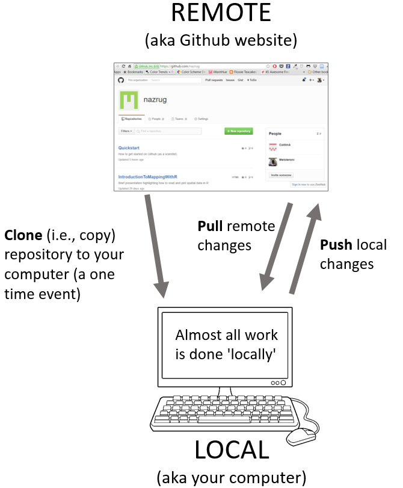

```{r setup, include=FALSE}
options(htmltools.dir.version = FALSE)
options(htmltools.preserve.raw = FALSE)
options(ggrepel.max.overlaps = Inf)

knitr::opts_chunk$set(echo = TRUE, 
                      dev = 'svg',
                      collapse = FALSE, 
                      comment = NA,  # PRINTS IN FRONT OF OUTPUT, default is '##' which comments out output
                      prompt = FALSE, # IF TRUE adds a > before each code input
                      warning = FALSE, 
                      message = FALSE,
                      fig.height = 3, 
                      fig.width = 4,
                      out.width = "100%"
                      )

# load necessary packages
library(Sleuth3)   # Data-set for Sleuth
library(tidyverse)
library(dplyr)
library(countdown)
library(mosaic)
library(ggthemes)
library(xaringanExtra)
library(forcats)
xaringanExtra::use_panelset()
xaringanExtra::use_tachyons()
xaringanExtra::use_clipboard()
xaringanExtra::use_extra_styles(
  hover_code_line = TRUE,         
  mute_unhighlighted_code = TRUE  
)
library(flipbookr)
library(patchwork)
library(DT)
library(moderndive)
library(knitr)
library(grid)
library(gridExtra)
library(palmerpenguins)
library(broom)
library(ggResidpanel)
library(keras)
library(tensorflow)

select <- dplyr::select

# Set ggplot theme
theme_set(theme_tufte(base_size = 10))

yt <- 0

# read.csv("https://raw.githubusercontent.com/deepbas/statdatasets/main/agstrat.csv")

```


```{r xaringanExtra-clipboard, echo=FALSE}
htmltools::tagList(
  xaringanExtra::use_clipboard(
    button_text = "<i class=\"fa fa-clipboard\"></i>",
    success_text = "<i class=\"fa fa-check\" style=\"color: #90BE6D\"></i>",
    error_text = "<i class=\"fa fa-times-circle\" style=\"color: #F94144\"></i>"
  ),
  rmarkdown::html_dependency_font_awesome()
)
```


layout: true
  
---

class: title-slide, middle

# .fancy[Introduction to Data Science]

### .fancy[Fall 2022]

`r format(Sys.Date(), ' %B %d %Y')`

---

class: middle

# Something about me

.pull-left[

.bq[
- Second year at Carleton
- Originally from Nepal
- Research in Bayesian computation and machine learning
- Avid learner and traveler
]
]

.pull-right[


<center>
 <br>
<a>On top of Nordkette in Innsbruck, Austria</a>
</center>


]

---

class: middle

# What is data science?

.bql[
Data science is the application of **computational** and **statistical** techniques to gain insight into some problem in the real world
]

<!-- Data science is an exciting discipline that allows you to turn raw data into understanding, insight, and knowledge. -->

$$
\begin{align*}
\text{Data Science} &= \text{scientific inquiry } +\\
& \quad  \text{ data collection } +\\
& \quad  \text{ data processing } +\\
& \quad  \text{ visualization } +\\
& \quad  \text{ statistics } +\\
& \quad  \text{ machine learning } +\\
& \quad  \text{ communication }
\end{align*}
$$

---

background-image: url("images/glassdoor.png")
background-position: center
background-size: 60%
class: clear

# One of the best jobs

.footnote[ Source: Click [here](https://www.glassdoor.com/List/Best-Jobs-in-America-LST_KQ0,20.htm)]


---

background-image: url("images/ds-cycle.png")
background-position: center
background-size: 80%
class: clear

# Data Science in a nutshell

.footnote[ Image adapted from work of Joe Blitzstein, Hanspeter Pfister, and Hadley Wickham]

---

class: middle

# Stat 220: Introduction to Data Science

.out-t[Focus on the “soup to nuts” approach to problem solving]

.bql.font80[

- data wrangling

  + reshaping, cleaning, gathering
  
- learning from data

  + EDA tools
  + statistical learning methods
  + network data, spatial data
  
- communication

  + reproducibility
  + effective visualization
]


---

background-image: url("images/flexible.png")
background-position: center
background-size: 64%
class: clear

# Gendered language in professor reviews

.footnote[ Click [here](http://benschmidt.org/profGender/) to go to the app]


---


class: middle

# How to make friends and succeed in Data Science?

.bq.font90[
1. Actively follow along! RMarkdown (.Rmd) documents will be provided for you
each week 

  - use these to take notes and run code “live” in class.
  
2. Ask questions! 

  - This is new for everyone, no question is a bad question.

3. When you don’t know if something will work, try it! 

  - experimentation is key in this class.
]

---

class: middle

# Tell me something about yourself!

.pull-left[
.bq[
- Your name?
- Gender Pronouns?
- Why are you interested in data science?
- Your favorite media personality?
]
]

.pull-right[


]


---

class: middle

# Class Pipelines

.font140.center[[https://deepbas.io/courses/stat220/](https://deepbas.io/courses/stat220/)]


.bq[

- Please bookmark this page: should be checked multiple times a day
- Most of the course information and schedule will be posted here in advance
- Use moodle for submitting class activity and accessing solutions
- Use Github for homework and projects
]


---

class: middle

# Necessary skills to be mastered

.bq[
- programming with data
- statistical modeling
- domain knowledge
- communication
]

---

class: middle

# What will a typical day/week look like?

.bql[

Before class:
- Some reading/video to introduce some topics
- Work on homework/projects, come with questions

During class:
- Mini lectures
- Class activities 
]


---

class: middle

#  What you need to do ..

.bq[
- read the [Rstudio for Stat220](https://deepbas.io/courses/stat220/rstudio-in-stat-220/) page
- read the [GitHub for Stat220](https://deepbas.io/courses/stat220/github-in-stat-220/) page
- read the [Software for Stat220](https://deepbas.io/courses/stat220/software/) page
]


---

# R Vs Python for data science

.out-t["R is written by statisticians, for statisticians," 
.right[Norm Matloff, Author of The Art of R Programmming, Prof. of Computer Science, UC Davis]]
<br>
.bq[
.brown[Advantages of R over Python]:
- Not so steep learning curve as Python
- R has many generic functions that are universal, e.g. `print()`, `plot()`, `summary()`
- R Comprehensive R Archive Network (CRAN) has many user-friendly packages
- R's basic `help()` and `example()` functions are much more informative than Python's counterparts
- R community champions for inclusiveness. The `reticulate` package enables seamless, high-performance interoperability between R and Python
]

---

background-image: url("images/RStudio Anatomy.svg")
background-position: center
background-size: 96%
class: clear


.footnote[ Click [here](https://buzzrbeeline.blog/2018/07/04/rstudio-anatomy/) for source]

---

# Using R Markdown for data science

.bql.font80[
- You will use R Markdown for all work in this class

- A Markdown (.Rmd) file contains

  + R code
  +  answers, description of results, report, etc.
  
- The Markdown file is knit to generate an output document

  + pdf, html, word
  + presentations (html, beamer pdf)
  + dashboards, interactive graphics (html)
  
- Markdown is designed for reproducibility!

- The slides I produce for this class are made using R Markdown’s [Xaringan](https://github.com/yihui/xaringan) presentation

]


---

# Version Control using Git and GitHub

.pull-left-60[
.bq.font80[
- _User:_ A Github account for you (e.g., deepbas).
- _Organization:_ The Github account for one or more user (e.g., DataScienceFall22).
- _Repository:_ A folder within the organization that includes files dedicated to a project.
- _Local Github:_ Copies of Github files located your computer.
- _Remote Github:_ Github files located on the https://github.com website.
- _Clone:_ Process of making a local copy of a remote Github repository. 
- _Pull:_ Copy changes on the remote Github repository to your local Github repository.
- _Push:_ Save local changes to remote Github
]
]

.pull-right-40[

<center>
 <br>
<a>Git Cycle</a>
</center>

]

.footnote[Source: Click [here](http://ohi-science.org/data-science-training/)]

---

class: middle

# Using GitHub and Rstudio for data science


.bq[
Rstudio lets you create git controlled projects
- create a GitHub repo
- make a Rstudio project using your cloned repo
- edit/create files (.rmd, .r, .csv, . . . )
- commit changes to your local computer using git
- push changes to the GitHub repo (online)
- pull changes made by others to your computer
]

---

class: action, middle

# <i class="fa fa-pencil-square-o" style="font-size:48px;color:purple">&nbsp;Group&nbsp;Activity&nbsp;`r (yt <- yt + 1)`</i>    


.pull-left-40[

]
.pull-right-60[
<br>
<br>
.bq[
- Work on the class-activity-1.Rmd file
- You can get the file either from [Github organization repo](https://github.com/DataScienceFall22) or from [moodle](https://moodle.carleton.edu/course/view.php?id=39491)
- Ask me questions
- Submit your compiled .pdf file to moodle
]
]

`r countdown(minutes = 10, seconds = 00, top = 0 , color_background = "inherit", padding = "3px 4px", font_size = "2em")`

