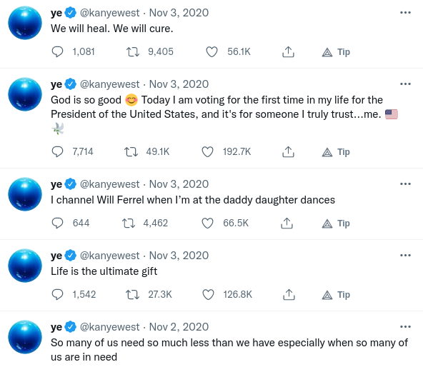
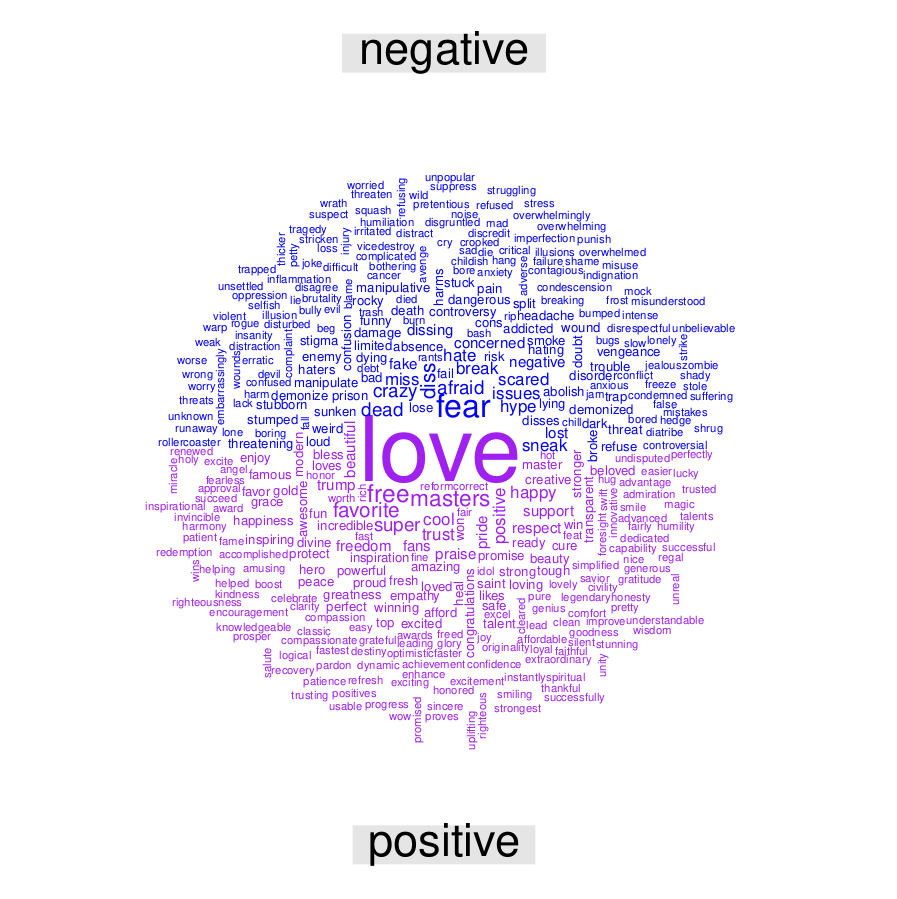

```{r setup, include=FALSE}
options(htmltools.dir.version = FALSE)
options(htmltools.preserve.raw = FALSE)
options(ggrepel.max.overlaps = Inf)

knitr::opts_chunk$set(echo = TRUE, 
                      dev = 'svg',
                      collapse = TRUE, 
                      comment = NA,  # PRINTS IN FRONT OF OUTPUT, default is '##' which comments out output
                      prompt = FALSE, # IF TRUE adds a > before each code input
                      warning = FALSE, 
                      message = FALSE,
                      fig.height = 3, 
                      fig.width = 4,
                      out.width = "100%",
                      prompt = FALSE,
                      rows.print=7
                      )

# load necessary packages
library(tidyverse)
library(countdown)
library(mosaic)
library(ggthemes)
library(xaringanExtra)
library(forcats)
xaringanExtra::use_panelset()
xaringanExtra::use_tachyons()
xaringanExtra::use_clipboard()
xaringanExtra::use_extra_styles(
  hover_code_line = TRUE,         
  mute_unhighlighted_code = TRUE  
)
library(flipbookr)
library(patchwork)
library(DT)
library(moderndive)
library(knitr)
library(grid)
library(gridExtra)
library(ggrepel)
library(lubridate)
library(pdftools)
library(magick)

# specific packages
library(polite)
library(rvest)
library(stringr)
library(gapminder)
select <- dplyr::select

# Set ggplot theme
# theme_set(theme_stata(base_size = 10))

yt <- 0

# read.csv("https://raw.githubusercontent.com/deepbas/statdatasets/main/agstrat.csv")

kanye <- read_csv("~/Desktop/Insync/STAT220_Spring23/data/Kanye_cleaned.csv")

url <- "https://en.wikipedia.org/w/index.php?title=Gun_violence_in_the_United_States_by_state&direction=prev&oldid=810166167"
murders <- read_html(url) %>% 
  html_nodes("table") %>% 
  html_table() %>%
  .[[1]] %>%
  setNames(c("state", "population", "total", "murder_rate"))
```


```{r xaringanExtra-clipboard, echo=FALSE}
htmltools::tagList(
  xaringanExtra::use_clipboard(
    button_text = "<i class=\"fa fa-clipboard\"></i>",
    success_text = "<i class=\"fa fa-check\" style=\"color: #90BE6D\"></i>",
    error_text = "<i class=\"fa fa-times-circle\" style=\"color: #F94144\"></i>"
  ),
  rmarkdown::html_dependency_font_awesome()
)
```


layout: true
  
---

class: title-slide, middle

# .fancy[Basic String Manipulation]

### .fancy[Spring 2023]

`r format(Sys.Date(), ' %B %d %Y')`

---

# Kanye West tweets analysis

.pull-left[

 <br>
.center[.blue[Kanye West Twitter Feed]]

]

--

.pull-right[

 <br>

]

---

# Tweets that look like this ...

```{r echo=FALSE}
kanye %>% select(text) %>% slice(c(2, 49, 67,89,900, 577))

```

--

# ... are changed to a cleaner version

```{r, echo=FALSE}
kanye %>% select(text_clean) %>% slice(c(2, 49, 67,89,900, 577))

```


---


## Let's Define Strings

.bql.font90[
- A .b[string] is any sequence of characters
- Define a string by surrounding text with either single quotes or double quotes.
]

--

```{r}
s <- "Hello!"    # double quotes define a string
s <- 'Hello!'    # single quotes define a string  
```
  
--

.hljs.font80[The `cat()` or `writeLines()` function displays a string as it is represented inside R.]

.pull-left[
```{r}
cat(s)
```
]
.pull-right[
```{r}
writeLines(s)
```
]


--
```{r, eval=FALSE, echo=TRUE}
s <- `Hello`    # backquotes do not define a string
s <- "10""    # error - unclosed quotes
```


---

class: middle

# String Parsing

.out-t[pulling apart some text or `string` to do something with it]

<!-- manipulate (or parse) textual data by looking for patterns in a string -->
.bq.font80[
- .Large[The most common tasks in string processing include:]
  + .yellow-h[extracting] numbers from strings, e.g. .yellow-h["12%"]
  + .yellow-h[removing] unwanted characters from text, e.g. .yellow-h["New Jersey_* "]
  + .yellow-h[finding and replacing] characters, e.g. .yellow-h["2,150"]
  + .yellow-h[extracting] specific parts of strings, e.g. .yellow-h["Learning #datascience is fun!"]
  + .yellow-h[splitting] strings into multiple values, e.g. .yellow-h["123 Main St, Springfield, MA, 01101"]
]

---

class: middle

# Regular expressions: Regex

  <!-- Use **regular expressions (regex)** to process strings. -->

.out-t[Regular expressions are a language for expressing patterns in strings]


<!-- - A way to describe a specific pattern of characters of text. -->

<br>

.bql.font80[

- Regex can include special characters unlike a regular string 

- To use regex in R, you need to use the **stringr** package

]


---

class: middle

# `stringr` package

<!-- add a picture -->


.pull-left-60[
<br>

<!-- The main types of string processing tasks are -->
.bq[
  + detecting, locating, extracting and replacing elements of strings.
  
<!-- The **stringr** package from the **tidyverse** includes a variety of string processing functions that -->  

  +  begin with `str_` and take the string as the first argument
  ]
<!-- which makes them compatible with the pipe. -->
]
.pull-right-40[

 <br>


]

.footnote[stringr [cheatsheet](https://evoldyn.gitlab.io/evomics-2018/ref-sheets/R_strings.pdf)]

---


# Special characters
  
  * .yellow-h[The "escape" backslash \ is used to escape the special use of certain characters ]

```{r collapse=TRUE}
writeLines("\"")
writeLines("\\")
writeLines("Math\\Stats")
```

--

  * .yellow-h[To include both single and double quotes in string, escape with \]
  
<!--  To include a double quote inside a string, use single quotes on the outside. To include a single quote inside a string, use double quotes on the outside. -->

--

```{r}
s <- '5\'10"'    # outer single quote
writeLines(s)
```

--

```{r}
s <- "5'10\""    # outer double quote
writeLines(s)
```

---


#  Combining strings


.pull-left-60[
```{r}
str_c("iron", "wine")
str_flatten(c("iron", "wine"), collapse = " and ")
```
]
.pull-right-40[

```{r}
a <- c("a", "b", "c")
b <- c("A", "B", "C")
str_c(a, b) 
```
]


--

```{r}
building <- "CMC"
room <- "102"
begin_time <- "12:30 a.m."
end_time <- "1:40 p.m."
days <- "MWF"
class <- "STAT 220"
```

--

```{r}
str_c(class, "meets from", begin_time, "to", end_time, 
      days, "in", building, room, sep = " ")
```


---

<br>
<br>

# `str_length()`


> tells you how many characters are in each entry of a character vector


```{r}
gapminder %>% names()
```


--

```{r}
# length of each column names 
gapminder %>% names() %>% str_length()
```

---

<br>
<br>

# `str_count()`

> counts the number of non-overlapping matches of a pattern in each entry of a character vector

```{r}
gapminder %>% names()
```

--

```{r}
# count number of vowels in each column name
vowels_pattern <- "[aeiouAEIOU]"
gapminder %>% names() %>% str_count(vowels_pattern)
```


---

class: middle

# `str_glue()`

> allows one to interpolate strings and values that have been assigned to names in R


.pull-left[

```{r}
y <- Sys.Date() # current date
str_glue("today is {y}")
```

```{r}
nm <- "Alex"
str_glue("Hi, my name is {nm}.")
```

]

.pull-right[

```{r}
# base R equivalent
paste0("today is ", y)
```

```{r}
a <- 5
str_glue("a = {a}")
```

]

---


<br>
<br>

# `str_sub()`

> Extract and replace substrings from a character vector


```{r}
phrase <- "cellar door"
str_sub(phrase, start = 1, end = 6)
```


--

```{r}
str_sub(phrase, start = c(1,8), end = c(6,11))
```


---

class: action, middle

# <i class="fa fa-pencil-square-o" style="font-size:48px;color:purple">&nbsp;Group&nbsp;Activity&nbsp;`r (yt <- yt + 1)`</i>    


.pull-left-40[

]
.pull-right-60[
<br>
.bql[
- Let's go over to maize server/ local Rstudio and our class [moodle](https://moodle.carleton.edu/course/view.php?id=41417)
- Get the class activity 11.Rmd file
- Work on problem 1
]

]

`r countdown(minutes = 5, seconds = 00, top = 0 , color_background = "inherit", padding = "3px 4px", font_size = "2em")`

---


class: middle

# More Special Characters

.bqt.font80[
- The .yellow-h[|] symbol inside a regex means `"or"`.

- Use .yellow-h[`\\n`] to matche a newline character

- Use .yellow-h[`\\s`] to match white space characters (spaces, tabs, and newlines)

- Use .yellow-h[`\\w`] to match alphanumeric characters (letters and numbers)
  - can also use .out-t[`[:alpha:]`] 

- Use .yellow-h[`\\d`] to represent digits (numbers)
  - can also use .out-t[`[:digit:]`]

]
<!-- The backlash is used to distinguish it from the character `'d'`. -->

.footnote[Click [here](https://www.jetbrains.com/help/objc/regular-expression-syntax-reference.html#regex-syntax-reference) for extensive lists]

---

## More Special Characters

.bq.font80[
- .out-t[`^`] = start of a string

- .out-t[`$`] = end of a string

- .out-t[`.`] = any character
]

--

## Quantifiers

.bq.font80[
- .out-t[`*`] = matches the preceding character any number of times

- .out-t[`+`] = matches the preceding character once

- .out-t[`?`] = matches the preceding character at most once (i.e. optionally)

- .out-t[{n}] = matches the preceding character exactly n times
]

.footnote[Try more regexes [here](https://regexr.com/)]

---

<br>
<br>

# `str_detect()`

```{r}
days <- c("Monday", "Tuesday", "Wednesday", 
              "Thursday", "Friday", "Saturday", "Sunday")
```

--

```{r}
str_detect(days, "^[Ss]un.*")
```

--

```{r}
days %>% 
  str_which("^T")  # indices of matching entries  #<<
```


---

<br>

# `str_subset()`

> returns all values in a vector which match a pattern

```{r}
gapminder$country %>% 
  unique() %>% 
  str_subset("^[CU].*a$")
```

--

```{r}
# columns with names starting with "c"
gapminder %>% 
  names() %>% 
  str_subset("^c")
```


---

## `str_sub()`


.bq.font80[extracts parts of strings based on their position with the start and end arguments]

```{r}
gapminder %>% 
  names() %>% 
  str_sub(start = 1, end = 6) # return the 1st 6 characters of each column name #<<
```

--


## `str_extract()` 


.bq.font80[extract just the part of the string matching the specified regex instead of the entire entry]

```{r}
name_phone <- c("Moly: 250-999-8878", 
       "Ali: 416-908-2044", 
       "Eli: 204-192-9829", 
       "May: 250-209-7047")
str_extract(name_phone,  "\\w+") 
```


---


# `str_split()`

> splits a string into a list or matrix of pieces based on a supplied pattern


```{r}
str_split(c("a_3", "d_4"), pattern = "_") # returns a list
```

--

```{r}
str_split(c("a_3", "d_4"), pattern = "_", simplify = TRUE) # returns a matrix
```


---

class: middle

# `str_replace()`

> `str_replace()` replaces the first instance of the detected pattern with a specified string.

```{r}
gap_names <- gapminder %>% names

str_replace(gap_names, 
            pattern = "^.{3}", # match the 1st 3 characters of each string in the vector
            replacement = "X_")
```

---

<br>
<br>

`r chunk_reveal("demo1", font_size_code="80%", widths = c(0.5, 0.5), title = "## str_replace_all()")`

.scroll-output-20[
```{r demo1, fig.width = 3, fig.height = 3.5, out.width = "100%", include=FALSE}
murders %>% 
  mutate(population = str_replace_all(population, ",", ""),
         total = str_replace_all(total, ",", "")) %>% 
  mutate_at(vars(2:3), as.double) 
```
]

---

class: action, middle

# <i class="fa fa-pencil-square-o" style="font-size:48px;color:purple">&nbsp;Group&nbsp;Activity&nbsp;`r (yt <- yt + 1)`</i>    


.pull-left-40[

]
.pull-right-60[
<br>
<br>
.bq[
- Go back to the activity file
- Work on problems 2-4
]

]

`r countdown(minutes = 10, seconds = 00, top = 0 , color_background = "inherit", padding = "3px 4px", font_size = "2em")`

