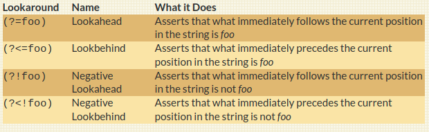

```{r setup, include=FALSE}
options(htmltools.dir.version = FALSE)
options(htmltools.preserve.raw = FALSE)
options(ggrepel.max.overlaps = Inf)

knitr::opts_chunk$set(echo = TRUE, 
                      dev = 'svg',
                      collapse = TRUE, 
                      comment = NA,  # PRINTS IN FRONT OF OUTPUT, default is '##' which comments out output
                      prompt = FALSE, # IF TRUE adds a > before each code input
                      warning = FALSE, 
                      message = FALSE,
                      fig.height = 3, 
                      fig.width = 4,
                      out.width = "100%",
                      prompt = FALSE,
                      rows.print=7
                      )

# load necessary packages
library(tidyverse)
library(countdown)
library(mosaic)
library(ggthemes)
library(xaringanExtra)
library(forcats)
xaringanExtra::use_panelset()
xaringanExtra::use_tachyons()
xaringanExtra::use_clipboard()
xaringanExtra::use_extra_styles(
  hover_code_line = TRUE,         
  mute_unhighlighted_code = TRUE  
)
library(flipbookr)
library(patchwork)
library(DT)
library(moderndive)
library(knitr)
library(grid)
library(gridExtra)
library(ggrepel)
library(lubridate)

# specific packages
library(polite)
library(rvest)
library(stringr)
library(gapminder)
library(tidytext)
select <- dplyr::select

# Set ggplot theme
# theme_set(theme_stata(base_size = 10))

yt <- 0

# read.csv("https://raw.githubusercontent.com/deepbas/statdatasets/main/agstrat.csv")


tweets <- read_csv("https://raw.githubusercontent.com/deepbas/statdatasets/main/TrumpTweetData.csv")

tweets_df <- tweets %>%
  select(id, statusSource, text, created) %>%
  extract(statusSource, "source", "Twitter for (.*?)<") %>%
  filter(source %in% c("iPhone", "Android"))


tweets_df %>%
  count(source, hour = hour(with_tz(created, "EST"))) %>%
  mutate(percent = n / sum(n)) %>%
  ggplot(aes(hour, percent, color = source)) +
  geom_line() +
  scale_y_continuous(labels = scales::label_percent(accuracy = 1L)) +
  labs(x = "Hour of day (EST)",
       y = "% of tweets",
       color = "")

reg <- "([^A-Za-z\\d#@']|'(?![A-Za-z\\d#@]))"

tweet_words <- tweets_df %>%
  filter(!str_detect(text, '^"')) %>%
  mutate(text = str_replace_all(text, "https://t.co/[A-Za-z\\d]+|&amp;", "")) %>%
  unnest_tokens(word, text, token = "regex", pattern = reg) %>%
  filter(!word %in% stop_words$word,
         str_detect(word, "[a-z]"))


```


```{r xaringanExtra-clipboard, echo=FALSE}
htmltools::tagList(
  xaringanExtra::use_clipboard(
    button_text = "<i class=\"fa fa-clipboard\"></i>",
    success_text = "<i class=\"fa fa-check\" style=\"color: #90BE6D\"></i>",
    error_text = "<i class=\"fa fa-times-circle\" style=\"color: #F94144\"></i>"
  ),
  rmarkdown::html_dependency_font_awesome()
)
```


layout: true
  
---

class: title-slide, middle

# .fancy[Advanced String Manipulation]

### .fancy[Stat 220]

`r format(Sys.Date(), ' %B %d %Y')`

---


class: middle

# Last time: Quantifiers and Special Characters


.pull-left.font90[

Preceding characters are matched ...
..bq.font120[
- .yellow-h[`*`] = 0 or more
- .yellow-h[`?`] = 0 or 1
- .yellow-h[`+`] = 1 or more
- .yellow-h[`{n}`] = exactly n times
]
]
.pull-right.font90[

Matching character types 
.bq.font120[
- .yellow-h[`\\\d`] = digit
- .yellow-h[`\\\s`] = white space
- .yellow-h[`\\\w`] = word
- .yellow-h[`\\\t`] = tab
- .yellow-h[`\\\n`] = newline
]
]

---


class: middle

# More quantifiers

.font120[
> useful when you want to match a pattern a specific number of times
]

.font130[

- .out-t[`{n, }`] = n or more times

- .out-t[`{, m}`] =  at most m times

- .out-t[`{n, m}`] = between n & m times
]

---

class: middle

# Alternatives

.font120[
> useful for matching patterns more flexibly
]

.font130[
- .out-t[`[abc]`] = one of .bold[a], .bold[b], or .bold[c]

- .out-t[`[e-z]`] = a letter from .bold[e] to .bold[z]

- .out-t[`[^abc]`] = anything other than .bold[a], .bold[b], or .bold[c]
]

---

<br>

# Duplicating Groups

.bq[
Use escaped numbers (\\\1, \\\2, etc) to repeat a group based on position
]

--

Which numbers have the same 1st and 3rd digits?

.code100[
```{r}
phone_numbers <- c("515 111 2244", 
                   "310 549 6892", 
                   "474 234 7548")
str_view(phone_numbers, "(\\d)\\d\\1")
```
]

<details>
<summary class="answer">Explanation</summary>
.hljs[
`(\\d)`: This part of the pattern matches a single digit (from 0 to 9) and captures it into a capturing group. 

`\\d`: This part matches another single digit (from 0 to 9).

`\\1`: This part matches the same digit as the first captured group. 
]
</details>

---


class: middle

# `str_view_all()`

.code110[
```{r}
name_phone <- c("Moly Robins: 250-999-8878",  
                "Ali Duluth: 416-908-2044",  
                "Eli Mitchell: 204.192.9829", 
                "May Flowers: 250.209.7047")
```
]

.code100[
```{r}
str_view_all(name_phone,
             pattern = "([2-9][0-9]{2})[.-]([0-9]{3})[.-]([0-9]{4})")
```
]

<details>
<summary class="answer">Explanation</summary>
.hljs[
([2-9][0-9]{2}) captures the area code (3 digits), ([0-9]{3}) captures the next 3 digits, ([0-9]{4}) captures the last 4 digits
]
</details>

---

<br>

# `str_replace_all()`

.code100[
```{r}
str_replace_all(name_phone,
pattern = "([2-9][0-9]{2})[.-]([0-9]{3})[.-]([0-9]{4})",
replacement = "XXX-XXX-XXXX"
)
```

<br>


```{r}
str_replace_all(name_phone,
                pattern = "([2-9][0-9]{2})[.-]([0-9]{3})[.-]([0-9]{4})",
                replacement = "\\1-\\2-XXXX")
```


]

---


# `str_extract_all()`

> pull all set of values matching the specified pattern


.code100[
```{r}
name_phone <- c("Moly Robins: 250-999-8878", 
                "Ali Duluth: 416-908-2044", 
                "Eli Mitchell: 204-192-9829", 
                "May Flowers: 250-209-7047")
```
]

--

.code100[
```{r}
str_extract_all(name_phone, "[:alpha:]{2,}", simplify = TRUE) 
```
]


---

## Repetition

.code80[
```{r}
aboutMe <- c("my SSN is 536-76-9423 and my age is 55")
```
]

--

## Repetition using `?`

.code80[
```{r, collapse=TRUE}
str_view_all(aboutMe, "\\s\\d?") # space followed by 0 or 1 digit
```

]

--

## Repetition using `+`


.code80[
```{r, , collapse=TRUE}
str_view_all(aboutMe, "\\s\\d+")  # space followed by 1 or more digits
```
]

--

## Repetition using `*`


.code80[
```{r, , collapse=TRUE}
str_view_all(aboutMe, "\\s\\d*")  # space followed by 0 or more digits

```
]

---

# Case conversion

.code110[
```{r}
str_to_lower("BEAUTY is in the EYE of the BEHOLDER")
```
]

--

.code110[
```{r}
str_to_upper("one small step for man, one giant leap for mankind")
```
]

--

.code110[
```{r}
str_to_title("Aspire to inspire before we expire")

```
]

--

.code110[
```{r}
str_to_sentence("everything you can imagine is real")
```
]


---

<br>

# Alternates: OR

.code120[
```{r}
aboutMe <- c("My phone number is 236-748-4508.")
```
]

--

.code120[

```{r}
str_view(aboutMe,"8|6-")  
```
]


<br>
--

.code120[
```{r}
str_view_all(aboutMe,"(8|6)-")  
```

]


---


# More Duplicating Groups

.code100[
```{r}
foo <- c("addidas", "racecar")
```
]


.pull-left[
.code100[
```{r}
# anything then repeat anything
str_view(foo, "(.)\\1") 
```
]
]
.pull-right[
.code100[
```{r}
# strings like `xyzzyx`
str_view(foo, "(.)(.)(.).\\3\\2\\1")
```
]
]

--

<br>

.code120[
```{r}
str_view(foo, "(.)(.)\\1")
```
]

---

# Finding patterns

.pull-left[
.code100[
```{r}
# find the last word in a sentence
str_view_all("it's a goat.", 
             "[a-z]+\\.")
```
]
]
.pull-right[
.code100[
```{r}
# find word with  `'s`
str_view_all("it's a goat.", 
             "[a-z]+\\'\\w")
```
]
]

--

<br>
.code120[
```{r}
# find a single letter word separated by spaces
str_view_all("it's a goat.", 
             "(\\s)(\\w)\\s")
```
]

---

class: middle


<!-- 
  .out-t[`(?=)`] = look ahead, e.g. `i(?=e)` = .bold[i] when it comes before .bold[e]

- .out-t[`(?!)`] = negative look ahead, e.g. `i(?!e)` .bold[i] when it comes before something that isn’t .bold[e]

- .out-t[`(?<)`] = look behind, e.g. `(?<=e)i` = .bold[i] when it follows .bold[e]

- .out-t[`(?<!)`] = negative look behind, e.g. `(?<!e)i` = .bold[i] when it does not follow .bold[e]

-->


# What are these?

<br>

 <br>


.footnote[Source: click [here](https://www.rexegg.com/regex-lookarounds.html#nav)]
---

# Look ahead example

.font110[
> .bold[Positive look ahead] operator `x(?=[y])` will find `x` when it comes before `y`

> .bold[Negative] version is `x(?![y])` (`x` when it comes before something that isn’t `y`)
]

.code110[
```{r}
# t before a period
str_view_all("it's a goat.", "t(?=[\\.])") 
```
]

---

# Look ahead example

.font110[
> .bold[Positive look ahead] operator `x(?=[y])` will find `x` when it comes before `y`

> .bold[Negative] version is `x(?![y])` (`x` when it comes before something that isn’t `y`)
]


.code110[
```{r}
# 1+ letters before a period
str_view_all("it's a goat.","[a-z]+(?=[\\.])") 
```
]

---


# Look ahead example

.font110[
> .bold[Positive look ahead] operator `x(?=[y])` will find `x` when it comes before `y`

> .bold[Negative] version is `x(?![y])` (`x` when it comes before something that isn’t `y`)
]


.code110[
```{r}
# t NOT followed by a period
str_view_all("it's a goat.", "t(?![\\.])")
```
]

---

# Look behind example

.font110[
> .bold[Positive look behind] operator `(?<=[x])y` will find `y` when it follows `x`

> .bold[Negative] version is `(?<![x])y` (`y` when it does not follow `x`)
]

.code110[
```{r}
# one or more t, if preceded by a letter
str_view_all("that is a top cat.","(?<=[a-z])t+") 
```
]

---

# Look behind example

.font110[
> .bold[Positive look behind] operator `(?<=[x])y` will find `y` when it follows `x`

> .bold[Negative] version is `(?<![x])y` (`y` when it does not follow `x`)
]


.code110[
```{r}
# t and one or more letter not preceded by a letter
str_view_all("that is a top cat.","(?<![a-z])t[a-z]+") 
```
]

---

class: action, middle

# <i class="fa fa-pencil-square-o" style="font-size:48px;color:purple">&nbsp;Group&nbsp;Activity&nbsp;`r (yt <- yt + 1)`</i>    


.pull-left-40[

]
.pull-right-60[
<br>
<br>
.bql[
- Let's go over to maize server/ local Rstudio and our class [moodle](https://moodle.carleton.edu/course/view.php?id=41417)
- Get the class activity 13.Rmd file
- Skim through the problems
]

]

`r countdown(minutes = 15, seconds = 00, top = 0 , color_background = "inherit", padding = "3px 4px", font_size = "2em")`

