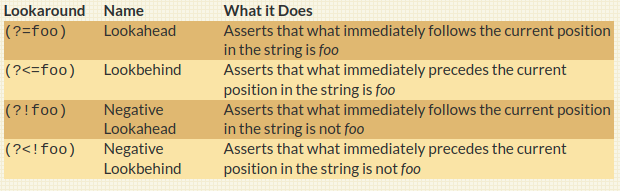

```{r setup, include=FALSE}
options(htmltools.dir.version = FALSE)
options(htmltools.preserve.raw = FALSE)
options(ggrepel.max.overlaps = Inf)

knitr::opts_chunk$set(echo = TRUE, 
                      dev = 'svg',
                      collapse = TRUE, 
                      comment = NA,  # PRINTS IN FRONT OF OUTPUT, default is '##' which comments out output
                      prompt = FALSE, # IF TRUE adds a > before each code input
                      warning = FALSE, 
                      message = FALSE,
                      fig.height = 3, 
                      fig.width = 4,
                      out.width = "100%",
                      prompt = FALSE,
                      rows.print=7
                      )

# load necessary packages
library(tidyverse)
library(countdown)
library(mosaic)
library(ggthemes)
library(xaringanExtra)
library(forcats)
xaringanExtra::use_panelset()
xaringanExtra::use_tachyons()
xaringanExtra::use_clipboard()
xaringanExtra::use_extra_styles(
  hover_code_line = TRUE,         
  mute_unhighlighted_code = TRUE  
)
library(flipbookr)
library(patchwork)
library(DT)
library(moderndive)
library(knitr)
library(grid)
library(gridExtra)
library(ggrepel)
library(lubridate)

# specific packages
library(polite)
library(rvest)
library(stringr)
library(gapminder)
library(tidytext)
select <- dplyr::select

# Set ggplot theme
# theme_set(theme_stata(base_size = 10))

yt <- 0

# read.csv("https://raw.githubusercontent.com/deepbas/statdatasets/main/agstrat.csv")


tweets <- read_csv("https://raw.githubusercontent.com/deepbas/statdatasets/main/TrumpTweetData.csv")

tweets_df <- tweets %>%
  select(id, statusSource, text, created) %>%
  extract(statusSource, "source", "Twitter for (.*?)<") %>%
  filter(source %in% c("iPhone", "Android"))


tweets_df %>%
  count(source, hour = hour(with_tz(created, "EST"))) %>%
  mutate(percent = n / sum(n)) %>%
  ggplot(aes(hour, percent, color = source)) +
  geom_line() +
  scale_y_continuous(labels = scales::label_percent(accuracy = 1L)) +
  labs(x = "Hour of day (EST)",
       y = "% of tweets",
       color = "")

reg <- "([^A-Za-z\\d#@']|'(?![A-Za-z\\d#@]))"

tweet_words <- tweets_df %>%
  filter(!str_detect(text, '^"')) %>%
  mutate(text = str_replace_all(text, "https://t.co/[A-Za-z\\d]+|&amp;", "")) %>%
  unnest_tokens(word, text, token = "regex", pattern = reg) %>%
  filter(!word %in% stop_words$word,
         str_detect(word, "[a-z]"))


```


```{r xaringanExtra-clipboard, echo=FALSE}
htmltools::tagList(
  xaringanExtra::use_clipboard(
    button_text = "<i class=\"fa fa-clipboard\"></i>",
    success_text = "<i class=\"fa fa-check\" style=\"color: #90BE6D\"></i>",
    error_text = "<i class=\"fa fa-times-circle\" style=\"color: #F94144\"></i>"
  ),
  rmarkdown::html_dependency_font_awesome()
)
```


layout: true
  
---

class: title-slide, middle

# .fancy[Advanced String Manipulation]

### .fancy[Fall 2022]

`r format(Sys.Date(), ' %B %d %Y')`

---


# Let's start with some positivity ...

.code110[
```{r}
str_to_lower("BEAUTY is in the EYE of the BEHOLDER")
```
]

--

.code110[
```{r}
str_to_upper("one small step for man, one giant leap for mankind")
```
]

--

.code110[
```{r}
str_to_title("Aspire to inspire before we expire")

```
]

--

.code110[
```{r}
str_to_sentence("everything you can imagine is real")
```
]


---

# Some more regexes

.code120[
```{r}
aboutMe <- c("My phone number is 236-748-4508.")
```
]

--

.code[
```{r}
str_view_all(aboutMe, "\\.") # literal period "."
```
]

--

.code120[
```{r}
str_view_all(aboutMe, "[^(\\d)(\\s)(\\-)(\\.)]") # everything except
```
]

---


# Alternates: OR

.code120[
```{r}
aboutMe <- c("My phone number is 236-748-4508.")
```
]

--


.pull-left[
.code120[
```{r}
str_view(aboutMe,"8|6-")  
```
]
]
.pull-right[
.code120[
```{r}
str_view(aboutMe,"(8|6-)")  
```
]
]

<br>
--

.code120[
```{r}
str_view_all(aboutMe,"(8|6)-")  
```

]


---


# More Duplicating Groups

.code100[
```{r}
foo <- c("addidas", "missim")
```
]


.pull-left[
.code100[
```{r}
# anything then repeat anything
str_view(foo, "(.)\\1") 
```
]
]
.pull-right[
.code100[
```{r}
# strings like `xyzzyx`
str_view(foo, "(.)(.)(.)\\3\\2\\1")
```
]
]

--

<br>

```{r}
str_view(foo, "(.)(.)\\1")
```


---


# Finding patterns

.pull-left[

```{r}
# find the last word in a sentence
str_view_all("it's a goat.", 
             "[a-z]+\\.")
```
]
.pull-right[

```{r}
# find word with  `'s`
str_view_all("it's a goat.", 
             "[a-z]+\\'\\w")
```

]

--

<br>

```{r}
# find a single letter word separated by spaces
str_view_all("it's a goat.", 
             "(\\s)(\\w)\\s")
```

---

class: action, middle

# <i class="fa fa-pencil-square-o" style="font-size:48px;color:purple">&nbsp;Group&nbsp;Activity&nbsp;`r (yt <- yt + 1)`</i>    


.pull-left-40[

]
.pull-right-60[
<br>
<br>
.bq[
- Let's go over to maize server/ local Rstudio and our class [moodle](https://moodle.carleton.edu/course/view.php?id=39491)
- Get the class activity 13.Rmd file
- Work on activity 1
- Knit to .html as .pdf won't work
]

]

`r countdown(minutes = 6, seconds = 00, top = 0 , color_background = "inherit", padding = "3px 4px", font_size = "2em")`

---

class: inverse, middle

# .Large[Look ahead and look behind !!]


---


<!-- 
  .out-t[`(?=)`] = look ahead, e.g. `i(?=e)` = .bold[i] when it comes before .bold[e]

- .out-t[`(?!)`] = negative look ahead, e.g. `i(?!e)` .bold[i] when it comes before something that isn’t .bold[e]

- .out-t[`(?<)`] = look behind, e.g. `(?<=e)i` = .bold[i] when it follows .bold[e]

- .out-t[`(?<!)`] = negative look behind, e.g. `(?<!e)i` = .bold[i] when it does not follow .bold[e]

-->

# What are these?

<br>

 <br>


.footnote[Source: click [here](https://www.rexegg.com/regex-lookarounds.html#nav)]
---

# Look ahead example

.font110[
> .bold[Positive look ahead] operator `x(?=[y])` will find `x` when it comes before `y`

> .bold[Negative] version is `x(?![y])` (`x` when it comes before something that isn’t `y`)
]

```{r}
str_view_all("it's a goat.", "t(?=[\\.])") # t before a period
```


---

# Look ahead example

.font110[
> .bold[Positive look ahead] operator `x(?=[y])` will find `x` when it comes before `y`

> .bold[Negative] version is `x(?![y])` (`x` when it comes before something that isn’t `y`)
]


```{r}
str_view_all("it's a goat.","[a-z]+(?=[\\.])") # 1+ letters before a period
```

---


# Look behind example

.font110[
> .bold[Positive look behind] operator `(?<=[x])y` will find `y` when it follows `x`

> .bold[Negative] version is `(?<![x])y` (`y` when it does not follow `x`)
]


```{r}
str_view_all("that is a top cat.","(?<=[a-z])t+") # one or more t, if preceded by a letter
```

---

# Look behind example

.font110[
> .bold[Positive look behind] operator `(?<=[x])y` will find `y` when it follows `x`

> .bold[Negative] version is `(?<![x])y` (`y` when it does not follow `x`)
]


```{r}
# t and one or more letter not preceded by a letter
str_view_all("that is a top cat.","(?<![a-z])t[a-z]+") 
```


---

class: action, middle

# <i class="fa fa-pencil-square-o" style="font-size:48px;color:purple">&nbsp;Group&nbsp;Activity&nbsp;`r (yt <- yt + 1)`</i>    


.pull-left-40[

]
.pull-right-60[
<br>
.font120.bq[
- Go back to the activity file
- Continue working on activity 3
- Ask me questions
]

]

`r countdown(minutes = 8, seconds = 00, top = 0 , color_background = "inherit", padding = "3px 4px", font_size = "2em")`

---


# Analyzing Trump tweets

.font120[
> What proportion of tweets (text) mention “Hillary” or “Clinton”?
]

--

```{r}
tweets %>% 
  summarize(prop = mean(str_detect(str_to_lower(text),"hillary|clinton"))) 
```

--
.font120[
- About 17.4% of these tweets mention Hillary or Clinton.
]
---

# Analyzing Trump tweets

.font120[
> What proportion of these tweets include “crooked”?
]

--

```{r}
tweets %>%   
  filter(str_detect(str_to_lower(text), "hillary|clinton")) %>%
  summarize(prop = mean(str_detect(str_to_lower(text), "crooked"))) 
```

--
.font120[
- Of the Hillary/Clinton tweets, about 54% of include the word “crooked.”
]

---

`r chunk_reveal("demo1", widths = c(40, 40), font_size_code="100%", title = "## How are the hashtags used?")`

```{r, demo1, eval=FALSE, echo=FALSE}
tweets %>% 
  mutate(ct = str_count(text, "#")) %>% 
  select(ct, text) %>%
  summarize(prop = mean(ct > 0))
```


---

# Finding URLs

.font120[
> URLs in tweets start with https://t.co/ followed by a string of letters or numbers
]

```{r}
link <- "https://t.co/[A-Za-z\\d]+"
tweets$text[992]
```

--

```{r}
str_view(tweets$text[992], link)
```


---

# What proportion of tweets have links?

--

```{r}
tweets %>%
  summarize(prop = mean(str_detect(text, link))) 
```

--

.font120[
- about 34.2% of tweets have a link.
]

---

# Removing links from tweets

.code120[
```{r}
tw_noLink <- tweets %>%
  mutate(textNoLink = str_replace_all(text, link, "")) 
```
]

--

```{r}
tw_noLink$text[992]
tw_noLink$textNoLink[992]
```


---

# Get the tweets with links

```{r}
tweets %>% 
  filter(str_detect(text, link)) %>% 
  select(text)
```


---

# Extract all tweets with links

.scroll-box-20[

```{r}
tweets %>% select(text) %>%
  str_extract_all(link)
```
]

---

# Unlist the list entries 

.scroll-box-20[

```{r}
tweets %>% select(text) %>%
  str_extract_all(link) %>%
  unlist()            # unlist and coerce into a vector #<<
```
]

---


class: action, middle

# <i class="fa fa-pencil-square-o" style="font-size:48px;color:purple">&nbsp;Group&nbsp;Activity&nbsp;`r (yt <- yt + 1)`</i>    


.pull-left-40[

]
.pull-right-60[
<br>
<br>
.bq[
- Continue working on activity 3
- Ask me questions
]

]

`r countdown(minutes = 8, seconds = 00, top = 0 , color_background = "inherit", padding = "3px 4px", font_size = "2em")`


