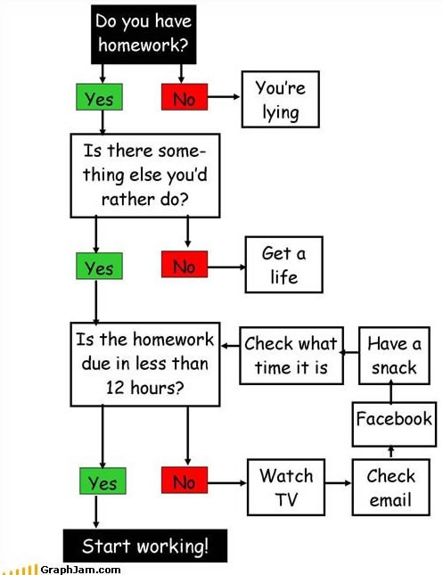

```{r setup, include=FALSE}
options(htmltools.dir.version = FALSE)
options(htmltools.preserve.raw = FALSE)
options(ggrepel.max.overlaps = Inf)

knitr::opts_chunk$set(echo = TRUE, 
                      dev = 'svg',
                      collapse = TRUE, 
                      comment = NA,  # PRINTS IN FRONT OF OUTPUT, default is '##' which comments out output
                      prompt = FALSE, # IF TRUE adds a > before each code input
                      warning = FALSE, 
                      message = FALSE,
                      fig.height = 3, 
                      fig.width = 4,
                      out.width = "100%",
                      prompt = FALSE,
                      rows.print=7
                      )

# load necessary packages
library(tidyverse)
library(countdown)
library(ggthemes)
library(xaringanExtra)
xaringanExtra::use_panelset()
xaringanExtra::use_tachyons()
xaringanExtra::use_clipboard()
xaringanExtra::use_extra_styles(
  hover_code_line = TRUE,         
  mute_unhighlighted_code = TRUE  
)
library(flipbookr)
library(patchwork)
library(knitr)
library(tidytext)
# specific packages
library(stringr)
select <- dplyr::select

# Set ggplot theme

yt <- 0

musical_instr_reviews <-  read_csv("https://raw.githubusercontent.com/deepbas/statdatasets/main/musicreviews.csv") %>% 
  rename(ratingOverall = overall)
```


```{r xaringanExtra-clipboard, echo=FALSE}
htmltools::tagList(
  xaringanExtra::use_clipboard(
    button_text = "<i class=\"fa fa-clipboard\"></i>",
    success_text = "<i class=\"fa fa-check\" style=\"color: #90BE6D\"></i>",
    error_text = "<i class=\"fa fa-times-circle\" style=\"color: #F94144\"></i>"
  ),
  rmarkdown::html_dependency_font_awesome()
)
```


layout: true
  
---

class: title-slide, middle

# .fancy[Functions]

### .fancy[Stat 220]

`r format(Sys.Date(), ' %B %d %Y')`


---

# Functions 

.bql[
A function is a type of object in R that can perform a specific task. 
]

<br>
--

.bq.font90[
- Functions take arguments as input and output some manipulated form of the input data.

- A function is specified first with the object name, then parentheses with arguments inside.

]

--

.pull-left-60[
```{r}
# a simple in-built function
sqrt
```
]

.pull-right-40[
```{r}
# using the sqrt function
sqrt(4)
```
]
---

class: middle

# When to write functions?

.font110.bql[

- Using the same code more than once

- Complicated operation

- Vectorization

]

---

class: middle

# Function arguments

.font120.bq[
- `x`, `y`, `z`: vectors.
- `w`: a vector of weights.
- `df`: a data frame or tibble
- `i`, `j`: numeric indices (typically rows and columns).
- `n`: length, or number of rows.
- `p`: number of columns.
]

---


class: middle


# Writing Functions

.code110[
```{r}
# Basic Set Up
my_awesome_function <- function(x,y) # arg1, arg2, etc. #<<
{ # Brackets that house the code 
  # Some code to execute 
  z = x*y 
  return(z) # Return a data value
} # Close the Brackets 
```
]


---

class: middle


# Writing Functions

.code110[
```{r}
# Basic Set Up
my_awesome_function <- function(x,y) ## arg1, arg2, etc.
{ # Brackets that house the code #<<
  # Some code to execute 
  z = x*y 
  return(z) # Return a data value
} # Close the Brackets 
```
]

---

class: middle


# Writing Functions

.code110[
```{r}
# Basic Set Up
my_awesome_function <- function(x,y) # arg1, arg2, etc.
{ # Brackets that house the code 
  # Some code to execute  #<<
  z = x*y 
  return(z) # Return a data value
} # Close the Brackets 
```
]

---

class: middle


# Writing Functions

.code110[
```{r}
# Basic Set Up
my_awesome_function <- function(x,y) # arg1, arg2, etc.
{ # Brackets that house the code 
  # Some code to execute 
  z = x*y  #<<
  return(z) # Return a data value
} # Close the Brackets 
```
]

---


class: middle

# Writing Functions

.code110[
```{r}
# Basic Set Up
my_awesome_function <- function(x,y) # arg1, arg2, etc.
{ # Brackets that house the code 
  # Some code to execute 
  z = x*y  
  return(z) # Return a data value #<<
} # Close the Brackets 
```
]


---

class: middle

# Writing Functions

.code110[
```{r}
# Basic Set Up
my_awesome_function <- function(x,y) # arg1, arg2, etc.
{ # Brackets that house the code 
  # Some code to execute 
  z = x*y  
  return(z) # Return a data value  
} # Close the Brackets   #<<
```
]

---

class: middle


# Writing Functions

.code110[
```{r}
# Basic Set Up
my_awesome_function <- function(x,y) # arg1, arg2, etc. 
{ # Brackets that house the code 
  # Some code to execute 
  z = x*y  
  return(z) # Return a data value  
} # Close the Brackets   
```
]

.fancy[.code120[
```{r}
my_awesome_function(x=5,y=6) #<<
```
]
]


---

# Writing Functions

.code110[
```{r}
# Basic Set Up
my_awesome_function <- function(x,y) # arg1, arg2, etc.
{ # Brackets that house the code 
  # Some code to execute 
  z = x*y  
  return(z) # Return a data value  
} # Close the Brackets   
```
]

.fancy[.code120[
```{r}
my_awesome_function(x=5,y=6)
```
]
]


.fancy[.code120[
```{r}
my_awesome_function(x=7,y=8) #<<
```
]
]


---


class: action, middle

# <i class="fa fa-pencil-square-o" style="font-size:48px;color:purple">&nbsp;Group&nbsp;Activity&nbsp;`r (yt <- yt + 1)`</i>    


.pull-left-40[

]
.pull-right-60[
<br>
.bql[
- Let's go over to maize server/ local Rstudio and our class [moodle](https://moodle.carleton.edu/course/view.php?id=43045)
- Get the class activity 14.Rmd file
- Work on activity 1
]

]

`r countdown(minutes = 10, seconds = 00, top = 0 , color_background = "inherit", padding = "3px 4px", font_size = "2em")`

---

class: middle

# Conditional Execution

.pull-left-60[
<br>

.bq[
Allows code to:

- become more flexible 
- adapt to the input arguments
- have certain “control flow” constructs 
]

]
.pull-right-40[

]


---


# if - else

.code110[
```{r}
if(TRUE){
  print("Positive")
}else{
  print("Negative")
}
```
]

--

.code110[
```{r}
if(FALSE){
  print("Positive")
}else{
  print("Negative")
}
```

]

---

# ifelse()

- Same idea just vectorized

.code120[
```{r}
ifelse(TRUE,"Positive","Negative")
```
]

--

.code120[
```{r}
dplyr::if_else(FALSE,"Positive","Negative")
```
]

--

.code120[
```{r}
x <- 1:5
ifelse(x<3, "Positive", "Negative")
```
]

---

# if and ifelse

```{r}
x <- c(3, 4, 6, -1)
y <- c("5", "c", "9", 1)
```

--

```{r}
# Use `if` for single condition tests
cutoff_make0 <- function(x, cutoff = 0){   # default cutoff is 0
  if(is.numeric(x)){
    ifelse(x < cutoff, 0, x)
  } else warning("The input provided is not a numeric vector")
}
```

--
.pull-left[
```{r, warning=TRUE}
# override the default cutoff of 0
cutoff_make0(x, cutoff = 4)
```
]

.pull-right[
```{r, warning=TRUE}
# no cutoff given, defaults to 0
cutoff_make0(x)
```
]
--

```{r, warning=TRUE}
cutoff_make0(y, cutoff = 4)
```

---

class: inverse, middle

.Large[Let's talk about word tokenization, word clouds, and sentiment analysis using *tidytext* principles !!]


---


class:middle

# Tidy Text

.pull-left[
<bq>
<bq>
.font110.bql[
- tidy data principles

- works with existing data manipulation tools

- streamlined integration with other text mining libraries
]
]
.pull-right[


]

---

<br>
<br>

# Excerpt from F. Scott Fitzgerald's .b[The Great Gatsby]

```r
text <- c("He had come a long way to this blue lawn, and his dream must have 
seemed so close that he could hardly fail to grasp it. He did not know that 
it was already behind him, somewhere back in that vast obscurity beyond the 
city, where the dark fields of the republic rolled on under the night. Gatsby 
believed in the green light, the orgastic future that year by year recedes
before us. It eluded us then, but that's no matter-tomorrow we will run faster,
stretch out our arms farther... And one fine morning- So we beat on, boats 
against the current, borne back ceaselessly into the past.")
```


```{r echo = FALSE}
text <- c("He had come a long way to this blue lawn, and his dream must have 
seemed so close that he could hardly fail to grasp it. He did not know that 
it was already behind him, somewhere back in that vast obscurity beyond the 
city, where the dark fields of the republic rolled on under the night. Gatsby 
believed in the green light, the orgastic future that year by year recedes
before us. It eluded us then, but that's no matter-tomorrow we will run faster,
stretch out our arms farther... And one fine morning- So we beat on, boats 
against the current, borne back ceaselessly into the past.")
```

--

```{r}
text_data <- tibble(text = text)
text_data
```


---

`r chunk_reveal("demo", widths = c(40, 40), font_size_code="100%", title = "## Tokenization")`

```{r demo, eval=FALSE, echo=FALSE}
text_data %>% 
  unnest_tokens(output = word, 
                input = text, 
                token = "words") %>%
  kable()
```


---

# Counting words

.scroll-box-20[
```{r}
text_data %>% 
  unnest_tokens(word,text) %>% 
  count(word, sort = TRUE) %>% kable()
```
]

---

# Stopwords

.bq.font80[
- `tidytext` comes with a database of common stop words
- carry little to no unique information, and need to be removed
]

```{r}
stop_words %>% sample_n(10)
```


---


class: center, inverse, top
background-image: url("images/musical_instruments.jpg")
background-size: cover

--

## .yellow.font200[What is the average sentiment of Amazon shoppers purchasing musical instruments?]

---

# Glimpse of the dataset


```{r, echo=FALSE}
kable(musical_instr_reviews %>% filter(row_number() == c(7,8,90)))
```


---

`r chunk_reveal("demo1", widths = c(40, 60), font_size_code="90%", title = "## Visualizing top words in Amazon Musical Instruments Reviews")`

```{r,demo1, eval=FALSE, echo=FALSE }
musical_instr_reviews %>% 
  select(reviewText) %>%
  unnest_tokens(output = word, 
                input = reviewText) %>% 
  anti_join(stop_words) %>%
  count(word, sort=TRUE) %>% 
  top_n(25) %>% 
  ggplot(aes(fct_reorder(word,n), n)) + 
  theme_tufte() +
  geom_col(fill = "#79CA32") + 
  xlab(NULL) + 
  coord_flip() + 
  ggtitle("Top words in Amazon Musical Instruments Reviews") +
  theme(plot.title = element_text(hjust = 0.5, size = 8)) 
```

---


`r chunk_reveal("demo2", widths = c(48, 52), font_size_code="80%", title = "## Sentiments in Amazon Musical Instruments Reviews")`

```{r demo2, eval=FALSE, echo=FALSE, fig.width=5}
library(wordcloud)
library(reshape2) # for acast function
set.seed(123) # for reproducibility

musical_instr_reviews %>%
  select(reviewText) %>%
  unnest_tokens(output=word,
                input=reviewText) %>%
  anti_join(stop_words) %>%
  inner_join(get_sentiments("bing")) %>%
  count(word, sentiment, sort = TRUE) %>%
  acast(word ~ sentiment, 
        value.var = "n", 
        fill = 0) %>%
  comparison.cloud(colors = c("blue","purple"),
                   scale = c(2,0.5),
                   max.words = 100,
                   title.size = 2)
```


---

class: action, middle

# <i class="fa fa-pencil-square-o" style="font-size:48px;color:purple">&nbsp;Group&nbsp;Activity&nbsp;`r (yt <- yt + 1)`</i>    


.pull-left-40[

]
.pull-right-60[
<br>
<br>
.bql[
- Work on activity 2
- Ask me questions
]

]

`r countdown(minutes = 10, seconds = 00, top = 0 , color_background = "inherit", padding = "3px 4px", font_size = "2em")`


