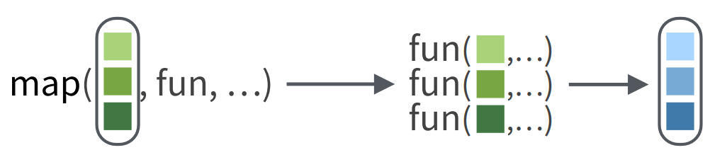

```{r setup, include=FALSE}
options(htmltools.dir.version = FALSE)
options(htmltools.preserve.raw = FALSE)
options(ggrepel.max.overlaps = Inf)

knitr::opts_chunk$set(echo = TRUE, 
                      dev = 'svg',
                      collapse = TRUE, 
                      comment = NA,  # PRINTS IN FRONT OF OUTPUT, default is '##' which comments out output
                      prompt = FALSE, # IF TRUE adds a > before each code input
                      warning = FALSE, 
                      message = FALSE,
                      fig.height = 3, 
                      fig.width = 4,
                      out.width = "100%",
                      prompt = FALSE,
                      rows.print=7
                      )

# load necessary packages
library(tidyverse)
library(countdown)
library(mosaic)
library(ggthemes)
library(xaringanExtra)
library(forcats)
xaringanExtra::use_panelset()
xaringanExtra::use_tachyons()
xaringanExtra::use_clipboard()
xaringanExtra::use_extra_styles(
  hover_code_line = TRUE,         
  mute_unhighlighted_code = TRUE  
)
library(flipbookr)
library(patchwork)
library(DT)
library(moderndive)
library(knitr)
library(grid)
library(gridExtra)
library(ggrepel)
library(lubridate)

# specific packages
library(polite)
library(rvest)
library(stringr)
library(gapminder)
select <- dplyr::select

# Set ggplot theme
# theme_set(theme_stata(base_size = 10))

yt <- 0

# read.csv("https://raw.githubusercontent.com/deepbas/statdatasets/main/agstrat.csv")
```


```{r xaringanExtra-clipboard, echo=FALSE}
htmltools::tagList(
  xaringanExtra::use_clipboard(
    button_text = "<i class=\"fa fa-clipboard\"></i>",
    success_text = "<i class=\"fa fa-check\" style=\"color: #90BE6D\"></i>",
    error_text = "<i class=\"fa fa-times-circle\" style=\"color: #F94144\"></i>"
  ),
  rmarkdown::html_dependency_font_awesome()
)
```


layout: true
  
---

class: title-slide, middle

# .fancy[Iterations and functionals]

### .fancy[Stat 220]

`r format(Sys.Date(), ' %B %d %Y')`

---

class: middle

# Why repeat ourselves?

.pull-left[
```{r}
tinydata <- tribble(
  ~case, ~x, ~y, ~z, 
  "a", 5, 3, -2,
  "b", 7, 1, -5,
  "c", 9, 12, -3
)
```

```{r}
tinydata
```
]

--

.pull-right[

.fancy[.bold[Find the mean of each columns]]

```{r}
mean(tinydata$x)
```

```{r}
mean(tinydata$y)
```

```{r}
mean(tinydata$z)
```

]


---

class: middle

# For loops

.bql[##What is a For loop?

A for loop is a way to iterate through a series of items stored as a data object in R.
]


```{r}
items <- c("grapes", "bananas", "chocolate", "bread")
for (i in items) {
  print(i)
}
```


---

# `for` loop components


.bq[
the `for()` function is used to specify

  - what object we're drawing from and
  - what object we are writing to
]


```
for( i  in  items  )
     ^        ^
     |        |
     |        |___ object we are drawing from
     |
     |
obj. we write each item to

```
---

# `for` loop components

.bq[
The `brackets {}`
  - Inside the brackets we house the code that is going to happen each iteration
]

<br>

```
for( i  in  items  ){
  |~~~~~~~~~~~~~~~~|   
  |~~~~~~~~~~~~~~~~|
  |~~~~~~~~~~~~~~~~| code we need perform on each iteration.
  |~~~~~~~~~~~~~~~~|
  |~~~~~~~~~~~~~~~~|
  }

```

---

# `for` loops `tinydata`

```{r}
tinydata
```

--

- Let’s iterate calculation of column means:

```{r}
my_means <- rep(NA, 3)   # initialize an empty vector
my_means
```

--

```{r}
for (i in 1:3) {  # three columns to get the mean for
  my_means[i] <- mean(tinydata[[i+1]])  # mean of col. i+1 (skip col. 1)
}
my_means
```

---

class: middle

# `for` loops: index vector

.hljs[Use `seq_along(df)` or `1:ncol(df)` to create an index vector.
- Example: `seq_along(tinydata)`]

```{r}
seq_along(tinydata)
```


```{r}
1:ncol(tinydata)
```

---

## Function for conditional evaluation

- if x is numeric then standardize, else just return x

.code80[
```{r}
standardize <- function(x, ...){   # ... used for arbitrary number of arguments
  if (is.numeric(x)){              # condition
    (x - mean(x, ...))/sd(x, ...)  # if TRUE, standardize
  } else{                          # else (FALSE)
    x                              # return x unchanged
  }
}
```
]

--

.code80[
```{r}
standardize(c(2,4,6,8, 10))
```
]

--

.code80[
```{r}
standardize(c(2,4,6,8, "10"))
```
]

--

.code80[
```{r}
standardize(c(2,4,6,8, NA), na.rm = TRUE)
```
]

---

# Standardizing tinydata


.pull-left[
.code80[
```{r}
# allocate storage in a new data frame
scaled_tinydata <- tinydata %>%
  mutate(
    x = NA, 
    y = NA, 
    z = NA
  )
```
]
]

.pull-right[
.code80[
```{r}
scaled_tinydata
```
]
]

--

.code80[
```{r}
for (i in seq_along(tinydata)){ 
    scaled_tinydata[, i] <- standardize(tinydata[[i]])
}
```
]
--

.code80[
```{r}
scaled_tinydata
```
]
---


# Using `for` loops efficiently

.bql[##For Loop with Break
For loops can be terminated early using the break statement. This can save processing time when the loop meets a specific condition.
- e.g. Find the first even number in a vector:
]

```{r}
numbers <- c(5, 7, 15, 8, 20, 30)
for (num in numbers) {
  if (num %% 2 == 0) {
    print(paste("The first even number is", num))
    break
  }
}
```


---


class: action, middle

# <i class="fa fa-pencil-square-o" style="font-size:48px;color:purple">&nbsp;Group&nbsp;Activity&nbsp;`r (yt <- yt + 1)`</i>    


.pull-left-40[

]
.pull-right-60[
.bql[
- Let's go over to maize server/ local Rstudio and our class [moodle](https://moodle.carleton.edu/course/view.php?id=43045)
- Get the class activity 15.Rmd file
- Work on activity 1
- Ask me questions
]

]

`r countdown(minutes = 5, seconds = 00, top = 0 , color_background = "inherit", padding = "3px 4px", font_size = "2em")`


---

class: middle

# Functionals


.pull-left[
.bql[A .brand-red[functional] function will apply the same operation (function) to each element of a vector, matrix, data frame or list.

  - base-R: `apply` family of commands
  - `purrr` package: `map` family of commands
]
]
.pull-right[

]

---

# `apply` family of commands

.hljs[R has a family of commands that apply a function to different parts of a vector, matrix or data frame]

<br>


<blockquote>
<p style="color: #502090"; font-size: 18px;> .bold[lapply(X, FUN)]: applies FUN to each element in the vector/list X </p> 
<p style="color: #502090; font-size: 16px;"> Example: lapply(tinydata, FUN = mean) </p>
</blockquote>

<br>

<blockquote>
<p style="color: #502090"; font-size: 18px;> .bold[sapply(X, FUN)]:works like lapply, but returns a vector</p> 
<p style="color: #502090; font-size: 16px;"> Example: sapply(tinydata, FUN = mean) </p>
</blockquote>
<br>

---

class: middle


# `purrr` package

.bq.font120[
powerful package for iteration with the same functionality as apply commands, but more readable 
]

<br>



- `map(.x, .f)` maps the function `.f` to elements in the vector/list `.x`

---

# `lapply` with `tinydata`

.pull-left[
```{r}
lapply(tinydata, FUN = mean)
```

- a 3x4 data frame is .bold[summarized] in a list of length 4.
]

--

.pull-right[
.bq.font90[
- R sees tinydata as a list whose elements are column vectors (variables)

- the FUN is applied to each list element 

- a list is returned

- length is the number of variables in the data frame
]
]

---

class: middle


# `map`

> In `purrr`, the `map` function is equivalent to `lapply`

```{r}
library(purrr)
map(tinydata, .f = mean)
```


---

class: middle


# `sapply` with `tinydata` 

> Output is an atomic vector (`s`implify)

```{r}
sapply(tinydata, FUN = mean)
```

- a 3x4 data frame is .bold[summarized] in a vector of length 4.


---

class: middle


# `map_dbl`

> `map_dbl` is equivalent to `sapply`


```{r}
map_dbl(tinydata, .f = mean)
```


---

class: middle


# `map_df`

> `map_df` returns a data frame instead of a vector

```{r}
map_df(tinydata, .f = mean)
```

- No equivalency in base-R `apply`!


---

class: middle


## Functionals: single function that mutates

.hljs[`standardize` function gives us a list of standardized values]

.pull-left[

```{r}
tinydata
```

]
.pull-right[

```{r}
lapply(tinydata, FUN = standardize)
```

]

- a 3x4 data frame is .bold[mutated] to a list of 4 vectors of length 3 each

---

class: middle


# map_df

> In `purrr`, the `map_df` is equal to `lapply` + `bind_cols`:


.pull-left[
```{r}
tinydata
```

]
.pull-right[

```{r}
map_df(tinydata, .f = standardize)
```
]


- a 3x4 data frame is mutated to .bold[standardized] 3x4 data frame


---

# applying multiple functions

- Let’s get the 0.1 and 0.9 quantile for variables in `tinydata`

```{r}
quantile(tinydata$x, probs = c(.1, .9))
```

```{r}
quantile(tinydata$y, probs = c(.1, .9))

```

```{r}
quantile(tinydata$z, probs = c(.1, .9))

```


-  the function output is a vector of length 2 (same lengths as probs)

---

class: middle


# `map_df`: getting quantiles


```{r}
tinydata %>% 
  select_if(is.numeric) %>%   # only numeric columns
  map_df(
    .f = quantile,   # function to apply to cols
    probs = c(.1, .9)) # extra function arguments
```

---

class: middle


# `map_df`: getting quantiles

> Can use `.id` to record the variable names from tinydata:

```{r}
tinydata %>% 
  select_if(is.numeric) %>% 
  map_df(
    .f = quantile, 
    probs = c(.1, .9), 
    .id = "variable") #<<
```

---

class: middle

# `map_df` options


.fancy.font120[There are two types of `map_df`]

.bql[
- `map_dfr`: row binds the list created by map
  - entries in the list are rows in the data frame
      
- `map_dfc`: column binds the list created by map
  - entries in the list are columns in the data frame
]    


---


class: middle


# Iterate or dplyr?!

.bq[
We need to manually add a percentile variable to help us ID the value in each row
]


```{r}
tinydata %>% 
    summarize_if(is.numeric, .funs = quantile, probs = c(.1, .9)) %>%
    mutate(percentile = c(10,90)) #<<
```


---


class: action, middle

# <i class="fa fa-pencil-square-o" style="font-size:48px;color:purple">&nbsp;Group&nbsp;Activity&nbsp;`r (yt <- yt + 1)`</i>    


.pull-left-40[

]
.pull-right-60[
<br>
<br>
.bq[
- Work on activity 2
- Ask me questions
]

]

`r countdown(minutes = 10, seconds = 00, top = 0 , color_background = "inherit", padding = "3px 4px", font_size = "2em")`


