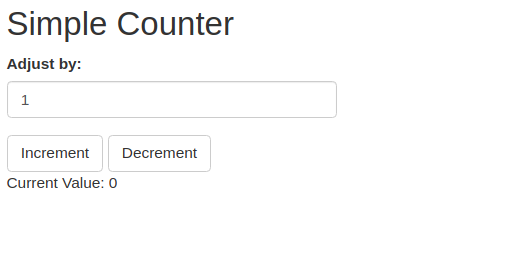
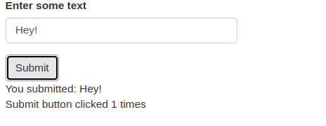

```{r setup, include=FALSE}
options(htmltools.dir.version = FALSE)
options(htmltools.preserve.raw = FALSE)
options(ggrepel.max.overlaps = Inf)

knitr::opts_chunk$set(echo = TRUE, 
                      dev = 'svg',
                      collapse = TRUE, 
                      comment = NA,  # PRINTS IN FRONT OF OUTPUT, default is '##' which comments out output
                      prompt = FALSE, # IF TRUE adds a > before each code input
                      warning = FALSE, 
                      message = FALSE,
                      fig.height = 3, 
                      fig.width = 4,
                      out.width = "100%",
                      prompt = FALSE,
                      rows.print=7
                      )


# load necessary packages
library(tidyverse)
library(ggplot2)
library(countdown)
library(ggthemes)
library(xaringanExtra)
xaringanExtra::use_panelset()
xaringanExtra::use_tachyons()
library(flipbookr)
library(htmlwidgets)
library(lubridate)

library(kableExtra)
library(fontawesome)
library(rvest)
library(forcats)
library(patchwork)
library(polite)
library(DT)
library(polite)
library(purrr)
library(leaflet)
library(maptools)
library(maps)     
library(sp)       
library(maptools) 
library(mapdata)
library(ggiraph)

select <- dplyr::select

# Set ggplot theme
# theme_set(theme_stata(base_size = 10))

yt <- 0

```


```{r xaringanExtra-clipboard, echo=FALSE}
htmltools::tagList(
  xaringanExtra::use_clipboard(
    button_text = "<i class=\"fa fa-clipboard\"></i>",
    success_text = "<i class=\"fa fa-check\" style=\"color: #90BE6D\"></i>",
    error_text = "<i class=\"fa fa-times-circle\" style=\"color: #F94144\"></i>"
  ),
  rmarkdown::html_dependency_font_awesome()
)
```


layout: true
  
---

class: title-slide, middle

# .fancy[Shiny Reactivity]

### .fancy[Stat 220]

`r format(Sys.Date(), ' %B %d %Y')`


---

class: middle


# Shiny Reactivity: A Quick Tour

<center>
 <br>
<a>Shiny reactivity 101</a>
</center>


.footnote[[Learn more about Shiny reactivity](https://shiny.rstudio.com/articles/understanding-reactivity.html)]


---

class: middle

# Shiny Reactivity: Listen and React

.bqt[
- Think of Shiny as a live conversation between you and your app.
- Your app listens (reacts) to what you say (input) and responds with answers (output).
- It keeps the chat going, updating automatically as the conversation evolves.
]

.footnote[[Understanding reactivity in R](https://shiny.rstudio.com/articles/understanding-reactivity.html)]

---

class: middle

# Behind the Scenes: Reactive Expressions

.center["Reactive expressions link your questions to the app's answers."]

.bql[
- They're like the app's thought process, taking your input and figuring out the output.
- They're smart: only recalculating when needed to keep everything running smoothly.
]

---


class: middle

# Real-World Magic: Reactive Use Cases

.bql[
- Imagine your app fetching data just as you ask for it:
  + Choosing a file? It reads it on-the-spot.
  + Curious about data from a website? It grabs it for you.
  + Need to crunch some numbers based on your choices? It does the math instantly.
]

---

class: middle


# Sharing Secrets: Reactive Values


.Large[
- Reactive values are the app's memory, holding onto data for quick recall.
- Think of `input$` as the app's ear, always listening for your next request.
]


---


.panelset[

.panel[

.panel-name[code]

```
library(shiny)
ui <- fluidPage(
  titlePanel("Updating Plot Based on User Input"),
  sidebarLayout(
    sidebarPanel(
      numericInput("obs", "Number of observations:", 
                   value = 100, min = 1)
    ),
    mainPanel( plotOutput("distPlot"))
  )
)
server <- function(input, output) {
  output$distPlot <- renderPlot({
    hist(rnorm(input$obs))
  })
}
shinyApp(ui, server)
```


]

.panel[

.panel-name[output]

<center>
 <br>
</center>

]

]

---

class: action, middle

# 🚀 **Try the Shiny Code Yourself!** `r (yt <- yt + 1)`


.pull-left[

]

.pull-right[
.bql[
- **Step 1:** Copy the codes on the previous slide
- **Step 2:** Paste the codes on your R console
- **Questions?** I'm here to help!
- **Caution!** Don't forget to close the R Shiny session once you are done!
]
]


---

class: middle

# Understanding `eventReactive()` in Shiny


.Large[
- `eventReactive()` lets a Shiny app react only when you want.
- Trigger updates with specific actions, like clicking a button.
- Reduces work by updating calculations only when needed.
]


---

.panelset[

.panel[

.panel-name[code]

```
ui <- fluidPage(
  mainPanel(
    actionButton("addButton", "Add 1"),
    textOutput("result")
  )
)

server <- function(input, output) {
  sum_so_far <- eventReactive(input$addButton, {
    if (is.null(input$addButton)) {
      0
    } else {
      input$addButton
    }
  })

  output$result <- renderText({
    paste("Sum so far:", sum_so_far())
  })
}

shinyApp(ui, server)
```


]

.panel[

.panel-name[output]

<center>
 <br>
</center>
]

]


---

class: action, middle

# 🚀 **Try the Shiny Code Yourself!** `r (yt <- yt + 1)`


.pull-left[

]

.pull-right[
.bql[
- **Step 1:** Copy the codes on the previous slide
- **Step 2:** Paste the codes on your R console
- **Questions?** I'm here to help!
- **Caution!** Don't forget to close the R Shiny session once you are done!
]
]

---


class: middle

# `actionButton()`: The Magic Button in Shiny

.center.font200["🖱️ A button that lets users decide when to make things happen."]

---

class: middle

# How `actionButton()` Empowers Your App


.Large[
- **What it does**: Adds a clickable button to your app's page.
- **User Power**: Lets people run actions (like calculations or data display) on their command.
- **Pair with Magic**: Works best with `eventReactive()`, waiting for the click to spring into action.
]


---

.panelset[

.panel[

.panel-name[code]

```
ui <- fluidPage(
  mainPanel(
    numericInput("obs", "Number of observations", value = 100, min = 1),
    actionButton("updateButton", "Update Plot"),
    plotOutput("distPlot")
  )
)

server <- function(input, output) {
  data_to_plot <- eventReactive(input$updateButton, {
    rnorm(input$obs)
  })

  output$distPlot <- renderPlot({
    hist(data_to_plot())
  })
}

shinyApp(ui, server)

```


]

.panel[

.panel-name[output]

<center>
 <br>
</center>

]

]

---

class: action, middle

# 🚀 **Try the Shiny Code Yourself!** `r (yt <- yt + 1)`


.pull-left[

]

.pull-right[
.bql[
- **Step 1:** Copy the codes on the previous slide
- **Step 2:** Paste the codes on your R console
- **Questions?** I'm here to help!
- **Caution!** Don't forget to close the R Shiny session once you are done!
]
]

---


class: middle

# `reactiveValues()`: Your App's Memory

.center["Think of `reactiveValues()` as a way for your app to remember and update things."]


.Large[
- **Memory Bank**: Stores and updates information your app needs to remember.
- **Flexibility**: Change one piece of info without affecting the rest.
- **Teamwork**: Shares data between different parts of your app seamlessly.
]


---

.panelset[

.panel[

.panel-name[code]

```r
ui <- fluidPage(
  titlePanel("Simple Counter"),
  numericInput("adjustValue", "Adjust by:", 1),
  actionButton("incrementButton", "Increment"),
  actionButton("decrementButton", "Decrement"),
  br(),
  textOutput("currentValue")
)
server <- function(input, output) {
  counter <- reactiveValues(value = 0)
  observeEvent(input$incrementButton, {
    counter$value <- counter$value + input$adjustValue
  })
  observeEvent(input$decrementButton, {
    counter$value <- counter$value - input$adjustValue
  })
  output$currentValue <- renderText({
    paste("Current Value:", counter$value)
  })
}
shinyApp(ui, server)
```

---


]

.panel[

.panel-name[output]

<center>
 <br>
</center>
]

]

---


class: action, middle

# 🚀 **Try the Shiny Code Yourself!** `r (yt <- yt + 1)`


.pull-left[

]

.pull-right[
.bql[
- **Step 1:** Copy the codes on the previous slide
- **Step 2:** Paste the codes on your R console
- **Questions?** I'm here to help!
- **Caution!** Don't forget to close the R Shiny session once you are done!
]
]

---


class: middle

# `observeEvent()`: The Watchful Eye in Shiny

.center["`observeEvent()` watches for specific actions, like button clicks, to do something special."]


.Large[
- **Action Detector**: Springs into action when it detects its specified trigger (like a button press).
- **Doer of Tasks**: Executes code to make changes or updates, without needing to return any value.
- **Perfect Pair**: Works hand-in-hand with `actionButton()` for on-demand actions.
]


---

.panelset[

.panel[

.panel-name[code]

```
ui <- fluidPage(
  mainPanel(
    actionButton("showAlert", "Show Alert"),
    textOutput("alertCount")
  )
)
server <- function(input, output) {
  alert_counter <- reactiveValues(count = 0)
  observeEvent(input$showAlert, {
    showModal(modalDialog(
      title = "Alert",
      "This is an alert message!"
    ))
    alert_counter$count <- alert_counter$count + 1
  })
  output$alertCount <- renderText({
    paste("Number of alerts shown:", alert_counter$count)
  })
}
shinyApp(ui, server)
```


]

.panel[

.panel-name[output]

<center>
 <br>
</center>
]

]

---


class: action, middle

# 🚀 **Try the Shiny Code Yourself!** `r (yt <- yt + 1)`


.pull-left[

]

.pull-right[
.bql[
- **Step 1:** Copy the codes on the previous slide
- **Step 2:** Paste the codes on your R console
- **Questions?** I'm here to help!
- **Caution!** Don't forget to close the R Shiny session once you are done!
]
]

---


class: middle

# `isolate()`: Pausing Reactivity in Shiny

.center["Use `isolate()` to freeze time in your app, preventing automatic updates."]


.Large[
- **Control Freak**: Lets you hold back reactions, giving you control over when updates happen.
- **Stealth Mode**: Use inputs quietly without alerting the rest of your app to change.
- **Strategic Updates**: Perfect for when you need to fetch or use data on your own terms, not automatically.
]

---

.panelset[

.panel[

.panel-name[code]

```
ui <- fluidPage(
  textInput("textInput", "Enter some text"),
  actionButton("submitButton", "Submit"),
  textOutput("outputText"),
  textOutput("counter")
)
server <- function(input, output) {
  counter <- reactiveValues(clicks = 0)
  
  observeEvent(input$submitButton, {
    counter$clicks <- counter$clicks + 1
    output$outputText <- renderText({
      # Using isolate() to prevent reactivity on textInput changes
      paste("You submitted:", isolate(input$textInput))
    })
    output$counter <- renderText({
      paste("Submit button clicked", counter$clicks, "times")
    })
  })
}
shinyApp(ui, server)
```


]

.panel[

.panel-name[output]
<center>
 <br>
</center>

]

]


---

class: action, middle

# 🚀 **Try the Shiny Code Yourself!** `r (yt <- yt + 1)`


.pull-left[

]

.pull-right[
.bql[
- **Step 1:** Copy the codes on the previous slide
- **Step 2:** Paste the codes on your R console
- **Questions?** I'm here to help!
- **Caution!** Don't forget to close the R Shiny session once you are done!
]
]


