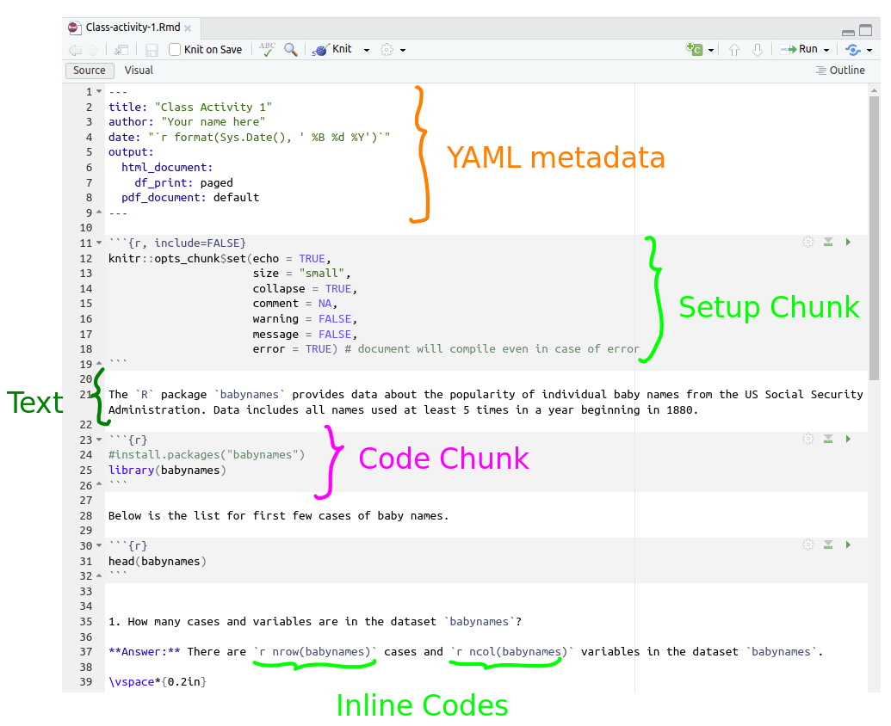
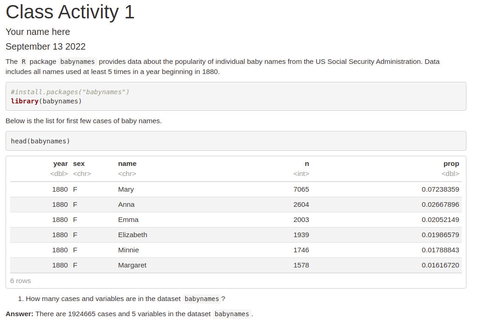
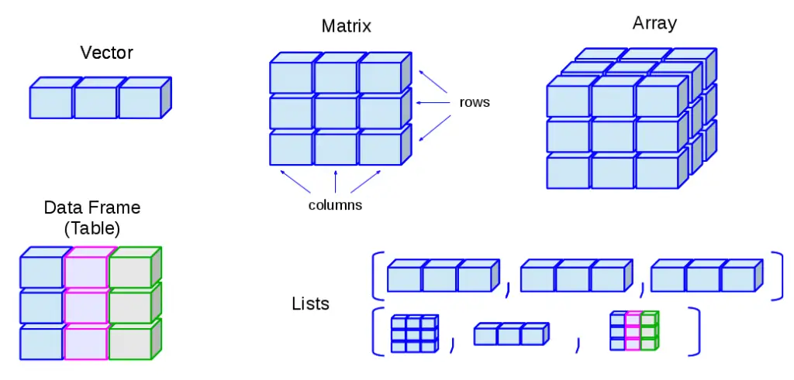

```{r setup, include=FALSE}
options(htmltools.dir.version = FALSE)
options(htmltools.preserve.raw = FALSE)
options(ggrepel.max.overlaps = Inf)

knitr::opts_chunk$set(echo = TRUE, 
                      dev = 'svg',
                      collapse = TRUE, 
                      comment = NA,  # PRINTS IN FRONT OF OUTPUT, default is '##' which comments out output
                      prompt = FALSE, # IF TRUE adds a > before each code input
                      warning = FALSE, 
                      message = FALSE,
                      fig.height = 3, 
                      fig.width = 4,
                      out.width = "100%",
                      prompt = TRUE
                      )

# load necessary packages
library(tidyverse)
library(dplyr)
library(countdown)
library(mosaic)
library(ggthemes)
library(xaringanExtra)
library(forcats)
xaringanExtra::use_panelset()
xaringanExtra::use_tachyons()
xaringanExtra::use_clipboard()
xaringanExtra::use_extra_styles(
  hover_code_line = TRUE,         
  mute_unhighlighted_code = TRUE  
)
library(flipbookr)
library(patchwork)
library(DT)
library(moderndive)
library(knitr)
library(grid)
library(gridExtra)
library(palmerpenguins)
library(broom)
library(ggResidpanel)
library(keras)
library(tensorflow)

select <- dplyr::select

# Set ggplot theme
theme_set(theme_tufte(base_size = 10))

yt <- 0

# read.csv("https://raw.githubusercontent.com/deepbas/statdatasets/main/agstrat.csv")

```


```{r xaringanExtra-clipboard, echo=FALSE}
htmltools::tagList(
  xaringanExtra::use_clipboard(
    button_text = "<i class=\"fa fa-clipboard\"></i>",
    success_text = "<i class=\"fa fa-check\" style=\"color: #90BE6D\"></i>",
    error_text = "<i class=\"fa fa-times-circle\" style=\"color: #F94144\"></i>"
  ),
  rmarkdown::html_dependency_font_awesome()
)
```


layout: true
  
---

class: title-slide, middle

# .fancy[R and R Markdown Basics]

### .fancy[Spring 23]

`r format(Sys.Date(), ' %B %d %Y')`

---

# Reproducible data science

.out-t[What does it mean for a data analysis to be "reproducible"?]

--
.bq.font80[### Short-term goals
- Are the tables and figures reproducible from the code and data?
- Does the code work as intended?
- In addition to what was done, is it clear **why** it was done? 
(e.g., how were parameter settings chosen?)
]

<br>

--

.bq.font80[
### Long-term goals
- Can the code be used for other data?
- Can you extend the code to do other things?
]
---

class: middle

# Toolkit for reproducibility

.bq[
- Scriptability  → R
- Literate programming (code, narrative, output in one place) → R Markdown
<!--  literate = it is readable and easy to learn -->
- Version control → Git / GitHub
]

---

class: action, middle

# <i class="fa fa-pencil-square-o" style="font-size:48px;color:purple">&nbsp;Group&nbsp;Activity&nbsp;`r (yt <- yt + 1)`</i>    


.pull-left-40[

]
.pull-right-60[
.bq.font90[
- Let's go over to maize server/ local Rstudio to connect it with the class [Github repository](https://github.com/DataScienceWinter24)
- Clone hw0-yourusername repository to your course folder as an R project using version control methods
- Make changes to hw and commit those changes
- Tip: push the changes regularly back to Github
]
]

`r countdown(minutes = 10, seconds = 00, top = 0 , color_background = "inherit", padding = "3px 4px", font_size = "2em")`

---

# Tour: R Markdown


 <br>


 <br>

---

# Text

.bq.font90[Simple  rules for 
- section headers (`#`,`##`,etc)
- lists (need ~2 tabs to create sublists)
- formatting (bold `**`, italics `*`)
- tables
- R syntax (use backward tick ` ` `)
- web links `[linked text](url)`
- latex math equations $\beta_1 + \beta_2$
]

.footnote[For further help, look at [R Markdown Cheatsheet](https://deepbas.io/courses/stat220/cheatsheets/)]
    
---


# Code chunks **chunks**, defined by three backticks

```{r, echo=FALSE, comment=FALSE, include=FALSE, message=FALSE}
library(babynames)
library(tidyverse)
library(ggplot2)

filtered_names <- babynames %>% filter(name=="Aimee", year <= max(year), year >= min(year))

```

````
```{r}`r ''`
filtered_names <- babynames %>% filter(name=="Amiee", year < max(year), year > min(year))  # filter the rows
ggplot(data=filtered_names, aes(x=year, y=prop)) + 
  geom_line(aes(colour=sex)) + 
  xlab('Year') + 
  ylab('Prop. of Babies Named Aimee')
```
````

```{r, echo=FALSE, out.width="40%", fig.align='center'}
ggplot(data=filtered_names, aes(x=year, y=prop)) + 
  geom_line(aes(colour=sex)) + 
  xlab('Year') + 
  ylab('Prop. of Babies Named Aimee')
```


---

class: middle

#  Adding/running chunks

.bq.font90[
Add chunks with button or:
  - Command (or Cmd) `⌘` + Option (or Alt) `⌥` +  `i` (Mac)
  - Ctrl + Alt + `i` (Windows/Linux)
   
Run chunks by:
  - Run current chunk button (interactive)
  - Knit button / run all chunks
]

---


<br>


# Inline code


.bq.font90[
How many babies were born with name 'Aimee'?

``` `r knitr::inline_expr(' filtered_names %>% summarise(total = sum(n))')` ```

There are a total of
`r  filtered_names %>% summarise(total = sum(n))` babies.

]

--

<br>

.bq.font90[

In what year were there highest proportion of babies born with the name `Aimee`?

``` `r knitr::inline_expr(' filtered_names %>% filter(prop == max(prop)) %>% pull(year)')` ```

`Aimee` name was the most popular in 
`r filtered_names %>% filter(prop == max(prop)) %>%pull(year)`.

]

---

class: middle

# Chunk options: echo


````
```{r echo=FALSE}`r ''`
glimpse(filtered_names)
```
````


```{r echo=FALSE}
glimpse(filtered_names)
```


---


## Chunk options: eval

.pull-left[
````
```{r eval=FALSE}`r ''`
glimpse(filtered_names)
```
````
]

.pull-right[
```{r eval=FALSE}
glimpse(filtered_names)
```
]

---


## Chunk options: eval

.pull-left[
````
```{r eval=FALSE}`r ''`
glimpse(filtered_names)
```
````
]

.pull-right[
```{r eval=FALSE}
glimpse(filtered_names)
```
]


## Chunk options: include

.pull-left[
````
```{r include=FALSE}`r ''`
glimpse(filtered_names)
```
````
]
.pull-right[
```{r include=FALSE}
glimpse(filtered_names)
```
]

---


## Chunk options: eval

.pull-left[
````
```{r eval=FALSE}`r ''`
glimpse(filtered_names)
```
````
]

.pull-right[
```{r eval=FALSE}
glimpse(filtered_names)
```
]


## Chunk options: include

.pull-left[
````
```{r include=FALSE}`r ''`
glimpse(filtered_names)
```
````
]
.pull-right[
```{r include=FALSE}
glimpse(filtered_names)
```
]

---

class: middle

## Chunk options: results

.pull-left[
.code80[
````
```{r echo=TRUE, results='hide'}`r ''`
glimpse(filtered_names)
```
````
]
]

.pull-right[
.code80[
```{r echo=TRUE, results='hide'}
glimpse(filtered_names)
```
]
]


---

class: middle

# Chunk labels

.code90[
````
```{r peek, echo=FALSE, results='hide'}`r ''`
glimpse(filtered_names)
```
````
]

- Place between curly braces --> `{r label}`
- Separate options with commas --> `{r label, option1=value}`


---

class: middle

# The setup chunk

.pull-left-40[
````
```{r setup, include=FALSE}`r ''`
knitr::opts_chunk$set(
  collapse = TRUE,   
  comment = "#>", 
  out.width = "100%" 
)
```
````
]
.pull-right-60[
.bq.font80[
+ A special chunk label: `setup`
-  Typically the first
- All following chunks will use these options (i.e., sets global chunk options)
- **Tip**: set `include=FALSE`
- You can (and should) use individual chunk options too
]
]


---

# Variables

> Variables are used to store data, figures, model output, etc.

.pull-left.font80[
### Assign just one value:
```{r prompt = TRUE, comment = NA}
x <- 5
x
```

### Assign a __vector__ of values:

```{r prompt = TRUE, comment = NA}
a <- 3:10
a
```
]
.pull-right.font90[
### __Concatenate__ a string of numbers

```{r prompt = TRUE, comment = NA}
b <- c(5, 12, 2, 100, 8)
b
```

### __Concatenate__ a string of characters

```{r prompt = TRUE, comment = NA}
names <- c("Amy", "Dee", "Lux")
names
```
]

---


class: middle

## A few things to remember


.bql.font80[

- Do not use special characters such as `$` or `%`. Common symbols that are used in variable names include `.` or `_`. 
- Remember that `R` is case sensitive.
- To assign values to objects, we use the assignment operator `<-`. Recommend to use `<-` to assign values to objects and `=` within functions.
- The `#` symbol is used for commenting and demarcation. Any code following `#` will not be executed.
]

---


class: middle

## R Objects

.bq.font80[Vectors and data frames are examples of _**objects**_ in R. 

  + There are other types of R objects to store data, such as matrices, arrays, lists.
]

<center>
 <br>
</center>

.footnote[[Data structures in R](https://excelunplugged.com/2021/11/19/r-beginner-tutorial-lists/). Source: Ceballos and Cardiel 2013.]


---

class: action, middle

# <i class="fa fa-pencil-square-o" style="font-size:48px;color:purple">&nbsp;Group&nbsp;Activity&nbsp;`r (yt <- yt + 1)`</i>    

.pull-left-40[

]
.pull-right-60[
<br>
<br>
.bq.font80[Go to class_activity_2.Rmd in [moodle](https://moodle.carleton.edu/course/view.php?id=43045)
1. Read through the activity answering any questions asked
4. Submit to moodle by the deadline.
]
]

`r countdown(minutes = 10, seconds = 00, top = 0 , color_background = "inherit", padding = "3px 4px", font_size = "2em")`


